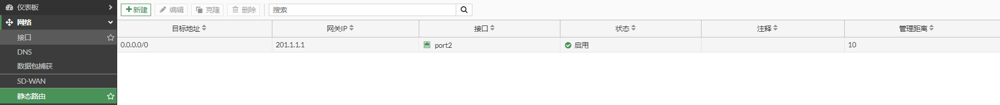
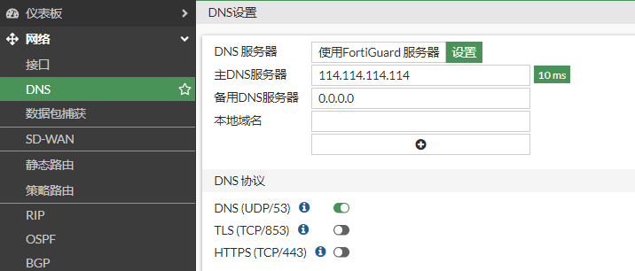
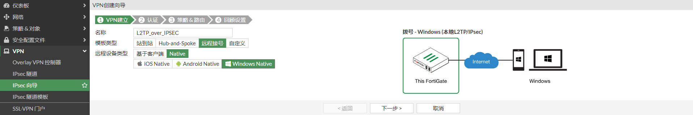
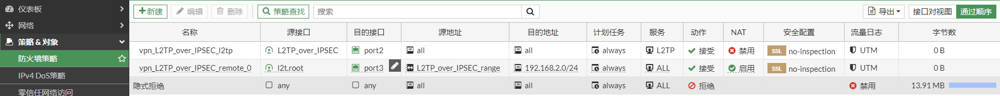

# L2TP over IPSec

## 简介

L2TP over IPSec，先用L2TP封装报文再用IPSec封装，通过L2TP实现用户验证和地址分配，并利用IPSec保障通信的安全性。

## **组网需求**

在外移动办公的工作人员需要通过L2TP over IPSEC VPN 隧道模式拨入到公司内网来对内网主机进行访问。

## 网络拓扑

PC1---------------Internet-------------(port2:201.1.1.3)FGT-BJ(port3:192.168.2.1/24)-----------PC2(192.168.2.10)

## 配置步骤

### 配置FortiGate L2TP over IPSec VPN

1. **基础配置**

   

   

   

   

2. **创建用户并将用户加入到用户组**

   

   

3. **创建地址对象**

   

4. **配置L2TP over IPSEC VPN**

   选择“IPsec隧道”，点击“新建”，选择“远程拨号”-->"Native"-->“Windows Native”，然后点击下一步。

   

   设置流入接口，预共享秘钥及用户组。

   

   设置本地接口，地址地址以及客户端地址范围。

   

   VPN向导即将创建的对象。

   

   创建完成。

   

### 查看IPSEC向导创建的配置

通过“VPN创建向导”可以很方便的配置VPN，但我们需要知道向导具体做了哪些配置。

1. **创建IPSEC VPN**

   

   对应的命令行

   ```
   config vpn ipsec phase1-interface
       edit "L2TP_over_IPSEC"
           set type dynamic
           set interface "port2"
           set peertype any
           set net-device disable
           set proposal aes256-md5 3des-sha1 aes192-sha1
           set comments "VPN: L2TP_over_IPSEC (Created by VPN wizard)"
           set dhgrp 2
           set wizard-type dialup-windows
           set psksecret ENC DCMMcDpdFzv7KXC1lwF5xK3SdOBK0RXf8G8UhEXU+wFRq58XOOoZOcDVaKxLd/mBg1CgkwMqEEXV+IwHs1kpFOTfoGAG428fkKO8BmwlfmDerRWCu5W8IcI6DwsDF1PllXIefGl+3H2tjySQ8gm6SeBCKD6XLFjRVlHIW+EwJiTfC1c+bPIEBq60ii9Puckspiec0g==
       next
   end
   config vpn ipsec phase2-interface
       edit "L2TP_over_IPSEC"
           set phase1name "L2TP_over_IPSEC"
           set proposal aes256-md5 3des-sha1 aes192-sha1
           set pfs disable
           set encapsulation transport-mode
           set l2tp enable
           set comments "VPN: L2TP_over_IPSEC (Created by VPN wizard)"
           set keylifeseconds 3600
       next
   end
   ```

2. **创建L2TP**

   ```
   config vpn l2tp
       set status enable
       set eip 172.31.1.200
       set sip 172.31.1.10
       set usrgrp "L2TP_over_IPSEC_Group"
   end
   ```

4. **创建地址对象**

   

5. **创建策略**

   第1条是L2TP over IPSEC的策略；第2条是L2TP到内网的策略。模板没有创建到Internet的策略，如果有需求，则要单独创建。

   

6. **创建路由**

   

### 配置终端的L2TP over IPSec VPN

1. 右击本地连接图标，选择“打开网络和Internet设置”，选择VPN。

   

2. 点击“添加VPN连接”，设置L2TP over IPSEC，然后点击保存。

   

3. L2TP over IPSEC创建完成。

   

## L2TP over IPSEC拨号测试

1. 点击创建的“L2TP_Over_IPSEC”，点击连接

   

2. 连接成功

   

   查看L2TP_Over_IPSEC获取的地址
   
   ```
   C:\Users\admin>ipconfig/all
   以太网适配器 Ethernet1:
   
      连接特定的 DNS 后缀 . . . . . . . :
      描述. . . . . . . . . . . . . . . : Intel(R) 82574L Gigabit Network Connection #2
      物理地址. . . . . . . . . . . . . : 00-0C-29-91-0B-35
      DHCP 已启用 . . . . . . . . . . . : 否
      自动配置已启用. . . . . . . . . . : 是
      本地链接 IPv6 地址. . . . . . . . : fe80::bc4e:191a:510a:62ba%7(首选)
      IPv4 地址 . . . . . . . . . . . . : 10.1.1.6(首选)
      子网掩码  . . . . . . . . . . . . : 255.255.255.0
      默认网关. . . . . . . . . . . . . : 10.1.1.1
      DHCPv6 IAID . . . . . . . . . . . : 402656297
      DHCPv6 客户端 DUID  . . . . . . . : 00-01-00-01-29-1C-6E-ED-00-0C-29-91-0B-2B
      DNS 服务器  . . . . . . . . . . . : 192.168.91.208
                                          114.114.114.114
      TCPIP 上的 NetBIOS  . . . . . . . : 已启用
   
   PPP 适配器 L2TP_Over_IPSEC:
   
      连接特定的 DNS 后缀 . . . . . . . :
      描述. . . . . . . . . . . . . . . : L2TP_Over_IPSEC
      物理地址. . . . . . . . . . . . . :
      DHCP 已启用 . . . . . . . . . . . : 否
      自动配置已启用. . . . . . . . . . : 是
      IPv4 地址 . . . . . . . . . . . . : 172.31.1.11(首选)
      子网掩码  . . . . . . . . . . . . : 255.255.255.255
      默认网关. . . . . . . . . . . . . : 0.0.0.0
      DNS 服务器  . . . . . . . . . . . : 114.114.114.114
      TCPIP 上的 NetBIOS  . . . . . . . : 已启用
   ```
   
   查看路由表
   
   ```
   C:\Users\admin>route print
   ===========================================================================
   接口列表
    10...00 09 0f fe 00 01 ......Fortinet Virtual Ethernet Adapter (NDIS 6.30)
     5...00 09 0f aa 00 01 ......Fortinet SSL VPN Virtual Ethernet Adapter
    13...00 0c 29 91 0b 2b ......Intel(R) 82574L Gigabit Network Connection
     7...00 0c 29 91 0b 35 ......Intel(R) 82574L Gigabit Network Connection #2
    43...........................L2TP_Over_IPSEC
     1...........................Software Loopback Interface 1
   ===========================================================================
   
   IPv4 路由表
   ===========================================================================
   活动路由:
   网络目标        网络掩码          网关       接口   跃点数
             0.0.0.0          0.0.0.0         10.1.1.1         10.1.1.6   4506
             0.0.0.0          0.0.0.0            在链路上       172.31.1.11     26
            10.1.1.0    255.255.255.0            在链路上          10.1.1.6   4506
            10.1.1.6  255.255.255.255            在链路上          10.1.1.6   4506
          10.1.1.255  255.255.255.255            在链路上          10.1.1.6   4506
           127.0.0.0        255.0.0.0            在链路上         127.0.0.1   4556
           127.0.0.1  255.255.255.255            在链路上         127.0.0.1   4556
     127.255.255.255  255.255.255.255            在链路上         127.0.0.1   4556
         172.31.1.11  255.255.255.255            在链路上       172.31.1.11    281
           201.1.1.3  255.255.255.255         10.1.1.1         10.1.1.6   4251
   ```

3. 访问内部主机

   ```
   C:\Users\admin>ping 192.168.2.10
   
   正在 Ping 192.168.2.10 具有 32 字节的数据:
   来自 192.168.2.10 的回复: 字节=32 时间=1ms TTL=63
   来自 192.168.2.10 的回复: 字节=32 时间=1ms TTL=63
   来自 192.168.2.10 的回复: 字节=32 时间=1ms TTL=63
   来自 192.168.2.10 的回复: 字节=32 时间<1ms TTL=63
   
   192.168.2.10 的 Ping 统计信息:
       数据包: 已发送 = 4，已接收 = 4，丢失 = 0 (0% 丢失)，
   往返行程的估计时间(以毫秒为单位):
       最短 = 0ms，最长 = 1ms，平均 = 0ms
   ```

4. FortiGate查看L2TP over IPSEC连接

   

   ```
   # diagnose vpn ike gateway list 
   
   vd: root/0
   name: L2TP_over_IPSEC_0
   version: 1
   interface: port2 6
   addr: 201.1.1.3:500 -> 10.1.1.6:500
   tun_id: 10.1.1.6/::10.0.0.2
   remote_location: 0.0.0.0
   network-id: 0
   created: 667s ago
   IKE SA: created 1/1  established 1/1  time 40/40/40 ms
   IPsec SA: created 1/1  established 1/1  time 10/10/10 ms
   
     id/spi: 0 3074e3c6042e3bd7/445ef45c6bf46ef9
     direction: responder
     status: established 667-667s ago = 40ms
     proposal: 3des-sha1
     key: b894656df6d73056-3c8f6e0801b4977e-f932994583512431
     lifetime/rekey: 28800/27862
     DPD sent/recv: 00000000/00000000
   
   # diagnose vpn tunnel list 
   list all ipsec tunnel in vd 0
   ------------------------------------------------------
   name=L2TP_over_IPSEC ver=1 serial=8 201.1.1.3:0->0.0.0.0:0 tun_id=10.0.0.3 tun_id6=::10.0.0.3 dst_mtu=0 dpd-link=on weight=1
   bound_if=6 lgwy=static/1 tun=intf mode=dialup/2 encap=none/552 options[0228]=npu frag-rfc  role=primary accept_traffic=1 overlay_id=0
   
   proxyid_num=0 child_num=1 refcnt=3 ilast=44533053 olast=44533053 ad=/0
   stat: rxp=403 txp=180 rxb=30057 txb=8731
   dpd: mode=on-demand on=0 idle=20000ms retry=3 count=0 seqno=0
   natt: mode=none draft=0 interval=0 remote_port=0
   run_tally=0
   ------------------------------------------------------
   name=L2TP_over_IPSEC_0 ver=1 serial=9 201.1.1.3:0->10.1.1.6:0 tun_id=10.1.1.6 tun_id6=::10.0.0.2 dst_mtu=1500 dpd-link=on weight=1
   bound_if=6 lgwy=static/1 tun=intf mode=dial_inst/3 encap=none/8872 options[22a8]=npu rgwy-chg frag-rfc  run_state=0 role=primary accept_traffic=1 overlay_id=0
   
   parent=L2TP_over_IPSEC index=0
   proxyid_num=1 child_num=0 refcnt=6 ilast=0 olast=2 ad=/0
   stat: rxp=403 txp=180 rxb=30057 txb=8731
   dpd: mode=on-demand on=1 idle=60000ms retry=3 count=0 seqno=0
   natt: mode=none draft=0 interval=0 remote_port=0
   proxyid=L2TP_over_IPSEC proto=17 sa=1 ref=3 serial=1 transport-mode add-route
     src: 17:201.1.1.3-201.1.1.3:1701
     dst: 17:10.1.1.6-10.1.1.6:0
     SA:  ref=3 options=182 type=00 soft=0 mtu=1470 expire=2915/0B replaywin=2048
          seqno=b5 esn=0 replaywin_lastseq=00000193 qat=0 rekey=0 hash_search_len=1
     life: type=01 bytes=0/0 timeout=3590/3600
     dec: spi=4b06e27a esp=3des key=24 b4765186ea5f3ac392a6009a3e9173907f2b1872715a317a
          ah=sha1 key=20 75f29e67a8a100e5d7a58b84451675d318b36ee5
     enc: spi=ba90d928 esp=3des key=24 7cbbc629743b42ac00b0ab328129364de3b157c67dfd1a39
          ah=sha1 key=20 e8fd28ceaf0d55c30643495a95af9e5b562d2443
     dec:pkts/bytes=806/60114, enc:pkts/bytes=360/23491
     npu_flag=00 npu_rgwy=10.1.1.6 npu_lgwy=201.1.1.3 npu_selid=6 dec_npuid=0 enc_npuid=0
   ```

   
