# PPTP VPN

## PPTP VPN简介

PPTP（Point to Point Tunneling Protocol），即点对点隧道协议，默认端口号：TCP 1723。该协议是在PPP协议的基础上开发的一种新的增强型安全协议，可以通过密码验证协议（PAP）、可扩展认证协议（EAP）等方法增强安全性，远程用户可以通过PPTP VPN拨号访问公司内网资源。

## PPTP数据报文

PPTP数据报文分为两种：

**控制报文**：用于创建、维护、终止PPTP连接；


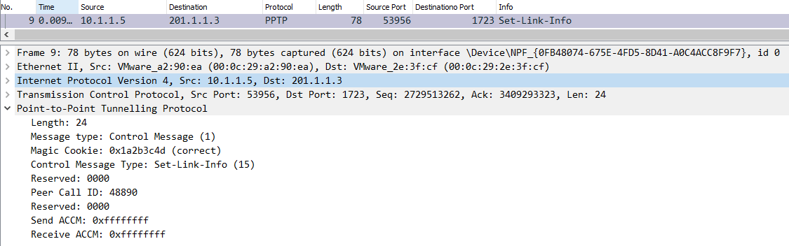

**数据报文**：用来传送PPP数据包，PPP数据包封装在GRE里进行传送。


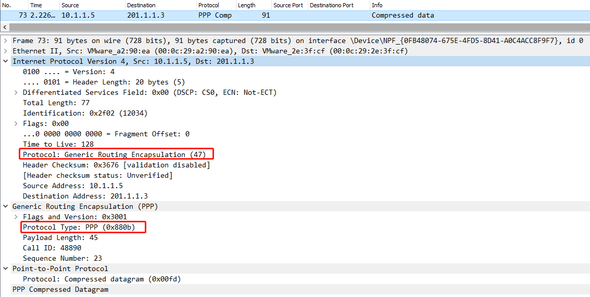

## PPTP协议交互过程

1. 建立TCP三次握手；

2. 建立PPTP控制层连接：

   **Start Control Connection Request**：Client发起控制链接请求，用于初始化PPTP Client 和Server之间的Tunnel,开始Tunnel的建立过程；

   **Start Control Connection Reply**：Server控制链接响应，表示接受了对端的连接请求；

   **Outgoing Call Request**：创建隧道，选择一个调用ID用于标识客户端到服务器发送数据的PPTP隧道；

   **Outgoing Call Reply**：隧道创建成功应答，选择一个调用ID用于标识从服务器到客户端发送数据的PPTP隧道；

   **Set-Link-Info**：指定PPP协商选项。

   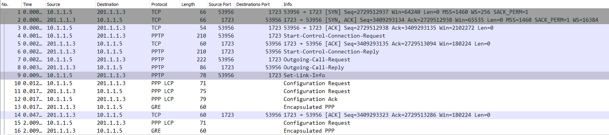

## **组网需求**

在外移动办公的工作人员需要通过PPTP VPN 隧道模式拨入到公司内网来对内网主机进行访问。

## 网络拓扑

PC1---------------Internet-------------(port2:201.1.1.3)FGT-BJ(port3:192.168.2.1/24)-----------PC2(192.168.2.10)

## 配置步骤

### 配置FortiGate PPTP VPN

1. **基础配置**

   

   

2. **创建用户并将用户加入到用户组**

   

   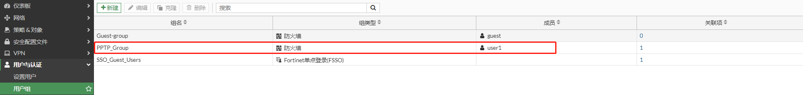

3. **配置PPTP VPN**

   ```
   config vpn pptp
       set status enable
       set eip 172.31.1.200
       set sip 172.31.1.10
       set usrgrp "PPTP_Group"
   end
   ```

4. **配置地址对象**

   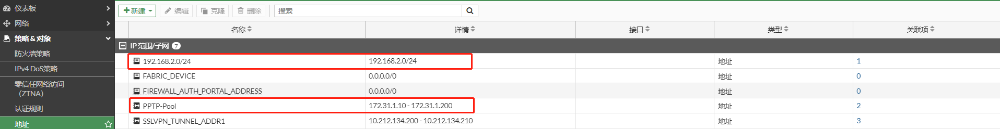

5. **配置防火墙策略**

   第1条策略用于客户端PPTP VPN拨号后访问内网；第2条策略用于客户端PPTP VPN拨号后上网。

   当客户端PPTP VPN拨号成功后，将会使用获取的地址（172.31.1.10-172.31.1.200）访问内部主机，因此内部网络需要增加到172.31.1.0/24网段的回程路由指向FortiGate 或者 可以在策略中开启NAT，那么源地址将被转换为FortiGate接口地址，则不用考虑回程路由。

   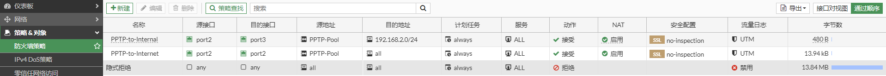

### **配置终端PPTP VPN**

1. 右击本地连接图标，选择“打开网络和Internet设置”，选择VPN。

   

2. 点击“添加VPN连接”，设置PPTP，然后点击保存。

   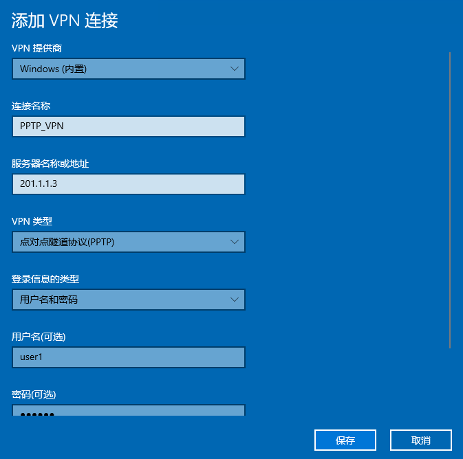

3. PPTP VPN创建完成。

   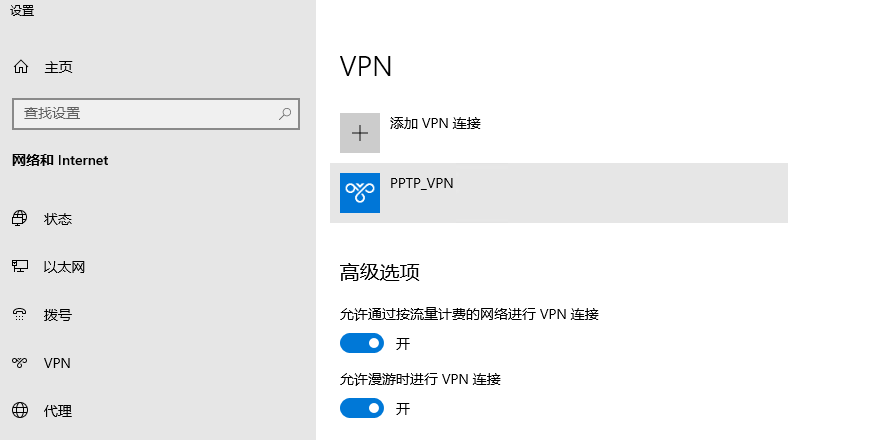

## PPTP VPN拨号测试

1. 点击创建的“PPTP_VPN”，点击“连接”。

   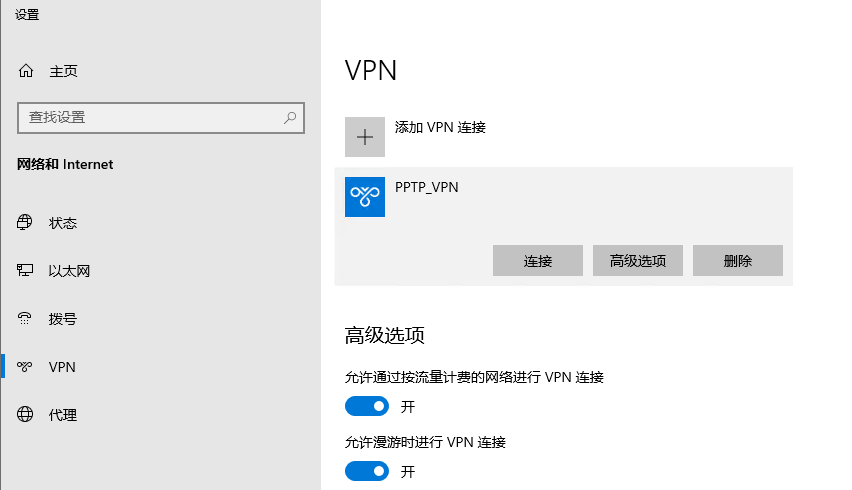

2. 连接成功。

   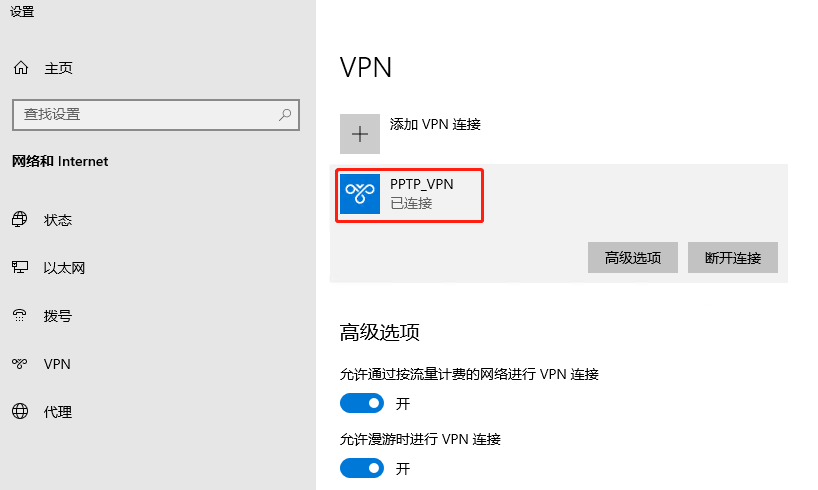

   查看PPTP VPN获取的地址，可以看到FortiGate无法推送DNS给PPTP客户端，如果PPTP客户端需要使用DNS，则需要手动编辑客户端的PPTP连接

   ```
   C:\Users\admin>ipconfig/all
   以太网适配器 Ethernet1:
   
      连接特定的 DNS 后缀 . . . . . . . :
      描述. . . . . . . . . . . . . . . : Intel(R) 82574L Gigabit Network Connection #2
      物理地址. . . . . . . . . . . . . : 00-0C-29-A2-90-EA
      DHCP 已启用 . . . . . . . . . . . : 否
      自动配置已启用. . . . . . . . . . : 是
      本地链接 IPv6 地址. . . . . . . . : fe80::65c4:a7eb:1876:83ac%5(首选)
      IPv4 地址 . . . . . . . . . . . . : 10.1.1.5(首选)
      子网掩码  . . . . . . . . . . . . : 255.255.255.0
      默认网关. . . . . . . . . . . . . : 10.1.1.1
      DHCPv6 IAID . . . . . . . . . . . : 402656297
      DHCPv6 客户端 DUID  . . . . . . . : 00-01-00-01-29-1C-CC-4A-00-0C-29-A2-90-E0
      DNS 服务器  . . . . . . . . . . . : 114.114.114.114
      TCPIP 上的 NetBIOS  . . . . . . . : 已启用
   
   PPP 适配器 PPTP_VPN:
   
      连接特定的 DNS 后缀 . . . . . . . :
      描述. . . . . . . . . . . . . . . : PPTP_VPN
      物理地址. . . . . . . . . . . . . :
      DHCP 已启用 . . . . . . . . . . . : 否
      自动配置已启用. . . . . . . . . . : 是
      IPv4 地址 . . . . . . . . . . . . : 172.31.1.11(首选)
      子网掩码  . . . . . . . . . . . . : 255.255.255.255
      默认网关. . . . . . . . . . . . . : 0.0.0.0
      TCPIP 上的 NetBIOS  . . . . . . . : 已启用
   ```

   查看终端路由表。

   ```
   C:\Users\admin>route print
   ===========================================================================
   接口列表
     6...00 09 0f fe 00 01 ......Fortinet Virtual Ethernet Adapter (NDIS 6.30)
    10...00 0c 29 a2 90 e0 ......Intel(R) 82574L Gigabit Network Connection
     5...00 0c 29 a2 90 ea ......Intel(R) 82574L Gigabit Network Connection #2
    46...........................PPTP
     1...........................Software Loopback Interface 1
   ===========================================================================
   
   IPv4 路由表
   ===========================================================================
   活动路由:
   网络目标        网络掩码          网关       接口   跃点数
             0.0.0.0          0.0.0.0         10.1.1.1         10.1.1.5   4506
             0.0.0.0          0.0.0.0            在链路上       172.31.1.11     26
            10.1.1.0    255.255.255.0            在链路上          10.1.1.5   4506
            10.1.1.5  255.255.255.255            在链路上          10.1.1.5   4506
          10.1.1.255  255.255.255.255            在链路上          10.1.1.5   4506
           127.0.0.0        255.0.0.0            在链路上         127.0.0.1   4556
           127.0.0.1  255.255.255.255            在链路上         127.0.0.1   4556
     127.255.255.255  255.255.255.255            在链路上         127.0.0.1   4556
         172.31.1.11  255.255.255.255            在链路上       172.31.1.11    281
   ```

3. 访问内部主机。

   ```
   C:\Users\admin>ping 192.168.2.10
   
   正在 Ping 192.168.2.10 具有 32 字节的数据:
   来自 192.168.2.10 的回复: 字节=32 时间=1ms TTL=63
   来自 192.168.2.10 的回复: 字节=32 时间<1ms TTL=63
   来自 192.168.2.10 的回复: 字节=32 时间<1ms TTL=63
   来自 192.168.2.10 的回复: 字节=32 时间=1ms TTL=63
   
   192.168.2.10 的 Ping 统计信息:
       数据包: 已发送 = 4，已接收 = 4，丢失 = 0 (0% 丢失)，
   往返行程的估计时间(以毫秒为单位):
       最短 = 0ms，最长 = 1ms，平均 = 0ms
   ```

4. 访问Internet

   ```
   C:\Users\admin>ping 114.114.114.114
   
   正在 Ping 114.114.114.114 具有 32 字节的数据:
   来自 114.114.114.114 的回复: 字节=32 时间=23ms TTL=82
   来自 114.114.114.114 的回复: 字节=32 时间=21ms TTL=71
   来自 114.114.114.114 的回复: 字节=32 时间=21ms TTL=89
   来自 114.114.114.114 的回复: 字节=32 时间=20ms TTL=75
   
   114.114.114.114 的 Ping 统计信息:
       数据包: 已发送 = 4，已接收 = 4，丢失 = 0 (0% 丢失)，
   往返行程的估计时间(以毫秒为单位):
       最短 = 20ms，最长 = 23ms，平均 = 21ms
   ```

5. 如果需要通过PPTP访问域名，则需要手动设置PPTP的DNS。先中断PPTP连接，手动设置DNS，然后再次拨号。

   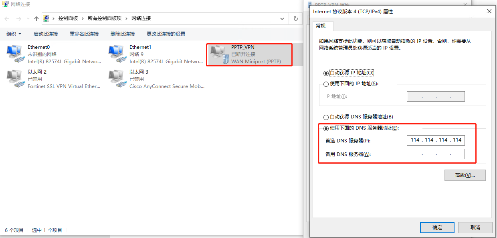

6. 访问www.baidu.com 正常。

   


