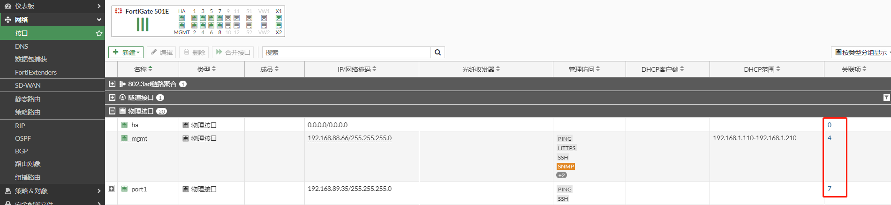
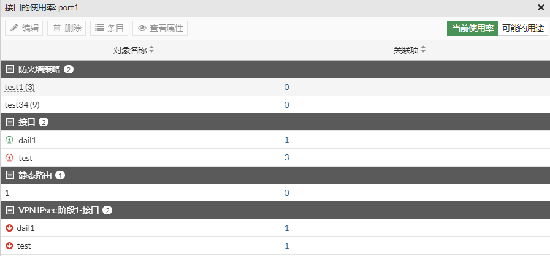
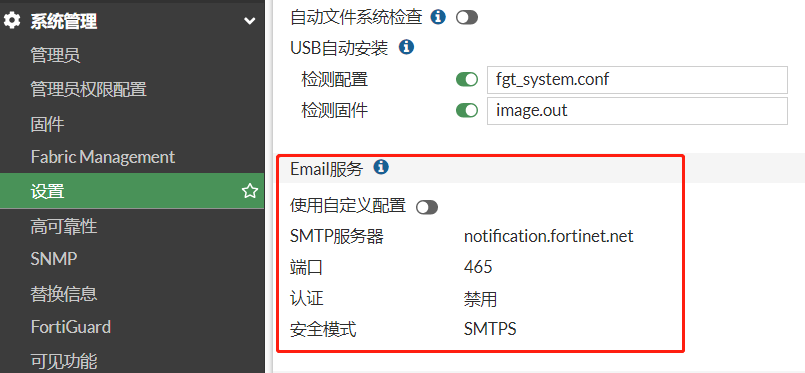
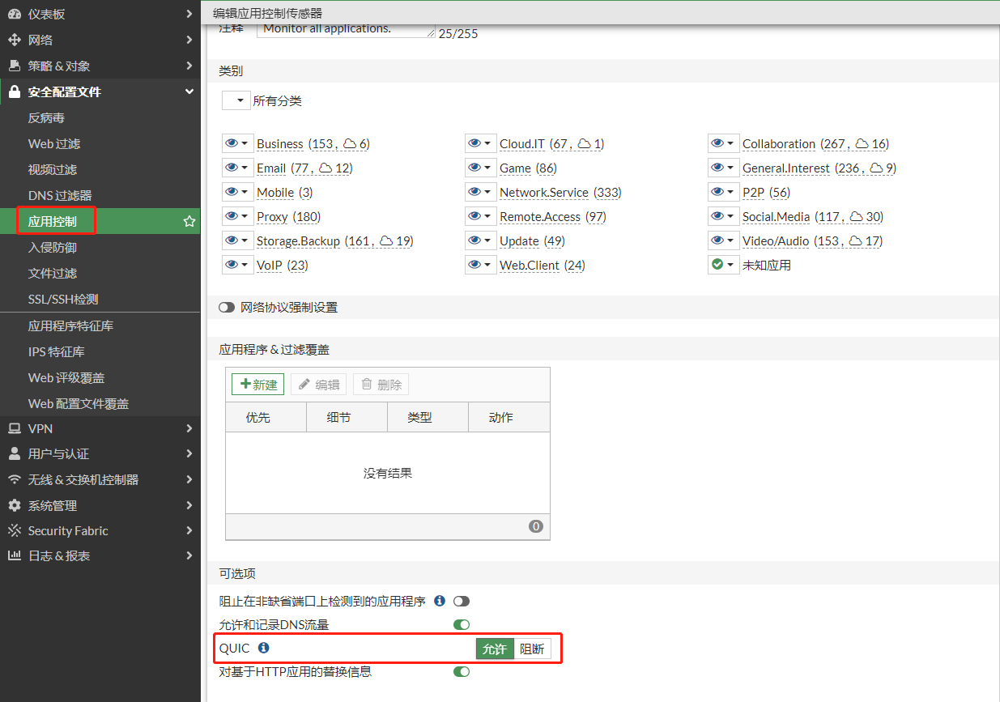

# 功能配置

1. **如何实现源NAT，防火墙策略中启用NAT、ip地址池、和中央NAT分别是什么意思？**

   答：源NAT：即源地址转换，源NAT在防火墙策略中实现，通过开启NAT、引用ip地址池、和引用中央NAT来实现源地址转换。

   ​       策略中启用NAT：代表源地址转换为此策略出接口的ip地址。

   ​       ip地址池：如果选择了ip地址池，代表源地址转换为ip地址池中的ip地址，或者也可以直接定义源地址对应关系，不受策略限制。

   ​       中央NAT：中央NAT是一个单独的地址转换表，防火墙策略选择了中央NAT后，会根据策略的源地址去到中央NAT查找匹配相应的转换关系。

2. **什么是虚拟ip？**

   答：虚拟ip即vip，虚拟ip是用来做目的地址转换使用，实现目的映射的对应关系的策略，需要引用到防火墙策略中才能生效，需要注意，虚拟ip的映射关系会影响到源地址转换，也就是，防火墙会优先匹配虚拟ip的映射关系，再匹配防火墙策略中选择的源地址转换方式。

3. **如何实现目的NAT？**

   答：目的NAT即目的转换，目的转换在防火墙策略中实现，通过事先新建一个vip，然后在防火墙策略中的目的选择vip即可实现目的地址映射。

4. **如何实现双向NAT？**

   答：如果要实现双向地址转换，在防火墙策略的目的选择相应的vip，然后在策略中启用NAT或者引用ip地址池，或者直接使用中央NAT。

5. **接口和区的有什么关系**

   答：区域可以包含多个接口，可以理解为接口组，接口一旦划入到区中，就不能单独做策略，在防火墙策略中只能找到相应的区，而无法选择所划入区的接口了，所以区通常较少使用。

6. **内网用户需要通过公网映射地址访问内部服务器，需要什么特殊配置？**

   答：做好外网访问内网的映射后，只需要增加一条内网访问外网的的防火墙策略即可。

7. **HA主备模式系统升级是否会中断业务，如何操作？**

   答：主备防火墙升级系统不会中断，只要按照正常的方式升级即可，通过管理主墙，上传版本文件后，主墙把版本文件同步给备墙，备墙先升级，备墙升级完后，主墙开始升级，升级过程中会切换到备墙工作，整个过程透明，无需其他额外操作，通单台升级操作一样。

8. **sslvpn支持几种模式？是否支持sslvpn的site-to-site模式？**

   答： a. 支持代理模式：代理模式只支持B/S架构的http、https应用代理

   ​         b. 支持客户端模式：即隧道模式，无应用限制。

   ​         c. 不支持插件方式

   ​         d. 不支持site-to-site模式

9. **移动终端vpn支持情况？**

   答：IPSEC vpn支持ios和android，ios和android均采用系统自带的客户端

   ​       SSLVPN支持支持ios和android，FortiExplore VPN支持ios，FortiClient支持Android。

10. **防火墙支持stp功能吗？**

    答：低端型号如FortiGate 60E，FortiGate 100E，FortiGate 100F的硬交换接口支持。

11. **防火墙是否支持 802.1x ？**

    答：低端型号如FortiGate 60E，FortiGate 100E，FortiGate 100F的硬交换接口支持。

12. **防火墙支持链路聚合 802.3ad 功能吗？**

    答：支持

13. **转换或接口提示被占用，如何查找接口被哪些模块被调用**

    关联项就是接口被引用的次数，如点击"7"可以查看具体被哪些模块引用。

    

    

14. **防火墙通过默认的notification.fortinet.net:465邮件服务器，邮件方式发送FortiToken（双因子认证）、告警或日志到特定邮箱时，为什么收件邮箱经常收不到，或被识别为了垃圾邮件？**

    答：出现该情况时，请在系统→设置→Email Service中配置“缺省回复至”，定义username，域名保证为notification.fortinet.net，就不会被其他email server认为是垃圾邮件。

    

    在FortiGate版本7.2.4及后续的版本中，默认的notification.fortinet.net:465邮件服务器 将取消 “缺省回复至” 选项，将该选项硬编码为DoNotReply@notification.fortinet.net

    

15. **配置了FQDN形式的地址对象并使用静态/策略路由引用，但实际效果不稳定，客户端访问配置的FQDN时，仍然从其他线路出去了。**

    答：FQDN地址对象中获取的IP地址有两种方式：1、设备使用自身配置的DNS解析到的结果；2、穿过防火墙的DNS流量被设备记录。（具体原理可以参考附件：https://support.fortinet.com.cn/uploadfile/2021/0928/fqdn.pdf）

    在FQDN地址对象的CLI配置下：

    1）如果配置的cache-ttl>DNS服务器返回的TTL，认为该FQDN下面配置的cache-ttl时间优先。

    2）如果cache-ttl<DNS服务器返回的TTL，则DNS服务器返回的TTL优先。

    3）如果没有没配置cache-ttl（默认为0），以DNS服务器返回的TTL为准。

    当TTL变为0时，防火墙会删除该FQDN下的相关地址记录。

    解决办法：在CLI下，编辑FQDN形式的地址对象，将cache-ttl修改为86400。

    ```
    config firewall address
      edit "www.baidu.com"
        set type fqdn
        set allow-routing enable
        set fqdn "www.baidu.com" 
        set cache-ttl 86400
      next
    end
    ```


16. **Flow模式和Proxy模式的区别**。

    答：

    **Flow模式：**

    当防火墙策略的检测方式设置为Flow时，经过该策略的流量不会被FortiGate进行缓冲。与代理模式不同的是，通过策略的内容负载将被逐包检查，最后一个包由FortiGate保存，直到扫描返回结果。如果检测到异常流量，则向接收端发送一个重置包，终止连接，并阻止有效负载成功发送。

    基于Flow检测能够实时识别和阻断安全威胁。所有适用的基于流的安全模块在一次通过中同时应用，使用DFA（Direct Filter Approach）模式匹配来识别可能的攻击或威胁。模式匹配由CP8或CP9处理器卸载和加速。

    基于流程的检查通常比基于代理的检查需要更少的处理资源，并且不改变报文，除非发现威胁并阻断报文。

    **Proxy模式：**

    当防火墙策略的检测方式设置为Proxy时，通过该策略的流量会被FortiGate进行缓冲检测。这意味着FortiGate将保存文件、电子邮件消息或网页的信息包，直到整个有效负载被检查是否违反(病毒、垃圾邮件或恶意web链接)。在FortiOS完成检查之后，如果流量是干净的，负载要么被发送到目的地，如果流量有异常，则被丢弃并用替换消息替换。

    代理模式提供了最彻底的流量检查，但是它的彻底的牺牲了性能，使得它的吞吐量比流模式策略慢。

17. **在策略中调用“应用控制”的安全配置文件后，发现微信发图片很慢，或一些手机App无法正常访问。**

    答：微信、支付宝等一些手机App在使用时会用到QUIC协议。默认情况下，应用控制安全配置文件不允许QUIC业务通过，此时微信在发图片时，首先会考虑使用QUIC协议，当QUIC协议被防火墙阻断后，微信再使用HTTPS协议进行发送，导致出现发图片慢的情况。通过在安全配置文件→应用控制中，将QUIC的动作配置为允许，可以解决此问题。

    
