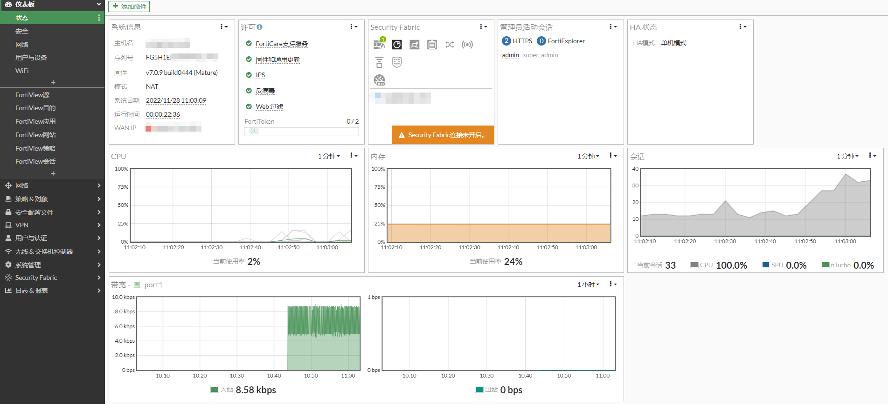
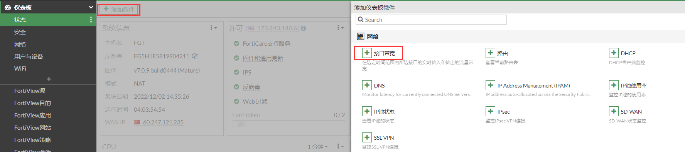
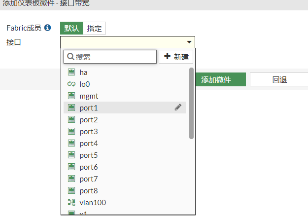

# 运行情况

1. **在"仪表板"-->"状态"界面，通过添加"微件"的方式，如接口流量，如下图，查看cpu、内存、接口流量和会话数。**

   

2. **如何查看设备接口的流量**

   答：在仪表板-->状态，选择“添加微件”，点击“接口带宽”，选择对应的业务接口。

3. **如何通过SNMP管理并监控FortiGate的系统运行及性能情况。**

   答：a.开启设备的SNMP，配置步骤请参考系统管理-->设备管理-->SNMP设置。

   ​    b.在SNMP配置界面下方可直接下载FortiGate SNMP MIB文件，并将MIB文件导入进MIB Browser、PRTG Network Monitor、Cacti等MIB管理监控工具。

   ​    c.通过MIB工具可读取出设备的相关CPU使用率、MEM使用率、硬盘使用率、新建会话数、并发会话数等关键参数， 以下为整理出来的常用MIB OID参数值。

   ```
   FortiGate设备名称          sysName         OID：1.3.6.1.2.1.1.5 
   FortiGate设备序列号        fnSysSerial     OID：1.3.6.1.4.1.12356.100.1.1.1
   FortiGate设备软件版本      fgSysVersion     OID：1.3.6.1.4.1.12356.101.4.1.1
   FortiGate设备运行时间      sysUpTime        OID：1.3.6.1.2.1.1.3
   CPU 使用率                fgSysCpuUsage    OID：1.3.6.1.4.1.12356.101.4.1.3
   MEM使用率                 fgSysMemUsage    OID：1.3.6.1.4.1.12356.101.4.1.4
   硬盘使用率                 fgSysDiskUsage   OID：1.3.6.1.4.1.12356.101.4.1.6
   IPv4并发会话数             fgSysSesCount    OID：1.3.6.1.4.1.12356.101.4.1.8
   IPv4新建会话数（1分钟）      fgSysSesRate1    OID：1.3.6.1.4.1.12356.101.4.1.11
   IPv6并发会话数             fgSysSes6Count   OID：1.3.6.1.4.1.12356.101.4.1.15
   IPv6新建会话数（1分钟）      fgSysSesRate1    OID：1.3.6.1.4.1.12356.101.4.1.16
   ```
