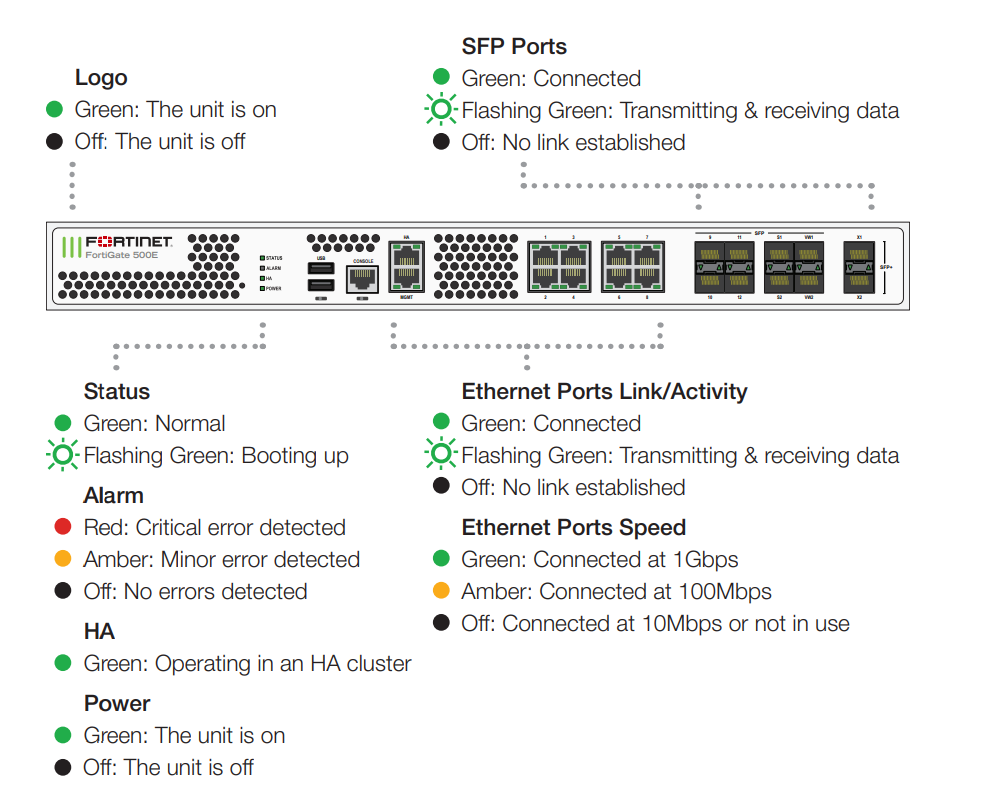

# 设备硬件检查

## 环境/指示灯维护

1. 清洁状况：设备外壳、设备内部、机架内各防尘网、地板等都应干净整洁无明显尘土附着。注意机柜防尘网的清洁状况，及时清洗更换，以免影响机柜门及风扇框的通风散热。

2. 散热状况：设备正常工作时，要求保持风扇正常运转，擅自关闭风扇会引起设备温度升高，并可能损坏设备。不要在设备子架上通风口处放置杂物，还应定期清理风扇的防网。

3. 设备指示灯及状态，请参考设备硬件指南：https://docs.fortinet.com/product/fortigate/hardware ，如FortiGate 500E

   

