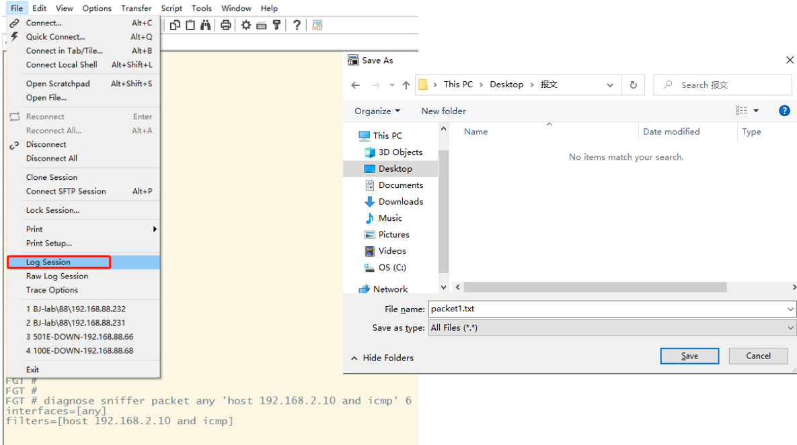
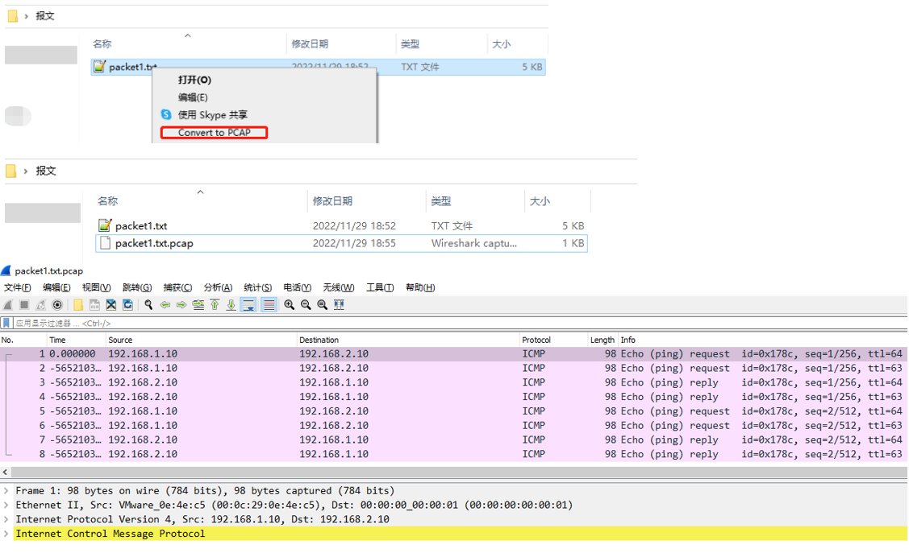
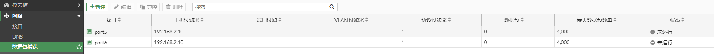
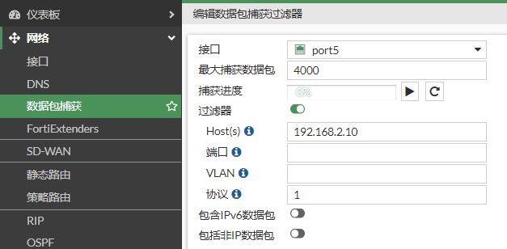
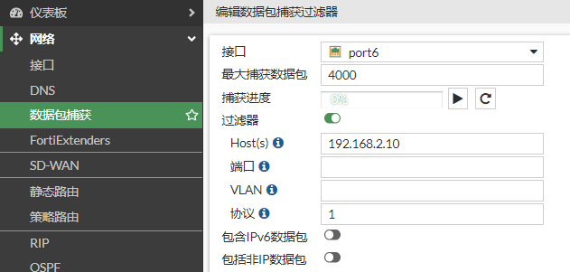
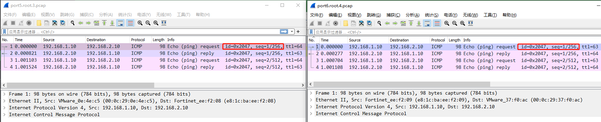

# 使用wireshark打开抓包文件

## sniffer命令抓包转换工具——推荐

通过diagnose sniffer packet any "xxxx" 6 抓取报文内容，保存为txt文本格式。

安装“ConvertPcap-1.1.exe”，然后右击txt文本格式的报文，选择Convert to PACP完成数据格式的转换，使用起来非常方便简洁。 

**ConvertPcap-1.1.exe下载连接点击[<a href="../../files/ConvertPcap.zip" target="_blank">ConvertPcap</a>](../../files/ConvertPcap.zip)。**

## GUI抓包

分别在内外接口上开启抓包，在此示例中使用（host 192.168.2.10）以及协议（icmp = proto  1）进行过滤。建议先开启捕获之后，再通过客户端访问，以确保抓取到完整数据包。 

GUI抓包优点是方便，抓取的内容可以直接查看；缺点是过滤选项不够丰富，而且抓包的接口不能使用any，因此进出接口的报文需要分别抓取。

通过比较报文ID，icmp seq序列号来确认两者是同一个报文

