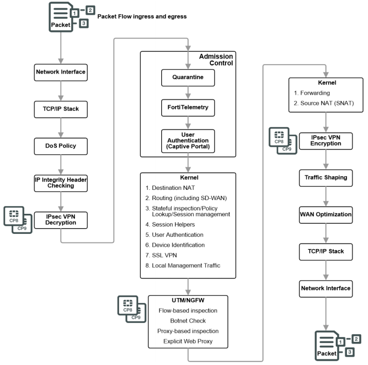
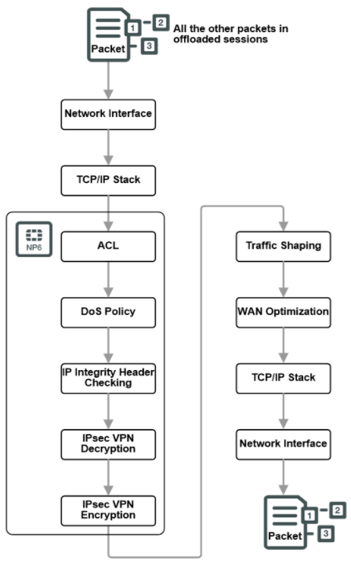
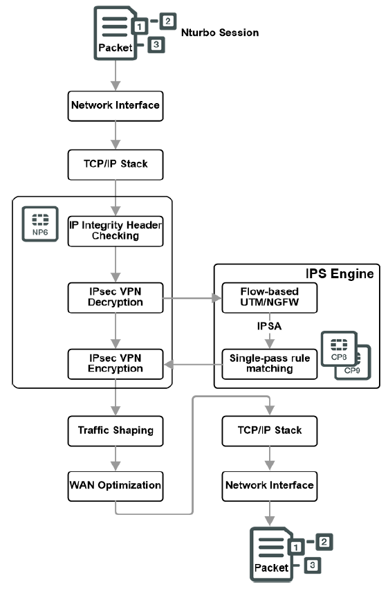
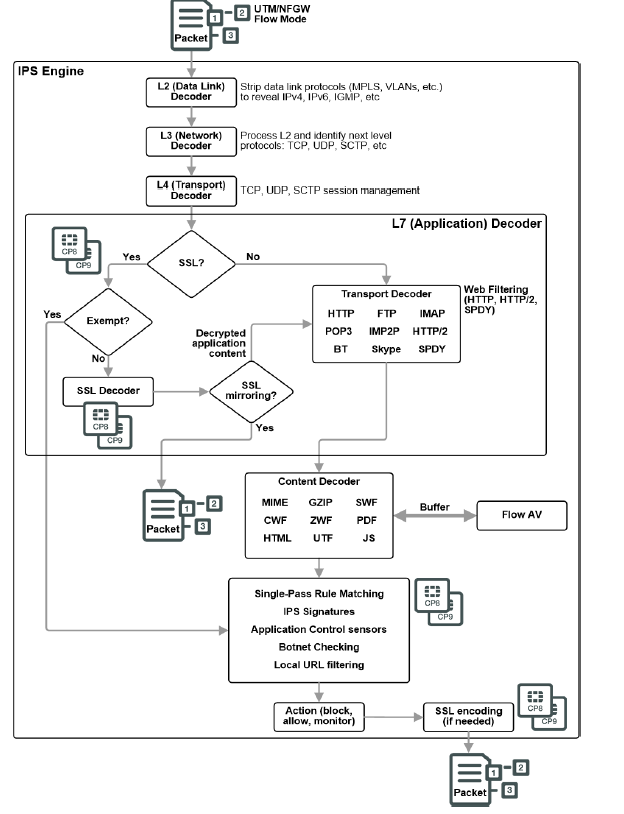

# 数据包处理流程

## FortiGate对数据包处理流程图

下图描述了数据包在进入、通过和离开FortiGate时所经过的步骤（不包含网络处理器，如NP6）。

1. **Ingress**

   FortiGate通过网络接口接收的数据包交由TCP/IP栈进行处理。

   如果配置了Dos策略，则FortiGate进行判断流量是有效的，还是攻击。DoS模块对所有的流量进行检测，但只跟踪可用于DoS攻击的报文(例如TCP SYN报文)，确保其在允许的参数范围内，阻断可疑DoS攻击，放行其他报文。

   IP完整性报头检查通过读取报文的报头来验证报文是否为有效的TCP、UDP、ICMP、SCTP报文等，确保协议头的长度正确。

   进入的IPsec报文，如果与FortiGate上配置的IPsec隧道相匹配，则IPsec引擎尝试解密。如果IPsec引擎能够应用正确的加密密钥并解密报文，则将未加密的报文发送到下一步，IPsec VPN解密由CP8或CP9处理器卸载和加速。非IPsec流量和无法解密的IPsec流量将不受影响地转入下一个步骤。

2. **Admission Control**

   接收控制检查，查看数据包是否来自隔离列表上的源或目的地，是否安装FortiClient，以及是否在入接口配置了portal认证。

3. **Kernel**

   数据包经过以上步骤后，将会进行内核检查

   **Destination NAT**

   检查数据包中的目标IP地址，如果在  VIP（目标地址NAT）表中，则将其替换为映射后IP地址（真实IP地址）和端口。 该步骤在路由之前。

   **Routing**

   使用routing table或者proute list来确定数据包离开FortiGate时所使用的接口

   **Stateful  Inspection Engine**

   状态检查查看会话的第一个包，并查看策略表，从而对整个会话做出安全决策。状态检查查看数据包TCP SYN和FIN标志，以识别会话的开始和结束、源/目的IP、源/目的端口和协议，还对数据包有效负载和序列号执行其他检查，以验证它是一个有效的会话，并且数据没有损坏或格式不正确。

   状态检查根据在会话的第一个包中发现的内容来决定删除或允许一个会话，并对其应用安全特性，并将该会话的信息添加到会话表中。然后，同一会话中的所有后续报文都将以相同的方式处理。

   **Session Helper**

   有些协议在数据负载中包含信息，必须对这些信息进行分析才能成功地处理该协议的会话，如FTP，FortiGate使用session-helper监控FTP控制连接中开放的数据连接的端口，动态的开放FTP数据连接的会话，从而允许FTP数据连接报文通过。

   **User authentication**

   对用户身份进行认证，根据用户名和用户所在组选择防火墙策略。

   **SSLVPN**

   本地SSL VPN流量被视为由SSL VPN目的端口决定的特殊管理流量。报文被解密后，路由到SSL VPN接口（ssl.root），然后使用策略查找来控制如何将包转发到目的地。SSL加密和解密由CP8或CP9处理器卸载和加速。

   **Local management traffic**

   防火墙自身相关的流量处理，如Web、SSH管理，Syslog、SNMP通信等，不涉及后续步骤。

4. **UTM/NGFW**

   UTM检测有两种模式：Flow模式和Proxy模式，通常使用Flow模式。在Flow模式中，如果匹配报文的策略中包含安全配置文件，如防病毒、IPS、应用控制，web过滤等UTM功能，则数据包交由IPS引擎处理，实时识别和阻断可能的攻击或威胁。如果开启了Bonet  Check（僵尸网络检查），数据包还将接受僵尸网络检查，以确保它们不是发送到已知的僵尸网络地址。

5. **Kernel**

   内核根据路由表将报文转发到正确的出接口。内核还会检查NAT表，判断出方向流量的源IP地址是否需要做源NAT。

6. **Egress**

   FortiGate判断流量是否需要经过IPsec VPN隧道加密，IPsec VPN加密由CP8或CP9处理器卸载和加速，以及是否需要做流量整形，最终报文经过TCP/IP栈处理后从出接口发出。

   

## FortiGate 网络处理器处理流程

FortiGate包含NP网络处理器，基于Flow模式且未开启UTM时：第一个数据包经过上述完整的处理过程，后续的报文将匹配会话转发，当会话推送到NP处理器后，后续流量将跳过路由和内核处理器，直接由NP处理器从出接口转发出去。

FortiGate包含NP网络处理器，基于Flow模式且开启UTM时：第一个数据包经过上述完整的处理过程，后续的报文将匹配会话转发，当会话推送到NP处理器后，后续流量将跳过路由和内核处理器，但对于UTM操作，如IPS，AV等扫描仍然由CPU进行处理，这种基于Flow的UTM加速方式称为NTurbo。如果发现安全威胁，则丢弃会话。否则，未被UTM阻断的报文由NP6处理器从出接口转发出去。NTurbo不兼容DoS策略、session-helper或大多数类型的隧道，如果这些特性存在，NTurbo就不会加速。

基于Flow的UTM检测，可以在策略中配置IPS，AV，Application Control，Webfilter等，将全部交由IPS引擎完成，在检测之前，IPS引擎使用一系列解码器来根据数据包的协议和策略设置确定要应用的适当安全模块，然后通过DFA (Direct Filter Approach)模式匹配，实时识别和阻断安全威胁，模式匹配由CP8或CP9处理器加速。在数据流通过时，IPS、Application Control、Webfilter、Bonet  Check将会一并处理，基于流的AV反病毒技术是在协议解码时缓存文件，在进行其他匹配时提交缓存文件进行病毒扫描。

