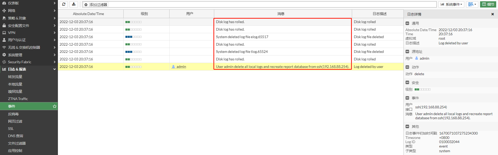
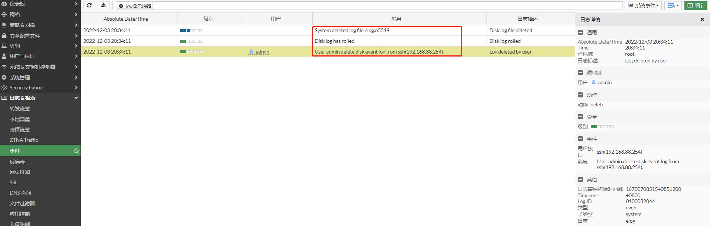

## 删除日志

FortiGate可以对记录在本地的日志（硬盘和内存）进行删除。

1. **删除所有的本地日志**

   a. 执行execute log delete-all删除所有日志

   ```
   # execute log delete-all 
   This will delete all local logs and recreate report database.
   Do you want to continue? (y/n)y
   ```

   b. 删除日志后，删除日志动作本身也会产生日志

   

   

2. **指定删除某个类型的日志**

   a. 选择日志的存储类型

   ```
   # execute log filter device 
   Available devices:
    0: memory
    1: disk
    2: fortianalyzer
    3: fortianalyzer-cloud
    4: forticloud
   ```

   b. 选择日志的类型

   ```
   # execute log  filter category 
   Available categories:
    0: traffic
    1: event
    2: utm-virus
    3: utm-webfilter
    4: utm-ips
    5: utm-emailfilter
    7: utm-anomaly
    8: utm-voip
    9: utm-dlp
   10: utm-app-ctrl
   12: utm-waf
   15: utm-dns
   16: utm-ssh
   17: utm-ssl
   19: utm-file-filter
   20: utm-icap
   22: utm-sctp-filter
   ```

   c. 删除日志

   ```
   这里删除硬盘的日志事件日志
   
   # execute log filter device 1
   # execute log filter category 1
   # execute log delete
   This will delete disk event log
   Do you want to continue? (y/n)y
   ```

   d. 删除日志后，删除动作本身也会产生日志

   