# 日志存储方式

防火墙上的日志存储主要有4种方式：**1.硬盘；2.内存；3.FortiAnalyzer；4.第三方syslog服务器**

## 硬盘记录日志

1. **格式化硬盘**

   在设备部署前，请先格式化硬盘，以免后续使用硬盘记录日志时产生异常情况，格式化硬盘会重启设备，硬盘中的数据将清空。设备的版本，配置文件是保存在flash中的，不会被影响。

   不是所有的FortiGate设备都有硬盘，如FortiGate 500E，FortiGate600F不带硬盘，FortiGate 501E，FortiGate601F带硬盘，没有硬盘则没有execute formatlogdisk命令。

   ```
   FGT # execute formatlogdisk 
   Log disk is /dev/sda1.
   Formatting this storage will erase all data on it, including
     logs, quarantine files;
   and require the unit to reboot.
   Do you want to continue? (y/n)
   ```

2. **开启硬盘日志**

   选择“日志设备”，在本地日志，在”本地日志“中打开”硬盘“选项即可。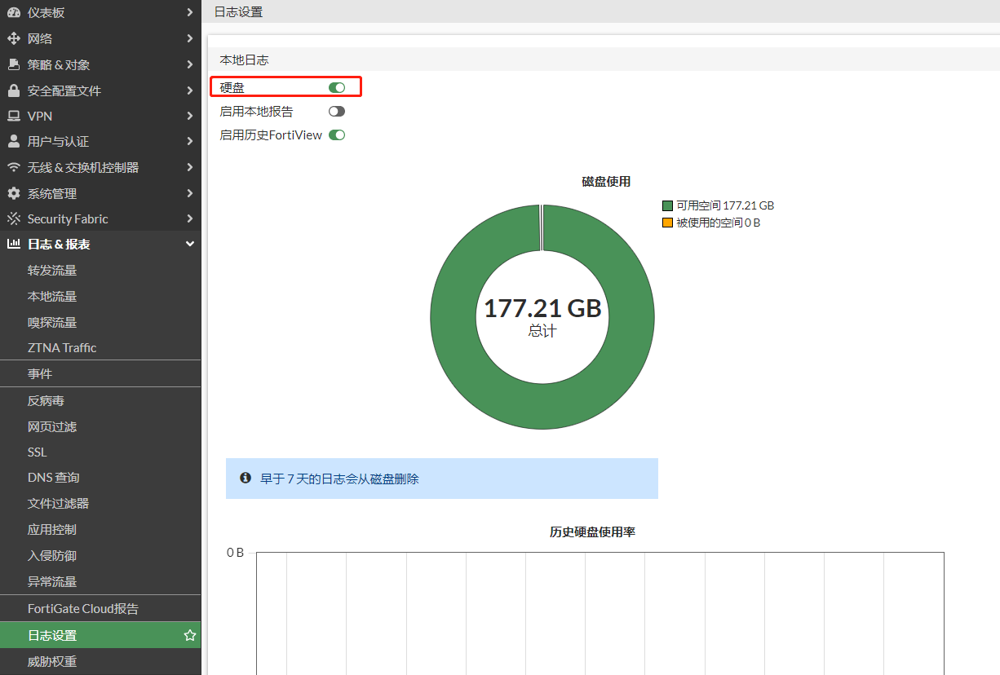

2. **不建议使用硬盘记录流量日志**

   由于流量日志非常大，所以记录于硬盘将带来设备性能损耗，减少硬盘寿命，以及从大量的流量日志中进行查询也非常消耗CPU资源。建议将流量日志发送到FortiAnalyzer或者syslog服务器。

   ```
   过滤硬盘记录流量日志的配置如下：
   config log disk filter
       config free-style
           edit 1
               set category traffic
               set filter "type traffic"
               set filter-type exclude
           next
       end
   end
   ```

3. **设置硬盘记录日志的参数**

   默认硬盘日志保存的时间为7天，可以根据需求进行修改。当硬盘满时，会覆盖最早的日志。

   ```
   config log disk setting
       set maximum-log-age 7
       set diskfull overwrite
   end
   ```

   建议取消勾选“解析主机名”和“解析未知应用”两个选项，影响日志观察。

   **解析主机名**：使用反向DNS解析；**解析未知应用**：使用Internet服务数据库解析

   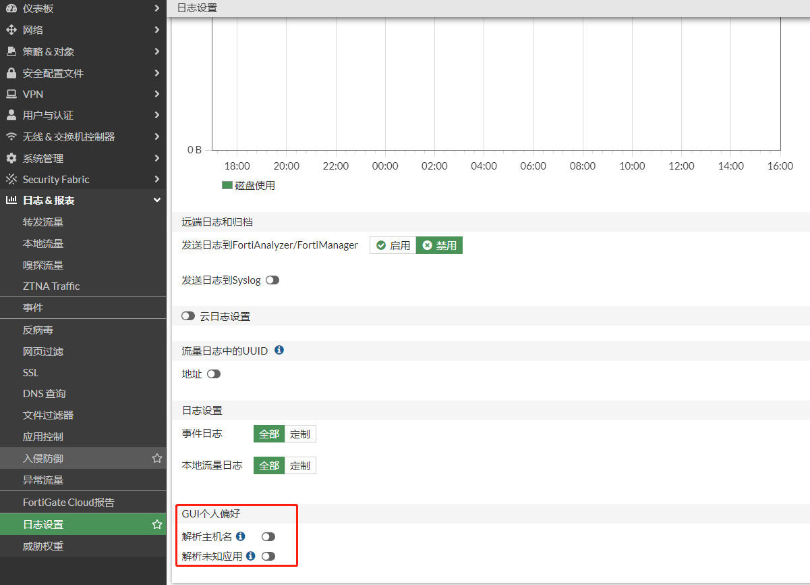

5. **查看硬盘日志**

   在GUI界面右上角选择“硬盘”，就可以查看到硬盘的对应的日志，也可以通过“添加过滤器”来过滤日志。

   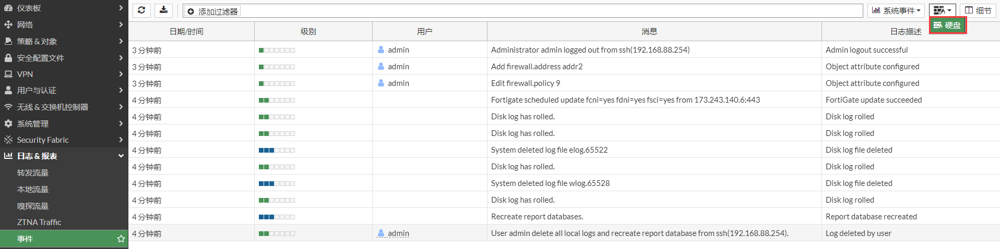

   上图日志的第一栏显示了日志产生的相对时间，但排错往往需要查看日志的绝对时间。通过右击日志的标题栏，选择“Absolute Date/Time”，去掉原有的“时间/日期”列，就可以看到日志的绝对时间了，而且列是可以拖动的。

   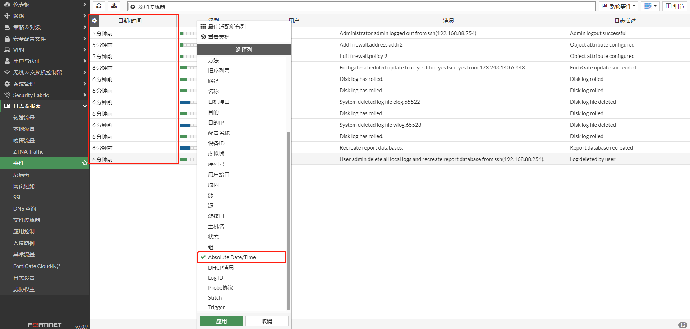

   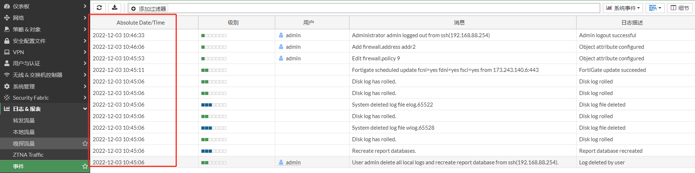

## 内存记录日志

**注意：在FortiGate中不建议使用内存记录日志，建议将日志发送到FortiAnalyzer或者syslog服务器。通常是为了排除任何特定问题或在本地监视日志而临时开启，稍后再禁用它。重启后内存日志会丢失。**

1. **开启内存记录日志**

   通过在config log memory setting中开启内存记录日志。

   ```
   config log memory setting
       set status enable
   end
   ```

2. **查看内存日志**

   在GUI界面右上角选择“内存”，查看内存日志。

   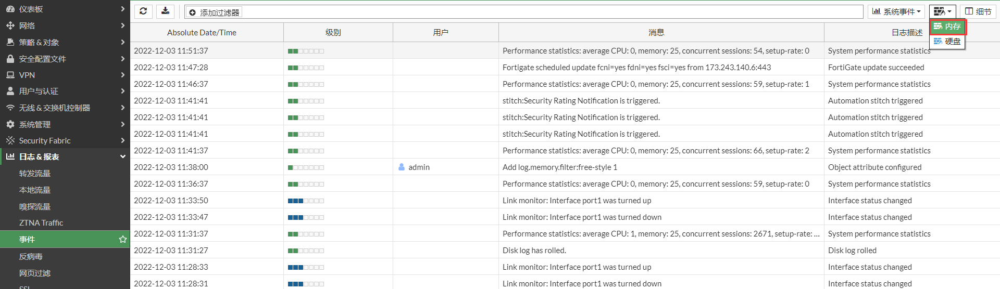

## FortiAnalyzer记录日志

FortiAnalyzer是专门用来做为Fortinet设备的网路安全日志记录、分析、统计和产生报表的产品。FortiGate和FortiAnalyzer之间使用OFTP协议交互，端口是TCP 514。FortiAnalyzer的固件版本应该等于或高于运行在FortiGate上的版本，如FortiAnalyzer的版本如果是7.0，FortiGate的版本可以是7.0或者6.4。

1. **开启FortiAnalyzer记录日志**

   在“日志设置”中，启用”发送日志到FortiAnalyzer/FortiManager“，“服务器”填写FortiAnalyzer的IP地址，”上传选项“选择 “实时”，然后点击“应用”。

   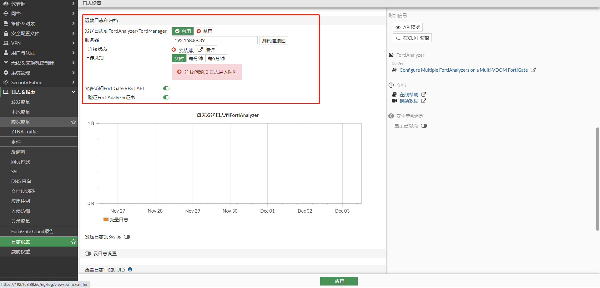

   弹出”Verify FortiAnalyzer Serial Number“，点击“接受”。

   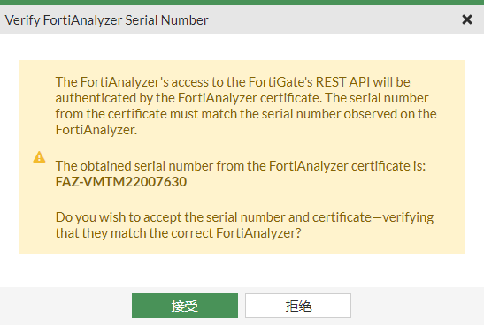点击“准许”

   点击“准许”。

   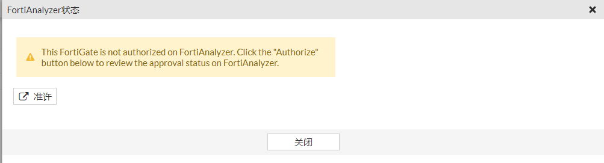

   弹出FortiAnalyzer登录窗口，输入FortiAnalyzer账号密码登录。

   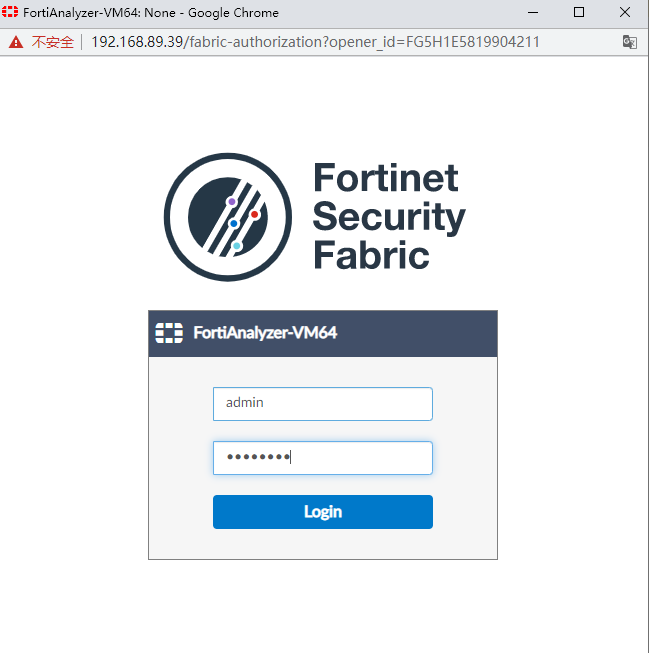

   登录成功后，点击“Approve”准许FortiGate注册到FortiAnalyzer，并点击“OK”。

   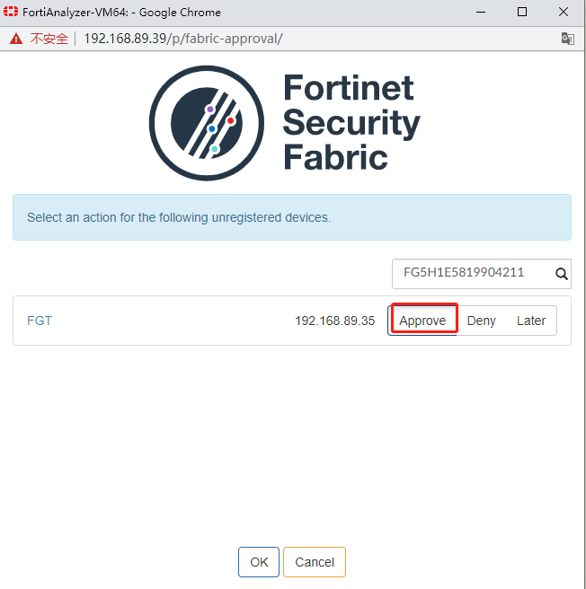

   FortiGate已成功被FortiAnalyzer授权成功。

   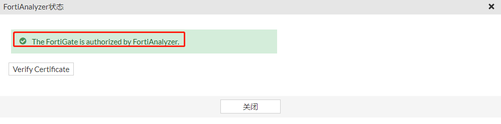

2. **查看连接状态**

   分别从FortiGate和FortiAnalyzer上查看两者的状态。FortiGate连接状态如下，可以通过“测试连接性”进行测试。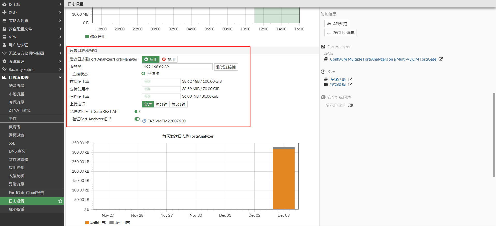

   FortiGate CLI通过execute log fortianalyzer test-connectivity测试连接状态。

   ```
   # execute log fortianalyzer test-connectivity 
   FortiAnalyzer Host Name: FAZVM64
   FortiAnalyzer Adom Name: root
   FortiGate Device ID: FG5H1E5819904211
   Registration: registered
   Connection: allow
   Adom Disk Space (Used/Allocated): 41997274B/107374182400B
   Analytics Usage (Used/Allocated): 41960410B/75161927680B
   Analytics Usage (Data Policy Days Actual/Configured): 60/60 Days
   Archive Usage (Used/Allocated): 36864B/32212254720B
   Archive Usage (Data Policy Days Actual/Configured): 0/365 Days
   Log: Tx & Rx (33 logs received since 16:19:54 12/03/22)
   IPS Packet Log: Tx & Rx
   Content Archive: Tx & Rx
   Quarantine: Tx & Rx
   
   Certificate of Fortianalyzer valid and serial number is:FAZ-VMTM22007630
   ```

   FortiAnalyzer查看该FortiGate连接如下：

   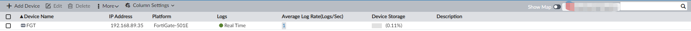

3. **在FortiGate上查看FortiAnalyzer的日志**

   在GUI界面右上角选择“FortiAnalyzer”，查看FortiAnalyzer记录的此FortiGate的日志。

   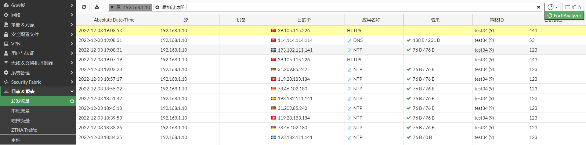

4. **在FortiAnalyzer上查看日志**

   登录FortiAnalyzer，在Log View界面可以查看到FortiGate产生的系统日志，流量日志，UTM日志等。

   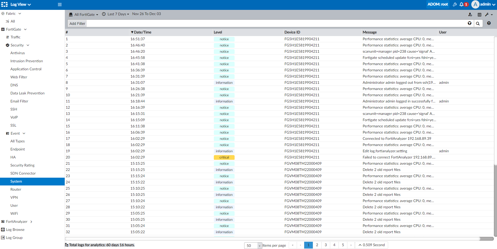

## Syslog记录日志

Syslog 也称为系统日志协议，是一种标准协议，用于将事件消息或系统日志发送到特定服务器，即 Syslog 服务器。 Syslog 主要用于从各种机器收集不同的设备日志，并将它们存储在一个中央位置以进行监控和查看。Syslog协议使用UDP 514端口。

1. **开启syslog记录日志**

   开启“发送日志到Syslog"，IP地址是syslog服务器的IP地址。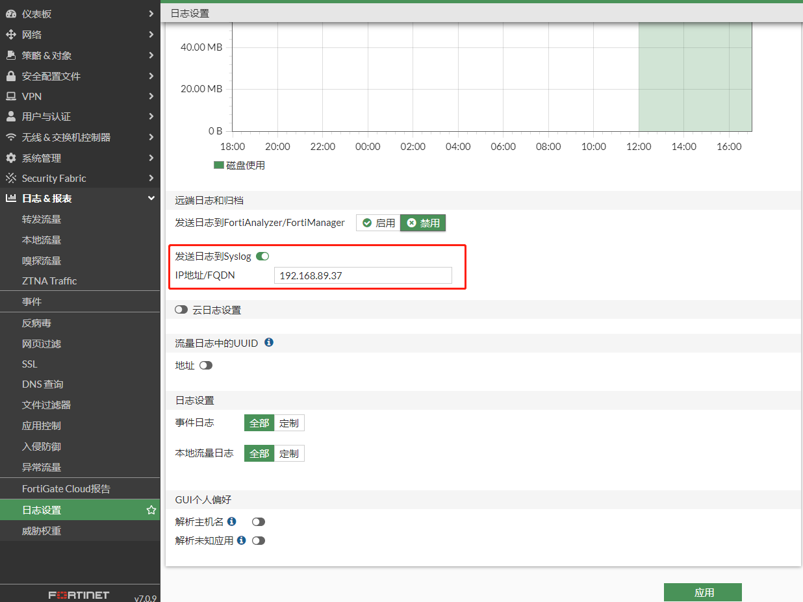

   对应的命令行如下：

   ```
   config log syslogd setting
       set status enable
       set server "192.168.89.37"
       set port 514           //syslog默认使用UDP 514端口传输数据，可以根据需求修改
   end
   ```

   如果有多个syslog服务器，可以通过命令行设置多个。

   ```
   config log syslogd (敲？号)
   syslogd     Configure first syslog device.
   syslogd2    Configure second syslog device.
   syslogd3    Configure third syslog device.
   syslogd4    Configure fourth syslog device.
   
   如设置第2个日志服务器：
   config log syslogd2 setting
       set status enable
       set server "192.168.89.38"
   end
   ```

2. **在syslog服务器上查看日志**

   如下使用简易的syslog测试软件3CD查看收到的日志。

   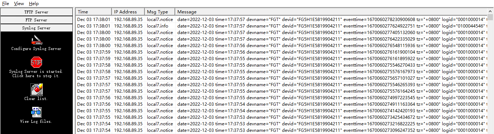
