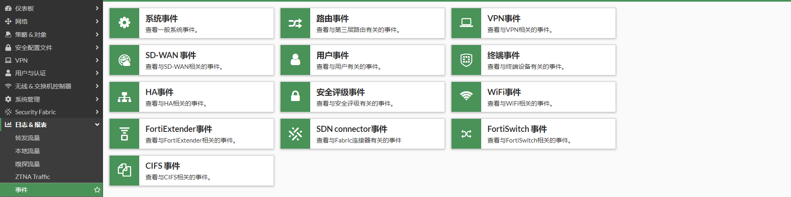
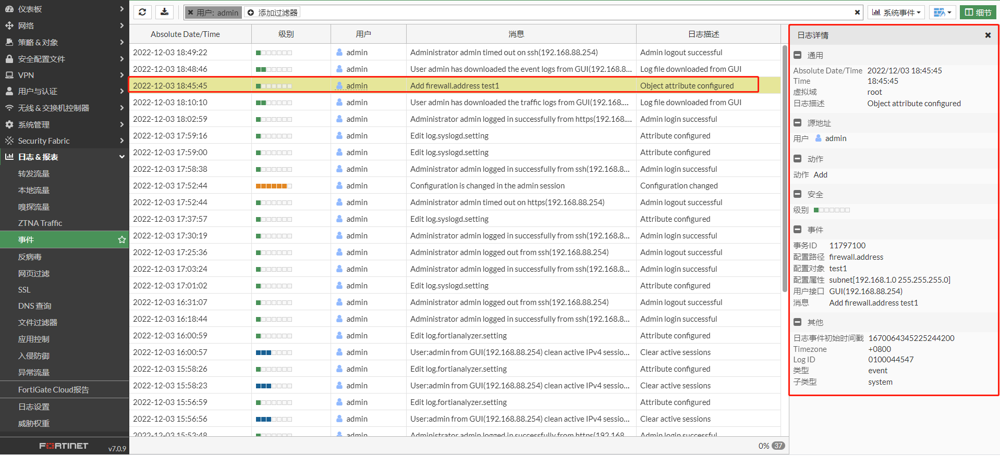
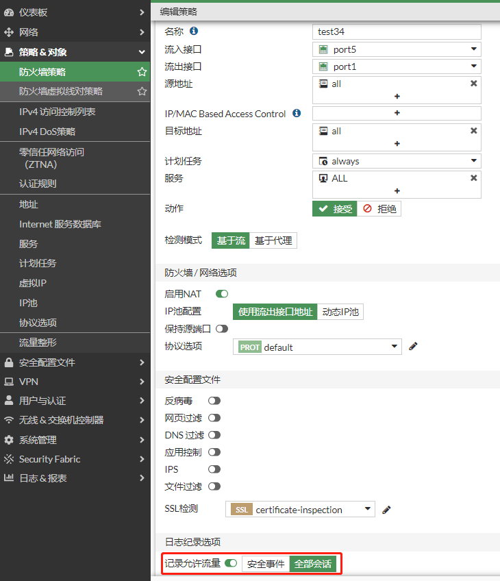
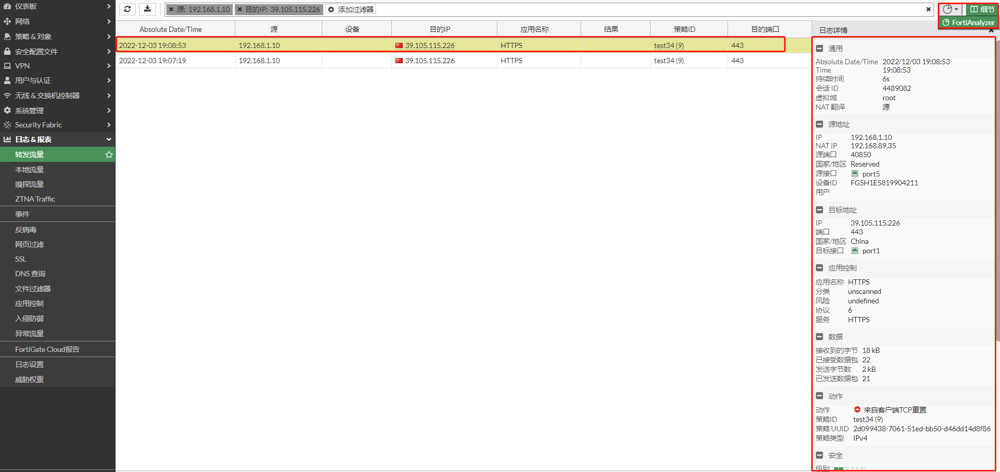
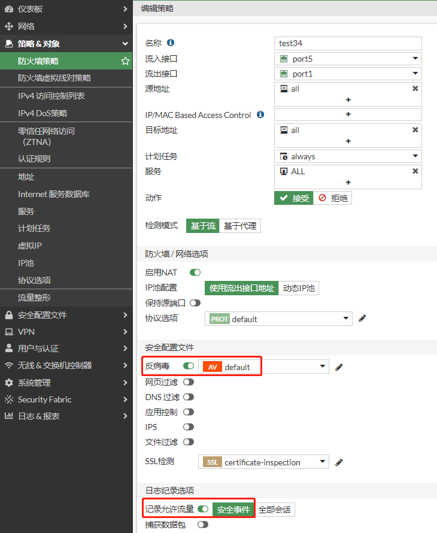
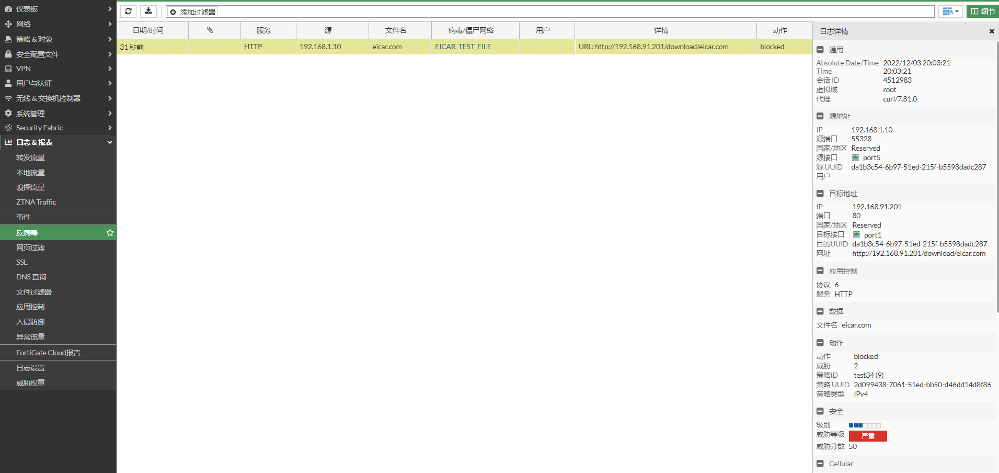

# 日志类型

每个日志条目都包含一个Type(类型)字段，该字段表示其日志类型。主要有三种类型：Event（时间日志），Traffic（流量日志），UTM（安全日志）。

## **事件日志**

事件日志用于记录系统和管理事件，如用户的操作日志，进程的活动日志等。根据事件日志 目的原因 的不同又分为很多Subtype（子类），如：System，Router，VPN，SD-WAN，User，Endpoint control，High Availability等，可以在GUI界面根据子菜单查看对应的事件。



如管理员admin的添加地址对象的操作日志



该日志对应的文本

```
date=2022-12-03 time=18:45:45 eventtime=1670064345225244185 tz="+0800" logid="0100044547" type="event" subtype="system" level="information" vd="root" logdesc="Object attribute configured" user="admin" ui="GUI(192.168.88.254)" action="Add" cfgtid=11797100 cfgpath="firewall.address" cfgobj="test1" cfgattr="subnet[192.168.1.0 255.255.255.0]" msg="Add firewall.address test1"
```

## **流量日志**

流量日志用于记录流量信息，如终端访问HTTPS站点。根据流量日志 目的原因 的不同又分为很多Subtype（子类），如：Forward，Local，Sniffer等。建议将流量日志发送到FortiAnalyzer或者syslog服务器。

在策略中，”记录允许流量“选择”全部会话“，这样FortiGate才会记录流量日志。“全部会话”包含了“安全事件”。



流量日志可以在GUI界面通过对应的菜单查看，这里FortiGate GUI的”转发流量“通过FortiAnalyzer读取。



该日志对应的文本

```
date=2022-12-03 time=19:08:53 id=7172877726888493056 itime="2022-12-03 19:08:58" euid=3 epid=1030 dsteuid=3 dstepid=101 logflag=1 logver=700090444 type="traffic" subtype="forward" level="notice" action="client-rst" policyid=9 sessionid=4489082 srcip=192.168.1.10 dstip=39.105.115.226 transip=192.168.89.35 srcport=40850 dstport=443 transport=40850 trandisp="snat" duration=6 proto=6 sentbyte=2101 rcvdbyte=18304 sentpkt=21 rcvdpkt=22 logid=0000000013 service="HTTPS" app="HTTPS" appcat="unscanned" srcintfrole="undefined" dstintfrole="undefined" policytype="policy" eventtime=1670065734672429913 poluuid="2d099438-7061-51ed-bb50-d46dd14d8f86" srccountry="Reserved" dstcountry="China" srcintf="port5" dstintf="port1" policyname="test34" tz="+0800" devid="FG5H1E5819904211" vd="root" dtime="2022-12-03 19:08:53" itime_t=1670065738 devname="FGT"
```

## UTM日志

UTM日志用于记录UTM事件，如IPS拦截的流量。根据UTM日志 目的原因 的不同又分为很多Subtype（子类），如：Virus，Web Filter，IPS，App-CTRL等。

在策略中，根据需求开启所需的UTM功能，这里开启AV功能。UTM日志默认是开启的，即“记录允许流量”中的“安全事件”。



反病毒日志可以在GUI界面通过对应的菜单查看。



该日志对应的文本

```
date=2022-12-03 time=20:03:21 eventtime=1670069001604241098 tz="+0800" logid="0211008192" type="utm" subtype="virus" eventtype="infected" level="warning" vd="root" policyid=9 poluuid="2d099438-7061-51ed-bb50-d46dd14d8f86" policytype="policy" msg="File is infected." action="blocked" service="HTTP" sessionid=4512983 srcip=192.168.1.10 dstip=192.168.91.201 srcport=55328 dstport=80 srccountry="Reserved" dstcountry="Reserved" srcintf="port5" srcintfrole="undefined" dstintf="port1" dstintfrole="undefined" srcuuid="da1b3c54-6b97-51ed-215f-b5598dadc287" dstuuid="da1b3c54-6b97-51ed-215f-b5598dadc287" proto=6 direction="incoming" filename="eicar.com" quarskip="Quarantine-disabled" virus="EICAR_TEST_FILE" viruscat="Virus" dtype="av-engine" ref="http://www.fortinet.com/ve?vn=EICAR_TEST_FILE" virusid=2172 url="http://192.168.91.201/download/eicar.com" profile="default" agent="curl/7.81.0" analyticscksum="275a021bbfb6489e54d471899f7db9d1663fc695ec2fe2a2c4538aabf651fd0f" analyticssubmit="false" crscore=50 craction=2 crlevel="critical"
```

