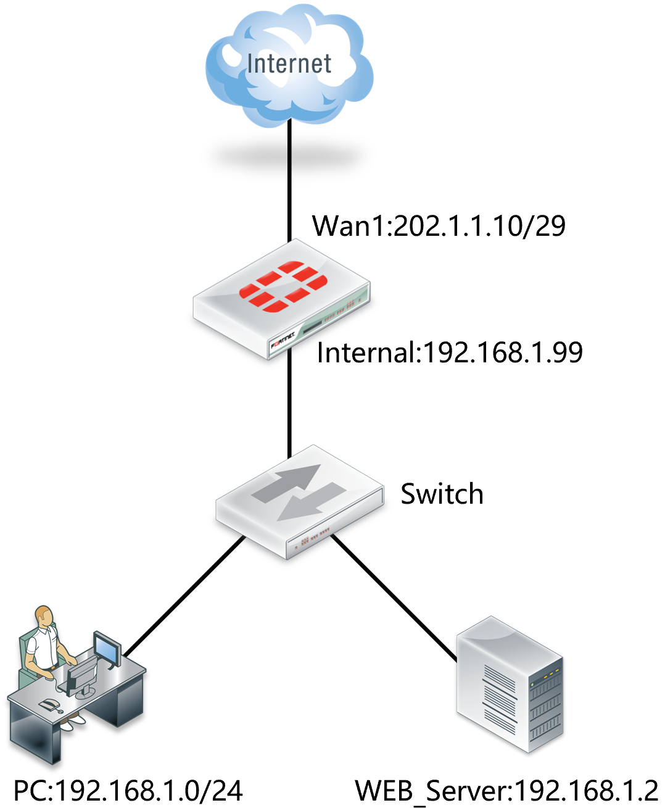
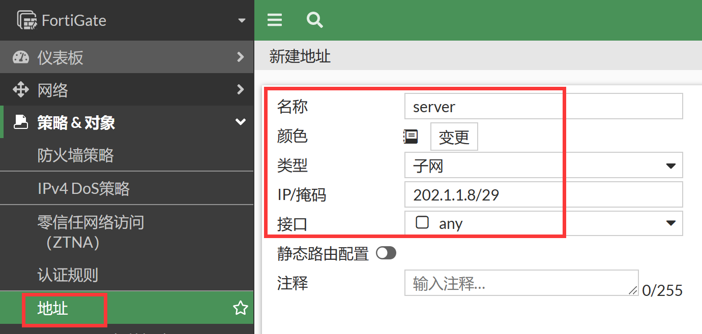
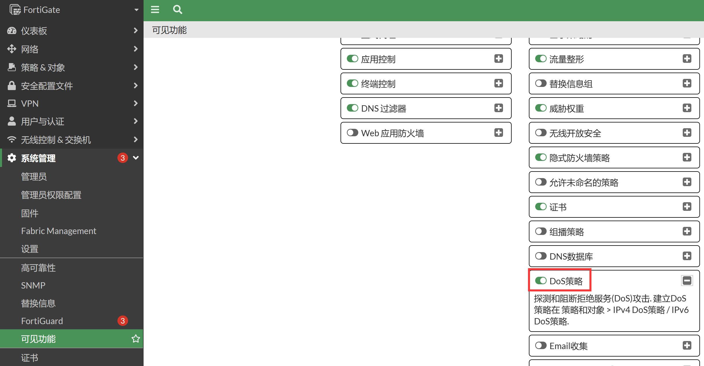
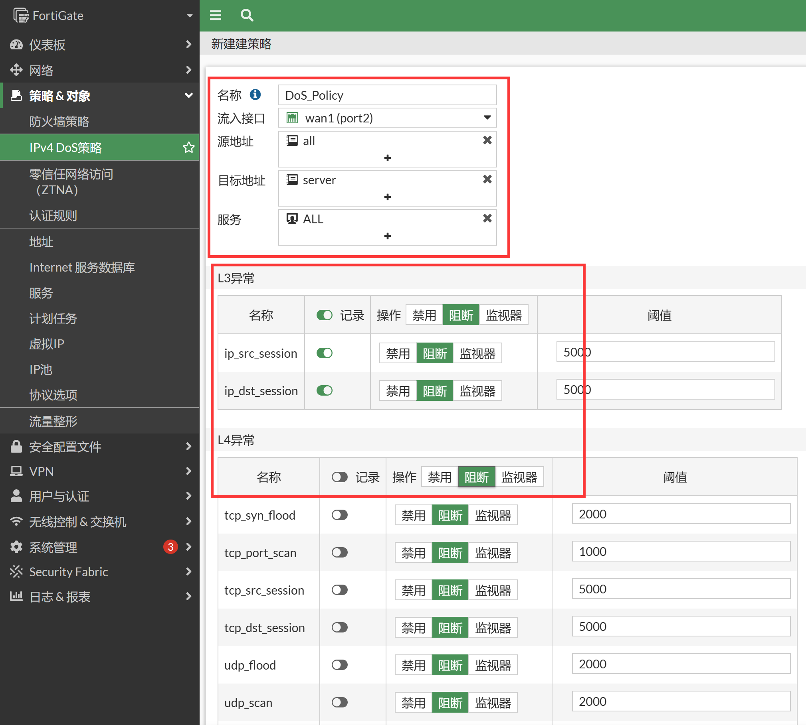
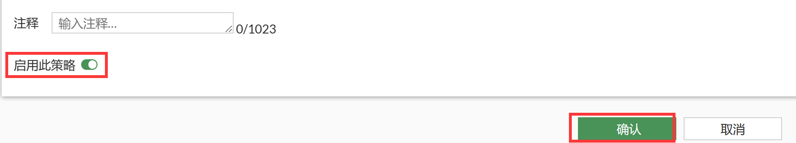

# FortiGate DoS策略配置

> 要阻止DoS攻击，在位于攻击者和希望保护的所有资源之间的FortiGate设备上应用DoS策略。 DoS过滤比包处理过程更早完成，由内核处理。FortiGate的防SYN Flood攻击采用了业界最新的syncookie技术，在很少占用系统资源的情况下，可以有效地抵御SYN Flood等DDOS攻击对受保护服务器的攻击。从而阻止外部的恶意攻击，保护设备和内网,当检测到此类扫描探测时，向用户进行报警提示。

 ## 组网需求

 Web服务器192.168.1.2，映射到外网地址202.1.1.11，对互联网开放HTTP服务，从而增加了服务器被攻击的风险，需要开启DDoS功能对服务器进行保护。对所有来自互联网的访问进行DDOS防护。

 ## 网络拓扑

 

## 配置要点

- 定义服务器地址
- 定义DDoS策略 

## 配置步骤

### 通过GUI配置

1. 定义服务器地址，进入策略&对象→地址，新建地址对象，名称配置为“server”，地址类型选择子网：ip/掩码为“202.1.1.8/29”，点击“确认”，该地址范围既包括了服务器地址（202.1.1.11）也包括了防火墙的外网口地址（202.1.1.10）。

   

2. 配置DoS策略齐前，需要确保在系统配置→可见功能中开启了DoS策略。

   

3. 一条DoS策略可以包含一个或多个异常配置，通过访问GUI的“策略 & 对象”→“IPv4 DoS策略”或“IPv6 DoS策略”页面，点击“新建”按钮，并配置参数。

   

4. 具体参数可以参考如下表格。

| 参数              | 说明                                                         |
   | ----------------- | ------------------------------------------------------------ |
   | 名称              | 输入策略名称。                                               |
   | 流入接口          | 选择DoS策略工作的接口。                                      |
   | 源地址            | 选择攻击流量的源地址。                                       |
   | 目标地址          | 选择攻击流量的目标地址。<br/>此处的地址应为与FortiGate接口相关联的地址，例如接口地址、接口第二地址、VIP地址。 |
   | 服务              | 选择攻击流量的目标服务或服务组。<br/>可以配置为ALL，或为了节省FortiGate资源，只选择FortiGate接口会应答的服务。 |
   | L3异常<br/>L4异常 | 配置异常:<br/>Logging：启用/禁用特定异常或所有异常的日志记录。当操作为“阻断”或“监视器”时，将记录异常流量。<br/><br/>动作：选择达到阈值时需要执行的操作：<br/><br/>禁用：不检查异常流量。<br/><br/>阻断：阻断异常流量。<br/><br/>监视器：允许异常流量，但是如果启用了logging，则记录日志信息。<br/><br/>Threshold：触发异常动作需要达到的流量速率或并发数阈值。 |
   | 注释              | 可选项。                                                     |

5.启用此策略，然后点击确认。



### 通过CLI配置

1. 相关CLI命令。

   ```
   config firewall DoS-policy
       edit 1
           set name "DoS_Policy"
           set interface "port2"
           set srcaddr "all"
           set dstaddr "server"
           set service "ALL"
           config anomaly
               edit "tcp_syn_flood"
                   set status enable
                   set action block
                   set threshold 2000
               next
               edit "tcp_port_scan"
                   set status enable
                   set action block
                   set threshold 1000
               next
               edit "tcp_src_session"
                   set status enable
                   set action block
                   set threshold 5000
               next
               edit "tcp_dst_session"
                   set status enable
                   set action block
                   set threshold 5000
               next
               edit "udp_flood"
                   set status enable
                   set action block
                   set threshold 2000
               next
               edit "udp_scan"
                   set status enable
                   set action block
                   set threshold 2000
               next
               edit "udp_src_session"
                   set status enable
                   set action block
                   set threshold 5000
               next
               edit "udp_dst_session"
                   set status enable
                   set action block
                   set threshold 5000
               next
               edit "icmp_flood"
                   set status enable
                   set action block
                   set threshold 250
               next
               edit "icmp_sweep"
                   set status enable
                   set action block
                   set threshold 100
               next
               edit "icmp_src_session"
                   set status enable
                   set action block
                   set threshold 300
               next
               edit "icmp_dst_session"
                   set status enable
                   set action block
                   set threshold 1000
               next
               edit "ip_src_session"
                   set status enable
                   set log enable
                   set action block
                   set threshold 5000
               next
               edit "ip_dst_session"
                   set status enable
                   set log enable
                   set action block
                   set threshold 5000
               next
               edit "sctp_flood"
                   set status enable
                   set action block
                   set threshold 2000
               next
               edit "sctp_scan"
                   set status enable
                   set action block
                   set threshold 1000
               next
               edit "sctp_src_session"
                   set status enable
                   set action block
                   set threshold 5000
               next
               edit "sctp_dst_session"
                   set status enable
                   set action block
                   set threshold 5000
               next
           end
       next
   end
   ```

2. 具体参数可以参考如下表格。

| 参数                               | 说明                                                         |
   | ---------------------------------- | :----------------------------------------------------------- |
   | name <string>                      | 策略名称。                                                   |
   | interface <string>                 | DoS策略工作的接口。                                          |
   | srcaddr <string>                   | 攻击流量的源地址。                                           |
   | dstaddr <string>                   | 攻击流量的目标地址。<br/>此处的地址应为与FortiGate接口相关联的地址，例如接口地址、接口第二地址、VIP地址。 |
   | service <string>                   | 攻击流量的目标服务或服务组。<br/>可以配置为ALL，或为了节省FortiGate资源，只选择FortiGate接口会应答的服务。 |
   | status {enable or disable}         | 启用或关闭该异常。                                           |
   | log {enable or disable}            | 启用/禁用特定异常或所有异常的日志记录。当操作为“阻断”或“监视器”时，将记录异常流量。 |
   | action {pass or block}             | 选择达到阈值时需要执行的操作：<br/>pass：允许异常流量，但是如果启用了logging，则记录日志信息。<br/>block：阻断异常流量。 |
   | quarantine {none or attacker}      | Quarantine方法：<br/>none：关闭Quarantine功能。<br/>attacker：阻断所有来自攻击者IP的流量，然后将攻击者IP加入用户黑名单。 |
   | quarantine-expiry <###d##h##m>     | 设置Quarantine的时长，格式为天、分钟、分钟（###d##h##m），范围1m - 364d23h59m, 默认为5m）。该配置仅在Quarantine被配置为attacker时可用。 |
   | quarantine-log {enable or disable} | 启用或禁用Quarantine日志（默认禁用），该配置仅在Quarantine被配置为attacker时可用。 |
   | threshold <integer>                | 触发异常动作需要达到的流量速率或并发数阈值。                 |

   

