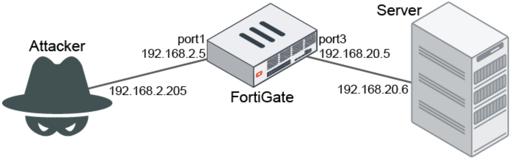

# FortiGate DoS策略排错

DoS策略排错最好的办法就是查看分析异常日志与IPS异常信息。

## 网络拓扑



## icmp_flood测试

1. Attacker向FortiGate以50pps的速率发送总共3000个icmp报文。

2. 在FortiGate上配置阈值为30pps的icmp_flood的DoS策略。

   ```
   config firewall DoS-policy
       edit 1
           set name icmpFlood
           set interface "port1"
           set srcaddr "all"
           set dstaddr "all"
           set service "ALL"
           config anomaly
               edit "icmp_flood"
                   set status enable
                   set log enable
                   set action block
                   set threshold 30
               next
           end
       next
   end
   ```

3. 配置debug filter，过滤icmp_flood攻击的debug信息。

   ```
   # diagnose ips anomaly config
   DoS sensors in kernel vd 0:
   DoS id 1 proxy 0
     0 tcp_syn_flood status 0 log 0 nac 0 action 0 threshold 2000
     ...
     7 udp_dst_session status 0 log 0 nac 0 action 0 threshold 5000
     8 icmp_flood status 1 log 1 nac 0 action 7 threshold 30
     9 icmp_sweep status 0 log 0 nac 0 action 0 threshold 100
     ...
   total # DoS sensors: 1.
   # diagnose ips anomaly filter id 8
   ```

4. 使用Mac OS或Linux发起icmp_flood攻击，这里使用hping3工具为例（需要自行安装）。

   ```
   summerice@Summerice ~ % sudo hping3 --icmp -i u20000（发包间隔20000微秒，即50pps） -c 3000 192.168.2.50
   
   HPING 192.168.2.50 (en11 192.168.2.50): icmp mode set, 28 headers + 0 data bytes
   
   ...
   
   --- 192.168.2.50 hping statistic ---
   
   3000 packets tramitted, 30 packets received, 99% packet loss
   
   round-trip min/avg/max = 0.4/0.5/0.8 ms
   ```

5. 由以上hping3发包结果可知，只有30个包通过，剩余icmp包被阻断，符合icmp_flood防护工作原理。

6. 在攻击期间，在FortiGate查看异常列表。

   ```
   # diagnose ips anomaly list
   
   list nids meter:
   
   id=icmp_flood         ip=192.168.2.50 dos_id=1 exp=1000 pps=46 freq=50
   
   total # of nids meters: 1.
   ```

| 参数            | 说明                                                         |
   | --------------- | ------------------------------------------------------------ |
   | id=icmp_flood   | 攻击名称。                                                   |
   | ip=192.168.2.50 | 触发异常的被攻击对象的IP地址，可能是服务器，也可能是客户端。<br/>对于icmp_flood攻击，IP地址为攻击目标IP地址。如果是icmp_sweep攻击，该IP应为攻击源IP。 |
   | dos_id=1        | 匹配的DoS策略ID。                                            |
   | exp=998         | 剩余过期时间，单位为秒。                                     |
   | pps=46          | 命令执行时，已经收到的数据包pps。                            |
   | freq=50         | 对于基于并发会话数的异常，freq为并发会话数。<br/>对于基于速率的异常（flood、scan）：<br/>continuous模式：freq为pps中的最大数值，或者时最后一秒收到的数据包的总数。<br/>periodic模式：freq为pps数值。 |

## 日志分析

1. 在GUI中访问“日志 & 报告”→异常，下载DoS的异常日志，这里截取攻击刚开始的两条日志举例。

2. 第一条日志中的字段分析。

   ```
   date=2021-1-15 time=18:38:39 eventtime=1605911919824184594 tz="-0800" logid="0720018433" type="utm" subtype="anomaly" eventtype="anomaly" level="alert" vd="root" severity="critical" srcip=192.168.2.205 srccountry="Reserved" dstip=192.168.2.50 srcintf="port1" srcintfrole="undefined" sessionid=0 action="clear_session" proto=1 service="PING" count=1307 attack="icmp_flood" icmpid="0x2195" icmptype="0x08" icmpcode="0x00" attackid=16777316 policyid=1 policytype="DoS-policy" ref="http://www.fortinet.com/ids/VID16777316" msg="anomaly: icmp_flood, 31 > threshold 30, repeats 28 times" crscore=50 craction=4096 crlevel="critical"
   ```

| 参数                                        | 说明                                                         |
   | ------------------------------------------- | ------------------------------------------------------------ |
   | msg="anomaly: icmp_flood, 31 > threshold 30 | 在攻击的刚开始，第一条日志记录了攻击流量超过了30pps的阈值。  |
   | repeats 28 times                            | 自上次记录日志以来超过阈值的数据包数。                       |
   | srcip=192.168.2.205<br/>dstip=192.168.2.50  | 攻击流量的源目IP。                                           |
   | action="clear_session"                      | 清除相关会话，即阻断动作。<br/>如果动作设置为“监视器”且“logging”开启，这里会显示“detected”。 |

3.第二条日志中的字段分析。

```
date=2021-1-15 time=18:39:09 eventtime=1605911949826224056 tz="-0800" logid="0720018433" type="utm" subtype="anomaly" eventtype="anomaly" level="alert" vd="root" severity="critical" srcip=192.168.2.205 srccountry="Reserved" dstip=192.168.2.50 srcintf="port1" srcintfrole="undefined" sessionid=0 action="clear_session" proto=1 service="PING" count=1497 attack="icmp_flood" icmpid="0x2195" icmptype="0x08" icmpcode="0x00" attackid=16777316 policyid=1 policytype="DoS-policy" ref="http://www.fortinet.com/ids/VID16777316" msg="anomaly: icmp_flood, 50 > threshold 30, repeats 1497 times" crscore=50 craction=4096 crlevel="critical"
```

| 参数                                        | 说明                                                         |
   | ------------------------------------------- | ------------------------------------------------------------ |
   | msg="anomaly: icmp_flood, 50 > threshold 30 | 在日志生成的前一秒，检测到了50个匹配异常的数据包，超过了配置的阈值30。 |
   | repeats 1497 times                          | 自上次记录日志以来超过阈值的数据包数。                       |

   - 由于是持续的攻击流量，FortiGate为多个数据包每30s生成一次日志（注意第二条日志和第一条日志的间隔为30s）。
   - 以下情况FortiGate不会再次生成DoS异常日志：
     - 相同的攻击ID在5s内发生了多次。
     - 相同的攻击ID在30s内发生了多次，且匹配的异常策略动作一致，并且拥有相同的源目IP。
