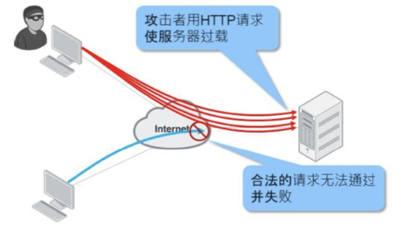

# 什么是DoS

## DoS&DDoS

1. 拒绝服务攻击（英语：denial-of-service attack，简称DoS攻击）亦称洪水攻击，是一种网络攻击手法，其目的在于使目标电脑的网络或系统资源耗尽，使服务暂时中断或停止，导致其正常用户无法访问。

2. 当黑客使用网络上两个或以上被攻陷的电脑作为“僵尸”向特定的目标发动“拒绝服务”式攻击时，称为分布式拒绝服务攻击（distributed denial-of-service attack，简称DDoS攻击）。

3. DoS侧重于通过对主机特定漏洞的利用攻击导致网络栈失效、系统崩溃、主机死机而无法提供正常的网络服务功能，从而造成拒绝服务，常见的DOS攻击手段有TearDrop、Land、Jolt、IGMP Nuker、Boink、Smurf、Bonk、OOB等；扫描也是网络攻击的一种，攻击者在发起网络攻击之前，通常会试图确定目标上开放的TCP/UDP端口，而一个开放的端口通常意味着某种应用。

4. DDoS的表现形式主要有两种，一种为流量攻击，主要是针对网络带宽的攻击，即大量攻击包导致网络带宽被阻塞，合法网络包被虚假的攻击包淹没而无法到达主机；另一种为资源耗尽攻击，主要是针对服务器主机的攻击，即通过大量攻击包导致主机的内存被耗尽或CPU被内核及应用程序占完而造成无法提供网络服务。 与DoS攻击相比，DDoS攻击更难以预防，因为黑客可能来自世界各地，DDoS攻击可以分为两个阶段：

   - 感染阶段：黑客将尝试开发并感染尽可能多的系统，受到感染和破坏的系统将称为Bot或Zombie，这些僵尸和僵尸分散在世界各地，所有这些僵尸或僵尸都将监听黑客的命令。
   - 攻击阶段：黑客向机器人或僵尸发出命令，以攻击目标系统，当这些僵尸程序或僵尸程序获得命令后，它们将开始攻击目标系统。从目标的角度来看，攻击将无处不在。

5. 拒绝服务的攻击也可能会导致目标计算机同一网络中的其他计算机被攻击，互联网和局域网之间的带宽会被攻击导致大量消耗，不但影响目标计算机，同时也影响局域网中的其他电脑。如果攻击的规模较大，整个地区的网络连接都可能会受到影响。

6. 攻击者的会话回消耗所有资源——RAM、CPU、端口号，减慢或使目标功能失效，直到不能响应合法的请求。

   

## 攻击现象

- 网络异常缓慢（打开文件或访问网站）
- 特定网站无法访问
- 无法访问任何网站
- 垃圾邮件的数量急剧增加
- 无线或有线网络连接异常断开
- 长时间尝试访问网站或任何互联网服务时被拒绝
- 服务器容易断线、卡顿、lag

## 攻击方式

DDoS攻击可分为3类：带宽消耗、资源匮乏、应用程序编程缺陷。

1. 带宽消耗：
   - 这种攻击试图使系统的带宽饱和。如果黑客可以用尽所有带宽，则黑客可以阻止合法用户访问系统。
   - 例如：客户从ISP订阅了10 Mbps的互联网带宽。如果黑客能够充分利用10 Mbps的Internet链接，则合法用户将不会留有带宽。由于没有足够的带宽供合法用户使用，因此他们将无法再访问系统。攻击的示例包括Smurf攻击，Fraggle攻击，Chargen攻击和放大攻击。
   - 使用FortiGate或FortiDDoS不能有效地缓解此类DDoS攻击。
2. 资源匮乏：
      - 该攻击试图使系统上的资源过载，使其无法使用，资源可以是会话表，CPU处理时间，磁盘空间等。
      - 攻击示例为TCP SYN Flood，SlowLoris等。
      - 可以使用Fortigate和FortiDDoS有效地缓解此类DDoS攻击。与Fortigate相比，FortiDDoS具有更先进和有效的缓解技术。
3. 应用程序编程缺陷：
      - 该攻击试图导致系统严重错误。黑客试图将格式错误的数据发送到系统，并且系统崩溃。通过对系统造成严重错误，这使系统无法使用。
      - 攻击示例包括缓冲区溢出和编程逻辑错误。
      - 使用FortiGate和FortiDDoS可以有效地缓解此类DDoS攻击。与FortiGate相比，FortiDDos具有更先进和有效的缓解技术。

## 攻击与防护方法

1. 防DoS攻击：
   - Jolt2：Jolt2攻击通过向目的主机发送报文偏移加上报文长度超过65535的报文，使目的主机处理异常而崩溃。 配置了防Jolt2攻击功能后，NGFW可以检测出Jolt2攻击，丢弃攻击报文并输出告警日志信息。
   - Land-Base：Land-Base攻击通过向目的主机发送目的地址和源地址相同的报文，使目的主机消耗大量的系统资源，从而造成系统崩溃或死机。 配置了防Land-Base攻击功能后，FortiGate可以检测出Land-Base攻击，丢弃攻击报文并输出告警日志信息。
   - PING of death：PING of death攻击是通过向目的主机发送长度超过65535的ICMP报文，使目的主机发生处理异常而崩溃。 配置了防PING of death攻击功能后，FortiGate可以检测出PING of death攻击，丢弃攻击报文并输出告警日志信息。
   - Syn flag：Syn-flag攻击通过向目的主机发送错误的TCP标识组合报文，浪费目的主机资源。 配置了防Syn-flag攻击功能后，FortiGate可以检测出Syn-flag攻击，丢弃攻击报文并输出告警日志信息。
   - Tear drop：Tear-drop攻击通过向目的主机发送报文偏移重叠的分片报文，使目的主机发生处理异常而崩溃。 配置了防Tear-drop攻击功能后， FortiGate可以检测出Tear-drop攻击，并输出告警日志信息。因为正常报文传送也有可能出现报文重叠，因此FortiGate不会丢弃该报文，而是采取裁减、重新组装报文的方式，发送出正常的报文。
   - Winnuke：Winnuke攻击通过向目的主机的139、138、137、113、53端口发送TCP紧急标识位URG为1的带外数据报文，使系统处理异常而崩溃。 配置了防Winnuke攻击功能后，FortiGate可以检测出Winnuke攻击报文，将报文中的TCP紧急标志位为0后转发报文，并可以输出告警日志信息。
   - Smurf：这种攻击方法结合使用了IP欺骗和ICMP回复方法使大量网络传输充斥目标系统，引起目标系统拒绝为正常系统进行服务。Smurf攻击通过使用将回复地址设置成受害网络的广播地址的ICMP应答请求(PING)数据包，来淹没受害主机，最终导致该网络的所有主机都对此ICMP应答请求做出答复，导致网络阻塞。
2. 防扫描：
   - TCP协议扫描：根据实际网络情况，当受到TCP扫描攻击时，可以配置防TCP扫描。 当一个源IP  地址在1秒内将含有TCP SYN片段的IP  封包发送给位于相同目标IP地址的不同端口数量大于配置的门限值时，即认为其进行了端口扫描，系统将其标记为TCP SCAN，并在配置的阻断时间内拒绝来自于该台源主机的所有其它TCP SYN包。 启用防TCP扫描，可能会占用比较多的内存。
   - UDP协议扫描：根据实际网络情况，当受到UDP扫描攻击时，可以配置防UDP SCAN扫描。 当一个源IP  地址在1秒内将含有UDP的IP  封包发送给位于相同目标IP地址的不同端口数量大于配置的门限值时，即进行了一次端口扫描，系统将其标记为UDP SCAN，并在配置的阻断时间内拒绝来自于该台源主机的所有其它UDP包。 启用防UDP扫描，可能会占用比较多的内存。
   - PING扫描：根据实际网络情况，当受到PING扫描攻击时，可以配置防PING扫描。 当一个源IP地址在1秒内发送给不同主机的ICMP  封包超过门限值时，即进行了一次地址扫描。此方案的目的是将ICMP  封包(  通常是应答请求)  发送给各个主机，以期获得至少一个回复，从而查明目标地址。NGFW设备在内部记录从某一远程源地点发往不同地址的ICMP  封包数目。当某个源IP被标记为地址扫描攻击，则系统在配置的阻断时间内拒绝来自该主机的其它更多ICMP  封包。 启用防PING扫描，可能会占用比较多的内存。
   - 主机抑制时长：设置防扫描功能的阻断时间，当系统检测到扫描攻击时，在配置的时长内拒绝来自于该台源主机的所有其它攻击包，缺省配置为20秒。
