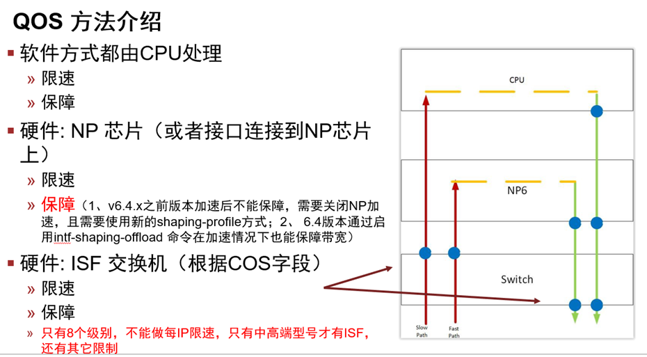

# QoS介绍

## 功能介绍

FortiGate的QoS流量管理可以作用在数据流流经的部件上，可以是CPU、NP或者ISF交换机。



## 术语解释

### 令牌桶机制

1. 关于速率评估，使用令牌桶评估模型。

2. 令牌桶是一个存放令牌的容器，它有一定的容量。系统按设定的速度向桶中放置令牌，当桶中令牌满时，多出的令牌溢出，桶中令牌不再增加。在用令牌桶评估流量时，是以令牌桶中的令牌数量是否足够满足数据包的转发为依据的。如果桶中存在足够的令牌可以用来转发数据包（通常一个令牌拥有一个比特的转发权限），称流量符合（conform）这个规格，否则称为超标（excess）。

3. 评估流量时令牌桶的参数设置包括：
   - CIR（Committed Information Rate）：向桶中放置令牌的速率，即允许的流量的平均速率。
   - CBS（Committed Burst Size）：第一个令牌桶的容量，即每次突发所允许的最大的流量值。该值必须大于最大包的长度。该令牌桶简称为C 桶。
   - EBS（Excess Burst Size）：第二个令牌桶的容量，即为允许的超出突发的最大流量值。该令牌桶简称为E桶。

4. 当使用两个令牌桶进行流量评估时，依据“C 桶有足够的令牌”、“C 桶令牌不足，但E 桶足够”以及“C 桶和E 桶都没有足够的令牌”的情况，分别实施不同的操作控制。

5. 当CBS 中的令牌数大于数据包的大小时，则该数据包符合规格（Conform），系统将根据配置进行操作；当CSB 中的令牌数小于数据包的大小，系统将检查EBS中令牌的数量，如果EBS 中令牌数量大于数据包的大小，则该数据包超出（Exceed），系统根据配置进行操作，如果EBS 中的令牌数也小于数据包的大小，则该数据包violate违约，系统再根据配置进行操作。

   ```
   config firewall shaping-profile
       edit "profile"
           set type queuing
           set default-class-id 31
           config shaping-entries
               edit 31
                   set class-id 31
                   set guaranteed-bandwidth-percentage 5
                   set maximum-bandwidth-percentage 50
                   set burst-in-msec 100 <range from 0 to 2000>//C桶容量
                   set cburst-in-msec 200 <range from 0 to 2000>//E桶容量
               next
           end
       next
   end
   ```

   > 我们关于这部分的说明：
   > Burst control in queuing mode
   > In a hierarchical token bucket (HTB) algorithm, each traffic class has buckets to allow a burst of traffic. The maximum burst is determined by the bucket size burst (for guaranteed bandwidth) and cburst (for maximum bandwidth). The shaping profile has burst-in-msec and cburst-in-msec parameters for each shaping entry (class id) to control the bucket size.
   > This example uses the outbandwidth of the interface as 1 Mbps and the maximum bandwidth of class is 50%.
   > burst = burst-in-msec * guaranteed bandwidth = 100 ms × 1 Mbps x 5% = 50000 b = 6250 B
   > cburst = cburst-in-msec * maximum bandwidth = 200 ms × 1 Mbps x 50% = 100000 b = 12500 B
   > The following example sets burst-in-msec to 100 and cburst-in-msec to 200.

### 单速率单桶

1. 我们经常配置的最大带宽，实际上就是CIR Committed informantion Rate就是承诺速率，这个就是令牌生成的速率。
2. CBS Committed Burst Size ：承诺突发尺寸，是容量。
3. CIR往CBS桶中一直注入令牌，当CBS桶满了，不再注入令牌。CBS叫做承诺突发尺寸。
4. 那么实际最大速率=配置的最大速率(CIR)+CBS桶容量（我们这个桶的容量正好等于一个CIR速率）。
5. 当前我们的CBS桶容量等于我们配置的限速最大带宽。
6. 按照这个理论，当设置最大带宽为5M，当用iperf3测试时，突发速率=CIR+CBS=5M+5M=10Mbps，也就是第一秒的速率。从第二秒时，因为第一秒流量已经用完了CBS桶存的令牌， CBS开始是空的，所以CIR一直往里面注入令牌，流量一直取走令牌，所以CBS桶一直空着。
7. 后续的速率就等于CIR。
8. 在Traffic-shaper中我们用的是单速率单桶，所以请忽略EBS这桶。

### 单速率双桶

1. 单速率双桶，令牌以CIR的速率往CBS桶中注，如果CBS桶满了，溢出流入到EBS桶。
2. 那么在这种模型中，第一秒钟最大速率=CIR+CBS桶容量+EBS桶容量，是能够超过设置的maximum-bandwidth的。

### 双速率双桶

1. 有CIR速率和PIR速率两个速率分别往两个桶注入令牌。
2. 目前FGT不涉及。
