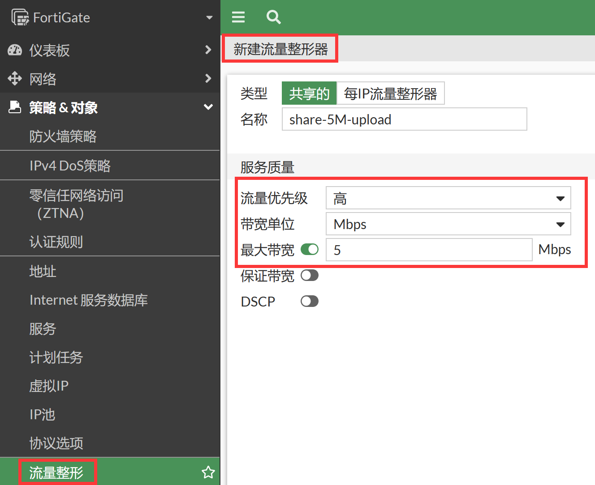
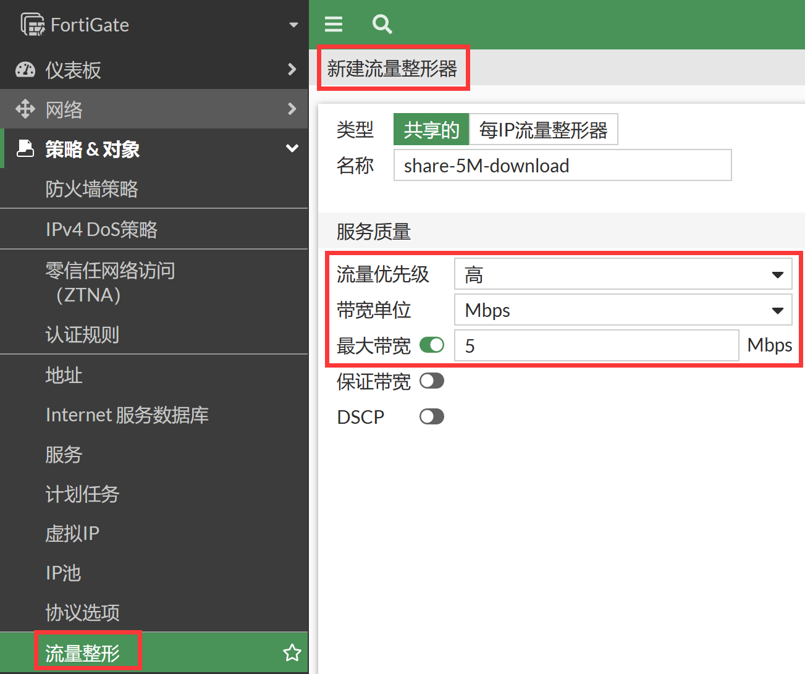
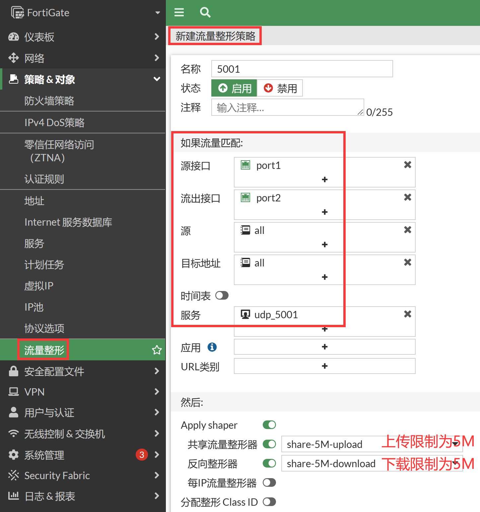
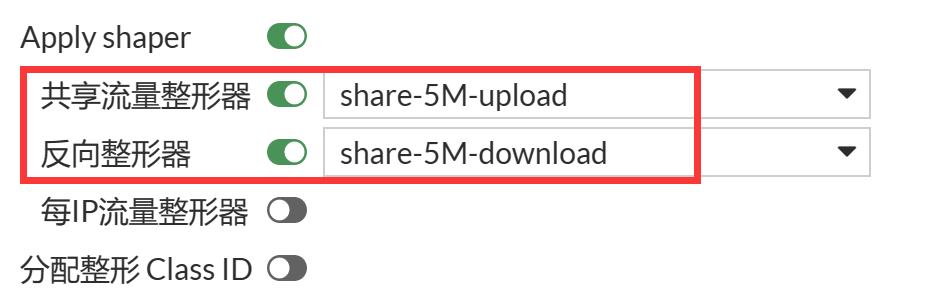

# 共享带宽限速

## 组网需求

基于多IP共享进行限速，限制Iperf Client传输速度，上行和下行速度分别为5Mbps。

## 网络拓扑


## 配置步骤

1. 进入策略&对象→流量整形→流量整形器，分别新建上传和下载的流量整形器，选择类型为共享的，最大带宽配置为5Mbps。

   

   

   ```
   config firewall shaper traffic-shaper
       edit "share-5M-upload"
           set maximum-bandwidth 5
           set bandwidth-unit mbps
       next
       edit "share-5M-download"
           set maximum-bandwidth 5
           set bandwidth-unit mbps
       next
   end
   ```

2. 进入策略&对象→流量整形→流量整策略，新建流量整形策略，源接口为内网口port1，出接口为port2，服务配置为iperf打流使用的端口，这里以UDP 5001为例。开启Apply Shaper，开启共享流量整形器，引用上传限速5M，开启反向整形器，引用下载5M。

   

   ```
   config firewall shaping-policy
       edit 1
           set name "5001"
           set service "udp_5001"
           set srcintf "port1"
           set dstintf "port2"
           set traffic-shaper "share-5M-upload"
           set traffic-shaper-reverse "share-5M-download"
           set srcaddr "all"
           set dstaddr "all"
       next
   end
   ```

## 结果验证

1. 客户端IPerf打流测试打30M流（上传）。

2. 客户端端观察。

   ```
   C:\iperf-3.1.3-win64>iperf3.exe -c 2.2.2.2 -p 5001 -u -b 30M -l 1K
   Connecting to host 2.2.2.2, port 5001
   [  4] local 192.168.10.23 port 49590 connected to 2.2.2.2 port 5001
   [ ID] Interval           Transfer     Bandwidth       Total Datagrams
   [ 4]   0.00-1.00   sec 3.30 MBytes  27.7 Mbits/sec  3380
   [ 4]   1.00-2.00   sec 3.61 MBytes  30.2 Mbits/sec  3692
   [ 4]   2.00-3.00   sec 3.69 MBytes  30.9 Mbits/sec  3774
   [ 4]   3.00-4.00   sec 3.66 MBytes  30.7 Mbits/sec  3748
   [ 4]   4.00-5.00   sec 3.46 MBytes  29.0 Mbits/sec  3546
   [ 4]   5.00-6.00   sec 3.66 MBytes  30.7 Mbits/sec  3745
   [ 4]   6.00-7.00   sec 3.39 MBytes  28.4 Mbits/sec  3468
   [ 4]   7.00-8.00   sec 3.53 MBytes  29.6 Mbits/sec  3612
   [ 4]   8.00-9.00   sec 3.62 MBytes  30.3 Mbits/sec  3705
   [ 4]   9.00-10.00  sec 3.66 MBytes  30.7 Mbits/sec  3743
   - - - - - - - - - - - - - - - - - - - - - - - - -
   [ ID] Interval           Transfer     Bandwidth       Jitter   Lost/Total Datagrams
   [ 4]   0.00-10.00  sec 35.6 MBytes  29.8 Mbits/sec  0.196 ms 29694/36412 (82%)
   [  4] Sent 36412 datagrams 
   iperf Done.
   ```

3. 服务器端观察，接收速率被限制在5Mbps左右。

   ```
   C:\iperf-3.1.3-win64>iperf3.exe -s -p 5001
   -----------------------------------------------------------
   Server listening on 5001
   -----------------------------------------------------------
   Accepted connection from 2.2.2.1, port 61655
   [ 5] local 2.2.2.2 port 5001 connected to 2.2.2.1 port 49590
   [ ID] Interval           Transfer     Bandwidth       Jitter   Lost/Total Datagrams
   [ 5]   0.00-1.00  sec  1.08 MBytes  9.05 Mbits/sec  0.205 ms 2219/3325 (67%)
   [ 5]   1.00-2.00   sec  628 KBytes  5.14 Mbits/sec  0.155 ms 3072/3700 (83%)
   [ 5]   2.00-3.00   sec  641 KBytes  5.25 Mbits/sec  0.154 ms 3118/3759 (83%)
   [ 5]   3.00-4.00   sec  627 KBytes  5.13 Mbits/sec  0.175 ms 2952/3579 (82%)
   [ 5]   4.00-5.00   sec  610 KBytes  5.00 Mbits/sec  0.132 ms 3093/3703 (84%)
   [ 5]   5.00-6.00   sec  635 KBytes  5.20 Mbits/sec  0.199 ms 3044/3679 (83%)
   [ 5]   6.00-7.00  sec   591 KBytes  4.84 Mbits/sec  0.192 ms 2924/3515 (83%)
   [ 5]   7.00-8.00   sec  616 KBytes  5.04 Mbits/sec  0.190 ms 3060/3676 (83%)
   [ 5]   8.00-9.00   sec  628 KBytes  5.15 Mbits/sec  0.202 ms 3041/3669 (83%)
   [ 5]   9.00-10.00  sec  635 KBytes  5.20 Mbits/sec  0.172 ms 3077/3712 (83%)
   [ 5]  10.00-10.03  sec 1.00 KBytes   286 Kbits/sec  0.196 ms 94/95 (99%)
   - - - - - - - - - - - - - - - - - - - - - - - - -
   [ ID] Interval           Transfer     Bandwidth       Jitter   Lost/Total Datagrams
   [ 5]   0.00-10.03  sec 0.00 Bytes  0.00 bits/sec  0.196 ms 29694/36412 (82%)
   -----------------------------------------------------------
   ```

4. 查看会话状态，可以看到共享限速的标识信息。

   ```
   session info: proto=17 proto_state=01 duration=11 expire=179 timeout=0 flags=00000000 sockflag=00000000 sockport=0 av_idx=0 use=4
   origin-shaper=share-5M-upload    //应用的共享限速
   prio=2 guarantee 0Bps max 655360Bps traffic 655739Bps drops 36587508B
   reply-shaper=
   per_ip_shaper=
   class_id=0 shaping_policy_id=3 ha_id=0 policy_dir=0 tunnel=/ vlan_cos=0/255
   state=may_dirty os route_preserve
   statistic(bytes/packets/allow_err): org=8138304/7737/1 reply=32/1/1 tuples=2
   tx speed(Bps/kbps): 694987/5559 rx speed(Bps/kbps): 2/0
   orgin->sink: org pre->post, reply pre->post dev=3->4/4->3 gwy=0.0.0.0/0.0.0.0
   hook=post dir=org act=snat 192.168.10.23:49768->2.2.2.2:5001(2.2.2.1:49768)
   hook=pre dir=reply act=dnat 2.2.2.2:5001->2.2.2.1:49768(192.168.10.23:49768)
   misc=0 policy_id=1 auth_info=0 chk_client_info=0 vd=0
   serial=00001102 tos=ff/ff app_list=0 app=0 url_cat=0
   rpdb_link_id = 00000000 ngfwid=n/a
   dd_type=0 dd_mode=0
   
   FGT-1 # diagnose  firewall shaper  traffic-shaper  list
   name share-5M-upload
   maximum-bandwidth 640 KB/sec
   guaranteed-bandwidth 0 KB/sec
   current-bandwidth 640 KB/sec
   priority 2
   overhead 0
   tos ff
   packets dropped 965353
   bytes dropped 1015551356
    
   FGT-1 # diagnose  netlink interface list  port2
   if=port2 family=00 type=1 index=4 mtu=1500 link=0 master=0
   ref=17 state=off start fw_flags=0 flags=up broadcast run multicast
   Qdisc=pfifo_fast hw_addr=00:0c:29:e1:7d:41 broadcast_addr=ff:ff:ff:ff:ff:ff
   stat: rxp=21438 txp=465340 rxb=12605783 txb=478598536 rxe=0 txe=0 rxd=0 txd=0 mc=0 collision=0
   re: rxl=0 rxo=0 rxc=0 rxf=0 rxfi=0 rxm=0
   te: txa=0 txc=0 txfi=0 txh=0 txw=0
   misc rxc=0 txc=0
   input_type=0 state=3 arp_entry=0 refcnt=17
   
   FGT-1 # diagnose netlink qlen get port2
   TX queue length for interface port2 is 1000
   ```

## 注意

共享带宽限速上行和下行限速需要分别调用，彼此之间独立工作，特别注意别只限制了上传速度，而没有配置下载速度，然后测速的时候发现限速不准确，标准的上行、下行速度限制为下图所示。


