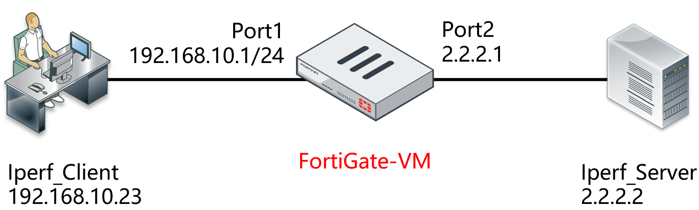
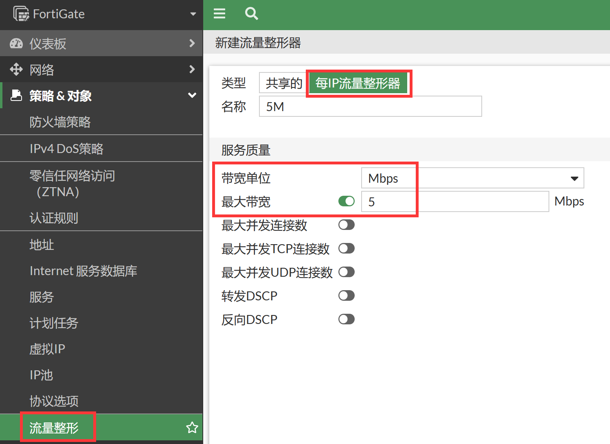
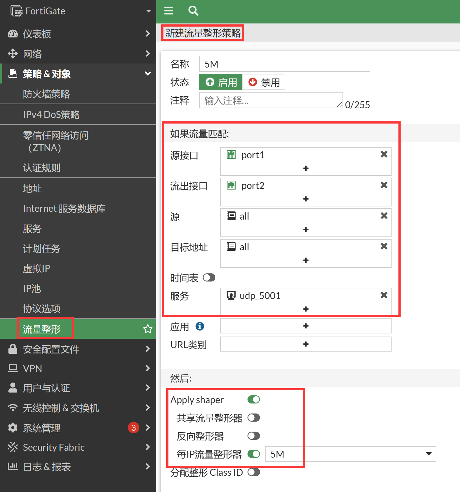

# 每IP带宽限速

## 组网需求

基于每IP对客户端进行限速，限制Iperf Client传输速度（包括上行和下行速度总和）为5Mbps。

## 网络拓扑



## 配置步骤

1. 进入策略&对象→流量整形→流量整形器，新建流量整形器，选择类型为每IP流量整形器，最大带宽配置为5Mbps。

   

   ```
   config firewall shaper per-ip-shaper
       edit "5M"
           set max-bandwidth 5
           set bandwidth-unit mbps
       next
   end
   ```

2. 进入策略&对象→流量整形→流量整策略，新建流量整形策略，源接口为内网口port1，出接口为port2，服务配置为iperf打流使用的端口，这里以UDP 5001为例。开启Apply Shaper，并引用上步配置的每IP限速整形器。

   

   ```
   config firewall shaping-policy
       edit 1
           set name "5M"
           set service "udp_5001"
           set srcintf "port1"
           set dstintf "port2"
           set per-ip-shaper "5M"
           set srcaddr "all"
           set dstaddr "all"
       next
   end
   ```

## 结果验证

1. 客户端IPerf打流测试打30M流（上传）。

2. 客户端端观察。

   ```
   C:\iperf-3.1.3-win64>iperf3.exe -c 2.2.2.2 -p 5001 -u -b 30M -l 1K
   Connecting to host 2.2.2.2, port 5001
   [  4] local 192.168.10.23 port 54998 connected to 2.2.2.2 port 5001
   [ ID] Interval           Transfer     Bandwidth       Total Datagrams
   [ 4]   0.00-1.00   sec 3.27 MBytes  27.4 Mbits/sec  3350
   [ 4]   1.00-2.00   sec 3.53 MBytes  29.6 Mbits/sec  3619
   [ 4]   2.00-3.00   sec 3.64 MBytes  30.6 Mbits/sec  3732
   [ 4]   3.00-4.00   sec 3.77 MBytes  31.6 Mbits/sec  3860
   [ 4]   4.00-5.00   sec 3.42 MBytes  28.7 Mbits/sec  3501
   [ 4]   5.00-6.00   sec 3.57 MBytes  30.0 Mbits/sec  3660
   [ 4]   6.00-7.00   sec 3.67 MBytes  30.8 Mbits/sec  3763
   [  4]   7.00-8.00  sec  3.68 MBytes  30.8 Mbits/sec  3768
   [ 4]   8.00-9.00   sec 3.34 MBytes  28.1 Mbits/sec  3421
   [ 4]   9.00-10.00  sec 3.56 MBytes  29.8 Mbits/sec  3641
   - - - - - - - - - - - - - - - - - - - - - - - - -
   [ ID] Interval           Transfer     Bandwidth       Jitter   Lost/Total Datagrams
   [ 4]   0.00-10.00  sec 35.5 MBytes  29.7 Mbits/sec  0.180 ms 29610/36310 (82%)
   [  4] Sent 36310 datagrams
   iperf Done.
   ```

3. 服务器端观察，接收速率被限制在5Mbps左右。

   ```
   C:\iperf-3.1.3-win64>iperf3.exe -s -p 5001
   -----------------------------------------------------------
   Server listening on 5001
   -----------------------------------------------------------
   Accepted connection from 2.2.2.1, port 61145
   [ 5] local 2.2.2.2 port 5001 connected to 2.2.2.1 port 54998
   [ ID] Interval           Transfer     Bandwidth       Jitter   Lost/Total Datagrams
   [ 5]  0.00-1.00   sec  1.07 MBytes 9.00 Mbits/sec  0.159 ms  2162/3262 (66%)
   [ 5]   1.00-2.00   sec  616 KBytes  5.05 Mbits/sec  0.186 ms 3071/3687 (83%)
   [ 5]   2.00-3.00   sec  635 KBytes  5.21 Mbits/sec  0.153 ms 3072/3707 (83%)
   [ 5]   3.00-4.00   sec  654 KBytes  5.36 Mbits/sec  0.138 ms 3127/3781 (83%)
   [ 5]   4.00-5.00   sec  597 KBytes  4.89 Mbits/sec  0.160 ms 2989/3586 (83%)
   [ 5]   5.00-6.00   sec  621 KBytes  5.09 Mbits/sec  0.117 ms 3049/3670 (83%)
   [ 5]   6.00-7.00   sec  642 KBytes  5.25 Mbits/sec  0.141 ms 3148/3790 (83%)
   [ 5]   7.00-8.00   sec  632 KBytes  5.18 Mbits/sec  0.107 ms 3074/3706 (83%)
   [ 5]   8.00-9.00   sec  587 KBytes  4.80 Mbits/sec  0.160 ms 2851/3438 (83%)
   [ 5]   9.00-10.00  sec  615 KBytes  5.04 Mbits/sec  0.187 ms 2961/3576 (83%)
   [ 5]  10.00-10.02  sec 1.00 KBytes   409 Kbits/sec  0.180 ms 106/107 (99%)
   - - - - - - - - - - - - - - - - - - - - - - - - -
   [ ID] Interval           Transfer     Bandwidth       Jitter   Lost/Total Datagrams
   [ 5]   0.00-10.02  sec 0.00 Bytes  0.00 bits/sec  0.180 ms 29610/36310 (82%)
   -----------------------------------------------------------
   ```

4. 查看会话状态，可以看到每IP限速的标识信息。

   ```
   session info: proto=17 proto_state=01 duration=33 expire=160 timeout=0 flags=00000000 sockflag=00000000 sockport=0 av_idx=0 use=4
   origin-shaper=
   reply-shaper=
   per_ip_shaper=5M    //被每IP限速标识
   class_id=0 shaping_policy_id=3 ha_id=0 policy_dir=0 tunnel=/ vlan_cos=0/255
   state=may_dirty per_ip route_preserve
   statistic(bytes/packets/allow_err): org=9691056/9213/1 reply=32/1/1 tuples=2
   tx speed(Bps/kbps): 291285/2330 rx speed(Bps/kbps): 0/0
   orgin->sink: org pre->post, reply pre->post dev=3->4/4->3 gwy=0.0.0.0/0.0.0.0
   hook=post dir=org act=snat 192.168.10.23:49631->2.2.2.2:5001(2.2.2.1:49631)
   hook=pre dir=reply act=dnat 2.2.2.2:5001->2.2.2.1:49631(192.168.10.23:49631)
   misc=0 policy_id=1 auth_info=0 chk_client_info=0 vd=0
   serial=00000e61 tos=ff/ff app_list=0 app=0 url_cat=0
   rpdb_link_id = 00000000 ngfwid=n/a
   dd_type=0 dd_mode=0
   
   diagnose  firewall shaper  per-ip-shaper list
   name 5M
   maximum-bandwidth 640 KB/sec
   maximum-concurrent-session 0
   tos ff/ff
   packets dropped 94884
   bytes dropped 99717192
   addr=192.168.10.23 status: bps=5250320 ses=3 
   ```

## 注意

每IP带宽限速对上行和下行同时生效。只需要配置为5M，则上行和下行速度总和限速为5M。

> With per-IP traffic shaping, you can limit each IP address's behavior to avoid a situation where one user uses all of the available bandwidth. In addition to controlling the maximum bandwidth used per IP address, you can also define the maximum number of concurrent sessions for an IP address. For example, if you apply a per-IP shaper of 1 Mbps to your entire network, FortiOS allocates each user/IP address 1 Mbps of bandwidth. Even if the network consists of a single user, FortiOS allocates them 1 Mbps. If there are ten users, each user gets 1 Mbps of bandwidth, totaling 10 Mbps of outgoing traffic.
>
> For shared shapers, all users share the set guaranteed and maximum bandwidths. For example, if you set a shared shaper for all PCs using an FTP service to 10 Mbps, all users uploading to the FTP server share the 10 Mbps.
>
> Shared shapers affect upload speed. If you want to limit the download speed from the FTP server in the example, you must configure the shared shaper as a reverse shaper. Per-IP shapers apply the speed limit on both upload and download operations.
>
> The following example shows how to apply a per-IP shaper to a traffic shaping policy. This shaper assigns each user a maximum bandwidth of 1 Mbps and allows each user to have a maximum of ten concurrent connections to the FTP server. In the example, FortiOS communicates with users using port10 and the FTP server using port9.
