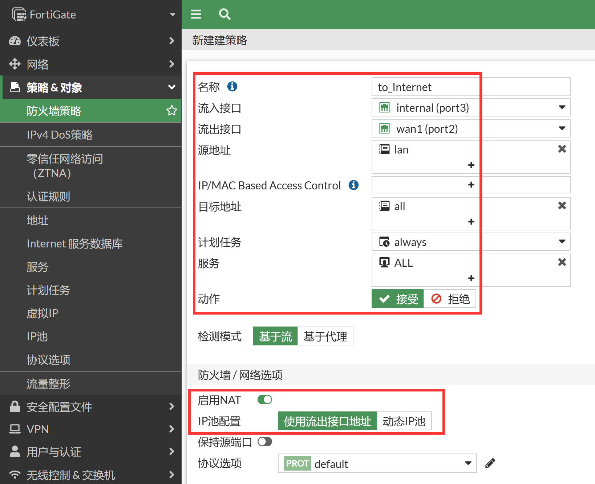

# DHCP线路上网配置

## 组网需求

外网接口使用DHCP，内网为192.168.1.0/24网段，实现基本上网功能。

## 网络拓扑


## 配置要点

- wan1（port2）口：务必勾选“从服务器重新得到网关”，这样DHCP地址获取成功后设备会自动生成默认路由，无需手动配置默认路由
- internal（port3）口:  IP地址设置格式为：192.168.1.99/24，可选择性地开启接口的管理功能
- 配置地址对象“lan”，内容为192.168.1.0/24
- 配置从internal（port3）到wan1（port2）口的策略，并开启NAT

## 配置步骤

1. 进入网络→接口，编辑wan1（port2）接口，将接口的模式配置为DHCP，并勾选“从服务器重新得到网关”。

   
   
2. 以上配置完成后，等待DHCP获取到IP地址，然后查看路由表，可以看到通过DHCP自动添加了默认路由。

   ```
   FortiGate #  get router info routing-table all
   Codes: K - kernel, C - connected, S - static, R - RIP, B - BGP
          O - OSPF, IA - OSPF inter area
          N1 - OSPF NSSA external type 1, N2 - OSPF NSSA external type 2
          E1 - OSPF external type 1, E2 - OSPF external type 2
          i - IS-IS, L1 - IS-IS level-1, L2 - IS-IS level-2, ia - IS-IS inter area
          * - candidate default
   
   Routing table for VRF=0
   S*      0.0.0.0/0 [5/0] via 202.103.100.1, port2, [1/0]
   C       192.168.1.0/24 is directly connected, port3
   C       202.103.100.0/29 is directly connected, port2
   ```
   
3. 配置internal（port3）接口的IP为192.168.1.99/24。选择性地开启接口的管理功能，建议内部开启https ,ssh, ping服务。

   

4. 配置地址资源，进入防火墙&对象→地址，点击新建地址按钮。

   

5. 名称配置为lan，地址节点选择子网：192.168.1.0/24，点击确认。

   

   ```
   config firewall address
       edit "lan"
           set subnet 192.168.1.0 255.255.255.0
       next
   end
   ```

6. 配置防火墙策略，放通内网到Internet的流量，并开启NAT，点击确定按钮后，系统自动保存配置，策略生效。

   

   ```
   config firewall policy
       edit 1
           set name "to_Internet"
           set srcintf "port3"
           set dstintf "port2"
           set action accept
           set srcaddr "lan"
           set dstaddr "all"
           set schedule "always"
           set service "ALL"
           set nat enable
       next
   end
   ```

   - 流入接口：internal（port3）
   - 源地址：选择刚才定义的地址资源lan上网网段
   - 流出接口：pppoe接口
   - 目的地址选择: all，代表所有的地址
   - 时间表：always
   - 服务: ALL
   - 动作：ACCEPT
   - NAT：选择 "启用NAT"， 系统会自动将内网的lan地址段ip，转换为wan1接口地址，进行互联网访问
   - 注意：启用"记录允许流量（记录流日志）"将会给系统带来额外的资源消耗，所以非必要情况下请不要启用记录日志

## 结果验证

将电脑IP地址设置为192.168.1.10/24，网关设置地为192.168.1.99，DNS一般设置为当地的DNS即可，电脑可正常上网。
