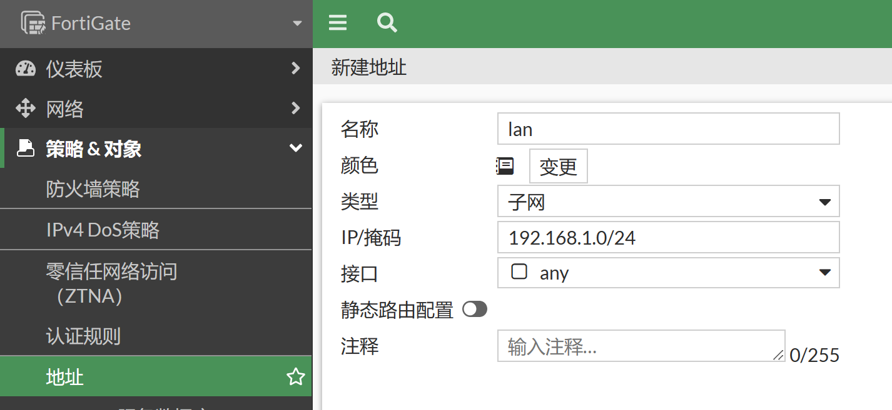

# 静态地址线路上网配置

## 组网需求

外网接口使用专线，由运营商分配指定的静态地址，内网为192.168.1.0/24网段，实现基本上网功能。

## 网络拓扑


假设运营商分配的地址如下：

| 网段             | 分配IP        | 网关地址      | DNS             |
| ---------------- | ------------- | ------------- | --------------- |
| 202.103.100.0/29 | 202.103.100.5 | 202.103.100.1 | 202.106.196.115 |

## 配置要点

- wan1（port2）口：IP地址配置为互联网运营商所提供的地址
- internal（port3）口：IP地址设置格式为：192.168.1.99/24，可选择性地开启接口的管理功能
- 配置静态路由表
- 配置地址对象lan，内容为192.168.1.0/24
- 配置从internal（port3）到wan1（port2）口的策略，并开启NAT

## 配置步骤

1. 进入网络→接口，配置wan1口的IP地址。对于202.103.100.0/29网段，202.103.100.0网络地址和202.103.100.7广播地址均不可用，202.103.100.1为运营商网关所用，202.103.100.2—202.103.100.6为可用IP地址范围。所以配置给wan接口的地址我们选择为202.103.100.5。

   

2. 配置internal（port3）接口的IP为192.168.1.99/24。选择性地开启接口的管理功能，建议内部开启https ,ssh, ping服务。

   

3. 配置静态路由，添加默认路由指向运营商网关。

   

   ```
   config router static
       edit 1
           set gateway 202.103.100.1
           set device "port2"
       next
   end
   ```

   - 目的的IP/子网掩码：由于是默认网关，使用默认的0.0.0.0/0.0.0.0即可
   - 接口：该路由所关联的接口，wan1口，必须正确填写，否则该路由无法工作
   - 网关：下一跳IP地址， 即wan1口对端运营商设备接口的ip地址
   - 管理距离：默认10
   - 高级选项-优先级：默认1

4. 配置地址资源，进入防火墙&对象→地址，点击新建地址按钮。

   

5. 名称配置为lan，地址节点选择子网：192.168.1.0/24，点击确认。

   

   ```
   config firewall address
       edit "lan"
           set subnet 192.168.1.0 255.255.255.0
       next
   end
   ```

6. 配置防火墙策略，放通内网到Internet的流量，并开启NAT，点击确定按钮后，系统自动保存配置，策略生效。

   

   ```
   config firewall policy
       edit 1
           set name "to_Internet"
           set srcintf "port3"
           set dstintf "port2"
           set action accept
           set srcaddr "lan"
           set dstaddr "all"
           set schedule "always"
           set service "ALL"
           set nat enable
       next
   end
   ```

   - 流入接口：internal（port3）
   - 源地址：选择刚才定义的地址资源lan上网网段
   - 流出接口：wan1（port2）
   - 目的地址选择: all，代表所有的地址
   - 时间表：always
   - 服务: ALL
   - 动作：ACCEPT
   - NAT：选择 "启用NAT"， 系统会自动将内网的lan地址段ip，转换为wan1接口地址，进行互联网访问
   - 注意：启用"记录允许流量（记录流日志）"将会给系统带来额外的资源消耗，所以非必要情况下请不要启用记录日志

## 结果验证

将电脑IP地址设置为192.168.1.10/24，网关设置地为192.168.1.99，DNS一般设置为当地的DNS即可，电脑可正常上网。
