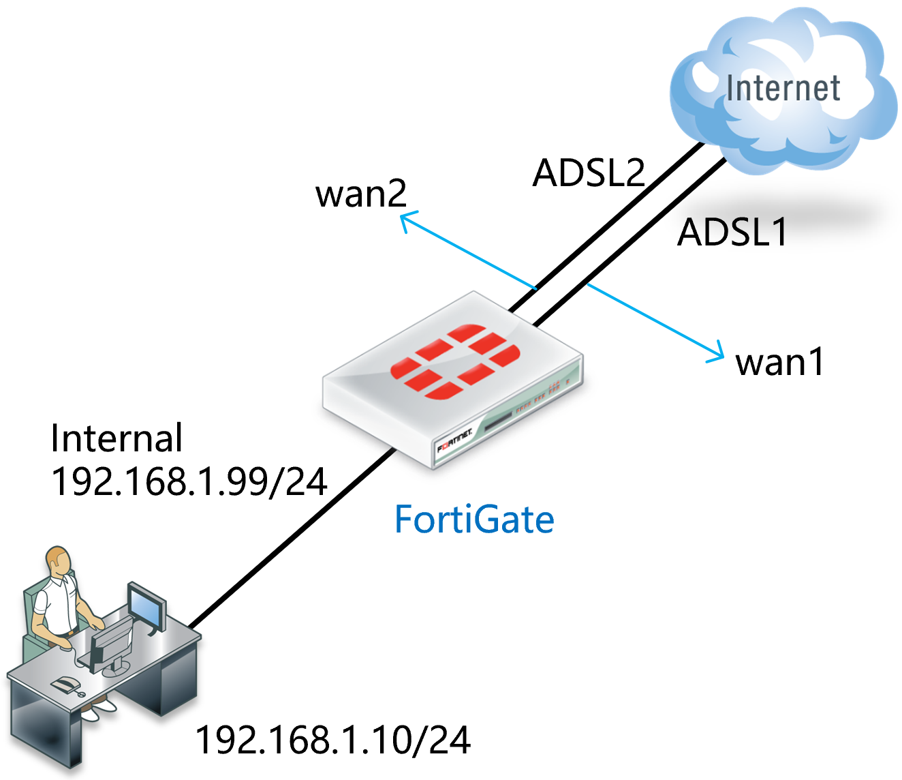
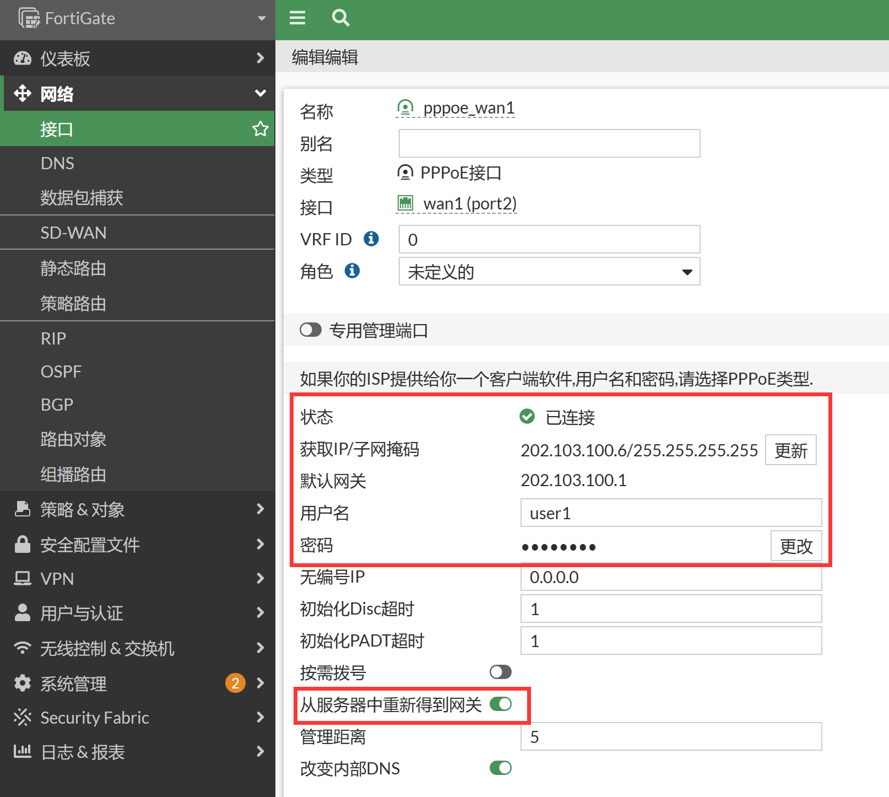
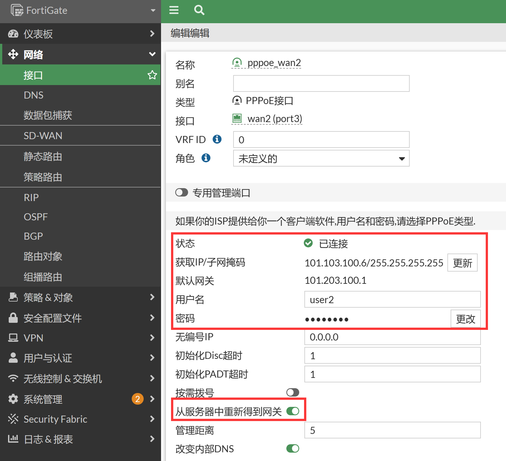
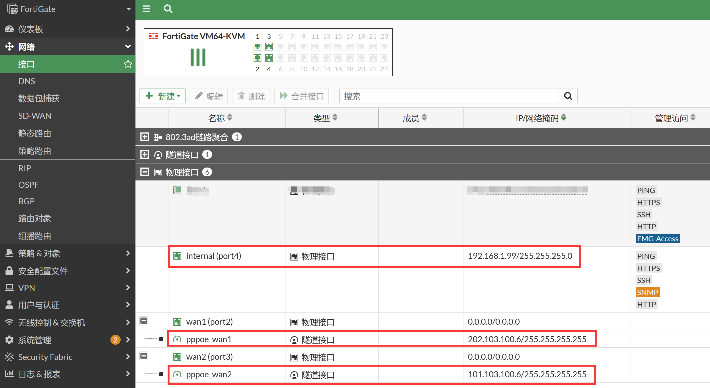
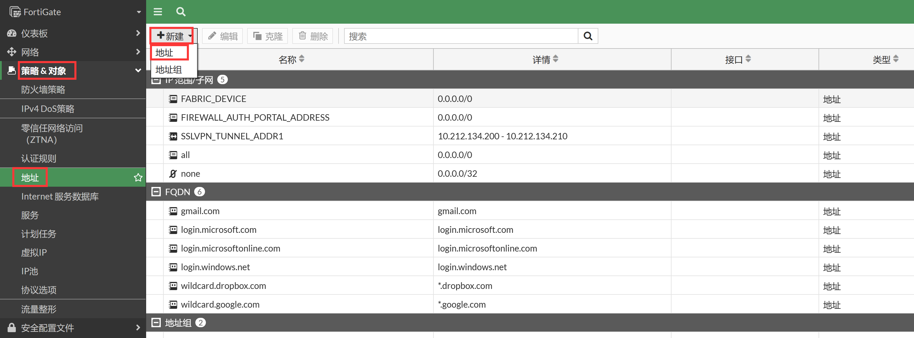
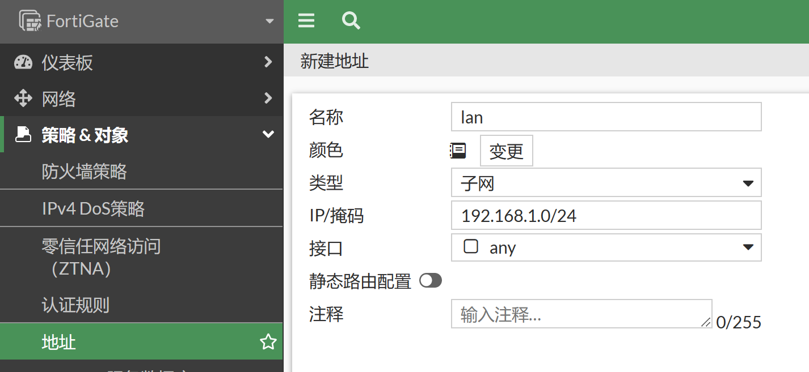
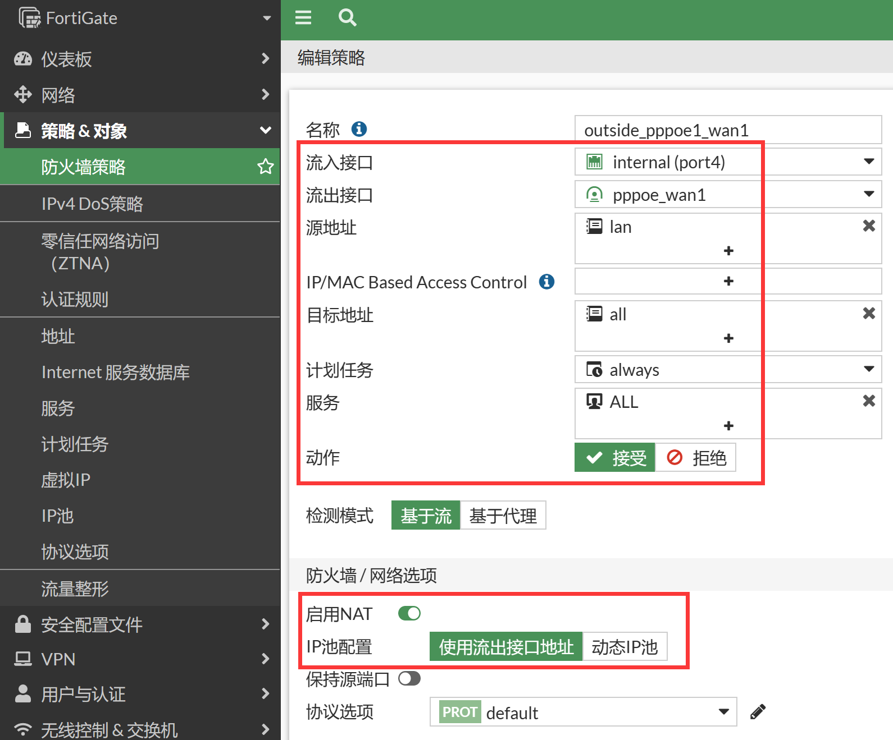
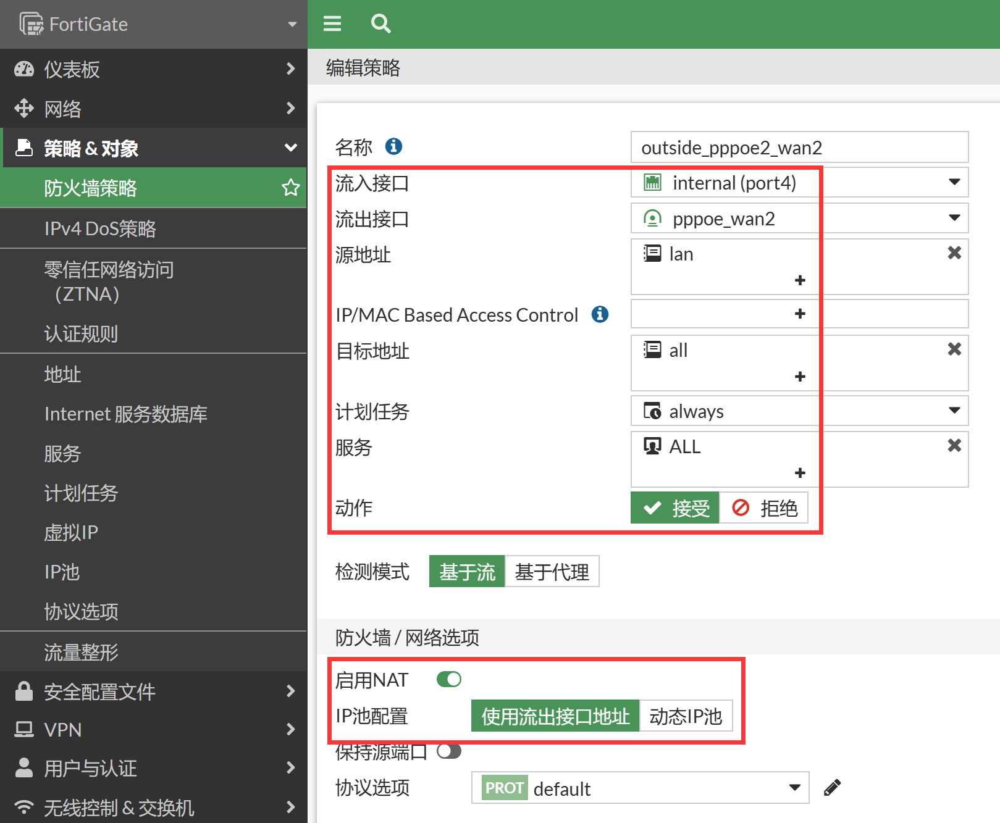
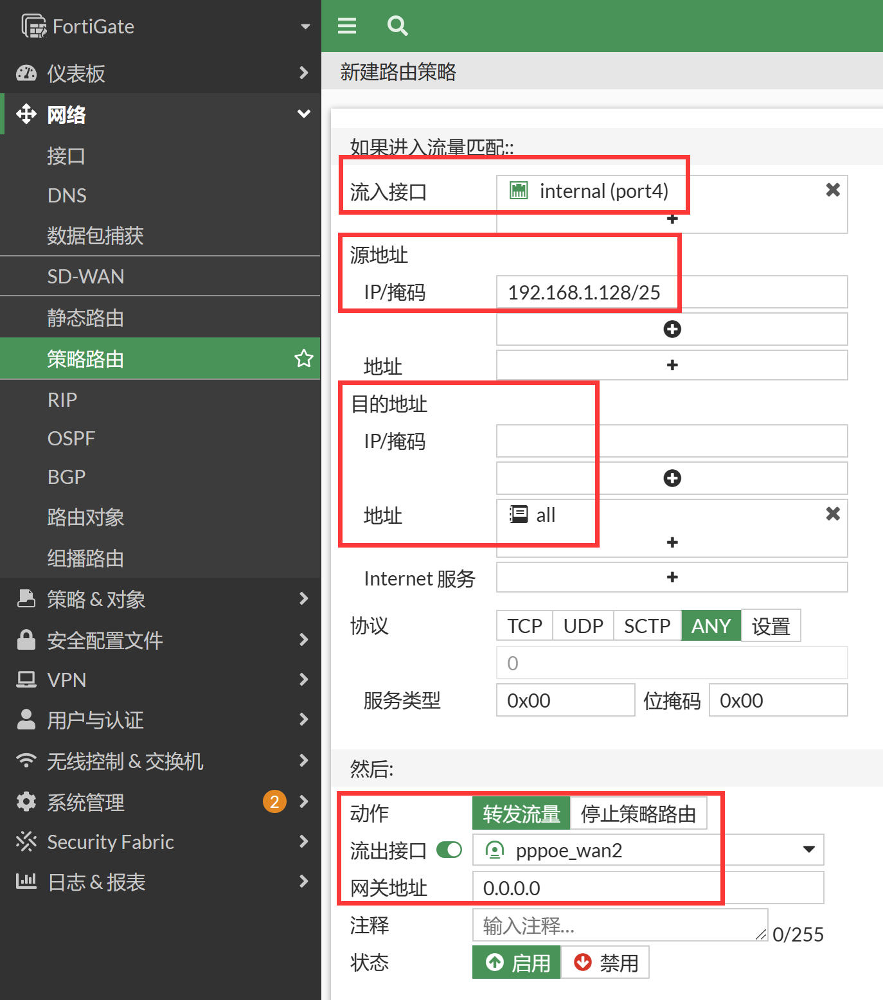

# 双线路ADSL

1. 使用两条ADSL拨号接入互联网，内网为192.168.1.0/24网段。
2. 通过策略路由，192.168.1.128/25网段单独使用一条ADSL2线路上网，其他人在ADSL1和ADSL2之间负载。

## 网络拓扑



## 配置要点

- wan1（port2）口、wan2（port3）口：接ADSL的接口，务必开启“从服务器重新获得网关”，这样ADSL拨号成功后设备会自动生成默认路由，无需手动配置默认路由
- internal（port4）口:  IP地址设置格式为：192.168.1.99/24，可选择性地开启接口的管理功能
- 配置地址对象"lan"内容为：192.168.1.0/24， "lan1"内容为: 192.168.1.128/25。
- 配置从internal到wan1口的策略，并开启NAT
- 配置从internal到wan2口的策略，并开启NAT
- 配置策略路由，强制 lan1地址段使用wan2口访问互联网

## 配置步骤

1. 配置wan1口和wan2口的PPPoE，建议在CLI下配置PPPoE接口，使用此方式配置获取到IP后会自动添加默认路由到运营商。

   ```
   config system pppoe-interface
       edit "pppoe_wan1"
           set device "port2"
           set username "user1"
           set password ENC iPUwfhZvvT1T1+v3UPEiPkxLa7RArisivypVqKeSgnPpEGbxLuddF05fEn962jPWkP+PyJBPoKRJcigI+8qvIuzFdBwFW2Mn/EF3Dq6zkcQqTfBT=
       next
       edit "pppoe_wan2"
           set device "port3"
           set username "user2"
           set password ENC 1ZwM5cq6bHbQbaIYXw89RBaYTCvlGH3TVghDsO0OMj1WdIEi/jCtnSTdvG3WfL9Iy9/r0C+D/CGI4hplaN2I/ga3Fp2x/dXfeQnQ2Xf82A6FGZ1R=
       next
   end
   
   以上命令执行后，会自动在system interface下创建同名接口，其中包含“从服务器中重新得到网关”的配置
   FortiGate # show full sys int pppoe
   config system interface
       edit "pppoe_wan1"
           set vdom "root"
           set mode pppoe
           set type tunnel
           set defaultgw enable
           set interface "port2"
       next
           edit "pppoe_wan2"
           set vdom "root"
           set mode pppoe
           set type tunnel
           set defaultgw enable
           set interface "port3"
       next
   end
   ```

2. 以上配置完成后，可以在GUI上看到wan1（port2）、wan2（port3）下分别多了个PPPoE接口，并获取到了运营商的IP。可以看到“从服务器中重新得到网关”已开启，路由表中两个运营商的默认路由等价负载。

   

   

   ```
   FortiGate # get router info routing-table all
   Codes: K - kernel, C - connected, S - static, R - RIP, B - BGP
          O - OSPF, IA - OSPF inter area
          N1 - OSPF NSSA external type 1, N2 - OSPF NSSA external type 2
          E1 - OSPF external type 1, E2 - OSPF external type 2
          i - IS-IS, L1 - IS-IS level-1, L2 - IS-IS level-2, ia - IS-IS inter area
          * - candidate default
   
   Routing table for VRF=0
   S*      0.0.0.0/0 [5/0] via 101.203.100.1, pppoe_wan2, [1/0]
                     [5/0] via 202.103.100.1, pppoe_wan1, [1/0]
   C       101.103.100.6/32 is directly connected, pppoe_wan2
   C       101.203.100.1/32 is directly connected, pppoe_wan2
   C       202.103.100.1/32 is directly connected, pppoe_wan1
   C       202.103.100.6/32 is directly connected, pppoe_wan1
   ```

3. 配置internal（port4）接口的IP为192.168.1.99/24。选择性地开启接口的管理功能，建议内部开启https、ssh、ping服务。

   

4. 配置地址资源，进入防火墙&对象→地址，点击新建地址按钮。

   

5. 名称配置为lan，地址节点选择子网：192.168.1.0/24，点击确认。

   

   ```
   config firewall address
       edit "lan"
           set subnet 192.168.1.0 255.255.255.0
       next
   end
   ```

6. 分别为wan1和wan2配置防火墙策略，放通内网到Internet的流量，并开启NAT，点击确定按钮后，系统自动保存配置，策略生效。

   

   

   ```
   config firewall policy
       edit 1
           set name "outside_pppoe1_wan1"
           set srcintf "port4"
           set dstintf "pppoe_wan1"
           set action accept
           set srcaddr "lan"
           set dstaddr "all"
           set schedule "always"
           set service "ALL"
           set nat enable
       next
       edit 2
           set name "outside_pppoe2_wan2"
           set srcintf "port4"
           set dstintf "pppoe_wan2"
           set action accept
           set srcaddr "lan"
           set dstaddr "all"
           set schedule "always"
           set service "ALL"
           set nat enable
       next 
   end
   ```

   - 流入接口：internal（port4）
   - 源地址：选择刚才定义的地址资源lan上网网段
   - 流出接口：pppoe接口
   - 目的地址选择: all，代表所有的地址
   - 时间表：always
   - 服务: ALL
   - 动作：ACCEPT
   - NAT：选择 "启用NAT"， 系统会自动将内网的lan地址段ip，转换为wan1接口地址，进行互联网访问
   - 注意：启用"记录允许流量（记录流日志）"将会给系统带来额外的资源消耗，所以非必要情况下请不要启用记录日志

7. 配置策略路由，强制192.168.1.128/25网段单独使用一条ADSL2线路上网（需要在系统管理→可见功能中开启高级路由）。其他地址可以在ADSL1和ADSL两条链路上负载。

   

   ```
   config router policy
       edit 1
           set input-device "port4"
           set src "192.168.1.128/255.255.255.128"
           set dstaddr "all"
           set output-device "pppoe_wan2"
       next
   end
   ```

   -  协议端口：协议类型，0为所有任何协议，可以指定6 tcp,17 udp,132 sctp等
   -  流入接口：流量进入接口 ，internal
   -  源地址掩码：数据包的源地址，192.168.1.128/25
   -  目的地址掩码：数据包的目的地址,  默认全部
   -  目的端口：目的端口，默认为所有。从1-65536
   -  动作：流量采用的动作
   -  流出接口：数据包的流出接口，pppoe_wan2
   -  网关地址：流出接口的下一条网关地址， 由于是PPPoE拨号，不写下一跳地址，防火墙会根据静态路由表中的条目，自动使用PPPoE生成的静态路由的下一跳IP

## 结果验证

1. 将电脑IP地址设置为192.168.1.10/24，网关设置地为192.168.1.99，DNS配置为当地的DNS即可。电脑可通过wan1以及wan2访问互联网。

2. 更改主机IP为192.168.1.168/24，主机只能通过wan2口访问互联网。

3. 排障时可使用 tracert命令，或者抓包命令来查看数据包流出接口。

   ```
   FortiGate#diagnose sniffer packet any 'icmp and host x.x.x.x' 4    //x.x.x.x为测试目标地址
   ```

   
