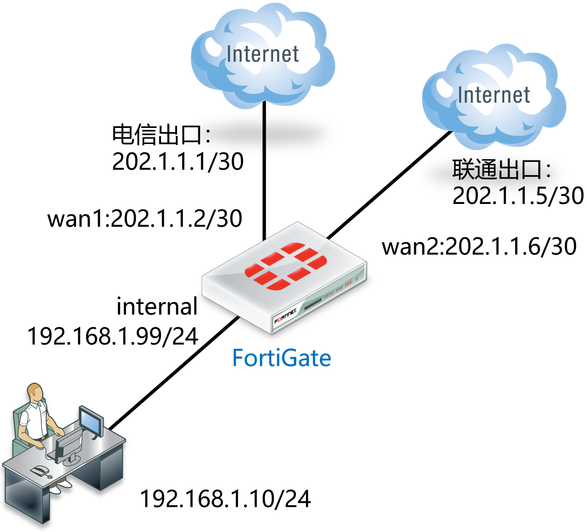
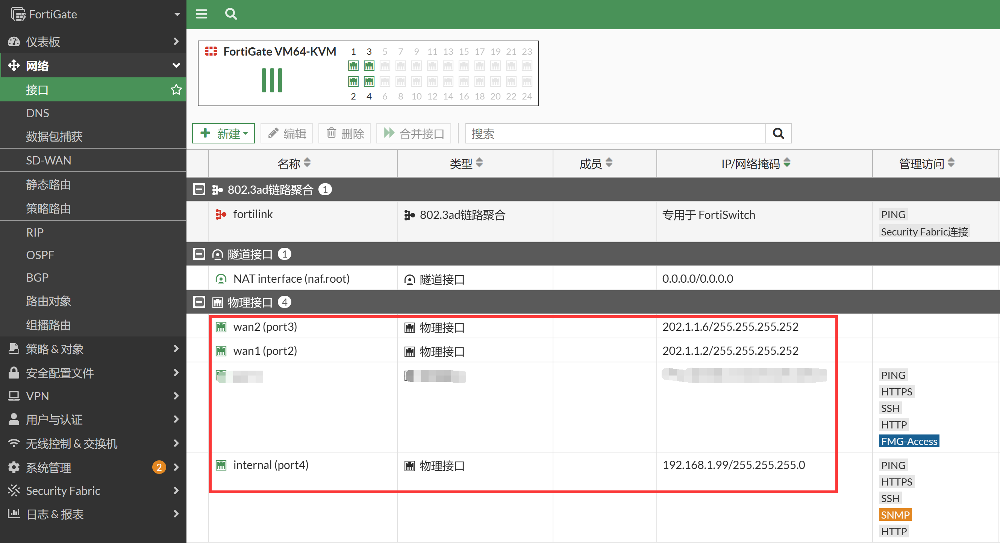
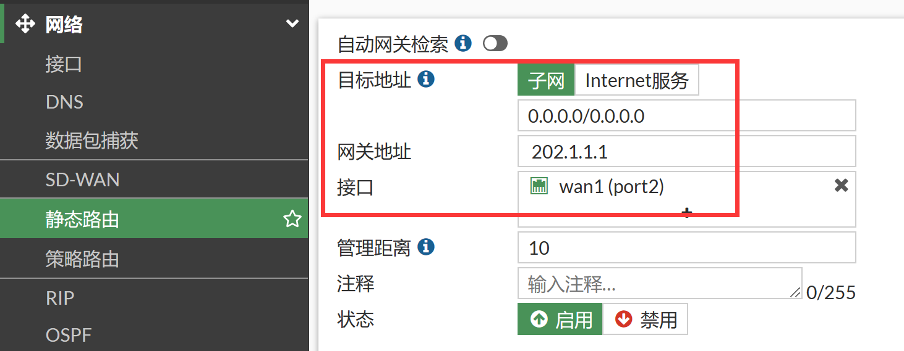
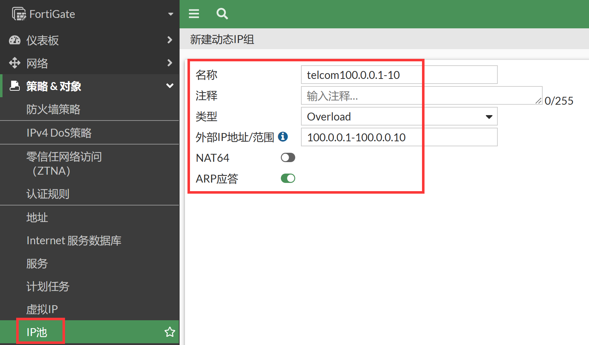
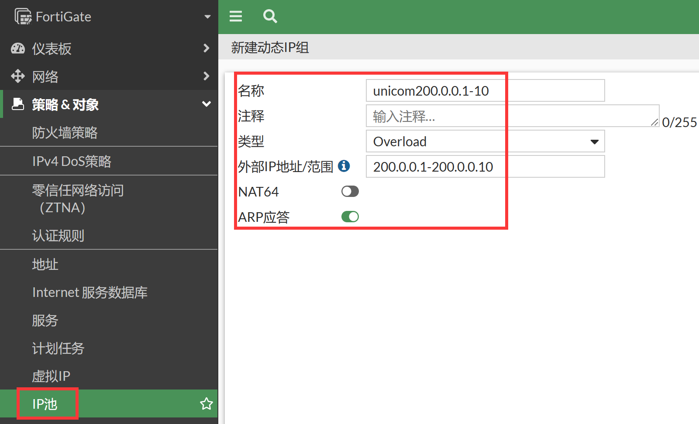
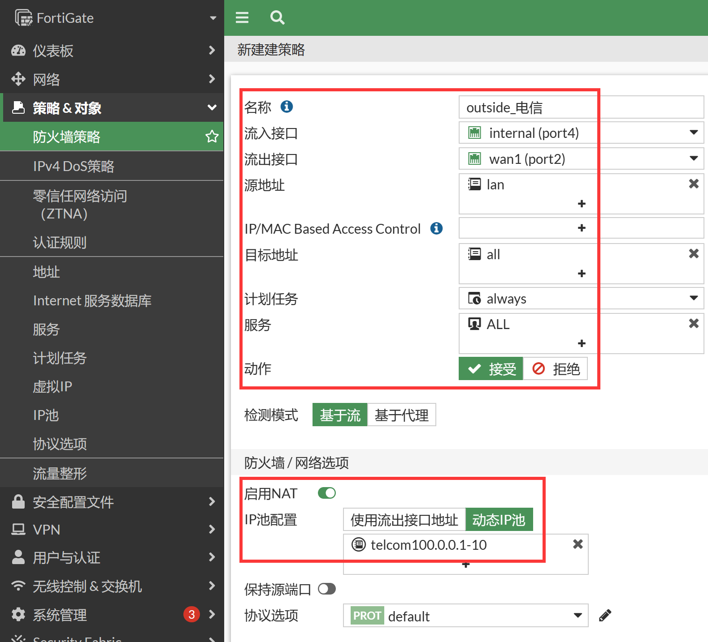
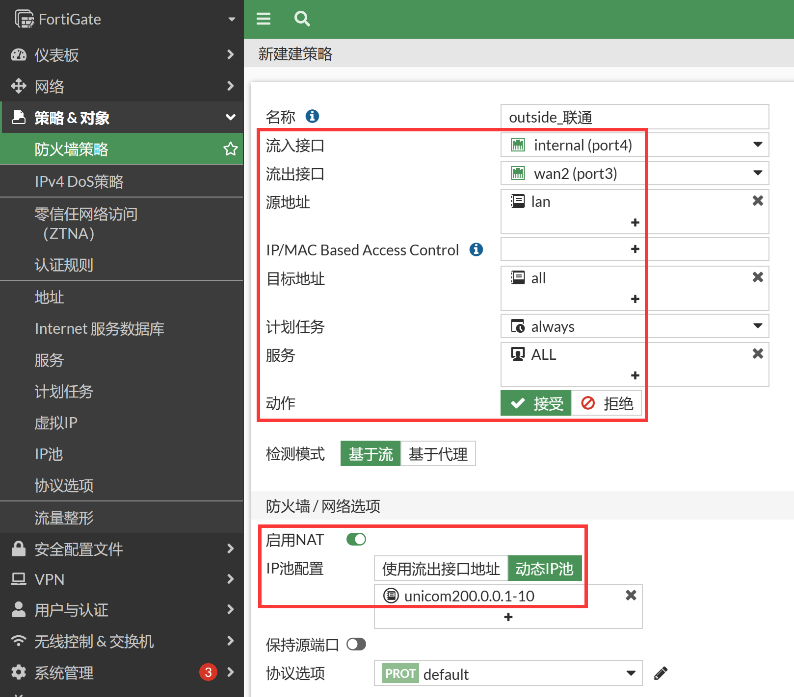

# 双线路不同运营商上网配置

## 组网需求

防火墙到电信和联通分别有一条链路，去往电信的IP，通过wan1（port2）口；去往联通的IP，通过wan2（port3）口。

- 电信：wan1（port2）口：202.1.1.2/30，网关为202.1.1.1，NAT地址池：202.1.1.1-10
- 联通：wan2（port3）口：102.1.1.2/30，网关为102.1.1.1，NAT地址池：200.0.0.1-10

## 网络拓扑



## 配置要点

- 配置接口IP
- 配置路由
- 配置地址池
- 配置策略
- 注意：部分低端型号路由表规格有限，不适用导入运营商路由表的方法

## 配置步骤

1. 配置接口IP，进入网络→接口页面，编辑wan1（port2）、wan2（port3）internal（port4），分别配置为 202.1.1.2/30、202.1.1.6/30、192.168.1.99/24。

   

2. 配置静态路由，创建电信链路（wan1）的默认路由。

   

   ```
   config router static
       edit 1
           set gateway 202.1.1.1
           set device "port2"
       next
   end
   ```

   - 目的的IP/子网掩码：由于是默认网关，使用默认的0.0.0.0/0.0.0.0即可
   - 接口：该路由所关联的接口，wan1口，必须正确填写，否则该路由无法工作
   - 网关：下一跳IP地址， 即wan1口对端运营商设备接口的ip地址
   - 管理距离：默认10
   - 高级选项-优先级：默认1，优先级小的优先使用
   - 注意：
     - 要想实现两个出口线路同时工作，两条路由表的管理距离必须相同。否则路径长度长的路由条目，不会装入路由表
     - 管理距离相等的同时，优先级必须相同。 如果路径相等优先级不同，则虽然两条路由都会被装入路由表，防火墙会优先采用优先级数值较小的路由工作，无法实现两条链路的流量均担

3. 参照[命令行脚本批量转换工具说明](..\..\附件\命令行脚本批量转换工具说明.md)和[FortiGate通用多运营商路由导入脚本](..\..\附件\FortiGate通用多运营商路由导入脚本.md)附件章节，将联通明细路由导入FortiGate（注意脚本中要开启允许静态路由引用地址对象）。

4. 配置地址池，进入策略&对象→IP池，新建两个运营商的地址池。

   

   

   - 类型："超载"，动态的从地址池中分配
   - 外部IP范围/子网：NAT转换后的源地址池
   - 地址解析协议回复：启用，地址池会回应ARP请求

   ```
   config firewall ippool
       edit "telcom100.0.0.1-10"
           set startip 100.0.0.1
           set endip 100.0.0.10
       next
       edit "unicom200.0.0.1-10"
           set startip 200.0.0.1
           set endip 200.0.0.10
       next
   end
   ```

5. 配置上网放通策略，进入策略&对象→防火墙策略，新建安全策略。分别创建internal到wan1和internal到wan2的上网策略。

   

   

   ```
   config firewall policy
       edit 1
           set name "outside_电信"
           set srcintf "port4"
           set dstintf "port2"
           set action accept
           set srcaddr "lan"
           set dstaddr "all"
           set schedule "always"
           set service "ALL"
           set nat enable
           set ippool enable
           set poolname "telcom100.0.0.1-10"
       next
       edit 2
           set name "outside_联通"
           set srcintf "port4"
           set dstintf "port3"
           set action accept
           set srcaddr "lan"
           set dstaddr "all"
           set schedule "always"
           set service "ALL"
           set nat enable
           set ippool enable
           set poolname "unicom200.0.0.1-10"
       next
   end
   ```

   - 流入接口：选择internal
   - 源地址：选择刚才定义的地址资源lan上网网段
   - 流出接口：wan1或wan2
   - 目的地址选择: all，代表所有的地址
   - 时间表：always
   - 服务: ALL
   - 动作：ACCEPT
   - NAT：选择 "启用NAT"， 勾选" 动态IP地址池"，并选择相应的地址池进行互联网访问
   - 点击确定按钮后，系统自动保存配置，策略生效
   - 注意：启用"记录允许流量（记录流日志）"将会给系统带来额外的资源消耗，所以非必要情况下请不要启用记录日志

## 结果验证

客户端上网测试，通过tracert命令，检测去往不同运营IP的路径是否正确。
