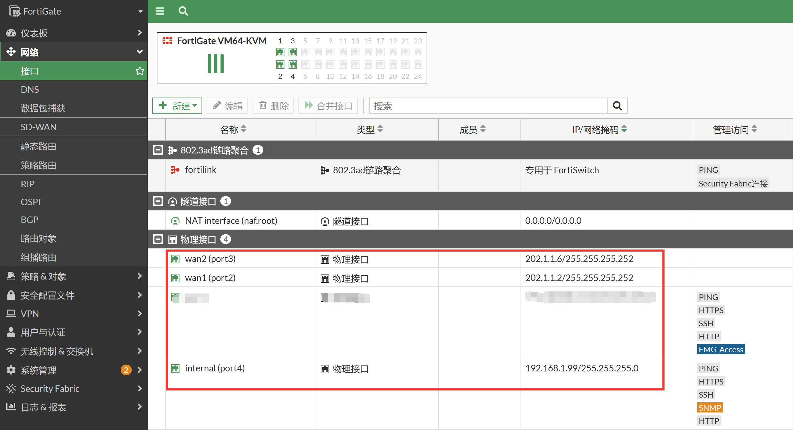

# 双线路同运营商上网配置

## 组网需求

现设备上申请了两条电信线路，带宽大小相同 ，通过配置实现负载均衡、冗余备份。

- 电信1：wan1（port2）口：202.1.1.2/30，网关为202.1.1.1
- 电信2：wan2（port3）口：202.1.1.6/30，网关为202.1.1.5

## 网络拓扑


## 配置要点

- 配置接口IP
- 配置路由
- 配置zone（untrust和 trust）
- 配置策略
- 配置ECMP负载均衡方式

## 配置步骤

1. 配置接口IP，进入网络→接口页面，编辑wan1（port2）、wan2（port3）internal（port4），分别配置为 202.1.1.2/30、202.1.1.6/30、192.168.1.99/24。

   

2. 配置静态路由，创建两条链路的默认路由。

   

   

   ```
   config router static
       edit 1
           set gateway 202.1.1.1
           set device "port2"
       next
       edit 2
           set gateway 202.1.1.5
           set device "port3"
       next
   end
   ```

   - 目的的IP/子网掩码：由于是默认网关，使用默认的0.0.0.0/0.0.0.0即可
   - 接口：该路由所关联的接口，wan1口，必须正确填写，否则该路由无法工作
   - 网关：下一跳IP地址， 即wan1口对端运营商设备接口的ip地址
   - 管理距离：默认10
   - 高级选项-优先级：默认1，优先级小的优先使用
   - 注意：
     - 要想实现两个出口线路同时工作，两条路由表的管理距离必须相同。否则路径长度长的路由条目，不会装入路由表
     - 管理距离相等的同时，优先级必须相同。 如果路径相等优先级不同，则虽然两条路由都会被装入路由表，防火墙会优先采用优先级数值较小的路由工作，无法实现两条链路的流量均担

3. 配置区域，采用区域的方式，为了配置更加快捷、精简。如果采用基于物理接口的方式，则可能需要配置多条防火墙策略。进入网络→接口，点击新建→所属区域按钮。

   

4. 分别创建Untrust和Trust区域，

   

   

   

   ```
   config system zone
       edit "Untrust"
           set interface "port2" "port3"
       next
       edit "Trust"
           set interface "port4"
       next
   end
   ```

5. 配置上网放通策略，进入策略&对象→防火墙策略，新建安全策略。

   

   ```
   config firewall policy
       edit 1
           set name "to_Internet"
           set srcintf "Trust"
           set dstintf "Untrust"
           set action accept
           set srcaddr "lan"
           set dstaddr "all"
           set schedule "always"
           set service "ALL"
           set nat enable
       next
   end
   ```

   - 流入接口：trust
   - 源地址：选择刚才定义的地址资源lan上网网段
   - 流出接口：untrust
   - 目的地址选择: all，代表所有的地址
   - 时间表：always
   - 服务: ALL
   - 动作：ACCEPT
   - NAT：  选择 "启用NAT"， 系统会自动将内网的lan地址段ip，转换为untrust的接口组里的wan1/wan2接口地址，进行互联网访问
   - 点击"确定"按钮后，系统自动保存配置，策略生效
   - 注意：启用"记录允许流量（记录流日志）"将会给系统带来额外的资源消耗，所以非必要情况下请不要启用记录日志

6. 配置ECMP负载均衡方式（具体可参考https://community.fortinet.com/t5/FortiGate/Technical-Tip-ECMP-Load-balancing-algorithms-for-IPv4-and-IPv6/ta-p/191149 ）。

   ```
   FortiGate # config system settings 
   FortiGate (settings) # set v4-ecmp-mode ?
   source-ip-based         Select next hop based on source IP. 
   weight-based            Select next hop based on weight.
   usage-based             Select next hop based on usage. 
   source-dest-ip-based    Select next hop based on both source and destination IPs.
   ```

   - 基于源IP：默认配置，根据源地址的不同选择不同的下一跳
   - 权重负载均衡 ： 根据权重值来选择路由（在默认路由的CLI下配置）
     - 比如wan1 50， wan2  50，其他为0 则2条链路会1:1的比例分配流量
     - 比如wan1 50， wan2  100，则流量会按照1:2的比例分配
   - 用量：根据线路带宽用量，选择用量较少的线路
   - 源目IP：根据源地址-目的地址对的不同选择不同的下一跳
   - 推荐采用“基于源IP”的负载均衡方式（默认）。因为例如网银、网游会进行源IP的验证，如果存在不同IP的多条流的交互（同时通过wan1/wan2做不同的NAT转换成不同的公网IP，一个网银user使用了多个公网IP访问网银业务），将会导致网银业务交互失败、游戏掉线等问题。

## 结果验证

不同的源IP的客户端的上网流量被分配到了不通的链路。
