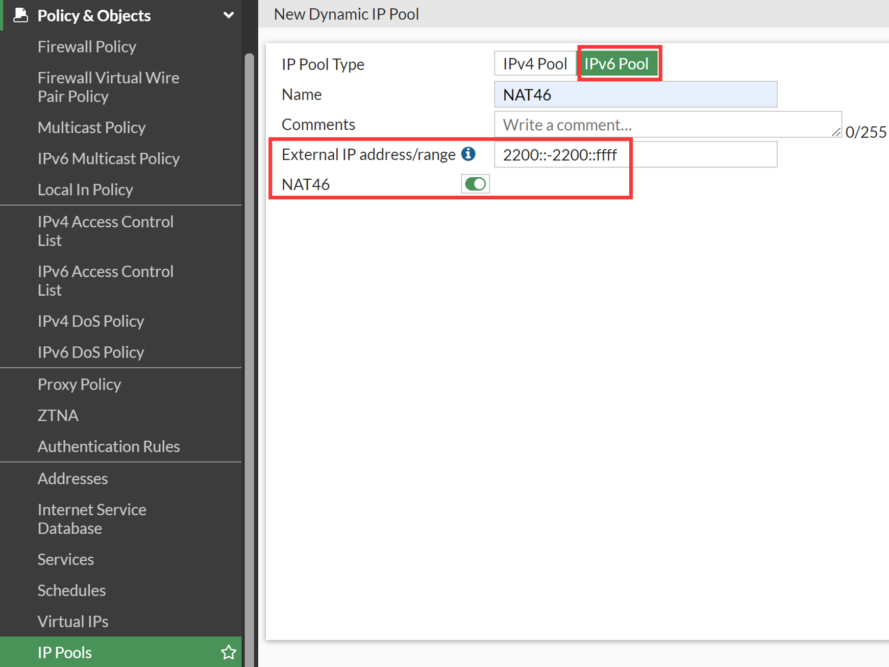
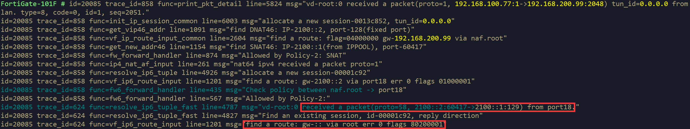

# VIP46映射

## 组网需求

将IPv6内部服务器，发布到IPv4网络之中，允许用户通过IPv4来对其进行访问。

## 网络拓扑


Client侧为IPv4，Server侧为IPv6，使用Client访问Server，FortiGate做NAT46转换

## 配置步骤

1. 创建VIP，选择类型为IPv4，Map to填写IPv6 Server地址， extip填写IPv4 VIP地址，如果是一个范围，必须填写为一个完整的subnet（最小31位）的单播地址范围，不能填写广播和网络号，否则GUI报错。

   

   ```
   config firewall vip
       edit "NAT46"
           set extip 192.168.200.99
           set nat44 disable
           set nat46 enable
           set extintf "lan"
           set ipv6-mappedip 2100::2
           set add-nat46-route enable
       next
   end
   ```

2. 可以看默认存在一个naf.root接口，用于处理NAT46流量，创建VIP完成后，如果开启了add-nat46-route（默认开启），针对naf.root接口生成去往VIP IPv4地址的路由，关闭add-nat46-route后，该路由会消失。

   

   

3. 如果是NAT46，extip配置的不是一个完整的subnet，或范围中包含subnet的广播地址，则下发时页面或CLI会报错，因为无法为naf接口下发路由。

   

4. 创建IPv6 Pool，配置地址池范围，注意不要和port18地址冲突，配置冲突这里并不会提示，后续会讲到为什么不能配成一样的，开启NAT46后，须填写为一个完整的subnet（最小128位）的IPv6地址范围，否则GUI报错。

   

   ```
   config firewall ippool6
       edit "NAT46"
           set startip 2200::
           set endip 2200::ffff
           set nat46 enable
           set add-nat46-route enable
       next
   end
   ```

5. 创建完成后，如果开启了add-nat46-route（默认开启），可以看到生成了IPv6的kernel路由，针对naf.root接口生成去往IPPool IPv6地址的路由，IPPool6关闭NAT46或关闭add-nat46-route后，该路由会消失。

   

6. 如果开启NAT46后，如果IPPool6配置的不是一个完整的subnet，则下发时页面或CLI会报错，因为无法为naf接口下发路由。

   

7. 创建防火墙策略，在NAT中开启NAT46，然后在Destination中引用VIP，在IPPool中引用IPPool6。

   

   ```
   config firewall policy
       edit 2
           set name "NAT46"
           set srcintf "lan"
           set dstintf "port18"
           set action accept
           set nat46 enable
           set srcaddr "all"
           set dstaddr "NAT46"
           set srcaddr6 "all"
           set dstaddr6 "all"
           set schedule "always"
           set service "ALL"
           set ippool enable
           set poolname6 "NAT46"
       next
   end
   ```

## 结果验证

1. Client访问FortiGate的NAT46 VIP地址192.168.200.99，抓包查看NAT46过程，可以看到经过naf.root接口，目标地址被转换为Server IPv6，源IPv4地址被转换为IPPool6中的IPv6地址，返回的流量从IPv6被还原为IPv4。

   

2. debug flow IPv4/IPv6，可以看到整个NAT46过程都需要经过naf.root接口处理。

   

3. 在FortiGate查看IPv4会话，可以看到源接口为物理入接口lan，目标接口为index 37，为naf.root，naf被标记为1，IPv4流量未被加速，会话中还包含相关的IPv6的相关信息。

   

   

4. 在FortiGate查看IPv6会话，可以看到源接口为index 37，为naf.root，目标接口为物理出接口port18，naf被标记为2，IPv6流量未被加速，会话中还包含相关的IPv4会话信息。

   

   

5. 修改IPPool6的地址范围和IPv6出接口地址一致，再次测试NAT46转换。

   ```
   config firewall ippool6
       edit "NAT46"
           set startip 2100::1
           set endip 2100::1
           set nat46 enable
       next
   end
   ```

6. 查看kernel路由中关于naf.root的路由，可以看到未产生IPPool6的路由，这样返回的流量肯定是被丢掉的，接下来验证一下。

   

7. debug flow IPv4&IPv6可以看到，Client到Server方向的NAT46的DNAT和SNAT均正常工作，但返回的IPv6流量未匹配到naf.root接口的路由，而gw查找到的是root接口，返回的流量无法到达Client。

   

8. 所以配置NAT46时，需要注意，IPPool6不要配置成和出接口地址相同的地址，配置不会报错，但实际会不通，如果是IPv6的第二地址，实际测试也是不行的。

   ```
   config system interface
       edit "port18"
           config ipv6
               set ip6-address 2100::1/64
               config ip6-extra-addr
                   edit 2100::3/64
               end
           end
   end
   ```

9. 还原IPPool6的配置，这次修改VIP的External IP和物理入接口IP一致。

   ```
   config firewall vip
       edit "NAT46"
           set extip 192.168.100.99
           set nat44 disable
           set nat46 enable
           set extintf "lan"
           set ipv6-mappedip 2100::2
       next
   end
   ```

10. 查看kernel路由中关于naf.root的路由，可以看到未产生naf.root接口的VIP的路由，这样NAT46的Client发起方流量应该是无法进入NAT46流程的，接下来验证一下。

    

11. debug flow IPv4&IPv6可以看到，Client到Server方向的NAT46流量被FortiGate路由到root接口，未进入naf.root接口，由FortiGate直接返回了reply报文，没有IPv6的debug flow产生。

    

12. 所以配置NAT46时，需要注意，IPv6 VIP的extip不要配置成和入接口地址相同的地址，配置不会报错，但实际会不通，如果是IPv4的第二地址，实际测试也是不行的。

## CLI相关

### VIP CLI

1. IPv4类型的VIP支持三种组合，NAT44、NAT46、NAT44+NAT46。

   ```
   config firewall vip
       edit "vip1"
           set extip 30.0.0.110-30.0.0.120
           set extintf "port3"
           set arp-reply disable
           set portforward enable
           set srcintf-filter "port3"
           set nat44 disable    <------- new option enabled by default
           set nat46 enable    <------- new option disabled by default
           set ipv6-mappedip 2040::20-2040::30    <------- new option available when nat46 enabled
           set extport 10
           set ipv6-mappedport 100    <------- new option available when nat46 enabled
       next
   end
   ```

2. NAT46也支持Virtual Server，开启NAT46后，RS必须配置为IPv6地址，实现的NAT过程和普通的NAT46是一样的。

   ```
   config firewall vip 
       edit "vip_svr"
           set type server-load-balance
           set extip 30.0.0.130
           set extintf "port3"
           set arp-reply disable
           set server-type http
           set monitor "ping-mon-l"
           set nat46 enable
           set extport 80
               config realservers
                   edit 1
                       set ip 2040::20    <------- server ip must be ipv6 when nat46 is enabled
                       set port 80
                   next
           end
       next
   end
   ```

3. IPv6类型的VIP支持三种组合，NAT66、NAT64、NAT66+NAT64。

   ```
   config firewall vip6
       edit "vip3"
           set extip 2002::100-2002::200
           set portforward enable
           set nat66 disable    <---- new option enabled by default
           set nat64 enable    <---- new option disabled by default
           set ipv4-mappedip 8.8.8.8-8.8.8.108    <----- new option available when nat64 is enabled
           set ipv4-mappedport 1000    <--- new option available when nat64 is enabled
           set extport 100
       next
   end
   ```

### IPPool CLI

1. IPv4类型的IPPool，类型为NAT64，地址池范围必须是一个subnet的范围，默认会开启add-nat64-route。

   ```
   config firewall ippool
       edit "pol64"
           set startip 10.0.0.0    <--- ip range must be a subnet if nat64 enabled
           set endip 10.0.255.255
           set nat64 enable    <--- new option
           set add-nat64-route enable    <---- new option available when nat64 enabled (by default enable)
       next
   end
   ```

2. IPv6类型的IPPool，类型为NAT46，地址池范围必须是一个subnet的范围，默认会开启add-nat46-route。

   ```
   config firewall ippool6
       edit "pol46"
           set startip 2002::    <---- ip range must be a subnet if nat46 enabled
           set endip 2002::ffff
           set nat46 enable
           set add-nat46-route enable    <---- new option available when nat46 enabled (by default enable)
       next
   end
   ```

### Firewall Policy & Central SNAT CLI

1. NAT46 Firewall Policy。

   ```
   config firewall policy
       edit 1
           set srcintf "port3"
           set dstintf "port2"
           set srcaddr "all"
           set dstaddr "vip1"    <-- vip with nat46 enabled
           set srcaddr6 "all"
           set dstaddr6 "all"    <--- both ipv4 and ipv6 addresses are required when nat46 enable
           set action accept
           set schedule "always"
           set service "ALL"
           set dnsfilter-profile "default"
           set ippool enable
           set poolname6 "ipv6_po1"    <---- ipv6 pool with nat46 enabled
           set nat46 enable    <----- new option to enable nat46
       next
   end
   ```

2. NAT46 Central SNAT。

   ```
   config firewall central-snat-map
       edit 2
           set srcintf "any"
           set dstintf "any"
           set orig-addr "all"
           set dst-addr "all"
           set nat46 enable    <----- new option for ipv4 rule
           set nat-ippool6 "ipv6_po1"    <---- available when nat46 is enabled, ipv6 pool with nat46 enabled
       next
   end
   ```

