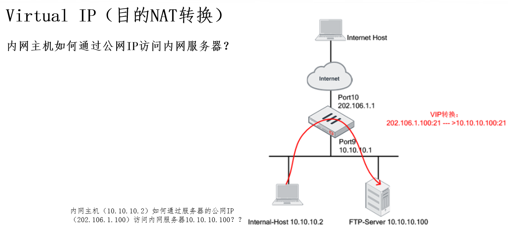
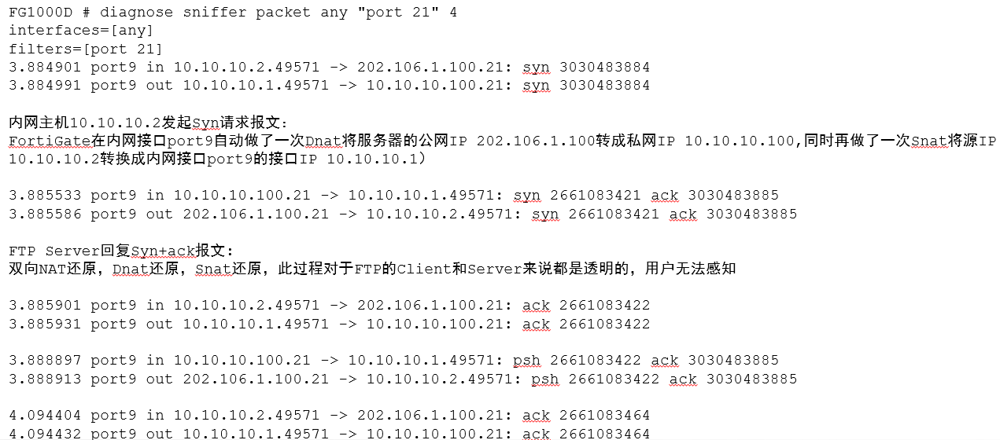
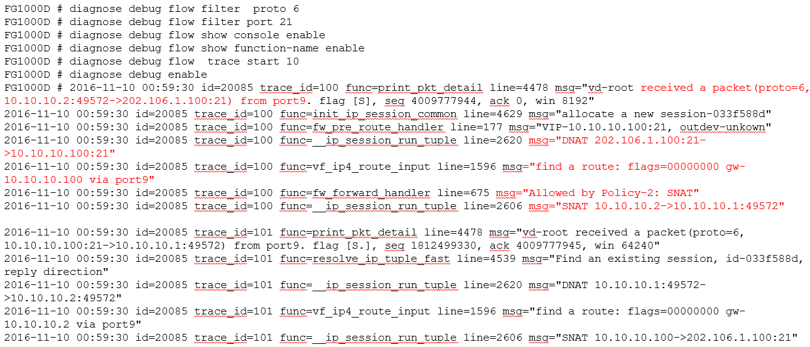
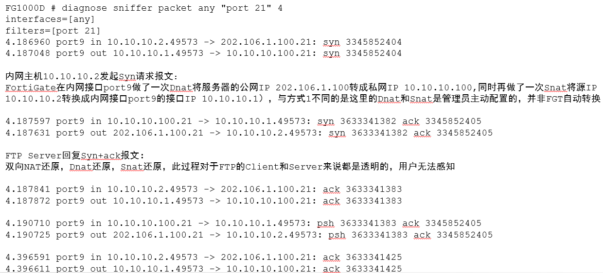
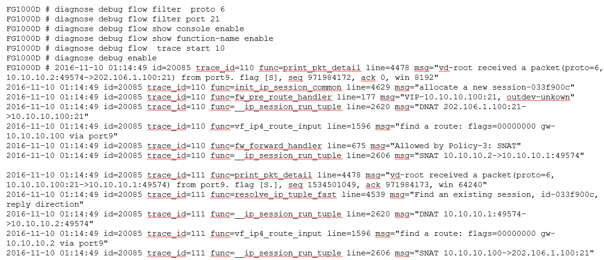

# 内网主机通过公网IP访问VIP

## 功能需求



## 实现方式一（推荐）

### 配置步骤

1. 配置属于外网接口（port10 outside）的VIP条目

   ```
   config firewall vip
   	edit "VIP-FTP-Server-Port10"
   		set extip 202.106.1.100
   		set extintf "port10"
   		set nat-source-vip enable
   		set portforward enable
   		set mappedip "10.10.10.100"
   		set extport 21
   		set mappedport 21
   end
   ```

2. 配置放通外网（port10 outside）到内网（port9 inside）且目的IP为VIP条目的策略。

   ```
   config firewall policy
   	edit 2
   	set srcintf "port10"
   	set dstintf "port9"
   	set srcaddr "all"
   	set dstaddr "VIP-FTP-Server-Port10"
   	set action accept
   	set schedule "always"
   	set service "ALL"
   end
   ```

3. 配置放通内网（port9 inside）到外网(port10 outside)的策略（上Internet的策略）。

   ```
   config firewall policy
   	edit 1
   		set srcintf "port9"
   		set dstintf "port10"
   		set srcaddr "all"
   		set dstaddr "all"
   		set action accept
   		set schedule "always"
   		set service "ALL"
   		set nat enable
   end
   ```

### 抓包分析



### Debug Flow分析



## 实现方式二（不推荐，很容易误配）

### 配置步骤

1. 配置属于any接口的VIP条目。

   ```
   config firewall vip
   	edit "VIP-FTP-Server-Port10"
   		set extip 202.106.1.100
   		set extintf "any"
   		set nat-source-vip enable
   		set portforward enable
   		set mappedip "10.10.10.100"
   		set extport 21
   		set mappedport 21
   end
   ```

2. 配置放通外网（port10 outside）到内网（port9 inside）且目的IP为VIP条目的策略。

   ```
   config firewall policy
   	edit 2
   	set srcintf "port10"
   	set dstintf "port9"
   	set srcaddr "all"
   	set dstaddr "VIP-FTP-Server-Port10"
   	set action accept
   	set schedule "always"
   	set service "ALL"
   end
   ```

3. 配置放通内网（port9 inside）到内网（port9 inside）且目的IP为VIP条目的策略，同时策略中启用NAT。

   ```
   config firewall policy
   	edit 1
   		set srcintf "port9"
   		set dstintf "port9"
   		set srcaddr "all"
   		set dstaddr "VIP-FTP-Server-Port10"
   		set action accept
   		set schedule "always"
   		set service "ALL"
   		set nat enable
   end
   ```

### 抓包分析



### Debug Flow分析


