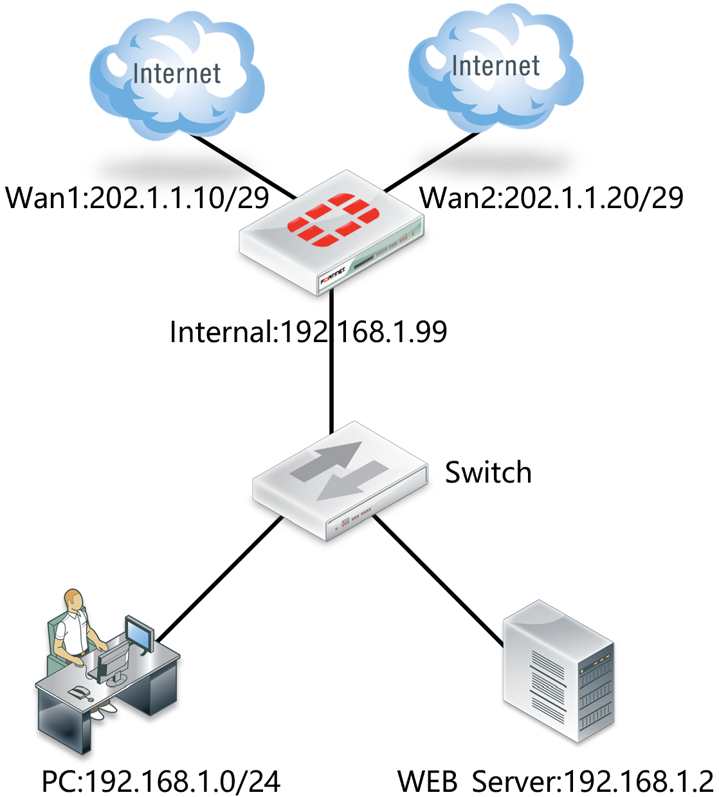
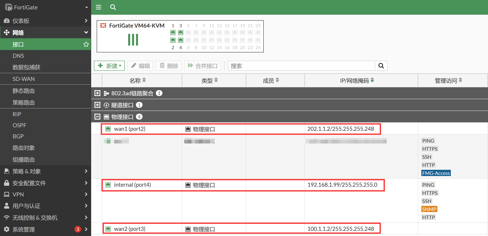
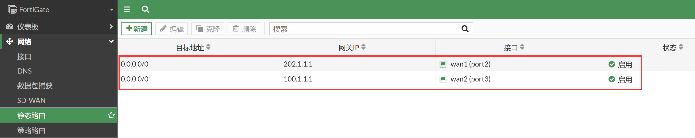
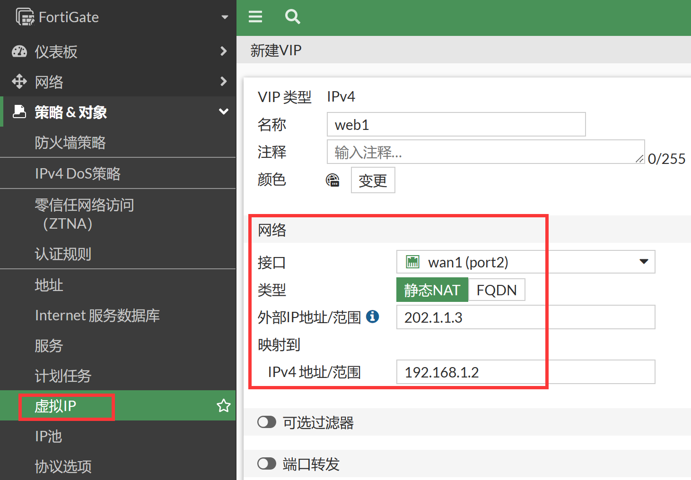
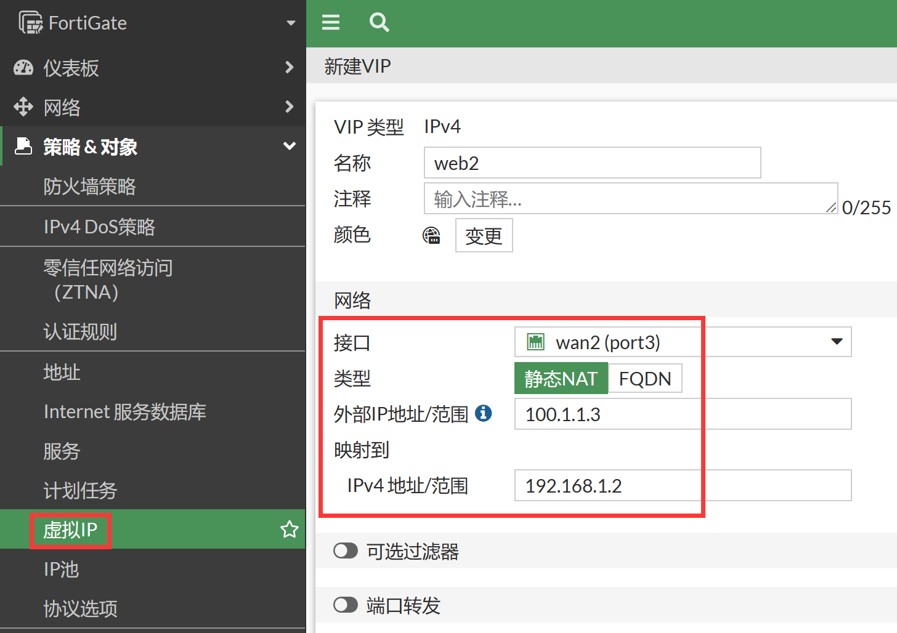
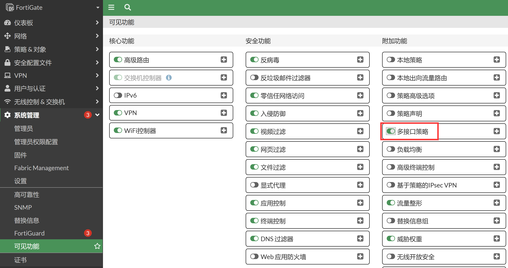
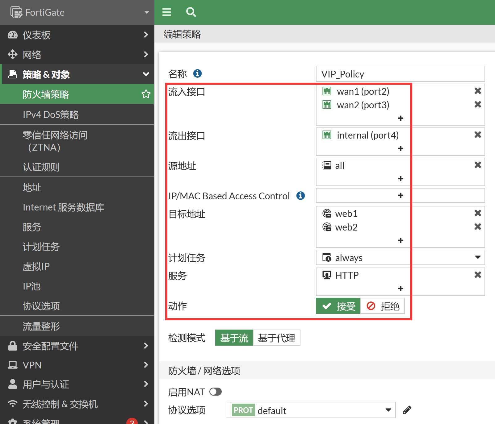
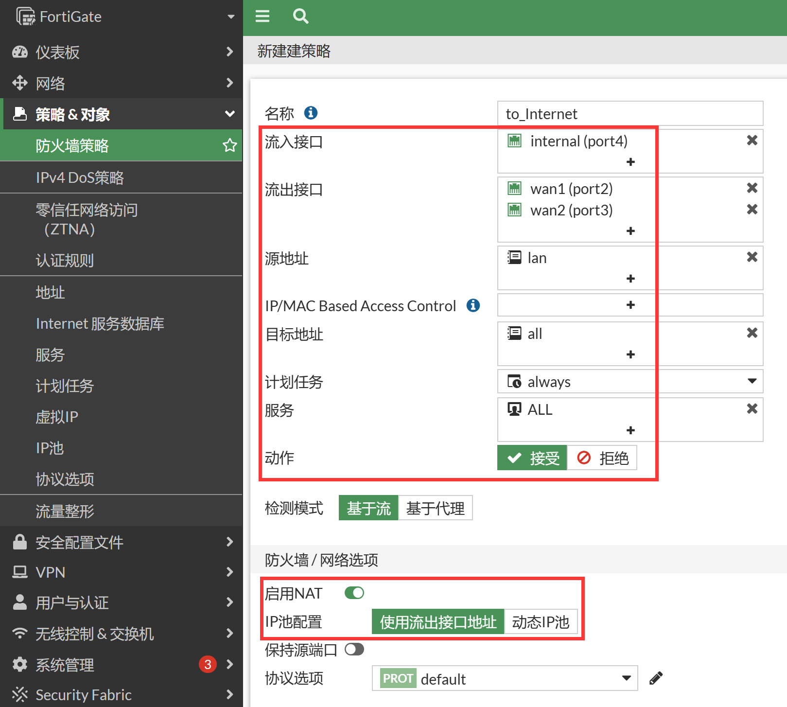

# 多线路端口映射

## 组网需求

- 将内网中的一台WEB服务器，分别映射到电信和联通２个互联网出口的公网IP上：

   - WEB服务器地址： 192.168.1.2/24   网关：192.168.1.99

   - 电信出口:  202.1.1.2/29 ,  网关202.1.1.1，服务器公网地址202.1.1.3

   - 联通出口:  100.1.1.2/29 ,  网关100.1.1.1，服务器公网地址100.1.1.3

   - 内部网段192.168.1.0/24需要上互联网

- 案例意义：
  - FortiGate支持数据流源进源出

  - 防火墙会对会话进行跟踪，从电信接口进入的访问，会优先从电信接口返回

  - 从联通接口进入的访问，会优先从联通接口返回

  - 条件是防火墙的路由表内，分别拥有能够匹配返回数据流的路由表，所以只需要配置电信和网通的两条默认路由即可


## 网络拓扑



## 配置要点

- 配置接口IP
- 配置虚拟IP（DNAT）
- 配置安全策略

## 配置步骤

1. 基础上网配置，请参照[双线路同运营商上网配置](..\..\策略与对象\多线路上网配置\双线路同运营商上网配置.md)章节，接口IP、静态路由配置如下。

   

   

   > 防火墙会对会话进行跟踪，从电信接口进入的访问，会优先从电信接口返回；从联通接口进入的访问，会优先从联通接口返回。条件是防火墙的路由表内，分别拥有能够匹配返回数据流的路由表。所以只需要配置电信和网通的两条默认路由即可。

2. 查看路由表，存在两条等价默认路由。

   ```
   FortiGate # get router info routing-table all
   Codes: K - kernel, C - connected, S - static, R - RIP, B - BGP
          O - OSPF, IA - OSPF inter area
          N1 - OSPF NSSA external type 1, N2 - OSPF NSSA external type 2
          E1 - OSPF external type 1, E2 - OSPF external type 2
          i - IS-IS, L1 - IS-IS level-1, L2 - IS-IS level-2, ia - IS-IS inter area
          * - candidate default
   
   Routing table for VRF=0
   S*      0.0.0.0/0 [10/0] via 100.1.1.1, port3, [1/0]
                     [10/0] via 202.1.1.1, port2, [1/0]
   C       100.1.1.0/29 is directly connected, port3
   C       192.168.1.0/24 is directly connected, port4
   C       202.1.1.0/29 is directly connected, port2
   ```

3. 进入策略&对象→虚拟IP，新建虚拟IP。

4. 配置VIP1，名称为web1，对HTTP服务器进行映射，用于wan1（电信）接口。

   

5. 配置VIP2，名称为web2，对HTTP服务器进行映射，用于wan2（联通）接口。

   

   ```
   config firewall vip
       edit "web1"
           set extip 202.1.1.3
           set mappedip "192.168.1.2"
           set extintf "port2"
       next
       edit "web2"
           set extip 100.1.1.3
           set mappedip "192.168.1.2"
           set extintf "port3"
       next
   end
   ```

   > 说明：“外部的IP地址/范围”和“映射的IPv4地址/范围”数量是对应，一对一映射，可以只写一个IP对一个IP的映射关系，也可以写一个映射范围。比如202.1.1.3-202.1.1.10，内部映射必须是192.168.1.2-192.168.1.9，对应映射关系也是对应的，202.1.1.3对应192.168.1.2，202.1.14对应192.168.1.3，依此类推。

6. 配置安全策略引用两个VIP，默认配置下，两条链路需要针对两个VIP配置两条防火墙策略，这里我们可以通过一条策略实现，打开系统管理→可见功能，开启“多接口策略”功能，这样我们就可以在防火墙策略的流入接口和流出接口中选择多个接口。

   

7. 配置安全策略引用两个VIP，入接口可以选择多个接口，同时选择wan1和wan2。

   

   ```
   config firewall policy
       edit 1
           set name "VIP_Policy"
           set srcintf "port2" "port3"
           set dstintf "port4"
           set action accept
           set srcaddr "all"
           set dstaddr "web1" "web2"
           set schedule "always"
           set service "HTTP"
       next
   end
   ```

   - 流入接口：wan1、wan2    //如内网用户也需通过虚拟IP访问，需将此处设置为any
   - 源地址：all
   - 流出接口： internal
   - 目的地址:   web1和web2    //定义好的虚拟IP映射对象
   - 服务: HTTP    //只允许进行HTTP服务访问
   - 注意：如内网用户也需通过虚拟IP访问，有2种方式可实现：
     - 需将原策略的【流入接口】设置为any，并在该策略上开启NAT
     - 或者添加一条【流入接口】为internal的内到内策略，并在该策略上开启NAT
   - NAT：根据需求开启，如果内网服务器到源客户端公网IP没有路由可达，仅有到达FortiGate内网口的路由，则需要开启NAT，在做DNAT之后再做一次源NAT，将源IP转换为FortiGate内网口IP
   - 动作：接受

8. 配置内网网段访问两条互联网线路的放通策略。

   

   ```
   config firewall policy
       edit 2
           set name "to_Internet"
           set srcintf "port4"
           set dstintf "port2" "port3"
           set action accept
           set srcaddr "lan"
           set dstaddr "all"
           set schedule "always"
           set service "ALL"
           set nat enable
       next
   end  
   ```

## 结果验证

1. 分别从2个运营商接口访问202.1.1.3和100.1.1.3两个IP的80端口。
2. 内网用户可以通过两条线路访问Internet。
