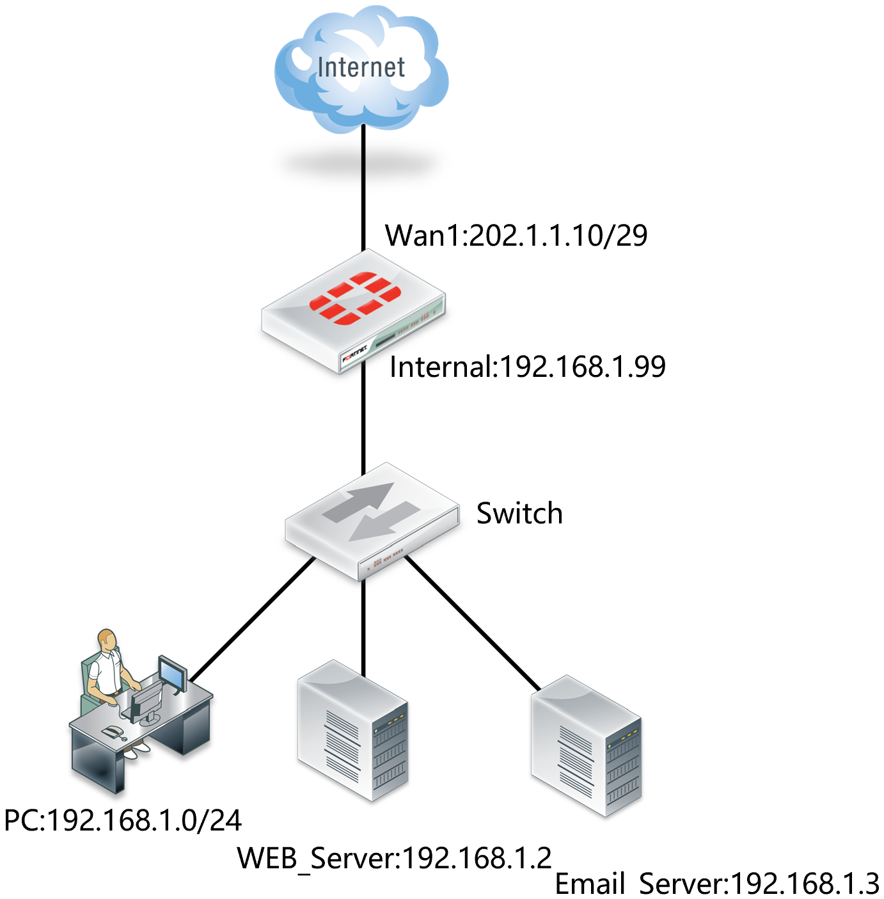
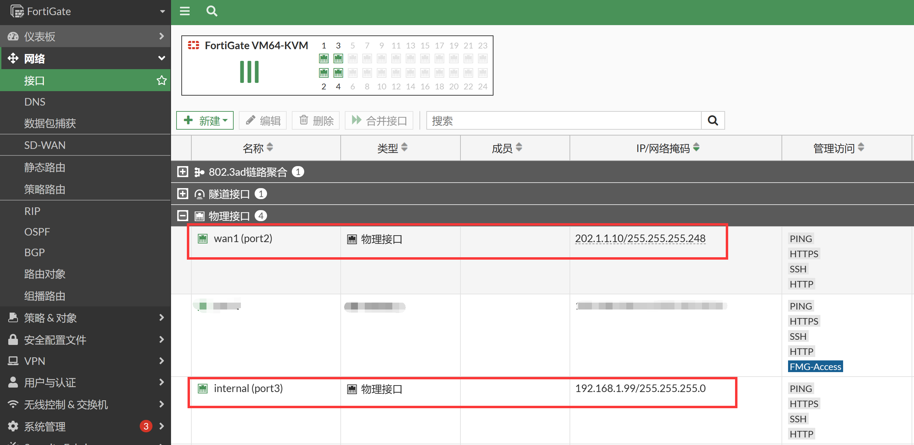
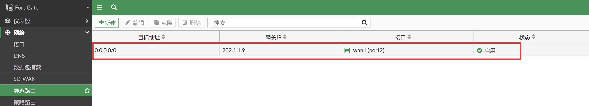
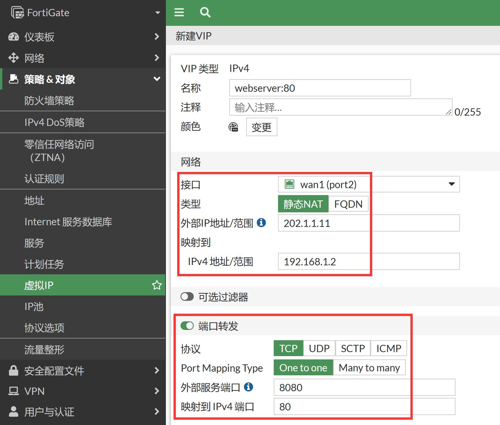
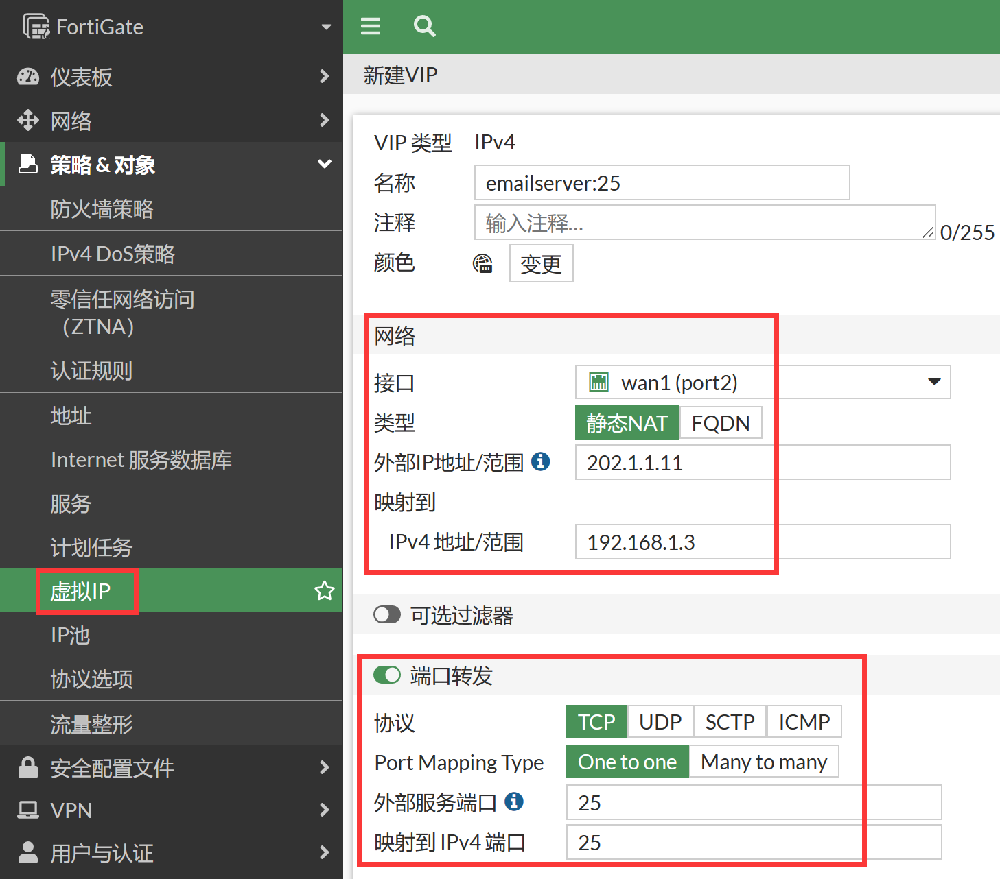
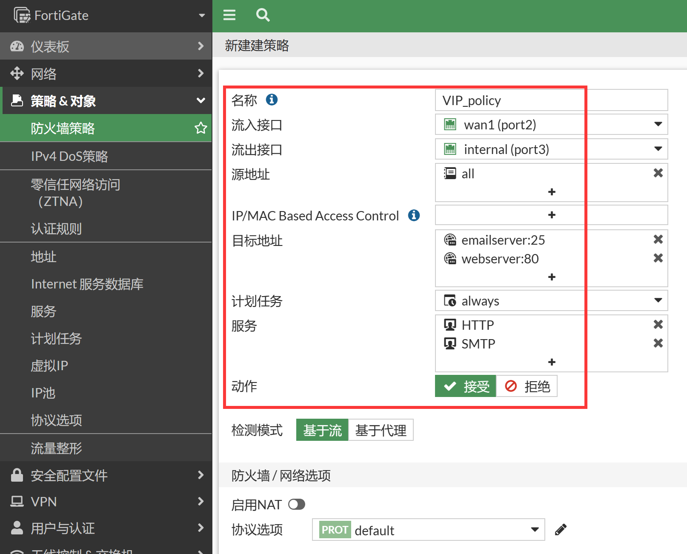

# 端口映射（一对多端口映射）

## 组网需求

1. 现在需要将内网的一台web服务器（192.168.1.2）的80端口映射到外网口的地址（202.1.1.11）的8080端口（内网端口与外网映射端口不一致）。
2. 将内网的一台email服务器（192.168.1.3）的25端口映射到外网口的地址（202.1.1.11）的25端口。
3. 案例意义：了解FortiGate的关键功能处理模块的匹配顺序：DNAT→路由→安全策略→源NAT。

## 网络拓扑



## 配置要点

- 基础上网配置
- 配置虚拟IP（DNAT）
- 配置安全策略

## 配置步骤

1. 基础上网配置，请参照[静态地址上网方式](..\..\网络管理\路由模式\静态地址上网方式.md)章节，接口IP、静态路由配置如下。

   

   

2. 进入策略&对象→虚拟IP，新建虚拟IP。

3. 配置VIP1，名称为webserver:80，对HTTP服务器进行映射，用于wan1接口。

   

4. 配置VIP2，名称为emailserver:25，对smtp服务器进行映射，用于wan1接口。

   

   ```
   config firewall vip
       edit "webserver:80"
           set extip 202.1.1.11
           set mappedip "192.168.1.2"
           set extintf "port2"
           set portforward enable
           set extport 8080
           set mappedport 80
       next
       edit "emailserver:25"
           set extip 202.1.1.11
           set mappedip "192.168.1.3"
           set extintf "port2"
           set portforward enable
           set extport 25
           set mappedport 25
       next
   end
   ```

   > 说明：“外部的IP地址/范围”和“映射的IPv4地址/范围”数量是对应，一对一映射，可以只写一个IP对一个IP的映射关系，也可以写一个映射范围。比如202.1.1.3-202.1.1.10，内部映射必须是192.168.1.2-192.168.1.9，对应映射关系也是对应的，202.1.1.3对应192.168.1.2，202.1.14对应192.168.1.3，依此类推。

5. 配置安全策略引用两个VIP。

   

   ```
   FortiGate # show firewall policy 
   config firewall policy
       edit 1
           set name "VIP_policy"
           set srcintf "port2"
           set dstintf "port3"
           set action accept
           set srcaddr "all"
           set dstaddr "emailserver:25" "webserver:80"
           set schedule "always"
           set service "HTTP" "SMTP"
       next
   end
   ```

   - 流入接口：wan1    //如内网用户也需通过虚拟IP访问，需将此处设置为any
   - 源地址：all
   - 流出接口： internal
   - 目的地址:   webserver:80和emailserver:25    //定义好的虚拟IP映射对象
   - 服务: HTTP和SMTP    //只允许进行HTTP和SMTP服务访问
   - 注意：如内网用户也需通过虚拟IP访问，有2种方式可实现：
     - 需将原策略的【流入接口】设置为any，并在该策略上开启NAT
     - 或者添加一条【流入接口】为internal的内到内策略，并在该策略上开启NAT
   - NAT：根据需求开启，如果内网服务器到源客户端公网IP没有路由可达，仅有到达FortiGate内网口的路由，则需要开启NAT，在做DNAT之后再做一次源NAT，将源IP转换为FortiGate内网口IP
   - 动作：接受

## 结果验证

1. 从外部进行访问http://202.1.1.11 。
2. 从外部访问202.1.1.11的SMTP服务。
