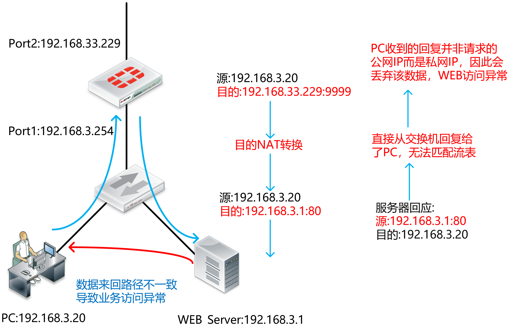

# 端口映射应原理

## 功能原理

数据从FortiGate通过时的处理流程：

1. 入接口收到数据包→新建流表或匹配流表→匹配目的NAT→查路由表→匹配安全策略→数据向出口转发→匹配源NAT→出接口转发数据包。
2. 源NAT转换通俗地讲即将源地址转换为另一个地址，目的地址不变。局域网的私网地址需要将源地址转换为公网地址才能访问外网。
3. 目的NAT转换通俗地讲即将目的地址转换为另一个地址，源地址不变。公网地址访问私网地址的服务器首先是将数据发给服务器所在的局域网的公网地址，再由设备将目的地址转换为服务器地址。

## 端口映射流程举例

1. 外网地址192.168.33.177访问服务器192.168.3.1的过程为：

   - 外网访问服务器的源IP为192.168.33.177，目的地址为192.168.33.229，目的端口为9999，经过FortiGate的目的NAT转换，将目的IP转换为192.168.3.1，目的端口转换为80。
   - 服务器回应时源IP为192.168.3.1，源端口为80，目的地址为192.168.33.177，匹配刚才目的NAT转换所建的流表将源IP地址转换为192.168.33.229，源端口转换为9999。

   

2. 内网用户192.168.3.20通过公网地址192.168.33.229访问服务器的数据过程需保证来回路径一致，所以需要配置源NAT转换也需要配置目的NAT转换：

   - 内网PC发出的源IP为192.168.3.20，目的IP为192.168.33.229，数据到FortiGate后，将源IP转换为内网口IP地址192.168.3.254，目的IP转换为192.168.3.1（注意目的端口也由9999变为80）。
   - 服务器收到数据后回应的源IP为192.168.3.1，目的IP为192.168.3.254，数据到FortiGate后，匹配刚才源NAT转换和目的NAT转换的流表，将192.168.3.1变为192.168.33.229，192.168.3.254变为192.168.3.20，则此时源IP地址变为192.168.33.229（注意源端口也由80变为9999），目的IP地址变为192.168.3.20，发送给内网PC。

   

   

## 配置举例

### 网络拓扑


### 配置步骤

1. 新建VIP映射，将公网地址从port10映射到内部的FTP服务器私网IP。

   ```
   config firewall vip
   	edit VIP-FTP-server-port10
   		set extip 202.106.1.100
   		set extintf "port10" 
   		set portforward enable
   		set mappedip 10.10.10.100
   		set extport 21
   		set mappedport 21
   end
   ```

2. 创建安全策略引用该VIP。

   ```
   config firewall policy
   	edit 0
   		set srcintf "port10"
   		set dstintf "port9"
   		set srcaddr "all"
   		set dstaddr VIP-ETP-Server-port10
   		set action accept
   		set schedule "always"
   		set service "ALL"
   end
   ```

3. 使用Internet PC访问VIP的FTP服务，查看会话表项。

   

   

4. 多出口Virtual IP的场景。

   
