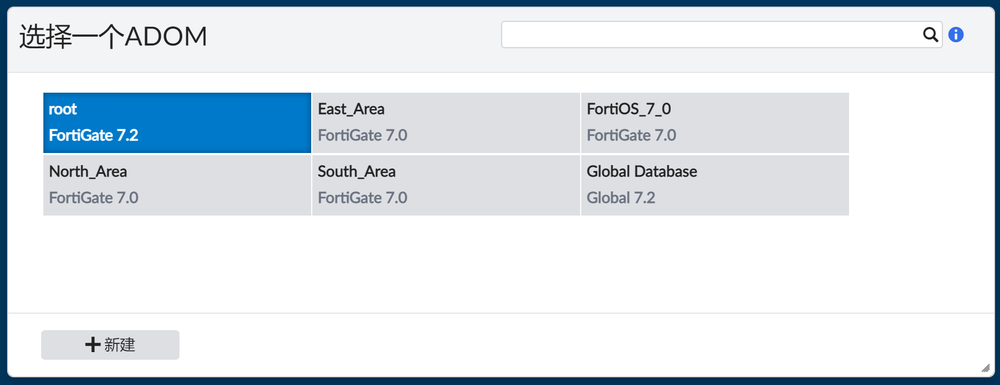

# ADOM的Workspace模式

## 需求

当多个管理员同时登陆到同一个ADOM，如果多个管理员试图同时更改相同的ADOM，则会导致小概率配置冲突。


为了避免这种情况，我们可以在CLI下开启workspace模式。禁用并发管理员对ADOM的配置访问，添加ADOM锁定，同时只能有一个管理员具备读/写访问权限，所有其他管理员都只具有读访问权限。

```
config system global
  set workspace-mode normal
end
```

> 注意：在启用Workspace模式以保存其工作之前，必须通知其他管理员，否则可能会导致一些登录用户丢失未保存的数据。

## 功能简介


以此避免多个管理员同时修改同一配置的冲突风险。

## 配置步骤

1. 使用admin账户登陆FortiManager，默认情况下，workspace-mode是“set workspace-mode disabled”，因此没有任何的锁定标志。

   

2. 进入Web CLI，在“config system global”下开启“set workspace-mode normal”。

   

3. 再次登录FortiManger，每一个ADOM都多了一把锁的标志，在没有锁定之前都仅仅拥有只读权限。

   

4. 在这个情况下，针对管理设备所有的配置按钮都是灰色的，都是只读权限。

   

5. 使用另外一个管理员user1登陆查看，和admin一样的结果，仅仅具有只读权限。

   

6. 此时admin账号想要在策略包里面添加一条策略（需要写的权限），这个时候我们就需要使用admin账户将这个root ADOM进行锁定了，只有锁定了ADOM的账户才会拥有读/写的操作权限。点击页面右上角的锁定按钮，锁定当前ADOM。

   

7. 新建或编辑策略，可以看到针对该ADOM，admin账户已经具备写权限。

   

8. 新建完成后，注意点击页面左上角的“保存”按钮，配置才会被下发到启动配置文件中。

   

9. 此时FortiOS_7_0这个ADOM已经被admin账户锁定了，使用user1账户同时登陆后查看该ADOM的权限。可以看到由于admin已经锁定了该ADOM，user1无法针对该ADOM进行任何写操作。

   

10. 针对ADOM锁定图标颜色的说明。

    
