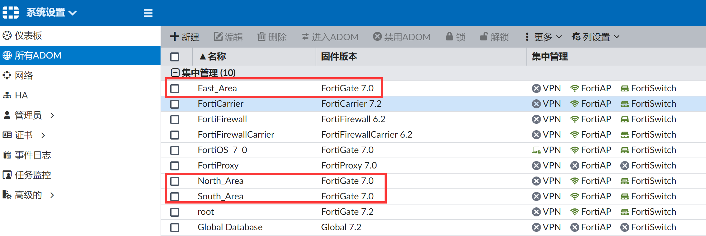
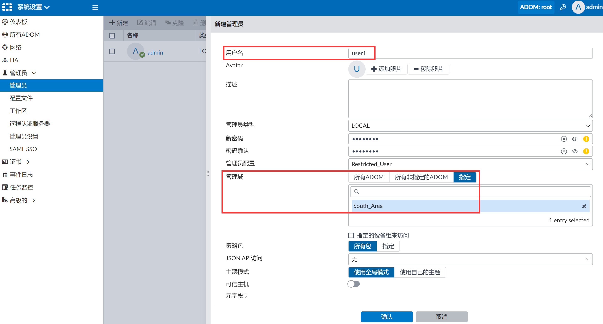
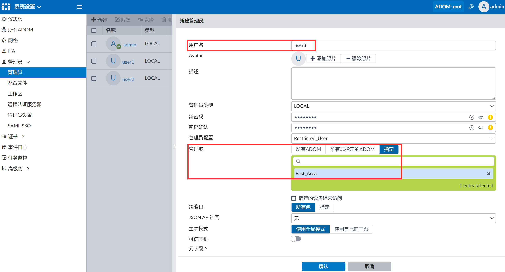
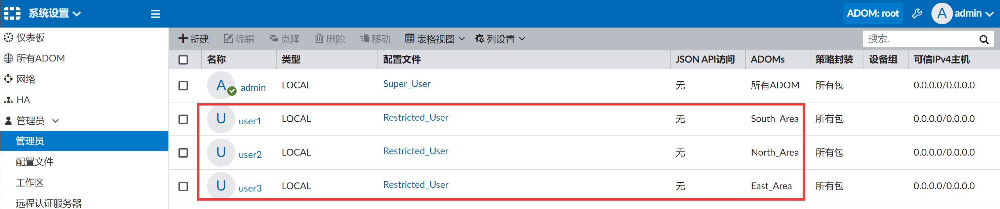
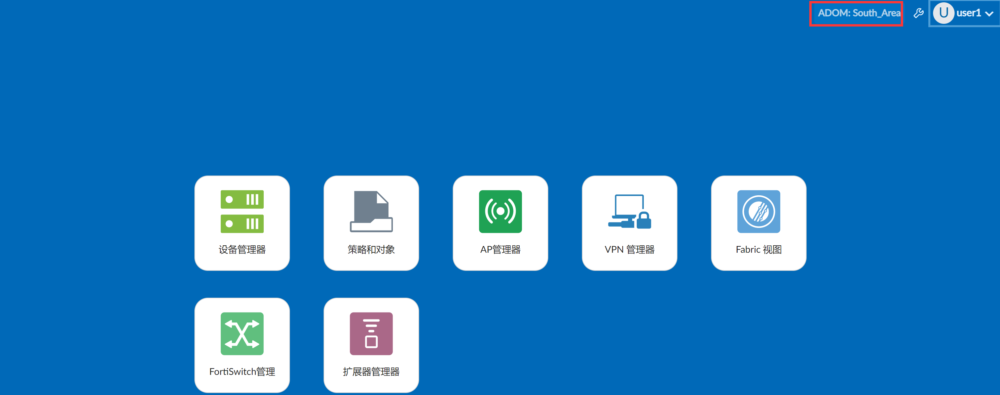
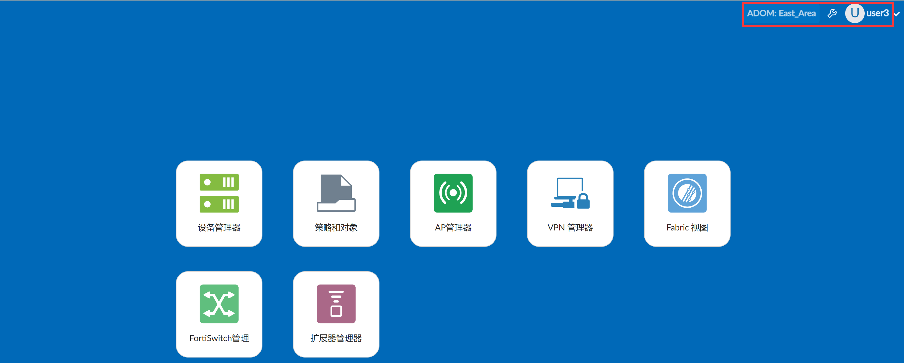
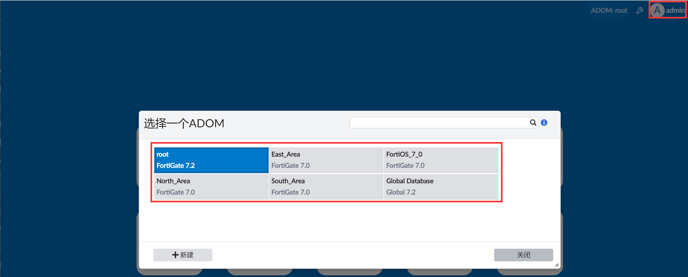

# 管理员和ADOM关联

## 需求

对于分区管理的需求，我们通常建议将管理员与ADOM进行绑定，每个区域的管理员只可以看到属于自己区域的管理设备，对于其他区域的设备不可见，这样可以实现管理员和设备的分区独立管理。

举例：有三个ADOM，South_Area、North_Area、East_Area，三个区域的管理员分别管理各自的FortiGate，相互之间独立彼此独立，管理员user1需要管理ADOM South_Area，管理员user2需要管理ADOM North_Area，管理员user3需要管理ADOM East_Area，而超级管理员admin则可以管理所有区域的所有防火墙。

## 配置步骤

新建user1、user2、user3三个本地账号并绑定到相应的ADOM上。

## 结果验证

1. 使用user1登陆FortiManager，可以看到user1只能访问South_Area ADOM。

   

2. 使用user2登陆FortiManager，可以看到user2只能访问North_Area ADOM。

   

3. 使用user3登陆FortiManager，可以看到user3只能访问East_Area ADOM。

   

4. 使用admin登陆FortiManager，可以看到admin能访问所有ADOM。

   
