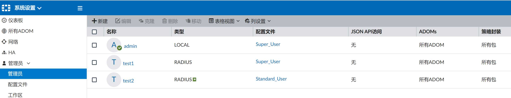
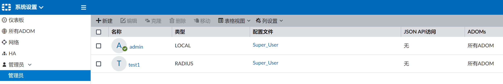

# 配置远程管理员

## 需求

要求使用test这个远程账号登陆FortiManger，如果远程认证服务器失效，则使用test这个账号的逃生密码test进行登陆，另外其他的远程用户也需要可以登陆到FortiManger。

## 拓扑

## 配置步骤

1. FortiAuthenticator上配置Radius认证client，IP地址需要保函FortiManger的管理IP地址。

   

2. 配置Radius Profile，认证方式为本地密码认证。

   

   

   

   

3. 配置本地Radius账户test1、test2、test3（密码均为11111111）。

   

4. 在FortiManager上创建远程Radius认证服务器，并测试成功。

   

5. 新建Radius管理员账户test1（密码Fortinet123#），不勾选“在远程服务器匹配所有用户”，这个账号必须先去Radius认证，认证通过可以登陆，如果Radius服务器出现了故障，则使用逃生账户密码（Fortinet123#）也可以登陆FortiManger。

   

6. 新建Radius管理员账户test2，勾选“在远程服务器匹配所有用户”，这个帐号必须在Radius服务器认证，无本地逃生密码。

   

   > 关于存在于FMG本地的admin账号，通常如果对于账号管理不是特别的严格的话，我们都是建议保留这个admin账号，这样比较好，防止没有配置test1这样的明细的具备逃生密码的账号且Radius服务器故障的时候，无法登陆到FMG。本地的admin相当于是另外一个逃生账号，当然密码需要保存好，另外平时尽量不要使用到本地的admin账号，只有当Radius服务器故障，且没有test1这样的逃生账号的时候，这个时候本地的admin才用来作为逃生账号使用。

## 结果验证

1. 使用test1用户的Radius密码11111111登陆FortiManager。

   

2. 登陆成功后，在系统设置中可以看到在线用户。

   

3. FAC上Radius的登陆成功日志。

   

4. 将Radius服务器关闭，再次使用test1和他的Radius密码11111111登陆FortiManager，登陆失败。

   

5. 这个时候就需要使用我们为test1设置的本地逃生密码Fortinet123#了，继续使用zhangsan账号和逃生密码登陆FortiManger。

   

6. 当然此时使用本地的admin账号也是可以登陆FortiManger的另外一个逃生账号。

   

   > 要注意，假如我们将FMG本地的admin账号删除了，这个情况下admin是没办法通过Radius认证成功的（Radius故障了，不可达了），这个时候只能用test1的逃生密码登陆FortiManger。而现在模拟的是我们没有删除本地的admin账号，因此这个情况下我们可以使用admin账号继续登陆FortiManger，相当于另外的一个逃生账号。

7. 使用test2账户（Radius用户密码11111111）登陆，该账户只允许Radius认证，没有逃生密码，由于FAC Radius服务器已经关闭，该用户登录失败。

   

8. 恢复FAC的Radius服务状态。

9. 再次使用test2（密码11111111）用户登陆，使用Radius认证登陆成功。

   

   > test2我们配置的是标准管理员，不是超级管理员，因此看到的FortiManger内容有限。

10. 查看FAC Radius认证成功的日志。

    

## 总结

### 推荐方式1（以上配置举例）

* 配置一个明细的test1账号+逃生密码
* 配置另外一个匹配远程Radius所有用户test2
* 保留本地admin账号（作为另外一个远程Radius的本地逃生账号）
* 远程用户全部可以登录，如果Radius服务器故障，可以使用test1的账号和逃生密码登陆，另外还可以使用本地的admin账号逃生登陆

### 推荐方式2

* 保留本地admin账号（作为远程Radius的本地逃生账号）
* 配置一个匹配远程Radius所有用户的账户
* 远程用户全部可以登录，如果Radius服务器故障，可以使用本地的admin账号逃生登陆

