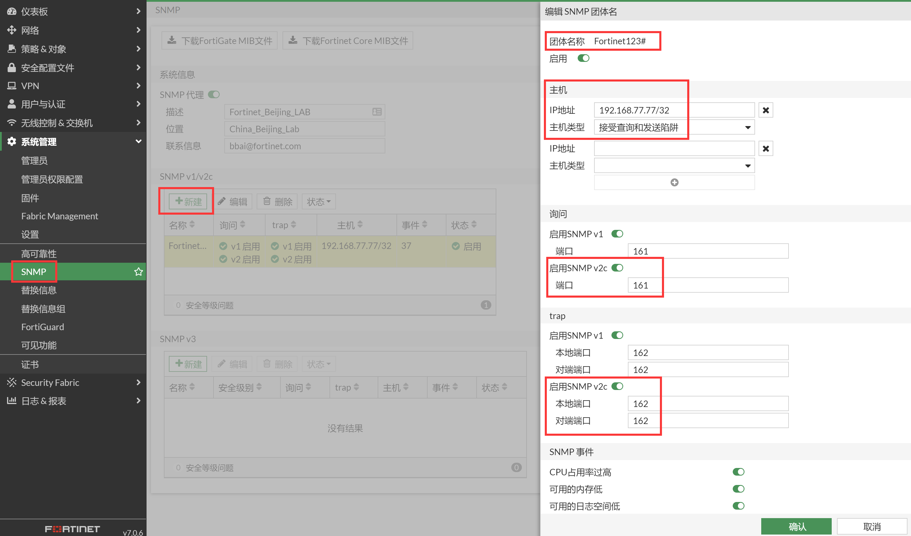
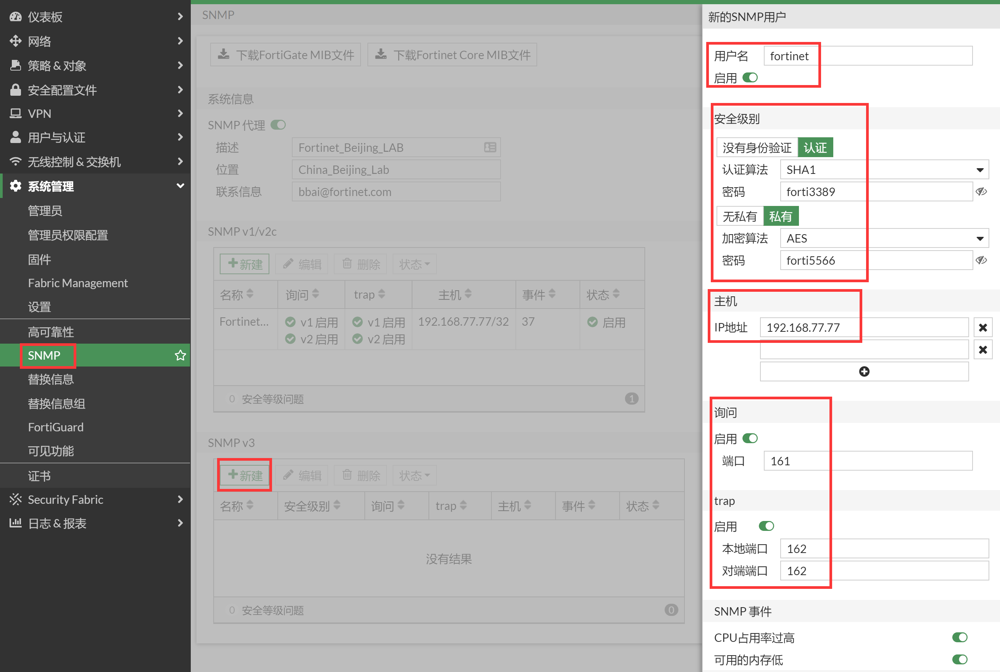

# SNMP有HA独立管理的设置

## 需求

在HA环境下配置FortiGate的SNMP，并且通过HA成员的独立管理接口进行SNMP操作。

## 组网拓扑


## 操作步骤

> HA独立管理口的配置，请参考[HA集群带外独立管理-独立管理接口](./../../../HA双机热备/HA-Cluster的网管/HA集群带外独立管理-独立管理接口.md)，使用的同样的一个拓扑图。本章节将关注点放置于如何配置和使用SNMP上。

1. 在HA独立管理接口上开启SNMP的允许访问（包括主防火墙的HA独立管理口port1和备防火墙的HA独立管理口port1）。

   

2. 开启SNMP的总开关。

   

3. 配置SNMP v2的属性，比如配置SNMPv2的SNMP属性为Fortinet123#，建议不要使用通用的public，容易被探测和攻击。需要添加SNMP客户端的主机IP（192.168.77.77）的SNMP权限，把主机的IP地址（192.168.77.77）添加到SNMPv2的配置里面。

   

4. 配置SNMPv3，配置SNMPv3的用户名为fortinet，认证算法选择SHA1，密码为forti3389，加密算法选择为AES，密码为forti5566。需要添加SNMP客户端的主机IP（192.168.77.77）的SNMP权限，把主机的IP地址（192.168.77.77）添加到SNMPv2的配置里面。

   

5. 这个时候去测试SNMP会发现SNMP是无法成功获取到的。

   

6. 在FortiGate上进行抓包，可以看到SNMP查询没有任何回应，debug flow显示SNMP请求在vd-vsys_hamgmt里面被丢弃的。

   ```
   FGT1-MASTER # diagnose sniffer packet any "host 192.168.77.77 and port 161" 4 
   Using Original Sniffing Mode
   interfaces=[any]
   filters=[host 192.168.77.77 and port 161]
   7.576093 port1 in 192.168.77.77.53750 -> 192.168.77.1.161: udp 53
   7.576474 port1 in 192.168.77.77.53750 -> 192.168.77.1.161: udp 53
   15.795977 port1 in 192.168.77.77.53751 -> 192.168.77.1.161: udp 53
   15.796132 port1 in 192.168.77.77.53751 -> 192.168.77.1.161: udp 53
   
   FGT1-MASTER # diagnose debug flow filter port 161
   FGT1-MASTER # diagnose debug flow filter addr 192.168.77.77
   FGT1-MASTER # diagnose debug flow show function-name enable
   show function name
   FGT1-MASTER # diagnose debug flow show  iprope enable
   show trace messages about iprope
   FGT1-MASTER # diagnose debug flow trace start 10
   FGT1-MASTER # diagnose debug enable
   FGT1-MASTER # id=20085 trace_id=1 func=print_pkt_detail line=5863 msg="vd-vsys_hamgmt:0 received a packet(proto=17, 192.168.77.77:53831->192.168.77.1:161) tun_id=0.0.0.0 from port1. "
   id=20085 trace_id=1 func=init_ip_session_common line=6042 msg="allocate a new session-00014576, tun_id=0.0.0.0"
   id=20085 trace_id=1 func=iprope_dnat_check line=5305 msg="in-[port1], out-[]"
   id=20085 trace_id=1 func=iprope_dnat_tree_check line=830 msg="len=0"
   id=20085 trace_id=1 func=iprope_dnat_check line=5317 msg="result: skb_flags-02000001, vid-0, ret-no-match, act-accept, flag-00000000"
   id=20085 trace_id=1 func=vf_ip_route_input_common line=2605 msg="find a route: flag=84000000 gw-192.168.77.1 via vsys_hamgmt"
   id=20085 trace_id=1 func=iprope_access_proxy_check line=436 msg="in-[port1], out-[], skb_flags-02000001, vid-0"
   id=20085 trace_id=1 func=__iprope_check line=2276 msg="gnum-100017, check-ffffffffa002be00"
   id=20085 trace_id=1 func=iprope_policy_group_check line=4734 msg="after check: ret-no-match, act-accept, flag-00000000, flag2-00000000"
   id=20085 trace_id=1 func=iprope_in_check line=469 msg="in-[port1], out-[], skb_flags-02000001, vid-0"
   id=20085 trace_id=1 func=__iprope_check line=2276 msg="gnum-100011, check-ffffffffa002cfd0"
   id=20085 trace_id=1 func=iprope_policy_group_check line=4734 msg="after check: ret-no-match, act-drop, flag-00000000, flag2-00000000"
   id=20085 trace_id=1 func=__iprope_check line=2276 msg="gnum-100001, check-ffffffffa002be00"
   id=20085 trace_id=1 func=iprope_policy_group_check line=4734 msg="after check: ret-no-match, act-accept, flag-00000000, flag2-00000000"
   id=20085 trace_id=1 func=__iprope_check line=2276 msg="gnum-10000e, check-ffffffffa002be00"
   id=20085 trace_id=1 func=__iprope_check_one_policy line=2029 msg="checked gnum-10000e policy-4294967295, ret-no-match, act-accept"
   id=20085 trace_id=1 func=__iprope_check_one_policy line=2029 msg="checked gnum-10000e policy-4294967295, ret-no-match, act-accept"
   id=20085 trace_id=1 func=__iprope_check_one_policy line=2029 msg="checked gnum-10000e policy-4294967295, ret-matched, act-accept"
   id=20085 trace_id=1 func=__iprope_check_one_policy line=2246 msg="policy-4294967295 is matched, act-drop"
   id=20085 trace_id=1 func=__iprope_check line=2293 msg="gnum-10000e check result: ret-matched, act-drop, flag-00000000, flag2-00000000"
   id=20085 trace_id=1 func=iprope_policy_group_check line=4734 msg="after check: ret-matched, act-drop, flag-00000000, flag2-00000000"
   id=20085 trace_id=1 func=__iprope_check line=2276 msg="gnum-10000f, check-ffffffffa002be00"
   id=20085 trace_id=1 func=__iprope_check_one_policy line=2029 msg="checked gnum-10000f policy-4294967295, ret-matched, act-accept"
   id=20085 trace_id=1 func=__iprope_check_one_policy line=2246 msg="policy-4294967295 is matched, act-accept"
   id=20085 trace_id=1 func=__iprope_check line=2293 msg="gnum-10000f check result: ret-matched, act-accept, flag-00000001, flag2-00000000"
   id=20085 trace_id=1 func=iprope_policy_group_check line=4734 msg="after check: ret-matched, act-accept, flag-00000001, flag2-00000000"
   id=20085 trace_id=2 func=print_pkt_detail line=5863 msg="vd-vsys_hamgmt:0 received a packet(proto=17, 192.168.77.77:53831->192.168.77.1:161) tun_id=0.0.0.0 from port1. "
   id=20085 trace_id=2 func=resolve_ip_tuple_fast line=5949 msg="Find an existing session, id-00014576, original direction"
   ```

7. 查看SNMP的debug信息，显示无法在vsys_hamgmt VDOM下查找到对应的community。

   ```
   FGT1-MASTER # diagnose debug application snmpd -1
   Debug messages will be on for 28 minutes.
   FGT1-MASTER # diagnose debug enable 
   FGT1-MASTER # snmpd: <msg> 53 bytes 192.168.77.77:34002 -> 192.168.77.1/192.168.77.1:161 (itf 3.3)
   snmpd: checking if community "Fortinet123#" is valid
   snmpd: updating cache: vdom_idx_map_cache
   snmpd: updating vdom idx mapping
   snmpd: Creating vdom_idx_cache for root
   snmpd: Vdom created kernel-index=0, snmp-index=1, name=root
   snmpd: cannot locate vdom with name vsys_hamgmt
   snmpd: checking against community "Fortinet123#"
   snmpd: request 2(vsys_hamgmt)/3/192.168.77.77 != comm 1/0/192.168.77.77/255.255.255.255
   snmpd: host or intf mismatch
   snmpd: checking against community "FortiManager"
   snmpd: full name mismatch
   snmpd: failed to match community "Fortinet123#"
   snmpd: </msg> 0
   ```

	> SNMP获取失败的原因是什么呢？
	> 
	> 原因就是因为存在HA独立管理口，HA独立管理口其实认为是一个独立的VDOM，vsys_hamgmt，默认的SNMP处理是root这个VDOM进行处理的，而不是vsys_hamgmt，因此SNMP请求HA的独立管理口是不行的。
	> 
	> 这个时候如果是请求的是root vdom里面的业务接口，非HA独立管理口的话，就没啥问题的，此问题仅仅出现在请求HA独立管理口的SNMP的情况下。
	> 
	> 因此为了满足这种场景下的SNMP使用需求，在SNMP的配置下有一个命令来适配HA独立管理口的使用，具体可以参考Fortinet Community文档的说明：
	> 
	> https://community.fortinet.com/t5/FortiGate/Technical-Tip-FortiGate-SNMP-polling-via-the-dedicated-HA/ta-p/196034
	> 
	> https://community.fortinet.com/t5/FortiGate/Technical-Tip-How-to-configure-SNMP-Community-over-Cluster/ta-p/192507

8. 关键的一步，配置snmp主机的ha-direct enable，这样SNMP才可以通过HA独立管理口获取到数据（只支持命令行配置）。以下分别是SNMPv2和SNMPv3下的配置方法。

   ```
   config system snmp community
       edit 1
           set name "Fortinet123#"
           config hosts
               edit 1
                   set ip 192.168.77.77 255.255.255.255
                   set ha-direct enable
               next
       next 
   end
   ```

   ```
   config system snmp user
       edit "fortinet"
           set notify-hosts 192.168.77.77
           set ha-direct enable
       next
   end
   ```

## 结果验证

1. Net-SNMP SNMPv2结果验证。

   ```
   [Tue Aug 11 15:28:55 root@centos7~#snmpwalk -v2c -c Fortinet123# 192.168.77.1 .1.3.6.1.4.1.12356.101.4.1.1.0  // 主防火墙结果验证
   SNMPv2-SMI::enterprises.12356.101.4.1.1.0 = STRING: "v7.0.6,build0366,220606 (GA.F)"
   [Tue Aug 11 15:28:57 root@centos7~#snmpwalk -v2c -c Fortinet123# 192.168.77.1 1.3.6.1.2.1.1.3.0
   DISMAN-EVENT-MIB::sysUpTimeInstance = Timeticks: (94369138) 10 days, 22:08:11.38
   [Tue Aug 11 15:29:02 root@centos7~#snmpwalk -v2c -c Fortinet123# 192.168.77.1 .1.3.6.1.4.1.12356.100.1.1.1.0
   SNMPv2-SMI::enterprises.12356.100.1.1.1.0 = STRING: "FGVM08TM22000173"
   [Tue Aug 11 15:29:15 root@centos7~#snmpwalk -v2c -c Fortinet123# 192.168.77.2 .1.3.6.1.4.1.12356.101.4.1.1.0  // 备防火墙结果验证
   SNMPv2-SMI::enterprises.12356.101.4.1.1.0 = STRING: "v7.0.6,build0366,220606 (GA.F)"
   [Tue Aug 11 15:29:17 root@centos7~#snmpwalk -v2c -c Fortinet123# 192.168.77.2 1.3.6.1.2.1.1.3.0
   DISMAN-EVENT-MIB::sysUpTimeInstance = Timeticks: (93667021) 10 days, 20:11:10.21
   [Tue Aug 11 15:29:21 root@centos7~#snmpwalk -v2c -c Fortinet123# 192.168.77.2 .1.3.6.1.4.1.12356.100.1.1.1.0
   SNMPv2-SMI::enterprises.12356.100.1.1.1.0 = STRING: "FGVM08TM22000174"
   ```

2. Net-SNMP SNMP V3结果验证。

   ```
   [Thu Aug 06 12:01:01 root@centos7~#net-snmp-config --create-snmpv3-user -ro -a SHA -A forti3389 -x AES -X forti5566 fortinet 
   adding the following line to /var/lib/net-snmp/snmpd.conf:
      createUser fortinet SHA "forti3389" AES forti5566
   adding the following line to /etc/snmp/snmpd.conf:
      rouser fortinet
   [Thu Aug 06 12:01:10 root@centos7~#chkconfig snmpd on
   Note: Forwarding request to 'systemctl enable snmpd.service'.
   Created symlink from /etc/systemd/system/multi-user.target.wants/snmpd.service to /usr/lib/systemd/system/snmpd.service.
   [Thu Aug 06 12:01:30 root@centos7~#service snmpd start
   Starting snmpd (via systemctl):                            [  OK  ]
   [Tue Aug 11 15:37:22 root@centos7~#snmpwalk -v3 -u fortinet -l authPriv -a SHA -A forti3389 -x AES -X forti5566 192.168.77.1 .1.3.6.1.4.1.12356.100.1.1.1.0 // 主防火墙
   SNMPv2-SMI::enterprises.12356.100.1.1.1.0 = STRING: "FGVM08TM22000173"
   [Tue Aug 11 15:37:23 root@centos7~#snmpwalk -v3 -u fortinet -l authPriv -a SHA -A forti3389 -x AES -X forti5566 192.168.77.2 .1.3.6.1.4.1.12356.100.1.1.1.0 // 备防火墙
   SNMPv2-SMI::enterprises.12356.100.1.1.1.0 = STRING: "FGVM08TM22000174"
   ```

	> Net-SNMP v3参考链接：https://www.thegeekdiary.com/centos-rhel-6-install-and-configure-snmpv3/

3. SNMPv2和SNMPv3的SNMP查询都正常，这个时候SNMP的查询就OK了，那么现在考虑另外一个问题，SNMP的Trap是否也OK呢？我们抓包看一下SNMP Trap的情况，可以看到SNMP Trap仍然可以通过HA独立管理口发送，并不需要在HA下开启ha-direct。

   ```
   FGT2-SLAVE # diagnose sniffer packet any 'port 162' 4
   Using Original Sniffing Mode
   interfaces=[any]
   filters=[port 162]
   15.428042 port1 out 192.168.77.2.162 -> 192.168.77.77.162: udp 138
   18.958515 port1 out 192.168.77.2.162 -> 192.168.77.77.162: udp 253
   133.104369 port1 out 192.168.77.2.162 -> 192.168.77.77.162: udp 138
   ```

4. 查看IReasoning MIB Browser上的Trap Receiver，可以看到主机和备机分别发送的SNMP Trap。

   

   
