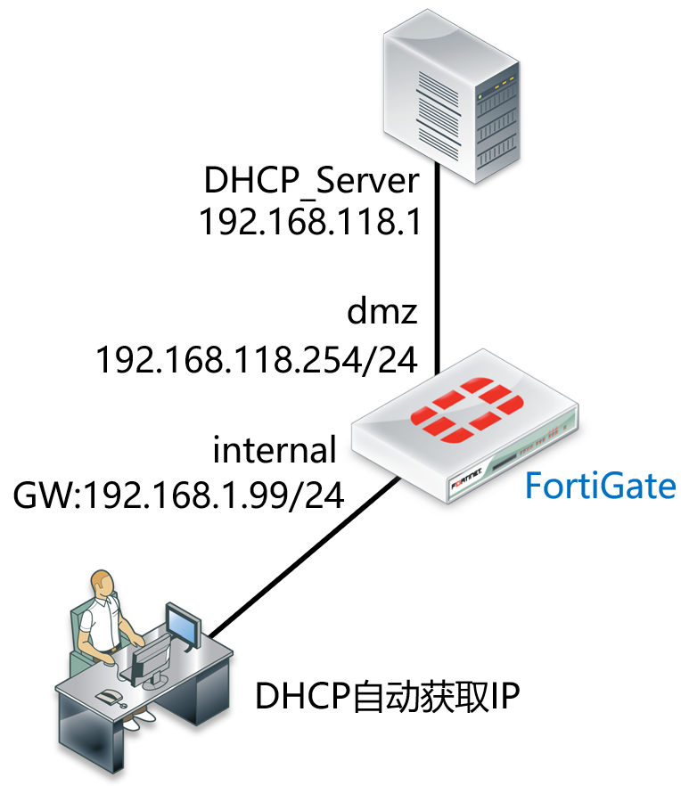
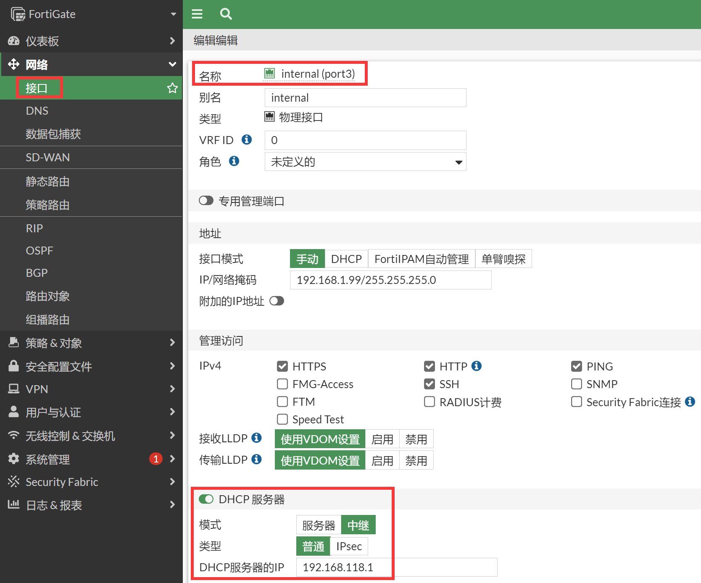

# DHCP中继配置

## 组网需求

在FortiGate上开启DHCP中继，让内网电脑能获取来自DHCP服务器分配的地址。

## 网络拓扑

## 配置要点

- 基础上网配置
- 开启DHCP中继功能，并填写DHCP服务器地址

## 配置步骤

1. 基本上网配置，请参考[静态地址线路上网配置](..\..\策略与对象\单线路上网配置\静态地址线路上网配置.md)章节。

2. 开启DHCP中继功能，并填写DHCP服务器地址。进入网络→接口，编辑需要开启DHCP服务的接口，开启DHCP服务器，打开高级选项，模式选择中继。

   

   - DHCP服务器：开启
   - DHCP服务器的IP：填写真实DHCP服务器的IP地址，需要防火墙进行中继的DHCP服务器地址
   - Mode：中继
   - 类型： 普通（或IPsec，用于为IPsec用户分配IP地址）

## 结果验证

将电脑配置为自动获取IP地址模式，会获取相应的IP地址。

