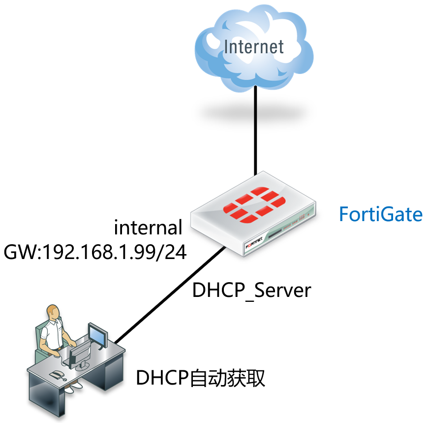
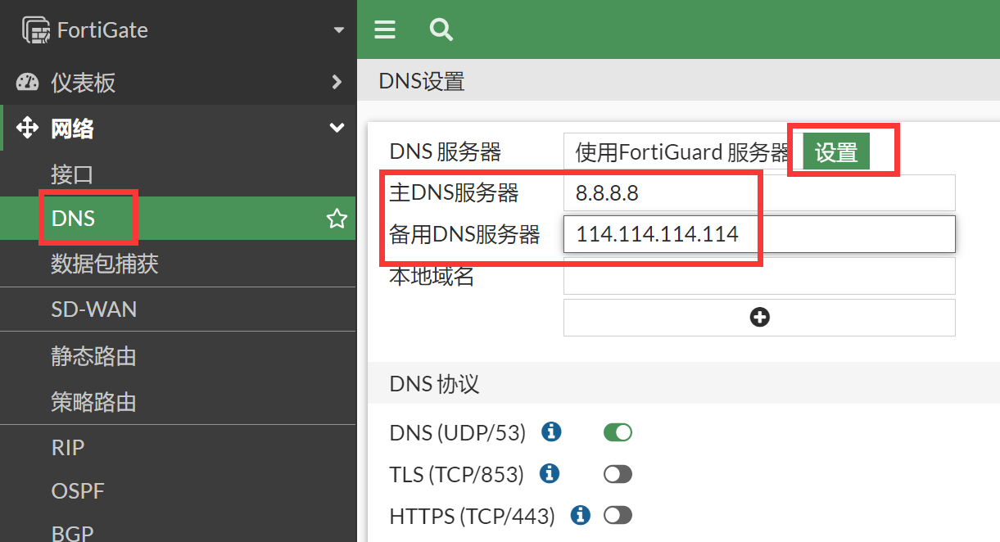

# DHCP服务器配置

## 组网需求

------

开启FortiGate的DHCP服务器功能，内网电脑可通过自动获取地址的方式上网。内网用户网段为192.168.1.0/24，网关为192.168.1.99。

## 网络拓扑

------



## 配置要点

------

- 基本上网配置
- 配置DHCP服务器

## 配置步骤

------

1. 基本上网配置，请参考[静态地址线路上网配置](..\..\策略与对象\单线路上网配置\静态地址线路上网配置.md)章节。

2. 开启DHCP服务，进入网络→接口，选择需要开启DHCP服务的接口，启用DHCP服务器。

   

   - 地址范围：用于为用户分配的IP地址范围
   - 掩码：分配的地址池地址掩码
   - 默认网关：一般为 DHCP所在接口的ip地址，也可以手工指定
   - DNS服务器：直接使用系统的DNS配置，也可以手工指定
   - 模式：选择“DHCP服务器模式”
   - IP地址分配规则：可指定固定的MAC地址分配固定的IP地址，也可以针对固定的MAC地址进行阻断过滤的策略控制（不需要控制IP分配到具体的主机时不需要配置）
   - 类型：普通（或IPsec，用于为IPsec用户分配IP地址）


## 结果验证

将电脑配置为自动获取IP地址模式，会获取配置的MAC地址对应的IP地址。


## 注意事项

1. DHCP配置中，利用系统DNS，为防火墙自身系统的DNS配置。当执行命令set dns-service default时，PC终端获取到防火墙自身系统配置的DNS。

   ```
   FortiGate# config system dhcp server
   FortiGate(server) #edit 1
   FortiGate(1)#set dns-service default     //默认参数
   default    Use system DNS settings.      //防火墙上配置的系统DNS服务器，
   local      Use this RGT as DNS server.   //防火墙接口的IP地址，
   specify    Specify DNS servers.          //指定DNS
   ```

2. 可以自定义设置防火墙自身系统DNS。

   ```
   FortiGate#config system dns      //防火墙上配置的dns
   FortiGate(dns) #set primary 8.8.8.8
   FortiGate(dns) #end
   ```

   

3. 当FortiGate执行命令set dns-service local时，PC终端获取到防火墙启用DHCP接口的IP日志。

   
