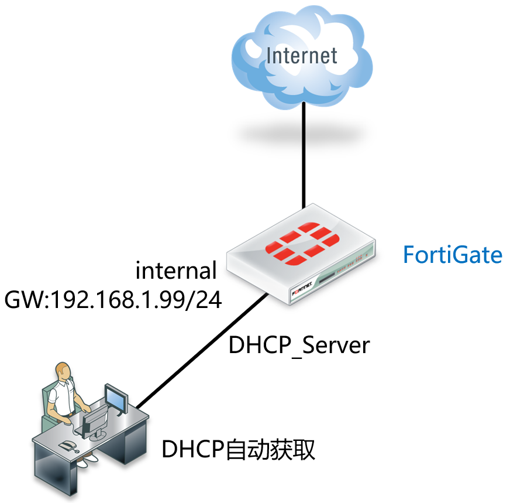
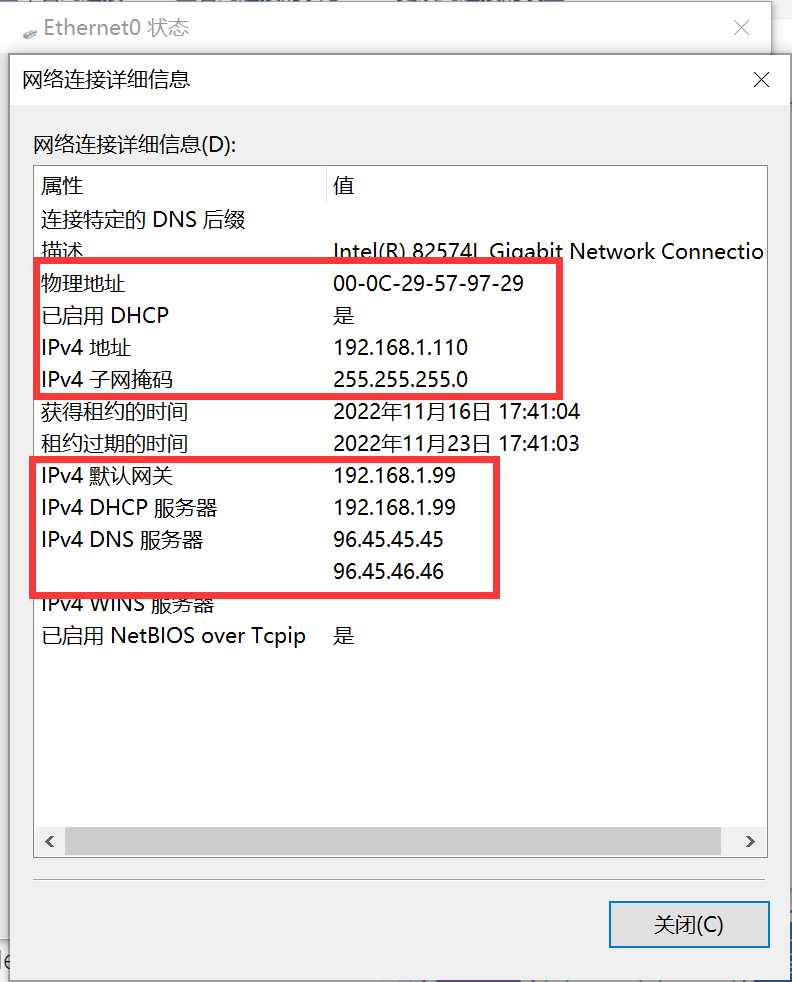
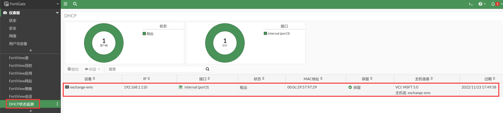

# DHCP静态绑定

## 组网需求

------

开启FortiGate的DHCP服务器功能，内网电脑可通过自动获取地址的方式上网。内网用户网段为192.168.1.0/24，网关为192.168.1.99。为MAC地址00:0c:29:57:97:29的主机保留ip地址192.168.1.110。

## 网络拓扑

------



## 配置要点

------

- 基本上网配置
- 配置DHCP服务器

## 配置步骤

------

1. 基本上网配置，请参考[静态地址线路上网配置](..\..\策略与对象\单线路上网配置\静态地址线路上网配置.md)章节。

2. 配置DHCP服务，请参考[DHCP服务器配置](.\DHCP服务器配置.md)章节。

3. 配置保留IP，也可参考[DHCP服务器配置](.\DHCP服务器配置.md)中的GUI方式配置。

   ```
   FortiGate# config system dhcp server                              
   FortiGate(server) # edit 1                          //DHCP基础配置
   FortiGate(1)#set dns-service default  
   FortiGate(1)#set default-gateway 192.168.1.99
   FortiGate(1)#set netmask 255.255.255.0
   FortiGate(1)#set interface internal
   FortiGate(1) # config ip-range
   FortiGate(ip-range) #edit 1
   FortiGate(1)set start-ip 192.168.1.110
   FortiGate(1)set end-ip 192.168.1.210
   FortiGate(1) # next
   FortiGate(ip-range) # end                            //DHCP基础配置
   FortiGate(1)#config reserved-address                 //配置保留ＩＰ
   FortiGate(reserved-address)#edit 1　　　　　　　　　　 //条目：1，2，3，仅做为标识作用，可以写多个条目。
   FortiGate(1) # set ip 192.168.1.110                  //为指定MAC地址分配该IP地址
   FortiGate(1) # set mac 00:0c:29:57:97:29             //指定MAC地址
   FortiGate(1) # next    
   FortiGate(reserved-address) # end
   FortiGate(1) # next
   FortiGate(server) #end
   ```

## 结果验证

1. 将电脑配置为自动获取IP地址模式，MAC地址为00:0c:29:57:97:29的主机会获取192.168.1.110。

   

2. 查看防火墙上dhcp地址池分配情况。

   

   

