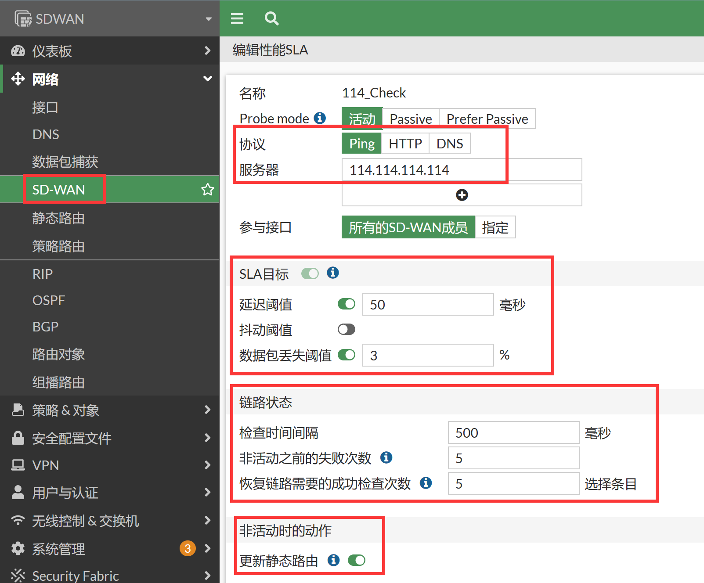
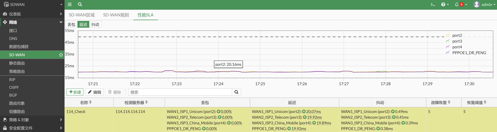
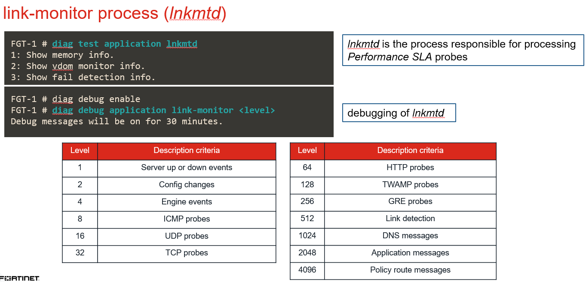
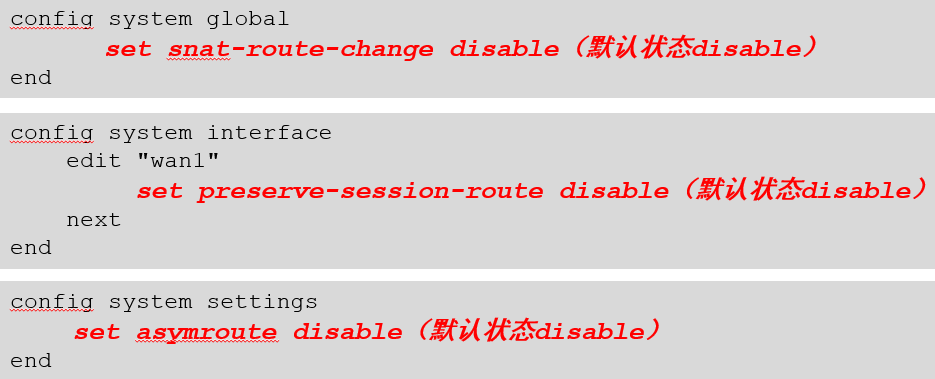

# SD-WAN健康状态检查（Performance SLA）

## 基础配置

1. 进入网络→SD-WAN→性能SLA，新建SLA检测。

   

2. 对应CLI。

   ```
   SDWAN # config system sdwan
   SDWAN (sdwan) # config health-check
   SDWAN (health-check) # edit "114_Check"
   SDWAN (114_Check) # show
   config health-check
       edit "114_Check"
           set server "114.114.114.114"    //可以指定两个被检测的server，server可以是IP或者FQDN
           set protocol ping    //SLA probe protocols are ping, http, tcp-echo (cli), udp-echo (cli) and twamp (cli).
           set interval 500    //每隔500 milliseconds发送一下健康检测的探测
           set failtime 5    //两个被探测的sla server在连续发起的5次探测都没有回应之后，没有回应的sd-wan接口成员将会被置位为dead状态，会将其在SD-WAN的选路接口组中剔除
           set recoverytime 5    //sla状态在两个sla server中其中的一个连续响应5次后切换回alive状态，会恢复到SD-WAN的选路接口中
           set members 0    //指定健康检查发送的出接口，0表示所有
           config sla    //SLA Targets是可选项,SD-WAN规则中的 “Lowest Cost”规则 (mode sla) 和 “Maximize Bandwidth“规则 (mode load-balance)需要用到SLA Targets中的检测值，基于SLA检测值进行流量路径的判断和选择。
               edit 1
                   set link-cost-factor latency packet-loss
                   set latency-threshold 50
                   set packetloss-threshold 3
               next
           end
       next
   end
   ```

## 效果验证

1. Server IP后台的处理：填写的SLA server IP会在FGT的内核中添加一个Fib路由条目项，以便每个SD-WAN接口拥有独立指向sla server ip的路由。这些特定的内核路由（被标记为“proto=17”）将使得SD-WAN接口成员到sla服务器的可访问性完全独立于通常的路由表转发表（静态路由、动态路由），从而不管静态/动态路由状态如何都可以对sla服务器的发起探测请求。

   ```
   SDWAN # get router info kernel | grep 114.114.114.114    //内核下发的独立于路由转发表的路由
   tab=254 vf=0 scope=0 type=1 proto=17 prio=0 114.100.1.204/255.255.255.255/0->114.114.114.114/32 pref=0.0.0.0 gwy=114.100.1.196 dev=19(PPPOE1_DR_PENG)
   tab=254 vf=0 scope=0 type=1 proto=17 prio=0 111.100.1.10/255.255.255.255/0->114.114.114.114/32 pref=0.0.0.0 gwy=111.100.1.192 dev=6(port4)
   tab=254 vf=0 scope=0 type=1 proto=17 prio=0 101.100.1.10/255.255.255.255/0->114.114.114.114/32 pref=0.0.0.0 gwy=101.100.1.192 dev=5(port3)
   tab=254 vf=0 scope=0 type=1 proto=17 prio=0 202.100.1.10/255.255.255.255/0->114.114.114.114/32 pref=0.0.0.0 gwy=202.100.1.192 dev=4(port2)
   ```

2. 健康检测SLA历史记录。

   

3. 实时SLA健康检查参数记录。

   ```
   SDWAN # diagnose sys sdwan health-check status 114_Check
   Health Check(114_Check): 
   Seq(1 port2): state(alive), packet-loss(0.000%) latency(19.972), jitter(0.253), bandwidth-up(9999999), bandwidth-dw(9999999), bandwidth-bi(19999998) sla_map=0x1
   Seq(2 port3): state(alive), packet-loss(0.000%) latency(19.809), jitter(0.266), bandwidth-up(9999999), bandwidth-dw(9999999), bandwidth-bi(19999998) sla_map=0x1
   Seq(3 port4): state(alive), packet-loss(0.000%) latency(19.721), jitter(0.256), bandwidth-up(9999999), bandwidth-dw(9999999), bandwidth-bi(19999998) sla_map=0x1
   Seq(4 PPPOE1_DR_PENG): state(alive), packet-loss(0.000%) latency(19.856), jitter(0.299), bandwidth-up(9999999), bandwidth-dw(9999999), bandwidth-bi(19999998) sla_map=0x1
   ```

## SLA日志

1. 某一个接口的十分钟的SLA历史记录log。

   ```
   SDWAN # diagnose sys sdwan intf-sla-log port3
   Timestamp: Tue Jan  3 01:22:04 2023, used inbandwidth: 877bps, used outbandwidth: 877bps, used bibandwidth: 1754bps, tx bytes: 542424bytes, rx bytes: 542130bytes.
   Timestamp: Tue Jan  3 01:22:14 2023, used inbandwidth: 877bps, used outbandwidth: 877bps, used bibandwidth: 1754bps, tx bytes: 543504bytes, rx bytes: 543210bytes.
   Timestamp: Tue Jan  3 01:22:24 2023, used inbandwidth: 877bps, used outbandwidth: 877bps, used bibandwidth: 1754bps, tx bytes: 544626bytes, rx bytes: 544332bytes.
   Timestamp: Tue Jan  3 01:22:34 2023, used inbandwidth: 877bps, used outbandwidth: 877bps, used bibandwidth: 1754bps, tx bytes: 545706bytes, rx bytes: 545412bytes.
   Timestamp: Tue Jan  3 01:22:44 2023, used inbandwidth: 884bps, used outbandwidth: 884bps, used bibandwidth: 1768bps, tx bytes: 546828bytes, rx bytes: 546534bytes.
   Timestamp: Tue Jan  3 01:22:54 2023, used inbandwidth: 877bps, used outbandwidth: 877bps, used bibandwidth: 1754bps, tx bytes: 547908bytes, rx bytes: 547614bytes.
   Timestamp: Tue Jan  3 01:23:04 2023, used inbandwidth: 884bps, used outbandwidth: 884bps, used bibandwidth: 1768bps, tx bytes: 549030bytes, rx bytes: 548736bytes.
   Timestamp: Tue Jan  3 01:23:14 2023, used inbandwidth: 884bps, used outbandwidth: 884bps, used bibandwidth: 1768bps, tx bytes: 550152bytes, rx bytes: 549858bytes.
   Timestamp: Tue Jan  3 01:23:24 2023, used inbandwidth: 890bps, used outbandwidth: 890bps, used bibandwidth: 1780bps, tx bytes: 551274bytes, rx bytes: 550980bytes.
   Timestamp: Tue Jan  3 01:23:34 2023, used inbandwidth: 884bps, used outbandwidth: 884bps, used bibandwidth: 1768bps, tx bytes: 552354bytes, rx bytes: 552060bytes.
   Timestamp: Tue Jan  3 01:23:44 2023, used inbandwidth: 884bps, used outbandwidth: 884bps, used bibandwidth: 1768bps, tx bytes: 553434bytes, rx bytes: 553140bytes.
   Timestamp: Tue Jan  3 01:23:54 2023, used inbandwidth: 890bps, used outbandwidth: 892bps, used bibandwidth: 1782bps, tx bytes: 554610bytes, rx bytes: 554304bytes.
   Timestamp: Tue Jan  3 01:24:04 2023, used inbandwidth: 884bps, used outbandwidth: 884bps, used bibandwidth: 1768bps, tx bytes: 555678bytes, rx bytes: 555384bytes.
   Timestamp: Tue Jan  3 01:24:14 2023, used inbandwidth: 875bps, used outbandwidth: 884bps, used bibandwidth: 1759bps, tx bytes: 556800bytes, rx bytes: 556452bytes.
   Timestamp: Tue Jan  3 01:24:24 2023, used inbandwidth: 875bps, used outbandwidth: 875bps, used bibandwidth: 1750bps, tx bytes: 557826bytes, rx bytes: 557532bytes.
   Timestamp: Tue Jan  3 01:24:34 2023, used inbandwidth: 888bps, used outbandwidth: 888bps, used bibandwidth: 1776bps, tx bytes: 558990bytes, rx bytes: 558696bytes.
   Timestamp: Tue Jan  3 01:24:44 2023, used inbandwidth: 875bps, used outbandwidth: 873bps, used bibandwidth: 1748bps, tx bytes: 560070bytes, rx bytes: 559776bytes.
   Timestamp: Tue Jan  3 01:24:54 2023, used inbandwidth: 882bps, used outbandwidth: 882bps, used bibandwidth: 1764bps, tx bytes: 561192bytes, rx bytes: 560898bytes.
   Timestamp: Tue Jan  3 01:25:04 2023, used inbandwidth: 884bps, used outbandwidth: 875bps, used bibandwidth: 1759bps, tx bytes: 562272bytes, rx bytes: 561978bytes.
   Timestamp: Tue Jan  3 01:25:14 2023, used inbandwidth: 890bps, used outbandwidth: 890bps, used bibandwidth: 1780bps, tx bytes: 563394bytes, rx bytes: 563100bytes.
   Timestamp: Tue Jan  3 01:25:24 2023, used inbandwidth: 884bps, used outbandwidth: 884bps, used bibandwidth: 1768bps, tx bytes: 564516bytes, rx bytes: 564222bytes.
   Timestamp: Tue Jan  3 01:25:34 2023, used inbandwidth: 884bps, used outbandwidth: 884bps, used bibandwidth: 1768bps, tx bytes: 565596bytes, rx bytes: 565302bytes.
   Timestamp: Tue Jan  3 01:25:44 2023, used inbandwidth: 884bps, used outbandwidth: 884bps, used bibandwidth: 1768bps, tx bytes: 566718bytes, rx bytes: 566424bytes.
   Timestamp: Tue Jan  3 01:25:54 2023, used inbandwidth: 890bps, used outbandwidth: 890bps, used bibandwidth: 1780bps, tx bytes: 567840bytes, rx bytes: 567546bytes.
   Timestamp: Tue Jan  3 01:26:04 2023, used inbandwidth: 890bps, used outbandwidth: 890bps, used bibandwidth: 1780bps, tx bytes: 568962bytes, rx bytes: 568668bytes.
   Timestamp: Tue Jan  3 01:26:14 2023, used inbandwidth: 884bps, used outbandwidth: 884bps, used bibandwidth: 1768bps, tx bytes: 570042bytes, rx bytes: 569748bytes.
   Timestamp: Tue Jan  3 01:26:24 2023, used inbandwidth: 897bps, used outbandwidth: 897bps, used bibandwidth: 1794bps, tx bytes: 571206bytes, rx bytes: 570912bytes.
   Timestamp: Tue Jan  3 01:26:34 2023, used inbandwidth: 890bps, used outbandwidth: 890bps, used bibandwidth: 1780bps, tx bytes: 572286bytes, rx bytes: 571992bytes.
   Timestamp: Tue Jan  3 01:26:44 2023, used inbandwidth: 890bps, used outbandwidth: 890bps, used bibandwidth: 1780bps, tx bytes: 573408bytes, rx bytes: 573114bytes.
   Timestamp: Tue Jan  3 01:26:54 2023, used inbandwidth: 884bps, used outbandwidth: 884bps, used bibandwidth: 1768bps, tx bytes: 574488bytes, rx bytes: 574194bytes.
   Timestamp: Tue Jan  3 01:27:04 2023, used inbandwidth: 890bps, used outbandwidth: 890bps, used bibandwidth: 1780bps, tx bytes: 575610bytes, rx bytes: 575316bytes.
   Timestamp: Tue Jan  3 01:27:14 2023, used inbandwidth: 884bps, used outbandwidth: 884bps, used bibandwidth: 1768bps, tx bytes: 576732bytes, rx bytes: 576438bytes.
   Timestamp: Tue Jan  3 01:27:24 2023, used inbandwidth: 884bps, used outbandwidth: 884bps, used bibandwidth: 1768bps, tx bytes: 577812bytes, rx bytes: 577518bytes.
   Timestamp: Tue Jan  3 01:27:34 2023, used inbandwidth: 884bps, used outbandwidth: 884bps, used bibandwidth: 1768bps, tx bytes: 578934bytes, rx bytes: 578640bytes.
   Timestamp: Tue Jan  3 01:27:44 2023, used inbandwidth: 890bps, used outbandwidth: 890bps, used bibandwidth: 1780bps, tx bytes: 580056bytes, rx bytes: 579762bytes.
   Timestamp: Tue Jan  3 01:27:54 2023, used inbandwidth: 884bps, used outbandwidth: 884bps, used bibandwidth: 1768bps, tx bytes: 581136bytes, rx bytes: 580842bytes.
   Timestamp: Tue Jan  3 01:28:04 2023, used inbandwidth: 884bps, used outbandwidth: 884bps, used bibandwidth: 1768bps, tx bytes: 582258bytes, rx bytes: 581964bytes.
   Timestamp: Tue Jan  3 01:28:14 2023, used inbandwidth: 890bps, used outbandwidth: 890bps, used bibandwidth: 1780bps, tx bytes: 583380bytes, rx bytes: 583086bytes.
   Timestamp: Tue Jan  3 01:28:24 2023, used inbandwidth: 884bps, used outbandwidth: 884bps, used bibandwidth: 1768bps, tx bytes: 584460bytes, rx bytes: 584166bytes.
   Timestamp: Tue Jan  3 01:28:34 2023, used inbandwidth: 884bps, used outbandwidth: 884bps, used bibandwidth: 1768bps, tx bytes: 585582bytes, rx bytes: 585288bytes.
   Timestamp: Tue Jan  3 01:28:44 2023, used inbandwidth: 884bps, used outbandwidth: 884bps, used bibandwidth: 1768bps, tx bytes: 586662bytes, rx bytes: 586368bytes.
   Timestamp: Tue Jan  3 01:28:54 2023, used inbandwidth: 868bps, used outbandwidth: 868bps, used bibandwidth: 1736bps, tx bytes: 587688bytes, rx bytes: 587394bytes.
   Timestamp: Tue Jan  3 01:29:04 2023, used inbandwidth: 875bps, used outbandwidth: 875bps, used bibandwidth: 1750bps, tx bytes: 588852bytes, rx bytes: 588558bytes.
   Timestamp: Tue Jan  3 01:29:14 2023, used inbandwidth: 875bps, used outbandwidth: 875bps, used bibandwidth: 1750bps, tx bytes: 589932bytes, rx bytes: 589638bytes.
   Timestamp: Tue Jan  3 01:29:24 2023, used inbandwidth: 868bps, used outbandwidth: 868bps, used bibandwidth: 1736bps, tx bytes: 591012bytes, rx bytes: 590718bytes.
   Timestamp: Tue Jan  3 01:29:34 2023, used inbandwidth: 875bps, used outbandwidth: 875bps, used bibandwidth: 1750bps, tx bytes: 592134bytes, rx bytes: 591840bytes.
   Timestamp: Tue Jan  3 01:29:44 2023, used inbandwidth: 884bps, used outbandwidth: 884bps, used bibandwidth: 1768bps, tx bytes: 593214bytes, rx bytes: 592920bytes.
   Timestamp: Tue Jan  3 01:29:54 2023, used inbandwidth: 877bps, used outbandwidth: 877bps, used bibandwidth: 1754bps, tx bytes: 594336bytes, rx bytes: 594042bytes.
   Timestamp: Tue Jan  3 01:30:04 2023, used inbandwidth: 884bps, used outbandwidth: 884bps, used bibandwidth: 1768bps, tx bytes: 595458bytes, rx bytes: 595164bytes.
   Timestamp: Tue Jan  3 01:30:14 2023, used inbandwidth: 884bps, used outbandwidth: 884bps, used bibandwidth: 1768bps, tx bytes: 596538bytes, rx bytes: 596244bytes.
   Timestamp: Tue Jan  3 01:30:24 2023, used inbandwidth: 884bps, used outbandwidth: 884bps, used bibandwidth: 1768bps, tx bytes: 597660bytes, rx bytes: 597366bytes.
   Timestamp: Tue Jan  3 01:30:34 2023, used inbandwidth: 884bps, used outbandwidth: 884bps, used bibandwidth: 1768bps, tx bytes: 598740bytes, rx bytes: 598446bytes.
   Timestamp: Tue Jan  3 01:30:44 2023, used inbandwidth: 884bps, used outbandwidth: 884bps, used bibandwidth: 1768bps, tx bytes: 599862bytes, rx bytes: 599568bytes.
   Timestamp: Tue Jan  3 01:30:54 2023, used inbandwidth: 884bps, used outbandwidth: 884bps, used bibandwidth: 1768bps, tx bytes: 600984bytes, rx bytes: 600690bytes.
   Timestamp: Tue Jan  3 01:31:04 2023, used inbandwidth: 884bps, used outbandwidth: 884bps, used bibandwidth: 1768bps, tx bytes: 602064bytes, rx bytes: 601770bytes.
   Timestamp: Tue Jan  3 01:31:14 2023, used inbandwidth: 877bps, used outbandwidth: 877bps, used bibandwidth: 1754bps, tx bytes: 603144bytes, rx bytes: 602850bytes.
   Timestamp: Tue Jan  3 01:31:24 2023, used inbandwidth: 884bps, used outbandwidth: 884bps, used bibandwidth: 1768bps, tx bytes: 604266bytes, rx bytes: 603972bytes.
   Timestamp: Tue Jan  3 01:31:34 2023, used inbandwidth: 884bps, used outbandwidth: 884bps, used bibandwidth: 1768bps, tx bytes: 605388bytes, rx bytes: 605094bytes.
   Timestamp: Tue Jan  3 01:31:44 2023, used inbandwidth: 877bps, used outbandwidth: 877bps, used bibandwidth: 1754bps, tx bytes: 606468bytes, rx bytes: 606174bytes.
   Timestamp: Tue Jan  3 01:31:54 2023, used inbandwidth: 884bps, used outbandwidth: 884bps, used bibandwidth: 1768bps, tx bytes: 607590bytes, rx bytes: 607296bytes.
   Timestamp: Tue Jan  3 01:32:04 2023, used inbandwidth: 884bps, used outbandwidth: 884bps, used bibandwidth: 1768bps, tx bytes: 608670bytes, rx bytes: 608376bytes.
   ```

2. SLA的日志记录开启。

   ```
   SDWAN # config system sdwan 
   SDWAN (sdwan) # config health-check 
   SDWAN (health-check) # edit 114_Check 
   SDWAN (114_Check) # set sla-fail-log-period 300    //当成员处于失败状态时，将按指定的间隔生成sla日志
   SDWAN (114_Check) # set sla-pass-log-period 120    //当成员处于活动状态时，按指定的间隔生成sla日志
   SDWAN (114_Check) # end
   SDWAN (sdwan) # end
   ```

3. SLA PASS日志。

   ```
   date=2023-01-03 time=01:36:49 eventtime=1672738609392716352 tz="-0800" logid="0113022925" type="event" subtype="sdwan" level="information" vd="root" logdesc="SDWAN SLA information" eventtype="SLA" healthcheck="114_Check" slatargetid=1 interface="port4" status="up" latency="20.333" jitter="1.324" packetloss="0.000" inbandwidthavailable="10.00Gbps" outbandwidthavailable="10.00Gbps" bibandwidthavailable="20.00Gbps" inbandwidthused="0kbps" outbandwidthused="0kbps" bibandwidthused="0kbps" slamap="0x1" msg="Health Check SLA status."
   ```

4. SLA FAIL日志。

   ```
   date=2023-01-03 time=01:38:29 eventtime=1672738709588764152 tz="-0800" logid="0113022933" type="event" subtype="sdwan" level="notice" vd="root" logdesc="SDWAN SLA notification" eventtype="SLA" healthcheck="114_Check" slatargetid=1 interface="port4" status="down" latency="0.000" jitter="0.000" packetloss="4.000" inbandwidthavailable="10.00Gbps" outbandwidthavailable="10.00Gbps" bibandwidthavailable="20.00Gbps" inbandwidthused="0kbps" outbandwidthused="0kbps" bibandwidthused="0kbps" slamap="0x0" metric="packetloss" msg="Health Check SLA status. SLA failed due to being over the performance metric threshold."
   ```

5. 健康检查全部成功的情况。

   ```
   
   SDWAN # diagnose sys sdwan health-check status 114_Check
   Health Check(114_Check): 
   Seq(1 port2): state(alive), packet-loss(0.000%) latency(20.186), jitter(0.659), bandwidth-up(9999999), bandwidth-dw(9999999), bandwidth-bi(19999998) sla_map=0x1
   Seq(2 port3): state(alive), packet-loss(0.000%) latency(19.979), jitter(0.519), bandwidth-up(9999999), bandwidth-dw(9999999), bandwidth-bi(19999998) sla_map=0x1
   Seq(3 port4): state(alive), packet-loss(70.000%) latency(20.073), jitter(0.695), bandwidth-up(9999999), bandwidth-dw(9999999), bandwidth-bi(19999998) sla_map=0x0
   Seq(4 PPPOE1_DR_PENG): state(alive), packet-loss(0.000%) latency(20.122), jitter(0.552), bandwidth-up(9999999), bandwidth-dw(9999999), bandwidth-bi(19999998) sla_map=0x1
   ```

6. 制造接口的Member3（Port4）丢包，查看失败的健康检查结果为dead。

   ```
   SDWAN # diagnose sys sdwan member 
   Member(1): interface: port2, flags=0x0 , gateway: 202.100.1.192, priority: 1 1024, weight: 0
   Member(2): interface: port3, flags=0x0 , gateway: 101.100.1.192, priority: 100 1024, weight: 0
   Member(3): interface: port4, flags=0x0 , gateway: 111.100.1.192, priority: 1 1024, weight: 0
   Member(4): interface: PPPOE1_DR_PENG, flags=0x8 , gateway: 114.100.1.196, priority: 1 1024, weight: 0
   
   SDWAN # diagnose sys sdwan health-check status 114_Check
   Health Check(114_Check): 
   Seq(1 port2): state(alive), packet-loss(0.000%) latency(20.068), jitter(0.454), bandwidth-up(9999999), bandwidth-dw(9999999), bandwidth-bi(19999998) sla_map=0x1
   Seq(2 port3): state(alive), packet-loss(0.000%) latency(19.887), jitter(0.483), bandwidth-up(9999999), bandwidth-dw(9999999), bandwidth-bi(19999998) sla_map=0x1
   Seq(3 port4): state(dead), packet-loss(18.000%) sla_map=0x0
   Seq(4 PPPOE1_DR_PENG): state(alive), packet-loss(0.000%) latency(19.876), jitter(0.497), bandwidth-up(9999999), bandwidth-dw(9999999), bandwidth-bi(19999998) sla_map=0x1
   ```

7. 对应的SD-WAN规则下port13接口也会显示dead。

   ```
   SDWAN # diagnose sys sdwan service 1
   
   Service(1): Address Mode(IPV4) flags=0x260 use-shortcut-sla
     Gen(4), TOS(0x0/0x0), Protocol(0: 1->65535), Mode(priority), link-cost-factor(latency), link-cost-threshold(10), heath-check(114_Check)
     Members(4): 
       1: Seq_num(1 port2), alive, latency: 20.087, selected
       2: Seq_num(4 PPPOE1_DR_PENG), alive, latency: 19.904, selected
       3: Seq_num(2 port3), alive, latency: 19.950, selected
       4: Seq_num(3 port4), dead    //不再被SD-WAN规则选路使用
     Internet Service(1): Microsoft-Office365(327782,0,0,0) 
     Src address(1): 
           192.168.1.0-192.168.1.255
   ```

8. 查看策略路由列表，SD-WAN转发表中移除了oif index 6：port4接口。

   ```
   SDWAN # diagnose firewall proute list 
   list route policy info(vf=root):
   
   id=2097807361(0x7d0a0001) vwl_service=1(OFFICE_365) vwl_mbr_seq=1 4 2 dscp_tag=0xff 0xff flags=0x0 tos=0x00 tos_mask=0x00 protocol=0 sport=0-65535 iif=0(any) dport=1-65535 path(3) oif=4(port2) gwy=202.100.1.192 oif=19(PPPOE1_DR_PENG) gwy=114.100.1.196 oif=5(port3) gwy=101.100.1.192 default    // SD-WAN转发表中移除了oif index 6：port4接口
   source(1): 192.168.1.0-192.168.1.255 
   destination wildcard(1): 0.0.0.0/0.0.0.0 
   internet service(1): Microsoft-Office365(327782,0,0,0) 
   hit_count=0 last_used=2023-01-03 00:00:13
   ```

9. 由于健康检查里面的更新静态路由打开了，因此相应的SD-WAN静态路由也会将port13对应的SD-WAN路由状态置位为inactive。

   

   ```
   SDWAN # get router info routing-table database
   ...
   S     > 0.0.0.0/0 [1/0] via 111.100.1.192, port4 inactive, [1/0]
        *>           [1/0] via 114.100.1.196, PPPOE1_DR_PENG, [1/0]
        *>           [1/0] via 202.100.1.192, port2, [1/0]
        *>           [1/0] via 101.100.1.192, port3, [100/0]
   ...
   ```

10. 只要健康检查失败，则port4就不会被策略路由/SD-WAN规则/路由转发数据了，和link-moniter的效果是类似的，其实进程也是使用的同样一个进程“link-monitor process (lnkmtd)”，debug lnkmtd进程。

    

## 补充

讨论另外一个事情：SD-WAN健康检查检测到出口异常，就会引起路由出接口变化，那么策略路由/SD-WAN规则/路由在出接口发生了变化的时候，FGT在转发数据的时候是什么样的一个处理逻辑。

1. 首先回答这个问题：SD-WAN规则的下一跳/出接口切换了，流量就会立即切换吗？

2. 有两条命令需要知道：

   ```
   config system global
         set snat-route-change disable（默认状态disable）
   end
   
   路由变化，Snat的会话表是否跟随着一起变化更新？
   disable  会话表项不变化，继续保持该会话，保持原有出口  （默认值为disable）
   enable  会话表项变化，会话状态会置位为：dirty，并且新来的数据将会重新上送CPU查询策略/路由等参数，重新进行会话的匹配，一旦路由变化将会匹配新的出口进行数据的转发
   ```

   ```
   config system interface
       edit "port2"
           set preserve-session-route disable（默认状态disable）
       next
   end
   
   出接口是否强制开启会话保持？
   disable 不保持
   enable 强制保持会话，不会主动的更新会话中路由的下一跳地址
   这个命令的优先级更高，只要开启了接口的会话保持，无论snat-route-change是否是enable，会话还是为会优先保持，会话/流量不会更变出接口信息。
   ```

3. 总结来看：默认情况已存在的SNAT会话将会进行会话保持，不会跟随着SD-WAN规则/路由的出接口变化，而改变数据的转发出口，还是会保持原有出接口进行转发数据。这样的会话数据是不会切换的。新建的SNAT的会话，则会按照新建会话处理流程上送CPU，查询当前最新的SD-WAN规则/路由等信息进行数据转发，会切换到新的出口上去。

4. 而如果没有SNAT的环境下，仅仅是三层路由转发的会话，会话是会随着路由的变化而dirty，强制上送CPU进行SD-WAN规则/路由/策略的重新查询和转发处理，一旦路由出接口有变化，转发数据会立即跟换改会话数据流的出接口。

5. 一旦在接口下配置了会话保持preserve-session-route enable，则会有最高的优先级保障会话保持的机制。

6. 还有另外一个参数（异步路由）会影响到路由变化时候的数据转发逻辑：

   ```
   config system settings
       set asymroute disable（默认状态disable）
   end
   
   默认情况下是disable，不允许非对称路由
   此时路由变化，Session（NAT/非NAT）是否保持基于“snat-route-change”和“preserve-session-route”的配置结果而定
   
   config system settings
       set asymroute enable
   end
   
   管理员手工enable，即允许非对称路由
   此时无论“snat-route-change”和“preserve-session-route”如何配置，只要路由发生了变化，流量会重新查询路由强制将流量转发到新的下一跳出口。此时任何会话保持都会失效。这个拥有超高的优先级，打破一切的会话保持机制，当然不建议开启异步路由。
   ```

7. SD-WAN规则的下一跳/出接口切换后，业务流量切换注意：因为SD-WAN的切换会相对频繁一些，以下参数如果调整不合适就会出现SD-WAN一切换就出现业务中断的情况。因此非特殊情况下，尽量保持以下三个参数为默认的状态，这样有利于SD-WAN路由切换时候业务的平滑切换。务必先理解清楚三个参数的含义，然后才可按照自己的需求选择性的开启。

   