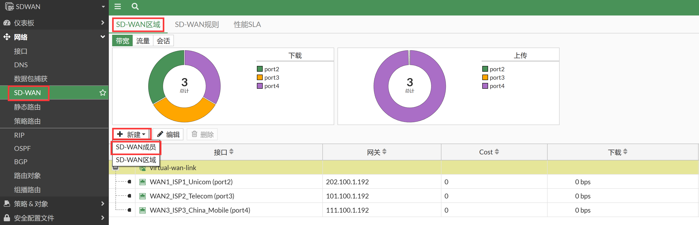
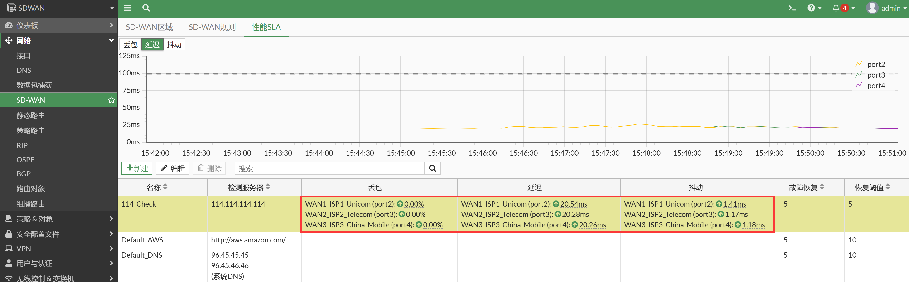
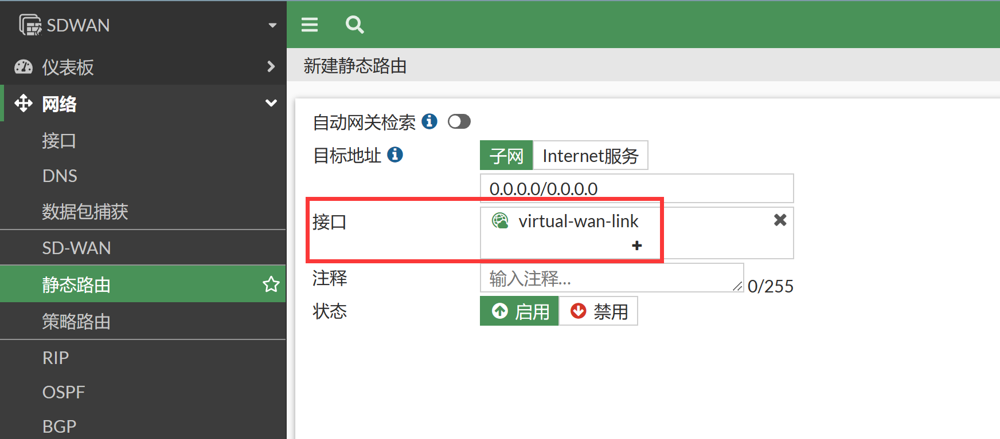
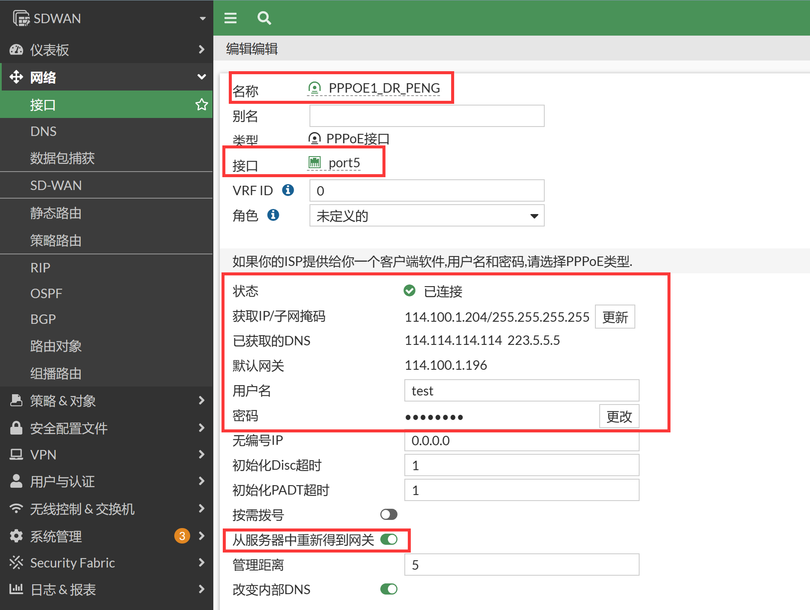
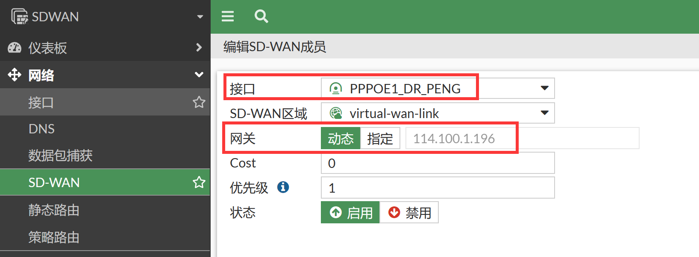
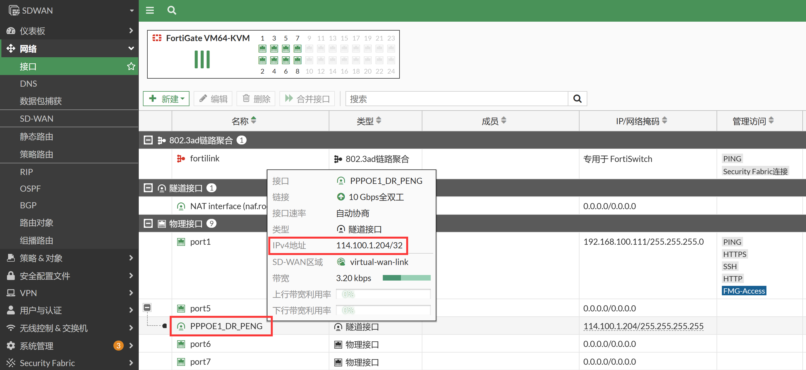
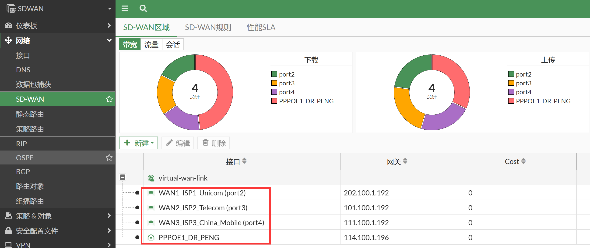

# SD-WAN接口成员组

## 静态IP接口成员配置

1. 进入网络→SD-WAN→SD-WAN区域，选择默认的SD-WAN区域（virtual-wan-link）或新建SD-WAN区域。

2. 点击新建→SD-WAN成员，将想要加入SD-WAN成员的接口依次加入SD-WAN区域。

   

3. 对应CLI：

   ```
   SDWAN # config system sdwan 
   SDWAN (sdwan) # config members 
   SDWAN (members) # show
   config members
       edit 1
           set interface "port2"
           set zone "virtual-wan-link"
           set gateway 202.100.1.192
           set source 0.0.0.0
           set gateway6 ::
           set source6 ::
           set cost 0
           set priority 1
           set priority6 1024
           set status enable
           set comment ''
       next
       edit 2
           set interface "port3"
           set zone "virtual-wan-link"
           set gateway 101.100.1.192
           set source 0.0.0.0
           set gateway6 ::
           set source6 ::
           set cost 0
           set priority 1
           set priority6 1024
           set status enable
           set comment ''
       next
       edit 3
           set interface "port4"
           set zone "virtual-wan-link"
           set gateway 111.100.1.192
           set source 0.0.0.0
           set gateway6 ::
           set source6 ::
           set cost 0
           set priority 1
           set priority6 1024
           set status enable
           set comment ''
       next
   end
   ```

### 参数说明

1. set gateway 202.100.1.192：

   - 作用1：这个参数会被用在SD-WAN健康检查目的IP的下一跳地址，比如我们检测114.114.114.114的SD-WAN健康检查，实际后台会在内核下发去往114.114.114.114的明细路由，以便port2/port3/Port13可以各自发起去往114.114.114.114的探测报文。
   
     
   
     ```
     SDWAN # get router info kernel | grep 114.114.114.114
     tab=254 vf=0 scope=0 type=1 proto=17 prio=0 111.100.1.10/255.255.255.255/0->114.114.114.114/32 pref=0.0.0.0 gwy=111.100.1.192 dev=6(port4)
     tab=254 vf=0 scope=0 type=1 proto=17 prio=0 101.100.1.10/255.255.255.255/0->114.114.114.114/32 pref=0.0.0.0 gwy=101.100.1.192 dev=5(port3)
     tab=254 vf=0 scope=0 type=1 proto=17 prio=0 202.100.1.10/255.255.255.255/0->114.114.114.114/32 pref=0.0.0.0 gwy=202.100.1.192 dev=4(port2)
     
     # get router info routing-table  all | grep 114.114.114.114
     ```
   
     路由表是看不到114.114.114.114的路由的，而这个kernel路由的gwy地址就是在sd-wan接口成员组中所配置的gateway所得来的。
   
   - 作用2：配置SD-WAN的路由的时候，也会借用SD-WAN接口组的网关作为SD-WAN路由的下一跳IP。
   
     
   
     对应CLI：
   
     ```
     config router static
         edit 1
             set distance 1
             set sdwan-zone "virtual-wan-link"
         next
     end
     ```
   
     静态路由借用下一跳SD-WAN接口成员组里下一跳IP的效果：
   
     ```
     SDWAN # get router info routing-table all
     ...
     S*      0.0.0.0/0 [1/0] via 101.100.1.192, port3, [1/0]
                       [1/0] via 111.100.1.192, port4, [1/0]
                       [1/0] via 202.100.1.192, port2, [1/0]
     ...
     ```

## 动态IP接口成员配置

1. 如果是PPPOE/DHCP这种动态接口，在SD-WAN接口组的时候，通常需要保持set gateway 0.0.0.0，SD-WAN的路由会自动去查找到PPPOE/DHCP接口的动态的默认网关IP地址。

   

   

2. SD-WAN接口成员中的PPPOE接口网关配置为动态，由于PPPOE接口下面的默认参数：defaultgw为enable状态，因此SD-WAN接口成员里面会自动去迭代查询到PPPOE默认路由的真实下一跳IP地址。

   ```
   SDWAN # config system interface
   SDWAN (interface) # edit PPPOE1_DR_PENG
   SDWAN (PPPOE1_DR_PENG) # show
   config system interface
       edit "PPPOE1_DR_PENG"
           set vdom "root"
           set mode pppoe
           set type tunnel
           set snmp-index 13
           set interface "port5"
       next
   end
   
   SDWAN (PPPOE1_DR_PENG) # show full-configuration | grep default
           set defaultgw enable    //默认为enable状态
   ```

3. 效果：SD-WAN健康检查的内核路由下发会找到PPP接口默认路由的真实下一跳IP。

   ```
   SDWAN # get router info kernel  | grep 114.114.114.114
   tab=254 vf=0 scope=0 type=1 proto=17 prio=0 114.100.1.204/255.255.255.255/0->114.114.114.114/32 pref=0.0.0.0 gwy=114.100.1.196 dev=19(PPP)
   tab=254 vf=0 scope=0 type=1 proto=17 prio=0 111.100.1.10/255.255.255.255/0->114.114.114.114/32 pref=0.0.0.0 gwy=111.100.1.192 dev=6(port4)
   tab=254 vf=0 scope=0 type=1 proto=17 prio=0 101.100.1.10/255.255.255.255/0->114.114.114.114/32 pref=0.0.0.0 gwy=101.100.1.192 dev=5(port3)
   tab=254 vf=0 scope=0 type=1 proto=17 prio=0 202.100.1.10/255.255.255.255/0->114.114.114.114/32 pref=0.0.0.0 gwy=202.100.1.192 dev=4(port2)
   ```

4. SD-WAN PPPOE接口的静态路由也会自动找到PPP接口默认路由的真实下一跳IP。

   ```
   SDWAN # get router info routing-table all
   ...
   S*      0.0.0.0/0 [1/0] via 101.100.1.192, port3, [1/0]
                     [1/0] via 111.100.1.192, port4, [1/0]
                     [1/0] via 114.100.1.196, PPPOE1_DR_PENG, [1/0]
                     [1/0] via 202.100.1.192, port2, [1/0]
   ...
   ```

5. 补充：PPPOE接口的推荐配置方式（只能命令行配置）。

   ```
   config system pppoe-interface
       edit "PPPOE1_DR_PENG"
           set device "port5"
           set username "test"
           set password ENC yPSGPPFbTeo7o9/FjjzgRe9vBUUkYXXXHxKlvsLj3Gk9cgS88ik8ifl5yhclIvjJ0XRAJGW5A4PqL3nczbmg/FgLTJCad4OmtjBuly1fjdwcdODr=
       next
   end
   ```

   然后会自动产生“PPPOE1_DR_PENG”接口：

   ```
   config system interface
       edit "PPPOE1_DR_PENG"
           set vdom "root"
           set mode pppoe
           set type tunnel
           set snmp-index 13
           set interface "port5"
       next
   end
   
   SDWAN (PPPOE1_DR_PENG) # show full-configuration | grep def
           set defaultgw enable
   ```

   

### 参数说明

1. set source 0.0.0.0：SD-WAN健康监控的源IP会借用set source里面设置的IP，默认为0.0.0.0，则是选择SD-WAN接口的主IP作为源IP进行发送健康检查探测报文。

   > IPsec VPN隧道、GRE隧道等VPN接口默认情况下接口是没有IP地址的，进行SD-WAN健康监控探测的时候默认是没有办法发送探测报文的，这种情况下监控检测会失败的。
   >
   > 解决办法：
   >
   > - 给VPN隧道接口配置上IP地址（推荐）。
   >
   > - 在SD-WAN接口成员配置的时候，命令行添加 set source ip，手工给没有IP的隧道指定一个IP地址，用于sd-wan监控检测发送探测包的源IP地址。

2. set cost 0：用在 “Lowest Cost & Maximize Bandwidth (SLA) rules”里面。用于SD-WAN算法中的出接口选择使用。具体可见[SD-WAN健康状态检查](.\SD-WAN健康状态检查.md)章节。

3. set priority 0：和静态路由中的priority参数一致，用于浮动静态路由时候，让备份的路由也存在于路由表，但是不用于出接口流量的路由转发，效果如下：

   ```
   SDWAN # config system sdwan 
   SDWAN (sdwan) # config members
   SDWAN (members) # show
   config members
       edit 1
           set interface "port2"
           set gateway 202.100.1.192
       next
       edit 2
           set interface "port3"
           set gateway 101.100.1.192
       next
       edit 3
           set interface "port4"
           set gateway 111.100.1.192
       next
       edit 4
           set interface "PPPOE1_DR_PENG"
       next
   end
   
   SDWAN (members) # edit 2
   SDWAN (2) # set priority 100
   SDWAN (2) # next
   
   SDWAN (members) # show
   config members
       edit 1
           set interface "port2"
           set gateway 202.100.1.192
       next
       edit 2
           set interface "port3"
           set gateway 101.100.1.192
           set priority 100
       next
       edit 3
           set interface "port4"
           set gateway 111.100.1.192
       next
       edit 4
           set interface "PPPOE1_DR_PENG"
       next
   end
   
   SDWAN (members) # end
   SDWAN (sdwan) # end
   ```

   当没匹配到SD-WAN自定义规则（策略路由），同时有存在SD-WAN的默认路由的时候，就会去匹配SD-WAN的负载路由（最后一条隐藏默认SD-WAN规则），这时候priority参数会生效（priority效果和普通路由一致）。port3的路由priority是100，此路由存在于路由表中，但是不用于出方向的路由转发（策略路由可以使用此路由），仅仅存在路由表中，以便入方向的RPF（反向路径检测）可以正常工作。

   ```
   SDWAN # get router info routing-table all
   ...
   S*      0.0.0.0/0 [1/0] via 111.100.1.192, port4, [1/0]
                     [1/0] via 114.100.1.196, PPPOE1_DR_PENG, [1/0]
                     [1/0] via 202.100.1.192, port2, [1/0]
                     [1/0] via 101.100.1.192, port3, [100/0]     //priority为100，对于出方向的策略路由是生效的，不用于出方向的FIB路由的转发。可以解决入方向的RPF问题
   ...
   ```

## 成员序号与接口index的关系

1. 查看SD-WAN成员的序号。

   

   ```
   config system sdwan
       set status enable
       config zone
           edit "virtual-wan-link"
           next
       end
       config members
           edit 1
               set interface "port2"
               set gateway 202.100.1.192
           next
           edit 2
               set interface "port3"
               set gateway 101.100.1.192
               set priority 100
           next
           edit 3
               set interface "port4"
               set gateway 111.100.1.192
           next
           edit 4
               set interface "PPPOE1_DR_PENG"
           next
       end
       
   SDWAN # diagnose sys sdwan member    //SD-WAN接口组成员
   Member(1): interface: port2, flags=0x0 , gateway: 202.100.1.192, priority: 1 1024, weight: 0
   Member(2): interface: port3, flags=0x0 , gateway: 101.100.1.192, priority: 100 1024, weight: 0
   Member(3): interface: port4, flags=0x0 , gateway: 111.100.1.192, priority: 1 1024, weight: 0
   Member(4): interface: PPPOE1_DR_PENG, flags=0x8 , gateway: 114.100.1.196, priority: 1 1024, weight: 0
   ```

2. 在SD-WAN SLA监控中查看SD-WAN成员序号。

   ```
   SDWAN # diagnose sys sdwan health-check status    //SD-WAN健康检查
   Health Check(114_Check): 
   Seq(1 port2): state(alive), packet-loss(0.000%) latency(20.472), jitter(0.790), bandwidth-up(9999999), bandwidth-dw(9999999), bandwidth-bi(19999998) sla_map=0x1
   Seq(2 port3): state(alive), packet-loss(0.000%) latency(20.289), jitter(0.750), bandwidth-up(9999999), bandwidth-dw(9999999), bandwidth-bi(19999998) sla_map=0x1
   Seq(3 port4): state(alive), packet-loss(0.000%) latency(20.199), jitter(0.746), bandwidth-up(9999999), bandwidth-dw(9999999), bandwidth-bi(19999998) sla_map=0x1
   Seq(4 PPPOE1_DR_PENG): state(alive), packet-loss(0.000%) latency(20.371), jitter(0.861), bandwidth-up(9999999), bandwidth-dw(9999999), bandwidth-bi(19999998) sla_map=0x1
   ```

3. 在SD-WAN规则中查看SD-WAN成员序号。

   ```
   SDWAN # diagnose sys sdwan service 1    
   
   Service(1): Address Mode(IPV4) flags=0x260 use-shortcut-sla
     Gen(1), TOS(0x0/0x0), Protocol(0: 1->65535), Mode(priority), link-cost-factor(latency), link-cost-threshold(10), heath-check(114_Check)
     Members(4): 
       1: Seq_num(1 port2), alive, latency: 21.736, selected
       2: Seq_num(4 PPPOE1_DR_PENG), alive, latency: 21.599, selected
       3: Seq_num(2 port3), alive, latency: 21.524, selected
       4: Seq_num(3 port4), alive, latency: 21.507, selected
     Internet Service(1): Microsoft-Office365(327782,0,0,0) 
     Src address(1): 
           192.168.1.0-192.168.1.255
   ```

4. 查看策略路由中对应的service 1的条目，记录其中的oif参数。

   ```
   SDWAN # diag firewall proute list
   list route policy info(vf=root):
   
   id=2097676289(0x7d080001) vwl_service=1(OFFICE_365) vwl_mbr_seq=1 4 2 3 dscp_tag=0xff 0xff flags=0x0 tos=0x00 tos_mask=0x00 protocol=0 sport=0-65535 iif=0(any) dport=1-65535 path(4) oif=4(port2) gwy=202.100.1.192 oif=19(PPPOE1_DR_PENG) gwy=114.100.1.196 ot
   source(1): 192.168.1.0-192.168.1.255 
   destination wildcard(1): 0.0.0.0/0.0.0.0 
   internet service(1): Microsoft-Office365(327782,0,0,0) 
   hit_count=0 last_used=2023-01-03 00:00:13
   ```

5. 查看接口索引与具体接口的对应关系。

   ```
   SDWAN # diag ip address list
   ...
   IP=202.100.1.10->202.100.1.10/255.255.255.0 index=4 devname=port2
   IP=101.100.1.10->101.100.1.10/255.255.255.0 index=5 devname=port3
   IP=111.100.1.10->111.100.1.10/255.255.255.0 index=6 devname=port4
   ...
   IP=114.100.1.204->114.100.1.196/255.255.255.255 index=19 devname=PPPOE1_DR_PENG
   ```

6. 综上所述可以得出SD-WAN接口组成员序号与各个功能模块里面的接口调用关系。

   ```
   接口索引 4     --- 对应 port2 ---对应SD-WAN接口成员组序号1
   接口索引 5    --- 对应 port3 ---对应SD-WAN接口成员组序号2
   接口索引 6  --- 对应 port4 ---对应SD-WAN接口成员组序号3
   接口索引 19  --- 对应 PPPOE1_DR_PENG ---对应SD-WAN接口成员组序号4
   ```

## 其他

1. 统计SD-WAN成员接口最近10分钟流量的命令。

   ```
   SDWAN # diagnose sys sdwan intf-sla-log port2
   Timestamp: Tue Jan  3 01:04:04 2023, used inbandwidth: 877bps, used outbandwidth: 877bps, used bibandwidth: 1754bps, tx bytes: 422346bytes, rx bytes: 422106bytes.
   Timestamp: Tue Jan  3 01:04:14 2023, used inbandwidth: 877bps, used outbandwidth: 877bps, used bibandwidth: 1754bps, tx bytes: 423468bytes, rx bytes: 423228bytes.
   Timestamp: Tue Jan  3 01:04:24 2023, used inbandwidth: 877bps, used outbandwidth: 877bps, used bibandwidth: 1754bps, tx bytes: 424590bytes, rx bytes: 424350bytes.
   Timestamp: Tue Jan  3 01:04:34 2023, used inbandwidth: 884bps, used outbandwidth: 884bps, used bibandwidth: 1768bps, tx bytes: 425712bytes, rx bytes: 425472bytes.
   Timestamp: Tue Jan  3 01:04:44 2023, used inbandwidth: 875bps, used outbandwidth: 884bps, used bibandwidth: 1759bps, tx bytes: 426792bytes, rx bytes: 426498bytes.
   Timestamp: Tue Jan  3 01:04:54 2023, used inbandwidth: 882bps, used outbandwidth: 882bps, used bibandwidth: 1764bps, tx bytes: 427860bytes, rx bytes: 427620bytes.
   Timestamp: Tue Jan  3 01:05:04 2023, used inbandwidth: 875bps, used outbandwidth: 875bps, used bibandwidth: 1750bps, tx bytes: 428940bytes, rx bytes: 428700bytes.
   Timestamp: Tue Jan  3 01:05:14 2023, used inbandwidth: 882bps, used outbandwidth: 882bps, used bibandwidth: 1764bps, tx bytes: 430104bytes, rx bytes: 429864bytes.
   Timestamp: Tue Jan  3 01:05:24 2023, used inbandwidth: 875bps, used outbandwidth: 875bps, used bibandwidth: 1750bps, tx bytes: 431184bytes, rx bytes: 430944bytes.
   Timestamp: Tue Jan  3 01:05:34 2023, used inbandwidth: 890bps, used outbandwidth: 882bps, used bibandwidth: 1772bps, tx bytes: 432306bytes, rx bytes: 432066bytes.
   Timestamp: Tue Jan  3 01:05:44 2023, used inbandwidth: 884bps, used outbandwidth: 884bps, used bibandwidth: 1768bps, tx bytes: 433386bytes, rx bytes: 433146bytes.
   Timestamp: Tue Jan  3 01:05:54 2023, used inbandwidth: 890bps, used outbandwidth: 890bps, used bibandwidth: 1780bps, tx bytes: 434508bytes, rx bytes: 434268bytes.
   Timestamp: Tue Jan  3 01:06:04 2023, used inbandwidth: 884bps, used outbandwidth: 884bps, used bibandwidth: 1768bps, tx bytes: 435630bytes, rx bytes: 435390bytes.
   Timestamp: Tue Jan  3 01:06:14 2023, used inbandwidth: 890bps, used outbandwidth: 890bps, used bibandwidth: 1780bps, tx bytes: 436752bytes, rx bytes: 436512bytes.
   Timestamp: Tue Jan  3 01:06:24 2023, used inbandwidth: 884bps, used outbandwidth: 884bps, used bibandwidth: 1768bps, tx bytes: 437832bytes, rx bytes: 437592bytes.
   Timestamp: Tue Jan  3 01:06:34 2023, used inbandwidth: 890bps, used outbandwidth: 890bps, used bibandwidth: 1780bps, tx bytes: 438954bytes, rx bytes: 438714bytes.
   Timestamp: Tue Jan  3 01:06:44 2023, used inbandwidth: 884bps, used outbandwidth: 884bps, used bibandwidth: 1768bps, tx bytes: 440034bytes, rx bytes: 439794bytes.
   Timestamp: Tue Jan  3 01:06:54 2023, used inbandwidth: 890bps, used outbandwidth: 890bps, used bibandwidth: 1780bps, tx bytes: 441198bytes, rx bytes: 440958bytes.
   Timestamp: Tue Jan  3 01:07:04 2023, used inbandwidth: 884bps, used outbandwidth: 884bps, used bibandwidth: 1768bps, tx bytes: 442278bytes, rx bytes: 442038bytes.
   Timestamp: Tue Jan  3 01:07:14 2023, used inbandwidth: 890bps, used outbandwidth: 892bps, used bibandwidth: 1782bps, tx bytes: 443412bytes, rx bytes: 443160bytes.
   Timestamp: Tue Jan  3 01:07:24 2023, used inbandwidth: 884bps, used outbandwidth: 884bps, used bibandwidth: 1768bps, tx bytes: 444480bytes, rx bytes: 444240bytes.
   Timestamp: Tue Jan  3 01:07:34 2023, used inbandwidth: 884bps, used outbandwidth: 884bps, used bibandwidth: 1768bps, tx bytes: 445560bytes, rx bytes: 445320bytes.
   Timestamp: Tue Jan  3 01:07:44 2023, used inbandwidth: 884bps, used outbandwidth: 884bps, used bibandwidth: 1768bps, tx bytes: 446724bytes, rx bytes: 446484bytes.
   Timestamp: Tue Jan  3 01:07:54 2023, used inbandwidth: 884bps, used outbandwidth: 884bps, used bibandwidth: 1768bps, tx bytes: 447804bytes, rx bytes: 447564bytes.
   Timestamp: Tue Jan  3 01:08:04 2023, used inbandwidth: 890bps, used outbandwidth: 888bps, used bibandwidth: 1778bps, tx bytes: 448968bytes, rx bytes: 448728bytes.
   Timestamp: Tue Jan  3 01:08:14 2023, used inbandwidth: 890bps, used outbandwidth: 890bps, used bibandwidth: 1780bps, tx bytes: 450048bytes, rx bytes: 449808bytes.
   Timestamp: Tue Jan  3 01:08:24 2023, used inbandwidth: 904bps, used outbandwidth: 904bps, used bibandwidth: 1808bps, tx bytes: 451212bytes, rx bytes: 450972bytes.
   Timestamp: Tue Jan  3 01:08:34 2023, used inbandwidth: 890bps, used outbandwidth: 890bps, used bibandwidth: 1780bps, tx bytes: 452292bytes, rx bytes: 452052bytes.
   Timestamp: Tue Jan  3 01:08:44 2023, used inbandwidth: 897bps, used outbandwidth: 897bps, used bibandwidth: 1794bps, tx bytes: 453414bytes, rx bytes: 453174bytes.
   Timestamp: Tue Jan  3 01:08:54 2023, used inbandwidth: 890bps, used outbandwidth: 890bps, used bibandwidth: 1780bps, tx bytes: 454536bytes, rx bytes: 454296bytes.
   Timestamp: Tue Jan  3 01:09:04 2023, used inbandwidth: 897bps, used outbandwidth: 897bps, used bibandwidth: 1794bps, tx bytes: 455658bytes, rx bytes: 455418bytes.
   Timestamp: Tue Jan  3 01:09:14 2023, used inbandwidth: 884bps, used outbandwidth: 884bps, used bibandwidth: 1768bps, tx bytes: 456738bytes, rx bytes: 456498bytes.
   Timestamp: Tue Jan  3 01:09:24 2023, used inbandwidth: 890bps, used outbandwidth: 890bps, used bibandwidth: 1780bps, tx bytes: 457860bytes, rx bytes: 457620bytes.
   Timestamp: Tue Jan  3 01:09:34 2023, used inbandwidth: 890bps, used outbandwidth: 890bps, used bibandwidth: 1780bps, tx bytes: 458982bytes, rx bytes: 458742bytes.
   Timestamp: Tue Jan  3 01:09:44 2023, used inbandwidth: 884bps, used outbandwidth: 884bps, used bibandwidth: 1768bps, tx bytes: 460062bytes, rx bytes: 459822bytes.
   Timestamp: Tue Jan  3 01:09:54 2023, used inbandwidth: 890bps, used outbandwidth: 890bps, used bibandwidth: 1780bps, tx bytes: 461226bytes, rx bytes: 460986bytes.
   Timestamp: Tue Jan  3 01:10:04 2023, used inbandwidth: 890bps, used outbandwidth: 890bps, used bibandwidth: 1780bps, tx bytes: 462306bytes, rx bytes: 462066bytes.
   Timestamp: Tue Jan  3 01:10:14 2023, used inbandwidth: 890bps, used outbandwidth: 890bps, used bibandwidth: 1780bps, tx bytes: 463428bytes, rx bytes: 463188bytes.
   Timestamp: Tue Jan  3 01:10:24 2023, used inbandwidth: 882bps, used outbandwidth: 882bps, used bibandwidth: 1764bps, tx bytes: 464496bytes, rx bytes: 464256bytes.
   Timestamp: Tue Jan  3 01:10:34 2023, used inbandwidth: 880bps, used outbandwidth: 888bps, used bibandwidth: 1768bps, tx bytes: 465618bytes, rx bytes: 465324bytes.
   Timestamp: Tue Jan  3 01:10:44 2023, used inbandwidth: 866bps, used outbandwidth: 875bps, used bibandwidth: 1741bps, tx bytes: 466698bytes, rx bytes: 466404bytes.
   Timestamp: Tue Jan  3 01:10:54 2023, used inbandwidth: 873bps, used outbandwidth: 882bps, used bibandwidth: 1755bps, tx bytes: 467820bytes, rx bytes: 467526bytes.
   Timestamp: Tue Jan  3 01:11:04 2023, used inbandwidth: 873bps, used outbandwidth: 882bps, used bibandwidth: 1755bps, tx bytes: 468942bytes, rx bytes: 468648bytes.
   Timestamp: Tue Jan  3 01:11:14 2023, used inbandwidth: 873bps, used outbandwidth: 890bps, used bibandwidth: 1763bps, tx bytes: 470064bytes, rx bytes: 469716bytes.
   Timestamp: Tue Jan  3 01:11:24 2023, used inbandwidth: 875bps, used outbandwidth: 884bps, used bibandwidth: 1759bps, tx bytes: 471144bytes, rx bytes: 470796bytes.
   Timestamp: Tue Jan  3 01:11:34 2023, used inbandwidth: 888bps, used outbandwidth: 897bps, used bibandwidth: 1785bps, tx bytes: 472308bytes, rx bytes: 471960bytes.
   Timestamp: Tue Jan  3 01:11:44 2023, used inbandwidth: 882bps, used outbandwidth: 890bps, used bibandwidth: 1772bps, tx bytes: 473388bytes, rx bytes: 473040bytes.
   Timestamp: Tue Jan  3 01:11:54 2023, used inbandwidth: 882bps, used outbandwidth: 890bps, used bibandwidth: 1772bps, tx bytes: 474510bytes, rx bytes: 474162bytes.
   Timestamp: Tue Jan  3 01:12:04 2023, used inbandwidth: 890bps, used outbandwidth: 890bps, used bibandwidth: 1780bps, tx bytes: 475632bytes, rx bytes: 475284bytes.
   Timestamp: Tue Jan  3 01:12:14 2023, used inbandwidth: 890bps, used outbandwidth: 890bps, used bibandwidth: 1780bps, tx bytes: 476712bytes, rx bytes: 476364bytes.
   Timestamp: Tue Jan  3 01:12:24 2023, used inbandwidth: 884bps, used outbandwidth: 884bps, used bibandwidth: 1768bps, tx bytes: 477834bytes, rx bytes: 477486bytes.
   Timestamp: Tue Jan  3 01:12:34 2023, used inbandwidth: 890bps, used outbandwidth: 890bps, used bibandwidth: 1780bps, tx bytes: 478956bytes, rx bytes: 478608bytes.
   Timestamp: Tue Jan  3 01:12:44 2023, used inbandwidth: 890bps, used outbandwidth: 890bps, used bibandwidth: 1780bps, tx bytes: 480078bytes, rx bytes: 479730bytes.
   Timestamp: Tue Jan  3 01:12:54 2023, used inbandwidth: 884bps, used outbandwidth: 884bps, used bibandwidth: 1768bps, tx bytes: 481158bytes, rx bytes: 480810bytes.
   Timestamp: Tue Jan  3 01:13:04 2023, used inbandwidth: 890bps, used outbandwidth: 890bps, used bibandwidth: 1780bps, tx bytes: 482280bytes, rx bytes: 481932bytes.
   Timestamp: Tue Jan  3 01:13:14 2023, used inbandwidth: 890bps, used outbandwidth: 890bps, used bibandwidth: 1780bps, tx bytes: 483402bytes, rx bytes: 483054bytes.
   Timestamp: Tue Jan  3 01:13:24 2023, used inbandwidth: 884bps, used outbandwidth: 884bps, used bibandwidth: 1768bps, tx bytes: 484482bytes, rx bytes: 484134bytes.
   Timestamp: Tue Jan  3 01:13:34 2023, used inbandwidth: 884bps, used outbandwidth: 884bps, used bibandwidth: 1768bps, tx bytes: 485604bytes, rx bytes: 485256bytes.
   Timestamp: Tue Jan  3 01:13:44 2023, used inbandwidth: 890bps, used outbandwidth: 892bps, used bibandwidth: 1782bps, tx bytes: 486738bytes, rx bytes: 486378bytes.
   Timestamp: Tue Jan  3 01:13:54 2023, used inbandwidth: 884bps, used outbandwidth: 884bps, used bibandwidth: 1768bps, tx bytes: 487806bytes, rx bytes: 487458bytes.
   Timestamp: Tue Jan  3 01:14:04 2023, used inbandwidth: 884bps, used outbandwidth: 884bps, used bibandwidth: 1768bps, tx bytes: 488928bytes, rx bytes: 488580bytes.
   ```
