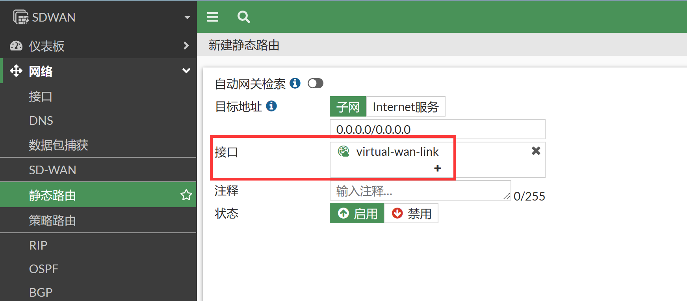

# SD-WAN数据转发逻辑

## SD-WAN规则介绍

1. SD-WAN 规则 = 策略路由 (PBR) ，但是同时SD-WAN rule规则又比策略路由的优先级低一些。


2. SD-WAN 规则和策略路由一样，也是从上往下按照顺序匹配，可以按照特定的算法将指定的数据流转发到相应的出接口上。

   

3. 在命令行下查看SDWAN规则在策略路由中的条目，SD-WAN规则本质为策略路由（ID>7f000001），优先级高于普通FIB路由。

   ```
   SDWAN # diagnose firewall proute list
   list route policy info(vf=root):
   
   id=2131230721(0x7f080001) vwl_service=1(OFFICE_365) vwl_mbr_seq=3 1 2 dscp_tag=0xff 0xff flags=0x0 tos=0x00 tos_mask=0x00 protocol=0 sport=0-65535 iif=0(any) dport=1-65535 path(3) oif=6(port4) oif=4(port2) oif=5(port3) 
   source(1): 192.168.1.0-192.168.1.255 
   destination wildcard(1): 0.0.0.0/0.0.0.0 
   internet service(1): Microsoft-Office365(327782,0,0,0) 
   hit_count=0 last_used=2023-01-02 22:15:18
   
   id=2131230722(0x7f080002) vwl_service=2(Wechat) vwl_mbr_seq=1 2 3 dscp_tag=0xff 0xff flags=0x0 tos=0x00 tos_mask=0x00 protocol=0 sport=0-65535 iif=0(any) dport=1-65535 path(3) oif=4(port2) oif=5(port3) oif=6(port4) 
   source(1): 192.168.1.0-192.168.1.255 
   destination wildcard(1): 0.0.0.0/0.0.0.0 
   internet service(7): WeChat(4294838375,0,0,0, 33760) WeChat_Location.Share(4294838376,0,0,0, 36743) WeChat_Picture.Transfer(4294838377,0,0,0, 36730) WeChat_Video.Transfer(4294838378,0,0,0, 36741) WeChat_Voice.Chat(4294838379,0,0,0, 36742) WeChat_Voip.Call(4294838380,0,0,0, 36648) WeChat_Web(4294838381,0,0,0, 39523) 
   hit_count=0 last_used=2023-01-02 22:17:55
   
   id=2131230723(0x7f080003) vwl_service=3(YOUKU) vwl_mbr_seq=3 1 dscp_tag=0xff 0xff flags=0x0 tos=0x00 tos_mask=0x00 protocol=0 sport=0-65535 iif=0(any) dport=1-65535 path(2) oif=6(port4) oif=4(port2) 
   source(1): 192.168.1.0-192.168.1.255 
   destination wildcard(1): 0.0.0.0/0.0.0.0 
   internet service(2): Youku(4294838550,0,0,0, 16531) Youku_Video(4294838551,0,0,0, 35285) 
   hit_count=0 last_used=2023-01-02 22:20:41
   ```

4. SD-WAN规则的最后面存在一条垫底的默认隐含规则，实际的作用就是当没有匹配到上面SD-WAN规则的数据时，最终将会匹配到这条隐含的规则，隐含规则的本质就是普通的FIB路由表。也就说没有匹配SD-WAN规则的数据将会匹配普通路由表进行转发。

   

5. 没有匹配SD-WAN规则的数据流将查询路由表，在port2/port3/Port13三条默认路由出口上进行负载均衡（默认按源IP方式负载流量）。

   ```
   SDWAN # get router info kernel
   ...
   tab=254 vf=0 scope=0 type=1 proto=11 prio=1 0.0.0.0/0.0.0.0/0->0.0.0.0/0 pref=0.0.0.0
           gwy=101.100.1.192 flag=04 hops=0 oif=5(port3)
           gwy=111.100.1.192 flag=04 hops=0 oif=6(port4)
           gwy=202.100.1.192 flag=04 hops=0 oif=4(port2)
   ...
   
   SDWAN # get router info routing-table  all
   ...
   S*      0.0.0.0/0 [1/0] via 101.100.1.192, port3, [1/0]
                     [1/0] via 111.100.1.192, port4, [1/0]
                     [1/0] via 202.100.1.192, port2, [1/0]
   ...
   ```

## SDWAN工作流程

1. 策略路由、SD-WAN规则、本地路由表的查找与转发逻辑关系：策略路由→SD-WAN规则→本地路由。

   

2. 对比策略路由和SD-WAN规则的工作过程（二者有细微的差别，大部分情况下很相似）。

   

   

## SDWAN规则

1. SD-WAN规则分成两种：

   - 手动自定义的SD-WAN规则：低优先级的策略路由（优先级比普通策略路由低），手工添加的SD-WAN规则则类似支持多出口的动态选择、支持应用控制、支持路由属性等的增强版策略路由，其转发优先级比普通策略路由低，比普通路由优先级高。

   - 最后一条默认的SD-WAN规则：依据LLB的负载方式查询本地静态路由（默认源IP负载），LLB负载支持源IP负载、溢出、会话权重负载、源目IP负载等多种方式，就是旧版本中的WAN LLB功能。

2. 手工自定义配置的SD-WAN规则相当于是一条只配置了出接口但没有配置下一跳地址（下一跳地址为0.0.0.0）的策略路由，因此必须要再次查询一遍路由表才可以找到正确的下一跳地址，如果无法查找到该接口的下一跳地址，自定义的SD-WAN规则也将失效，由此可见SD-WAN规则十分依赖FIB路由表。

   

3. SD-WAN规则这样的处理方式，带来的最大的好处是可以实现SD-WAN出口故障的快速切换，SD-WAN的健康检查完全依赖于这种处理方式。一旦健康检查失败，出接口的静态路由将会消失，SD-WAN将无法在路由表中查找到下一跳地址，因此相应的SD-WAN规则也跟随着会失效，从而实现了SD-WAN的多出口故障的自动切换。

   > 注意：SD-WAN的路由必不可少，否则SD-WAN规则将无法使用。

4. 必须要配置的内容：手工配置默认路由或明细路由指向SD-WAN出口（默认源IP负载），或者使用动态路由协议（OSPF/BGP/RIP）学习到相应的路由，总之路由表中一定要有去往SD-WAN规则中的目的IP的路由才可以。

5. 可以根据需要配置到具体port2/port3/port4分别的路由，也可以直接配置指向SD-WAN接口的路由。

   

   （网关在静态路由中配置）

   或：

   

   （网关在SDWAN成员中配置）

6. 如果SD-WAN是针对去往Internet的负载：则必须配置默认路由指向SD-WAN；如果SD-WAN是针对去往VPN业务网段的负载：则必须配置VPN明细路由指向SD-WAN。默认情况下路由表中需要存在SD-WAN接口的路由，这样SD-WAN规则才可以生效。

   

7. 总结来看：默认情况下， SD-WAN规则由于只能选择出接口而无法直接配置下一跳的IP地址（策略路由可以配置出接口和下一跳IP），因此需要继续通过FIB路由表的查询以便找到正确的下一跳IP地址，才可以将数据转发出去，可以看出SD-WAN规则十分的依赖路由转发表，几乎SD-WAN规则就是依赖FIB路由表而工作的，二者是相互依存的关系。

8. 那么是否可以打破这样的依赖关系呢？是否可以和策略路由一样，SD-WAN规则也可以有一个明确的出接口和下一跳IP，而不需要依赖FIB路由表而找到下一跳IP呢？答案是：有的，虽然我们不推荐这样做，这样不利于多出接口的快速切换。具体的做法如下：

   ```
   SDWAN # config system sdwan 
   SDWAN (sdwan) # config members 
   SDWAN (members) # show
   config members
       edit 1
           set interface "port2"
           set gateway 202.100.1.192
       next
       edit 2
           set interface "port3"
           set gateway 101.100.1.192
       next
       edit 3
           set interface "port4"
           set gateway 111.100.1.192
       next
   end
   SDWAN (members) # end
   
   SDWAN (sdwan) # config service  
   SDWAN (service) # edit 1
   SDWAN (1) # show full-configuration 
   config service
       edit 1
           set name "OFFICE_365"
           set addr-mode ipv4
           set input-device-negate disable
           set mode priority
           set role standalone
           set standalone-action disable
           set tos 0x00
           set tos-mask 0x00
           set src "LAN_192.168.1.0"
           set src-negate disable
           set internet-service enable
           set internet-service-name "Microsoft-Office365"
           set health-check "Default_DNS"
           set link-cost-factor latency
           set link-cost-threshold 10
           set hold-down-time 0
           set dscp-forward disable
           set dscp-reverse disable
           set priority-members 3 1 2
           set status enable
           ***set gateway disable***
           ***set default disable***
           set tie-break zone
           set use-shortcut-sla enable
           set passive-measurement disable
       next
   end
   ```

   如果将SD-WAN规则下面的gateway和default默认状态有disable改成enable，则SD-WAN规则将跳过FIB的查询，直接选择members接口里面配置的下一跳IP作为SDWAN规则（策略路由）的下一跳IP，直接转发流量，而不再查询FIB路由表了。

   ```
   SDWAN # config system sdwan
   SDWAN (sdwan) # config service
   SDWAN (service) # edit 1
   SDWAN (1) # set gateway enable
   SDWAN (1) # set default enable
   SDWAN (1) # end
   SDWAN (sdwan) # end
   ```

   

   > 这种使用场景比较特别，需要将SD-WAN规则固定的从某个出口/下一跳IP出去，而不想要受到底层FIB路由表路由切换的影响（健康检查切换/link-monitor等等），这种使用场景相对来说比较少用到。

9. 默认情况下，本机发出的报文不受SDWAN规则的影响。

## 总结

1. SD-WAN规则可以认为是调用了多个有序出接口（oif）列表的策略路由，但是优先级比普通的策略路由要低一些，oif在策略路由中从左（最优先）到右（最不优先）进行排序。

   ```
   SDWAN # diagnose firewall proute list 
   list route policy info(vf=root):
   
   id=2098397185(0x7d130001) vwl_service=1(OFFICE_365) vwl_mbr_seq=3 1 2 dscp_tag=0xff 0xff flags=0x0 tos=0x00 tos_mask=0x00 protocol=0 sport=0-65535 iif=0(any) dport=1-65535 path(3) oif=6(port4) gwy=111.100.1.192 oif=4(port2) gwy=202.100.1.192 oif=5(port3) gwy=101.100.1.192 default
   source(1): 192.168.1.0-192.168.1.255 
   destination wildcard(1): 0.0.0.0/0.0.0.0 
   internet service(1): Microsoft-Office365(327782,0,0,0) 
   hit_count=0 last_used=2023-01-02 23:10:21
   ```

2. SD-WAN规则的类别（Best Quality, Lowest Cost, Maximize Bandwidth）决定了当SLA检查值（延迟、抖动、丢失）发生变化时，接口列表中的出接口（oif）顺序是如何变化的。

3. 默认情况下，FIB路由表中必须有去往目的IP的路由，这样SD-WAN规则才可以生效，SD-WAN规则的出接口的下一跳是通过FIB路由表查询获取的，因此SD-WAN目的网段的路由非常重要。

   ```
   SDWAN # get router info routing-table  all
   ...
   S*      0.0.0.0/0 [1/0] via 101.100.1.192, port3, [1/0]
                     [1/0] via 111.100.1.192, port4, [1/0]
                     [1/0] via 202.100.1.192, port2, [1/0]
   ...
   ```

4. 如果没有匹配的SD-WAN的策略路由，则路由的决策会基于FIB进行查找（默认是源IP方式的ECMP）。

   

   ```
   # config system sdwan
   # set load-balance-mode ?
   source-ip-based          Source IP load balancing. All traffic from a source IP is sent to the same interface.
   
   weight-based             Weight-based load balancing. Interfaces with higher weights have higher priority and get more traffic.
   
   usage-based              Usage-based load balancing. All traffic is sent to the first interface on the list. When the bandwidth on that interface exceeds the spill-over limit new traffic is sent to the next interface.
   
   source-dest-ip-based     Source and destination IP load balancing. All traffic from a source IP to a destination IP is sent to the same interface.
   
   measured-volume-based    Volume-based load balancing. Traffic is load balanced based on traffic volume (in bytes). More traffic is sent to interfaces with higher volume ratios.
   ```

5. 路由发送改变后（比如出街接口列表重新排序、健康检查失败触发、动态路由协议更新），会话将重新上述CPU进行匹配处理，重新查询策略和路由，这样流量可能会迁移到另一个SD-WAN成员接口上（具体详见[SD-WAN健康状态检查](.\SD-WAN健康状态检查.md)章节）。

6. 有NAT的会话的流量不会随着路由的变化而改变流量的出接口（默认情况下），只有纯三层的流量转发才会正常的进行出接口切换。如下命令行决定了以上特性。

   ```
   SDWAN # config system global 
   SDWAN (global) # show full-configuration | grep snat
       set snat-route-change disable
   ```

7. 在接口下设置会话保持（preserve-session-route）可以允许在路由更改后强制将会话保持在同一个sd-wan成员上，不跟随这出接口的变化而变化已有流量会话的出接口信息。

   ```
   SDWAN # config system interface
   SDWAN (interface) # edit port2
   SDWAN (port2) # set preserve-session-route enable 
   SDWAN (port2) # end
   ```
