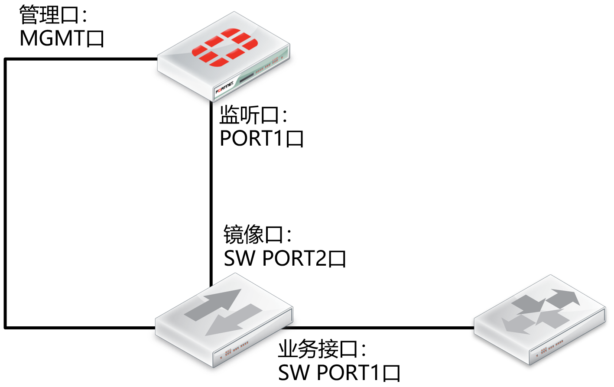
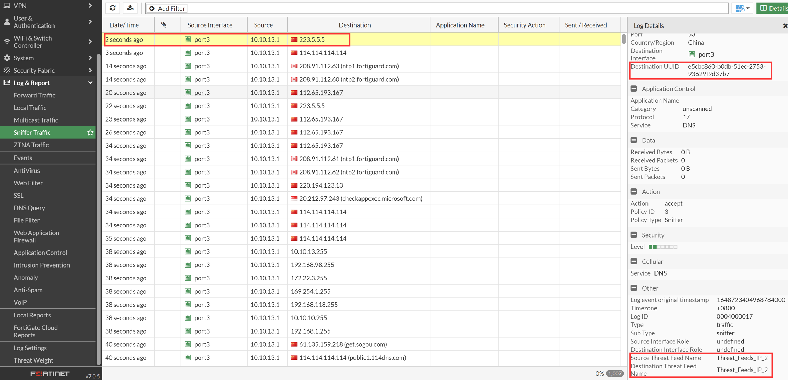

# 旁路模式典型案例

## 组网需求

有时客户为了保证重要业务连续不中断，且避免引入新的单点故障点：

- 需采用旁路部署的方式部署防火墙
- 启用防火墙的UTM功能，对防病毒、IPS等安全事件进行检测及记录

## 网络拓扑



## 配置要点

- 交换机配置（根据实际情况进行配置，建议由客户方维护人员进行配置）：配置sw G1/0为镜像口，将sw1口上下行流量镜像到sw2口
- 防火墙配置：
  - 配置接口，开启port1的sniffer模式，让port1口可以对收到的数据包进行分析
  - 编辑IPS、防病毒 规则参数（本文中均以default规则为例）
  - 配置防火墙策略，将IPS、防病毒等规则应用于port1口
  - 开启IPS、防病毒等日志

## 配置步骤

1. 接口启用sniffer模式。

   ```
   FGT #config system interface
   FGT (interface) #edit port1
   FGT (port1) #set ips-sniffer-mode enable
   FGT (port1) #end    
   ```

2. 根据实际情况，编辑相应的UTM规则参数，例如IPS（如default规则）、防病毒（default规则）以及UTM功能日志记录等，具体参数设置，详见UTM安全应用章节。

3. 配置防火墙sniffer策略，将UTM安全策略加载与port1口。

   ```
   FGT # config firewall sniffer
   FGT (sniffer) # edit 1
   FGT (1) # set logtraffic utm                         //记录UTM日志
   FGT (1) set interface "port1"                        //指定port1接口
   FGT (1) set application-list-status enable           //开启应用控制监控
   FGT (1) set application-list "default"               //根据应用控制规则"default"进行记录
   FGT (1) set ips-sensor-status enable                 //开启IPS监控
   FGT (1) set ips-sensor "default"                     //根据IPS规则"default"进行记录
   FGT (1) set av-profile-status enable                 //开启防病毒监控
   FGT (1) set av-profile "AV-flow"                     //根据防病毒规则"AV-flow"进行记录
   FGT (1) set webfilter-profile-status enable          //开启web过滤监控
   FGT (1) set webfilter-profile "flow-monitor-all "    //根据web过滤规则"default"进行记录
   FGT (1) end
   ```

4. 查看配置。

   ```
   FGT # config firewall sniffer                
   FGT (sniffer) # get
   == [ 1 ]  
   FGT (sniffer) # edit 1
   FGT (1) # get
   id                  : 1
   status              : enable
   logtraffic          : utm
   ipv6                : disable
   non-ip              : disable
   interface           : port1
   host                :
   port                :
   protocol            :
   vlan                :
   application-list-status: enable
   application-list    : default
   ips-sensor-status   : enable
   ips-sensor          : default
   av-profile-status   : enable
   av-profile          : default
   webfilter-profile-status: enable
   webfilter-profile   : flow-monitor-all
   spamfilter-profile-status: disable
   dlp-sensor-status   : disable
   ips-dos-status      : disable
   max-packet-count    : 4000
   ```

## 结果验证

进入日志&报表→嗅探流量，进行查看。


