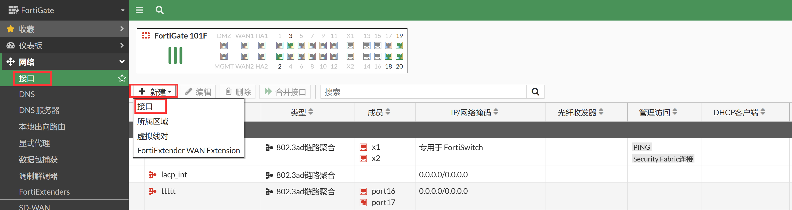
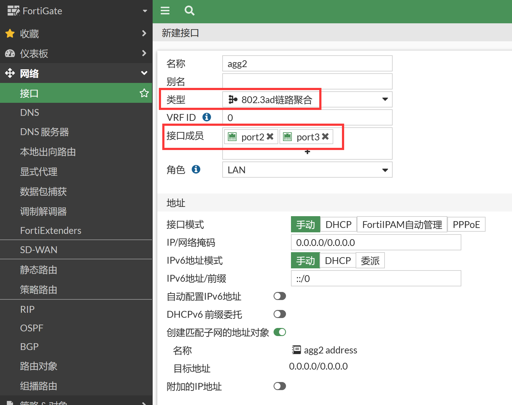
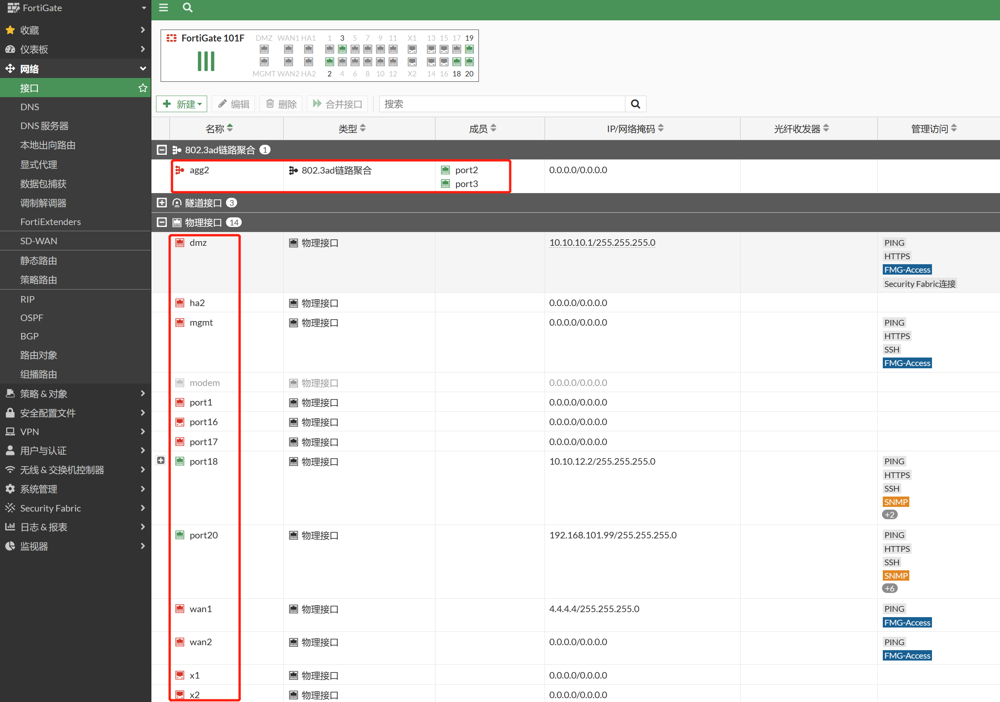

# 端口聚合配置

## LACP应用场景

1. 在带宽比较紧张的情况下，可以通过逻辑聚合可以扩展带宽到原链路的n倍。
2. 在需要对链路进行动态备份的情况下，可以通过配置链路聚合实现同一聚合组各个成员端口之间彼此动态备份。

## LACP模式

LACP的端口可以支持如下几种模式：static（静态），passive，和active：

- 静态：人为配置的聚合组，不允许系统自动添加或删除手工或静态聚合端口。
- passive：被动模式，该模式下端口不会主动发送LACPDU报文，在接收到对端发送的LACP报文后，该端口进入协议计算状态。
- Active：主动模式，该模式下端口会主动向对端发送LACPDU报文，进行LACP协议的计算。

## LACP配置

1. 添加聚合接口，进入网络→接口，新建接口。

   

2. 类型选择802.3ad聚合，选择物理接口成员。

   

   > 注意：建议在不需要的情况下关闭接口配置下的“设备探测”（Device detection）功能，该功能用于MAC地址厂商设备信息识别及MAC地址过滤，会消耗较多的设备资源。

3. 修改LACP的配置（可选）。

   ```
   FortiGate # config system interface
   FortiGate (interface) # edit agg2
   FortiGate (lacp) # set lacp-mode active           //配置LACP协商模式: 主动，被动或者静态，默认为动态
   FortiGate (lacp) # set algorithm L3               //负载均衡算法：L3基于IP地址进行哈希，L4基于四层进行哈希
   FortiGate (lacp) # end
   ```

4. 配置完成后查看配置聚合口配置，对应的物理口在WEB/CLI界面上将消失，不可配置。

   

5. 查看接口的命令行配置。

   ```
   config system interface
       edit "agg2"
           set vdom "root"
           set type aggregate
           set member "port2" "port3"
           set lldp-transmission enable
           set role lan
           set snmp-index 40
           set algorithm L3
       next
   end
   ```

6. 查看LACP接口状态。

   ```
   FGT1-MASTER # diagnose netlink aggregate name agg2
   LACP flags: (A|P)(S|F)(A|I)(I|O)(E|D)(E|D)
   (A|P) - LACP mode is Active or Passive
   (S|F) - LACP speed is Slow or Fast
   (A|I) - Aggregatable or Individual
   (I|O) - Port In sync or Out of sync
   (E|D) - Frame collection is Enabled or Disabled
   (E|D) - Frame distribution is Enabled or Disabled
   
   status: up
   npu: n
   flush: n
   asic helper: y
   ports: 2
   link-up-delay: 50ms
   min-links: 1
   ha: master
   distribution algorithm: L4
   LACP mode: active
   LACP speed: slow
   LACP HA: enable
   aggregator ID: 1
   actor key: 33
   actor MAC address: 50:00:00:03:00:01
   partner key: 1
   partner MAC address: aa:bb:cc:80:a0:00
   
   slave: port9
     index: 0
     link status: up
     link failure count: 0
     permanent MAC addr: 50:00:00:03:00:01
     LACP state: established
     actor state: ASAIEE
     actor port number/key/priority: 1 33 255
     partner state: ASAIEE
     partner port number/key/priority: 1 1 32768
     partner system: 36864 aa:bb:cc:80:a0:00
     aggregator ID: 1
     speed/duplex: 10000 1
     RX state: CURRENT 6
     MUX state: COLLECTING_DISTRIBUTING 4
   
   slave: port10
     index: 1
     link status: up
     link failure count: 0
     permanent MAC addr: 50:00:00:03:00:03
     LACP state: established
     actor state: ASAIEE
     actor port number/key/priority: 2 33 255
     partner state: ASAIEE
     partner port number/key/priority: 2 1 32768
     partner system: 36864 aa:bb:cc:80:a0:00
     aggregator ID: 1
     speed/duplex: 10000 1
     RX state: CURRENT 6
     MUX state: COLLECTING_DISTRIBUTING 4
   ```
