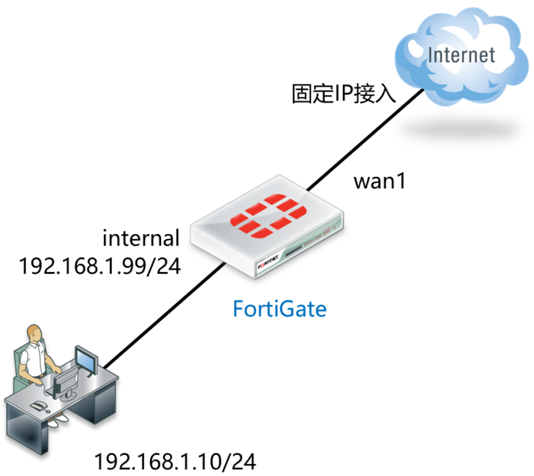
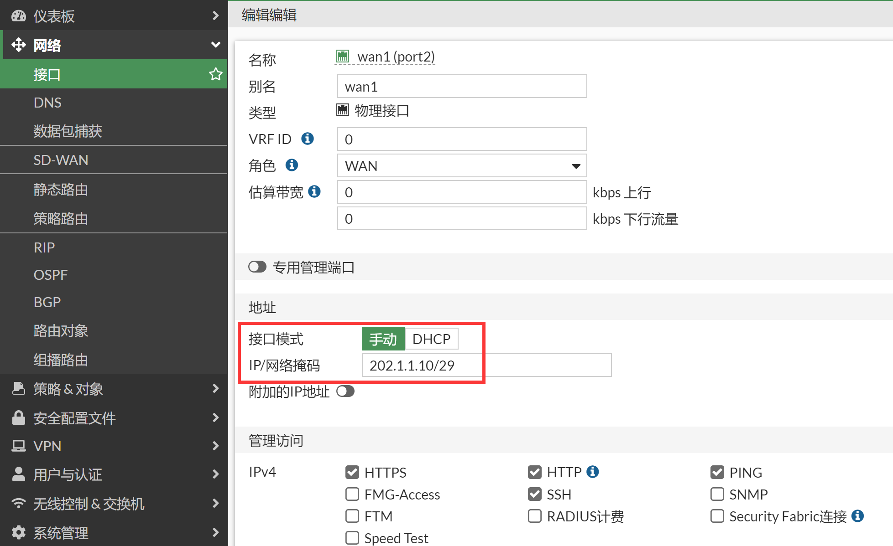
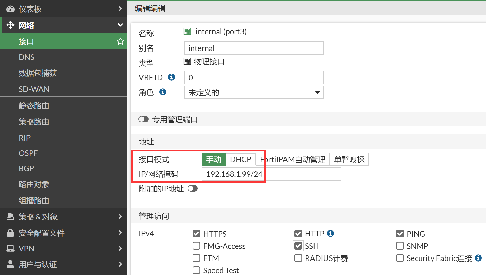
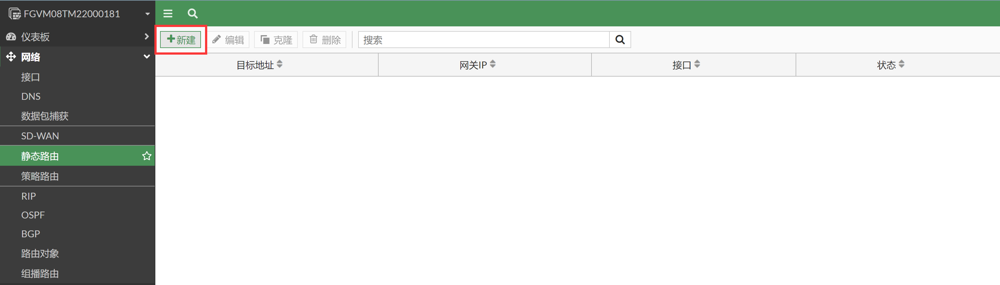
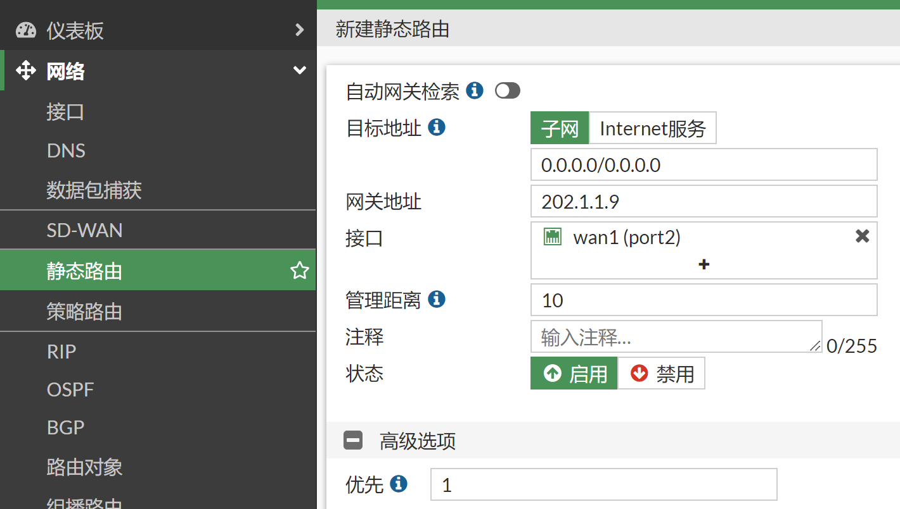
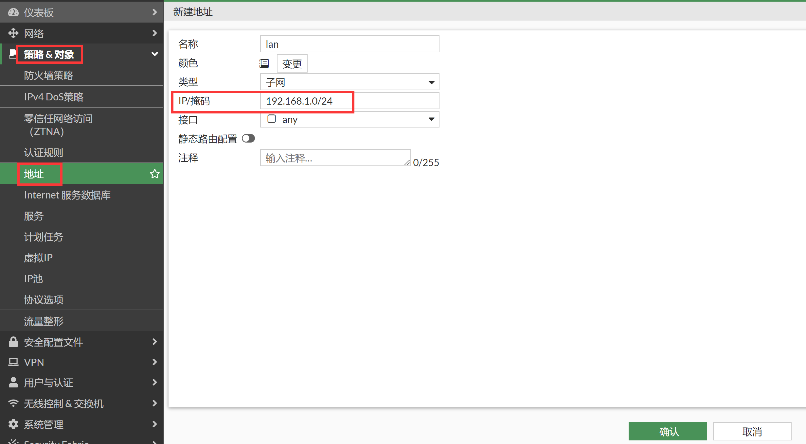
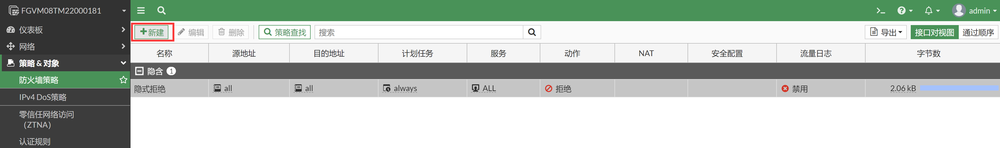
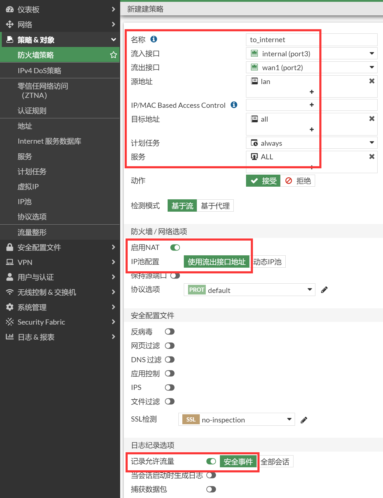

# 静态地址上网配置

## 组网需求

外网接口使用静态IP，由运营商分配指定的静态地址，内网为192.168.1.0/24网段，实现基本上网功能。

## 网络拓扑

假设运营商分配的地址如下，网段：202.1.1.8/29，分配IP地址：202.1.1.10，网关地址：202.1.1.9，DNS：202.106.196.115。

## 配置要点

- 配置接口IP
- wan1口:  IP地址配置为互联网运营商所提供的地址
- internal口:  IP地址设置格式为：192.168.1.99/24，可选择性地开启接口的管理功能
- 配置静态路由表
- 配置地址对象"lan"，内容为192.168.1.0/24
- 配置从internal到wan1口的策略，并开启NAT

## 操作步骤

1. 配置接口IP，进入网络→接口→编辑wan1，对于202.1.1.8/29网段，202.1.1.8为网络地址和202.1.1.15广播地址均不可用，202.1.1.9为运营商网关所用，202.1.1.9~202.1.1.14为可用IP地址范围。所以配置给wan1接口的地址我们选择为202.1.1.10。

   

2. 编辑internal，该接口的默认地址为192.168.1.99/24，根据实际情况更改即可。可选择性地开启接口的管理功能。建议内部开启HTTPS、SSH、PING服务。

   

3. 配置静态路由，进入网络→静态路由，点击新建。

   

4. 新建静态路由。

   - 目的地址：由于是默认网关，使用默认的0.0.0.0/0.0.0.0即可
   - 接口：该路由所关联的接口，wan1口，必须正确填写，否则该路由无法工作
   - 网关：下一跳IP地址，即wan1口对端运营商设备接口的IP地址
   - 管理距离：默认10
   - 高级选项-优先级：默认1

   

5. 配置地址资源，进入策略&对象→地址，新建地址，名称配置为"lan"，地址节点选择子网"192.168.1.0/24"，点击确认。

   

6. 配置防火墙策略（对于某些低端型号，系统会默认配置一条从internal到wan1的NAT策略），进入策略&对象→防火墙策略，点击新建按钮。

   

7. 在新建页面中，按照如下方式配置策略，点击确定按钮后，系统自动保存配置，策略生效。

   - 流入接口：internal
   - 源地址：选择刚才定义的地址对象“lan”
   - 流出接口：wan1
   - 目的地址选择: all，代表所有的地址
   - 时间表：always
   - 服务: ALL
   - 动作：ACCEPT
   - NAT：选择 "启用NAT"， 系统会自动将内网的lan地址段ip，转换为wan1接口地址，进行互联网访问
   - 注意： 启用"记录允许流量（记录流日志）"将会给系统带来额外的资源消耗，所以非必要情况下请不要启用记录日志
   

## 结果验证

将电脑IP地址设置为192.168.1.10/24，网关设置地为192.168.1.99，DNS配置为当地的DNS，电脑可正常上网。
