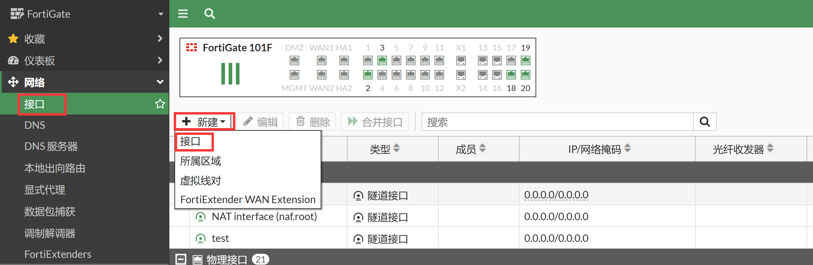
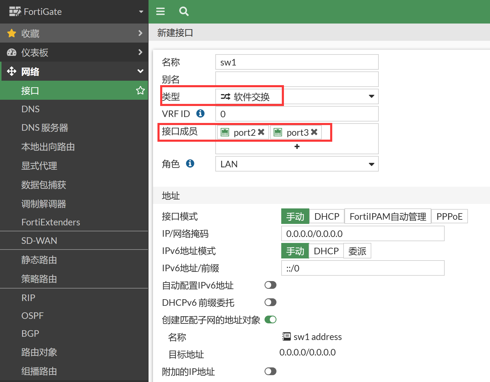
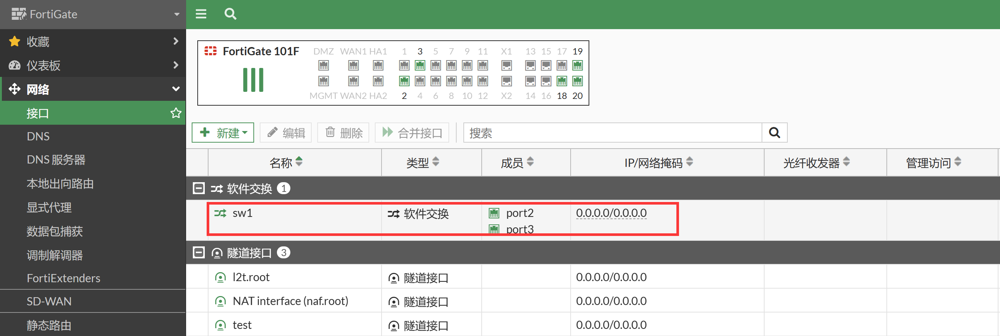

# 软交换配置

## 功能说明

软交换口是将防火墙的多个3层接口，通过软件的方式，组成一个2层交换接口。 当FortiGate的每个口都为3层路由接口时，可以将其中的接口组成软件交换接口。

## 功能配置

1. 添加聚合接口，进入网络→接口，新建接口。

   

2. 类型选择软件交换，选择物理接口成员。

   

   > 注意：建议在不需要的情况下关闭接口配置下的“设备探测”（Device detection）功能，该功能用于MAC地址厂商设备信息识别及MAC地址过滤，会消耗较多的设备资源。

3. 接口配置页面查看建立的软交换口。

   

4. 在命令行查看软交换接口的配置。

   ```
   FortiGate # show full-configuration system switch-interface sw1
   config system switch-interface
       edit "sw1"
           set vdom "root"
           set member "port2" "port3"
           set type switch
           set intra-switch-policy implicit
           set mac-ttl 300
           set span disable
       next
   end
   ```

## 功能限制

1. 软交换口是通过软件的方式模拟出的，需要由CPU处理，无法被ASIC芯片加速，会影响系统的性能，谨慎使用。（部分型号的设备自带硬交换接口，支持硬件加速，如100F）。
2. 低端型号如FG240D等不支持软交换配置。
