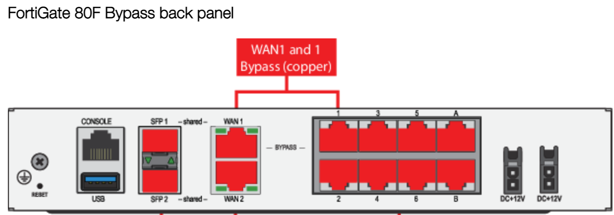
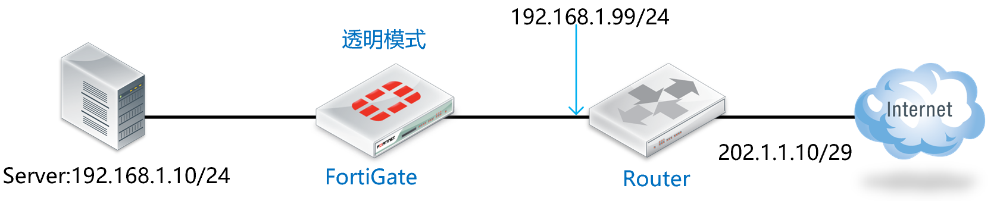

# Bypass部署

## 模式说明

FortiGate部分型号支持Bypass接口，即设备断电后或者重启，依然能够通讯（只能在透明模式下工作）。如下举例设备（80F Bypass），WAN1和internal1接口形成一个Bypass Pair（接口internal1是名为internal的硬件交换接口的一部分。要启用Bypass模式，必须从internal接口中删除internal1）。



> 目前支持Bypass的FortiGate型号包含：400E Bypass、2500E、80F Bypass、800D等。具体可参考：https://docs.fortinet.com/document/fortigate/7.0.8/hardware-acceleration

## 网络拓扑



防火墙工作在透明模式下，开启防病毒功能。使用bypass口，当防火墙故障后，确保链路工作正常。

## 配置要点

- 将防火墙配置为透明模式
- 配置防火墙策略
- 开启旁路模式

## 配置步骤

1. 将防火墙配置为透明模式，进入设备命令行（CLI）中进行配置，将模式修改为"透明模式"同时为设备配置好管理地址和网关。

   ```
   FortiGate-VM64-KVM # config system global
   FortiGate-VM64-KVM (global) # set hostname FortiGate_Transparent
   FortiGate_Transparent (global) # set timezone 55
   FortiGate_Transparent (global) # set language simch
   FortiGate-VM64-KVM (global) # end
   
   FortiGate_Transparent # config system settings
   FortiGate_Transparent (settings) # set opmode transparent    // 修改FGT的运行模式为透明模式，默认为NAT路由模式。，注意切换透明模式防火墙需要防火墙没有相关接口、策略、路由等配置。
   FortiGate_Transparent (settings) # set manageip 192.168.1.100 255.255.255.0    //配置可以管理防火墙的本地IP和网关，以便HTTP/SSH管理防火墙及防火墙的服务更新。
   FortiGate_Transparent (settings) # set gateway 192.168.1.99
   FortiGate_Transparent (settings) # end
   Changing to TP mode
   
   MGMT1或MGMT2口默认有管理权限，以要通过port1（LAN）接口管理设备为例，开启port1（LAN）管理FGT的命令如下：
   FortiGate_Transparent # config system interface
   FortiGate_Transparent (interface) # edit port1
   FortiGate_Transparent (port1) # set allowaccess https http ping ssh    //允许网管协议从Port1接口通过https/http/SSH/Ping访问透明模式的FortiGate
   FortiGate_Transparent (port1) # end
   ```

2. 配置防火墙策略，保证流量可以正常通过FortiGate。

3. 开Bypass模式。

   ```
   config system bypass
   	set bypass-watchdog enable
   	set poweroff-bypass enable
   end
   ```

## 结果验证

将系统断电或重启设备，客户业务不中断。
