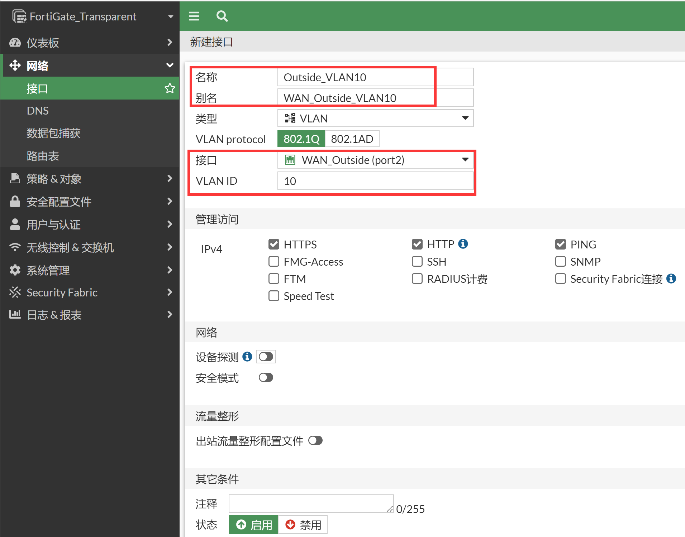
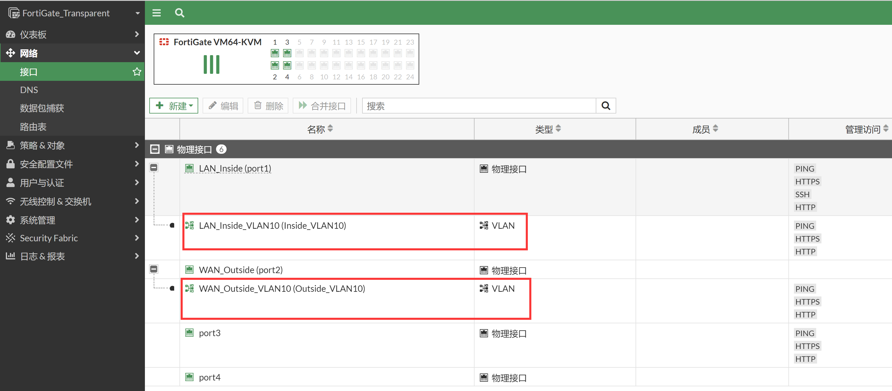
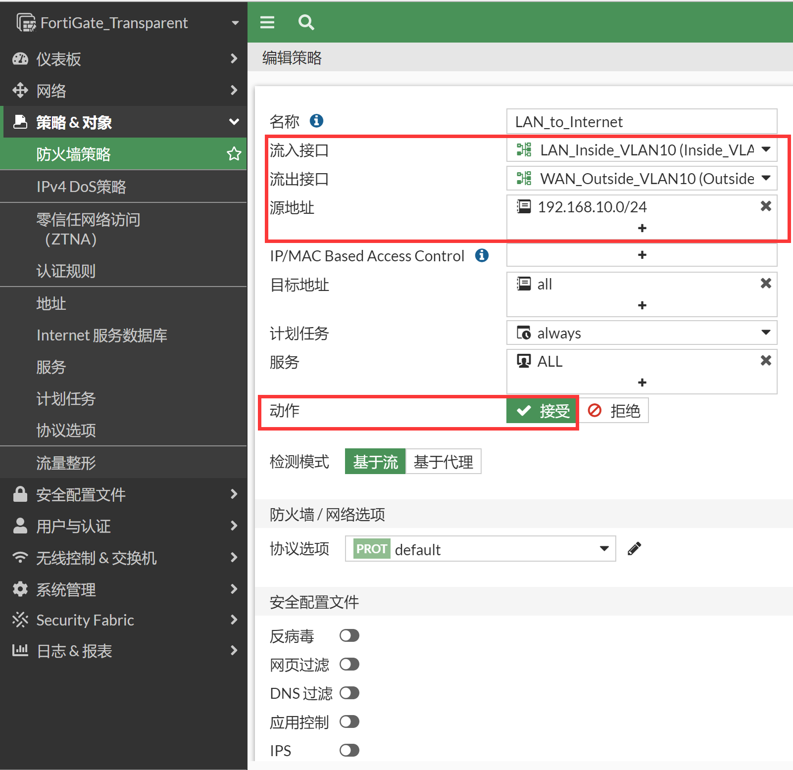
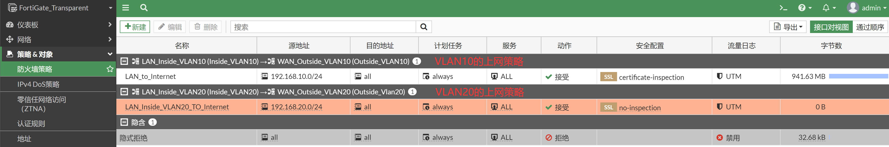

# Forward-Domain(有VLAN的场景建议配上)

## 组网需求

内部网络有两个vlan（trunk环境），网关在路由器上，防火墙工作在透明模式，部署在核心交换与核心路由之间，允许两个vlan访问外网，同时两个vlan之间需要互访，并且对这两个vlan进行保护，开启反病毒过滤。

## 网络拓扑

### 拓扑1：单VLAN透传


### 拓扑2：多VLAN透传，VLAN之间互访


## 配置要点

### 拓扑1：单VLAN透传

- SW交换机/Internet_R路由器的基础配置
- 将防火墙配置为透明模式并开启网管
- 配置LAN和WAN接口的VLAN子接口并加入到forward-domain
- 配置安全策略允许内网PC（VLAN10内主机）访问互联网

### 拓扑2：多VLAN透传，以及VLAN之间互访

- SW交换机/Internet_R路由器的基础配置
- 新增Inside和Outside关于VLAN20的子接口并加入到Forward-domain
- 配置Inside_VLAN20 到 Outside_VLAN20的安全策略允许内网PC（VLAN20内主机）访问互联网
- 配置VLAN10与VLAN20之间互访的策略

## 配置步骤

### 拓扑1：单VLAN透传

1. SW交换机/Internet_R路由器的基础配置（以思科为例）。

   **SW:**

   ```
   SW:
   interface Ethernet0/0
   switchport trunk allowed vlan 1,10
   switchport trunk encapsulation dot1q
   switchport mode trunk
   !
   interface Ethernet0/1
   switchport access vlan 10
   switchport mode access
   !
   ```

   **Router:**
   ```
   Router:
   hostname Internet_R
   !
   interface Ethernet0/0
   ip address 192.168.1.99 255.255.255.0
   no shutdown
   ip nat inside
   !
   interface Ethernet0/0.10
   encapsulation dot1Q 10
   ip address 192.168.10.99 255.255.255.0
   no shutdown
   ip nat inside
   !
   interface Ethernet0/1
   ip address 202.100.1.179 255.255.255.0
   no shutdown
   ip nat outside
   !
   ip route 0.0.0.0 0.0.0.0 202.100.1.192
   !        
   access-list 101 permit ip any any
   ip nat inside source list 101 interface Ethernet0/1 overload
   ```

2. 将防火墙配置为透明模式并开启网管（参考[开启透明模式防火墙并保护上网流量.md](..\开启透明模式防火墙并保护上网流量.md)）。

3. 新建LAN和WAN接口的VLAN10子接口并加入到forward-domain。

   

   

   

   

   > 注意：建议在不需要的情况下关闭接口配置下的“设备探测”（Device detection）功能，该功能用于MAC地址厂商设备信息识别及MAC地址过滤，会消耗较多的设备资源。

4. 为Inside_VLAN10和Outside_VLAN10接口配置forward-domain。

   ```
   FortiGate_Transparent # config system interface
   FortiGate_Transparent (interface) # edit Inside_VLAN10
   FortiGate_Transparent (Inside_VLAN10) # set forward-domain 10
   FortiGate_Transparent (Inside_VLAN10) # next
   
   FortiGate_Transparent (interface) # edit Outside_VLAN10
   FortiGate_Transparent (Outside_VLAN10) # set forward-domain 10
   FortiGate_Transparent (Outside_VLAN10) # end
   FortiGate_Transparent # 
   ```

   > Forward-Domain说明：
   > 默认所有的接口都属于Forward-Doamin 0，可以理解为同一个广播域，在FortiGate的概念中，Forward-Domain才代表真正的广播域，并非VLAN，而一般的理解交换机的常识都是VLAN隔离广播域，因此如果需要使用VLAN则务必将VLAN-ID和Fortiward-Domain ID关联起来，这样就可以以正常的交换机VLAN隔离广播域的思维去考虑FortiGate的透明模式。Forward-Domain是一个FGT透明模式下比较特别的东西，记住：只要有VLAN-ID的场景就需要配置对应的Forward-Domain ID这样就不会出现什么问题。
   > 旧版本中默认情况下：所有接口属于Forward-Doamin 0，不管是物理接口还是VLAN接口都属于Forward-Doamin 0。同时接口下又默认开启了vlanforward enable（由于此原因，v5.0.10, v5.2.2, and v5.4.0后的较新版本已经默认disable），这样所有的接口/VLAN都属于一个广播域，同时又默认转发携带vlan-tag的数据，这样就会出现环路，比如我们现在配置的这个场景，如果是旧版本（vlanforward enable），同时没有配置Forward-Domain则很容易出现环路。

5. 配置防火墙策略允许内网PC（VLAN10内主机）访问互联网，注意这里要选择VLAN接口。

   

   

### 拓扑2：多VLAN透传，VLAN之间互访

1. SW交换机/Internet_R路由器的基础配置（以思科为例）。

   **SW:**

   ```
   interface Ethernet0/0
   switchport trunk allowed vlan 1,10,20
   switchport trunk encapsulation dot1q
   switchport mode trunk
   !
   interface Ethernet0/1
   switchport access vlan 10
   switchport mode access
   !
   interface Ethernet0/2
   switchport access vlan 20
   switchport mode access
   !
   ```

   **Router:**

   ```
   Router:
   hostname Internet_R
   !
   interface Ethernet0/0
   ip address 192.168.1.99 255.255.255.0
   no shutdown
   ip nat inside
   !
   interface Ethernet0/0.10
   encapsulation dot1Q 10
   ip address 192.168.10.99 255.255.255.0
   no shutdown
   ip nat inside
   !
   interface Ethernet0/1
   ip address 202.100.1.179 255.255.255.0
   no shutdown
   ip nat outside
   !
   ip route 0.0.0.0 0.0.0.0 202.100.1.192
   !        
   access-list 101 permit ip any any
   ip nat inside source list 101 interface Ethernet0/1 overload
   ```

2. 新增Inside和Outside关于VLAN20的子接口并加入到Forward-domain。

   

   

   

3. 为Inside_VLAN20 和 Outside_VLAN20接口配置forward-domain。

   ```
   FortiGate_Transparent # config system interface
   FortiGate_Transparent (interface) # edit Inside_VLAN20
   FortiGate_Transparent (Inside_VLAN10) # set forward-domain 20
   FortiGate_Transparent (Inside_VLAN10) # next
   
   FortiGate_Transparent (interface) # edit Outside_Vlan20
   FortiGate_Transparent (Outside_VLAN10) # set forward-domain 20
   FortiGate_Transparent (Outside_VLAN10) # end
   FortiGate_Transparent # 
   ```

4. 配置Inside_VLAN20 到 Outside_VLAN20的安全策略，允许VLAN20内的主机访问Internet。

   

   

5. 配置VLAN10与VLAN20之间互访的策略，策略一：Inside_VLAN 10到Outside_VLAN 10，192.168.10.0/24到192.168.20.0/24放通。在当前VLAN10的上网策略前插入一条空策略。

   

6. 编辑新创建的策略，配置源和目的网段为192.168.10.0/24 到192.168.20.0/24，插入的空策略默认为禁用状态，编辑时启用该策略。

   

7. 使用相同的方法增加策略2：Inside_VLAN 20到Outside_VLAN 20，192.168.20.0/24到192.168.10.0/24放通的策略。

   

   

## 结果验证

### 拓扑1：单VLAN10透传

1. VLAN10内的PC通过透明模式的FortiGate访问互联网。

   

### 拓扑2：多VLAN透传，VLAN之间互访

1. VLAN20内的PC访问互联网。

   

2. VLAN10内的PC访问VLAN20的PC。

   

3. 查看对应sniffer抓包。

   ```
   FortiGate_Transparent # diagnose sniffer packet any "host 192.168.20.10 and icmp" 4
   Using Original Sniffing Mode
   interfaces=[any]
   filters=[host 192.168.20.10 and icmp]
   3.530807 Inside_VLAN10 in 192.168.10.10 -> 192.168.20.10: icmp: echo request
   3.530823 Outside_VLAN10 out 192.168.10.10 -> 192.168.20.10: icmp: echo request
   3.530826 port2 out 192.168.10.10 -> 192.168.20.10: icmp: echo request
   3.531120 Outside_Vlan20 in 192.168.10.10 -> 192.168.20.10: icmp: echo request
   3.531129 Inside_VLAN20 out 192.168.10.10 -> 192.168.20.10: icmp: echo request
   3.531130 port1 out 192.168.10.10 -> 192.168.20.10: icmp: echo request
   3.531696 Inside_VLAN20 in 192.168.20.10 -> 192.168.10.10: icmp: echo reply
   3.531703 Outside_Vlan20 out 192.168.20.10 -> 192.168.10.10: icmp: echo reply
   3.531703 port2 out 192.168.20.10 -> 192.168.10.10: icmp: echo reply
   3.531856 Outside_VLAN10 in 192.168.20.10 -> 192.168.10.10: icmp: echo reply
   3.531859 Inside_VLAN10 out 192.168.20.10 -> 192.168.10.10: icmp: echo reply
   3.531859 port1 out 192.168.20.10 -> 192.168.10.10: icmp: echo reply
   ```

4. 查看对应debug flow，可以看到第一个Ping Request第二次进入FortiGate时，直接匹配已生成的会话转发。

   ```
   FortiGate_Transparent # id=20085 trace_id=22 func=print_pkt_detail line=5871 msg="vd-root:0 received a packet(proto=1, 192.168.10.10:1->1"
   id=20085 trace_id=22 func=init_ip_session_common line=6050 msg="allocate a new session-000026fa, tun_id=0.0.0.0"
   id=20085 trace_id=22 func=br_fw_forward_handler line=573 msg="Allowed by Policy-3:"
   id=20085 trace_id=22 func=__if_queue_push_xmit line=391 msg="send out via dev-Outside_VLAN10, dst-mac-aa:bb:cc:00:20:00"
   id=20085 trace_id=23 func=print_pkt_detail line=5871 msg="vd-root:0 received a packet(proto=1, 192.168.10.10:1->192.168.20.10:2048) tun_i"
   id=20085 trace_id=23 func=resolve_ip_tuple_fast line=5957 msg="Find an existing session, id-000026fa, original direction"
   id=20085 trace_id=23 func=br_fw_forward_dirty_handler line=274 msg="auxiliary ses proto=1 dev=18->17 192.168.10.10/1=>192.168.20.10/8"
   id=20085 trace_id=23 func=npu_handle_session44 line=1183 msg="Trying to offloading session from Outside_Vlan20 to Inside_VLAN20, skb.npu_"
   id=20085 trace_id=23 func=br_fw_forward_dirty_handler line=297 msg="state=00008200, state2=00000000, npu_state=00000100"
   id=20085 trace_id=23 func=__if_queue_push_xmit line=391 msg="send out via dev-Inside_VLAN20, dst-mac-00:0c:29:ae:55:70"
   id=20085 trace_id=24 func=print_pkt_detail line=5871 msg="vd-root:0 received a packet(proto=1, 192.168.20.10:1->192.168.10.10:0) tun_id=0"
   id=20085 trace_id=24 func=resolve_ip_tuple_fast line=5957 msg="Find an existing session, id-000026fa, reply direction"
   id=20085 trace_id=24 func=br_fw_forward_dirty_handler line=274 msg="auxiliary ses proto=1 dev=18->17 192.168.10.10/1=>192.168.20.10/8"
   id=20085 trace_id=24 func=npu_handle_session44 line=1183 msg="Trying to offloading session from Inside_VLAN20 to Outside_Vlan20, skb.npu_"
   id=20085 trace_id=24 func=br_fw_forward_dirty_handler line=297 msg="state=00008200, state2=00000000, npu_state=00000100"
   id=20085 trace_id=24 func=__if_queue_push_xmit line=391 msg="send out via dev-Outside_Vlan20, dst-mac-aa:bb:cc:00:20:00"
   id=20085 trace_id=25 func=print_pkt_detail line=5871 msg="vd-root:0 received a packet(proto=1, 192.168.20.10:1->192.168.10.10:0) tun_id=0"
   id=20085 trace_id=25 func=resolve_ip_tuple_fast line=5957 msg="Find an existing session, id-000026fa, reply direction"
   id=20085 trace_id=25 func=br_ipv4_fast_cb line=71 msg="enter fast path"
   id=20085 trace_id=25 func=__if_queue_push_xmit line=391 msg="send out via dev-Inside_VLAN10, dst-mac-00:0c:29:57:97:29"
   ```

5. 查看对应会话，可以看到reflect会话标记。

   ```
   FortiGate_Transparent # diagnose sys session filter proto 1
   FortiGate_Transparent # diagnose sys session list
   
   session info: proto=1 proto_state=00 duration=3 expire=57 timeout=0 flags=00000000 socktype=0 sockport=0 av_idx=0 use=4
   origin-shaper=
   reply-shaper=
   per_ip_shaper=
   class_id=0 ha_id=0 policy_dir=0 tunnel=/ vlan_cos=0/0
   state=may_dirty br 
   statistic(bytes/packets/allow_err): org=240/4/1 reply=240/4/1 tuples=2
   tx speed(Bps/kbps): 77/0 rx speed(Bps/kbps): 77/0
   orgin->sink: org pre->post, reply pre->post dev=11->12/12->11 gwy=0.0.0.0/0.0.0.0
   hook=pre dir=org act=noop 192.168.10.10:1->192.168.20.10:8(0.0.0.0:0)
   hook=post dir=reply act=noop 192.168.20.10:1->192.168.10.10:0(0.0.0.0:0)
   misc=0 policy_id=3 pol_uuid_idx=14729 auth_info=0 chk_client_info=0 vd=0
   serial=00003719 tos=ff/ff app_list=0 app=0 url_cat=0
   rpdb_link_id=00000000 ngfwid=n/a
   npu_state=0x000100
   no_ofld_reason:  npu-flag-off
   reflect info 0:
   dev=18->17/17->18
   npu_state=0x000100
   npu info: flag=0x00/0x00, offload=0/0, ips_offload=0/0, epid=0/0, ipid=0/0, vlan=0x0000/0x0000
   vlifid=0/0, vtag_in=0x0000/0x0000 in_npu=0/0, out_npu=0/0, fwd_en=0/0, qid=0/0
   total reflect session num: 1
   total session 1
   ```

6. 查看当前VDOM设备列表，可以看到4个VLAN接口。

   ```
   FortiGate_Transparent # diagnose sys device list root
   list virtual firewall root info:
   ...
   vf=root dev=Inside_VLAN10 vrf=0
   vf=root dev=Outside_VLAN10 vrf=0
   vf=root dev=Inside_VLAN20 vrf=0
   vf=root dev=Outside_Vlan20 vrf=0
   ...
   ```

7. 使用VLAN20下的PC访问VLAN 10下的PC，可以正常访问。

   

> Forward-Domain参考文档：https://community.fortinet.com/t5/FortiGate/Technical-Note-Configure-a-FortiGate-unit-in-Transparent-mode/ta-p/194458
