# Remapping VLAN ID(VLAN NAT，特殊场景使用)

## 简介

Remapping VLAN简单的可以理解为，透明模式下VLAN ID的NAT转换。比如数据本来在VLAN104中，一旦需要透明穿过VLAN105去访问目的主机，这个时候FGT可以将原本携带了VLAN-Tag 104的数据转换为携带VLAN-Tag 105的数据，进行了一个VLAN-Tag的替换，以便数据可以在两个VLAN之间通信。

> 谁说的跨VLAN之间通信的数据必须经过路由器（三层设备），不，Fortigate二层也可以！但是这个技术使用场景有限，一般用在私有云环境中的东西向流量的控制和过滤，用的比较少，了解即可。

## 原始网络拓扑和需求

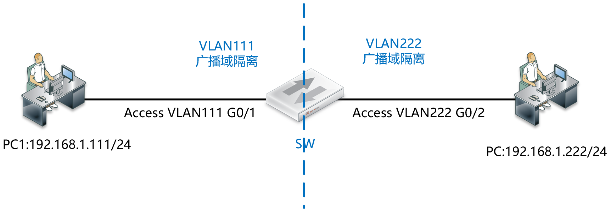

需求：要求PC1和PC2之间虽然是相同的网段，但是要相互隔离，同时要求防火墙策略对二者进行访问控制，PC1可以访问PC2，但是PC2不能访问PC1，同时要求PC1和PC2都可以正常的访问互联网。

## 解决方案拓扑

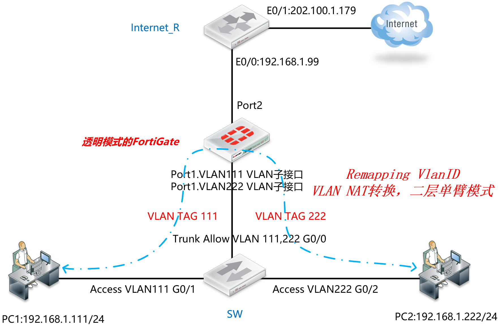

## 基础配置

**SW：**

```
interface GigabitEthernet0/0
switchport trunk encapsulation dot1q
switchport mode trunk
!
interface GigabitEthernet0/1
switchport access vlan 111
switchport mode access
no shutdown
spanning-tree portfast edge
!
interface GigabitEthernet0/2
switchport access vlan 222
switchport mode access
no shutdown
spanning-tree portfast edge
```

**Internet_R：**

```
interface Ethernet0/1
ip address 202.100.1.179 255.255.255.0
no shutdown
ip nat outside
!
interface Ethernet0/0
ip address 192.168.1.99 255.255.255.0
no shutdown
ip nat inside
!
ip route 0.0.0.0 0.0.0.0 202.100.1.192
!
access-list 101 permit ip any any
ip nat inside source list 101 interface Ethernet0/1 overload
```

**FortiGate：**

```
FortiGate-VM64-KVM # config system global
FortiGate-VM64-KVM (global) # set hostname FortiGate_Transparent
FortiGate_Transparent (global) # set timezone 55
FortiGate_Transparent (global) # set language simch
FortiGate-VM64-KVM (global) # end
FortiGate_Transparent # config system settings
FortiGate_Transparent (settings) # set opmode transparent    //修改FGT的运行模式为透明模式，默认为NAT路由模式。，注意切换透明模式防火墙需要防火墙没有相关接口、策略、路由等配置。
FortiGate_Transparent (settings) # set manageip 192.168.1.100 255.255.255.0    //配置可以管理防火墙的本地IP和网关，以便HTTP/SSH管理防火墙及防火墙的服务更新。
FortiGate_Transparent (settings) # set gateway 192.168.1.99
FortiGate_Transparent (settings) # end
Changing to TP mode

MGMT1或MGMT2口默认有管理权限，以要通过port2 接口管理设备为例，开启port2管理FGT的命令如下：
FortiGate_Transparent # config system interface
FortiGate_Transparent (interface) # edit port2
FortiGate_Transparent (port1) # set allowaccess https http ping ssh    //允许网管协议从Port2接口通过https/http/SSH/Ping访问透明模式的FortiGate
FortiGate_Transparent (port1) # end
```

## 配置步骤

1. 在FortiGate上创建VLAN子接口，VLAN111和VLAN222，分别绑定在port1和port2下。

   > 注意：建议在不需要的情况下关闭接口配置下的“设备探测”（Device detection）功能，该功能用于MAC地址厂商设备信息识别及MAC地址过滤，会消耗较多的设备资源。

   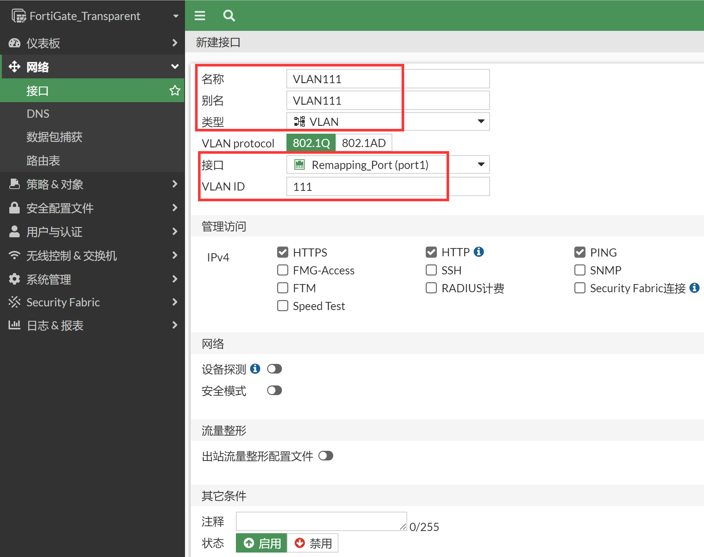

   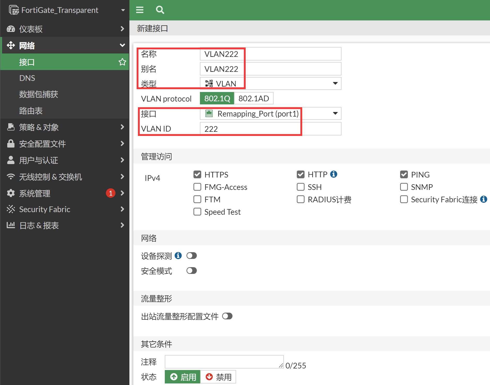

   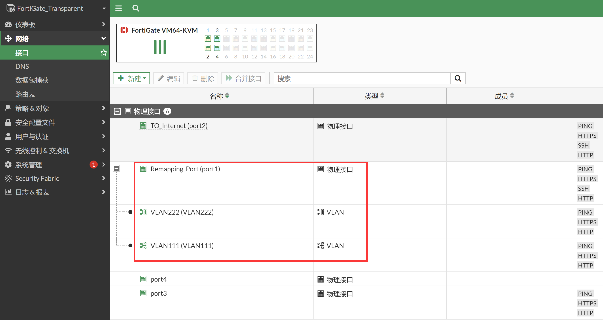

2. 页面右上角打开Web CLI，将VLAN111、VLAN222、port2三个接口划入到同一个Forward-Domain里。这样就将VLAN111和VLAN222之间的广播域打通了，VLAN111去访问VLAN222，则VLAN TAG 111就会被替换成 VLAN TAG222，反过来也一样的效果。同时VLAN111和VLAN222和Port2也是一个广播域，这样VLAN111和VLAN222配置策略后，可以通过Port2上互联网。

   ```
   切换到命令行，将三个接口划入到同一个Forward-Domain里：
   config system interface
       edit "VLAN111"
           set forward-domain 111222
           set alias "VLAN111"
           set interface "port1"
           set vlanid 111
       next
       edit "VLAN222"
           set forward-domain 111222
           set alias "VLAN222"
           set interface "port1"
           set vlanid 222
       next
       edit "port2"
           set allowaccess ping https ssh http
           set forward-domain 111222
           set alias "TO_Internet"
       next
   end
   ```

3. 这样流量是通过防火墙策略控制的，因此接下来需要配置防火墙策略，实现：PC1和访问PC2，但是PC2不能访问PC1，同时要求PC1和PC2都可以正常的访问互联网。

   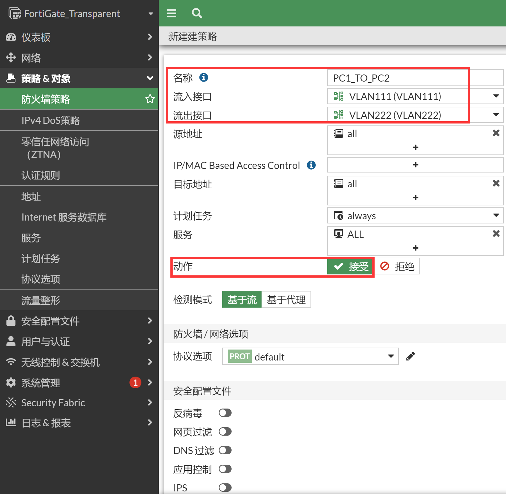

   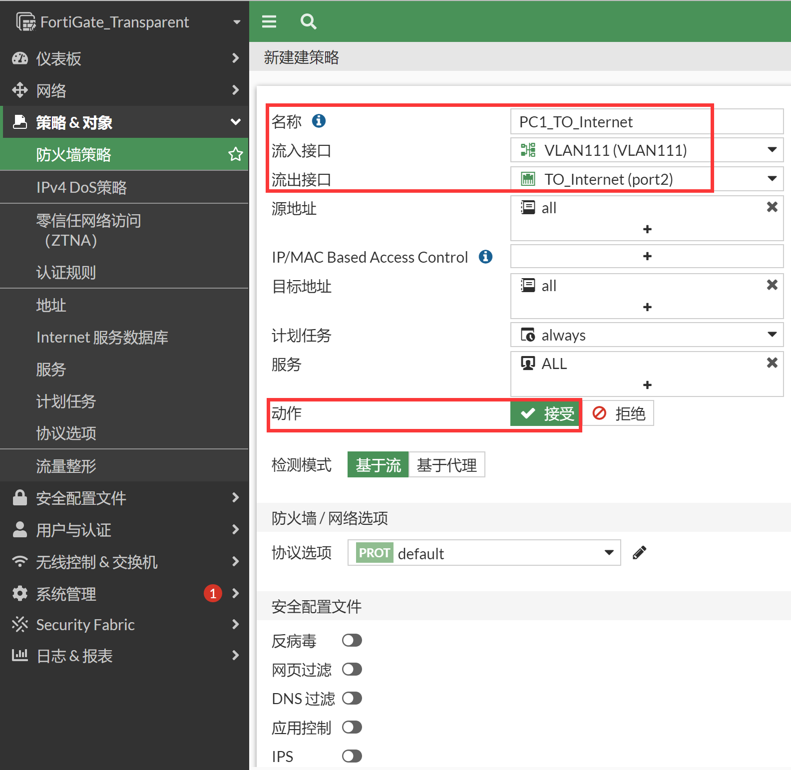

   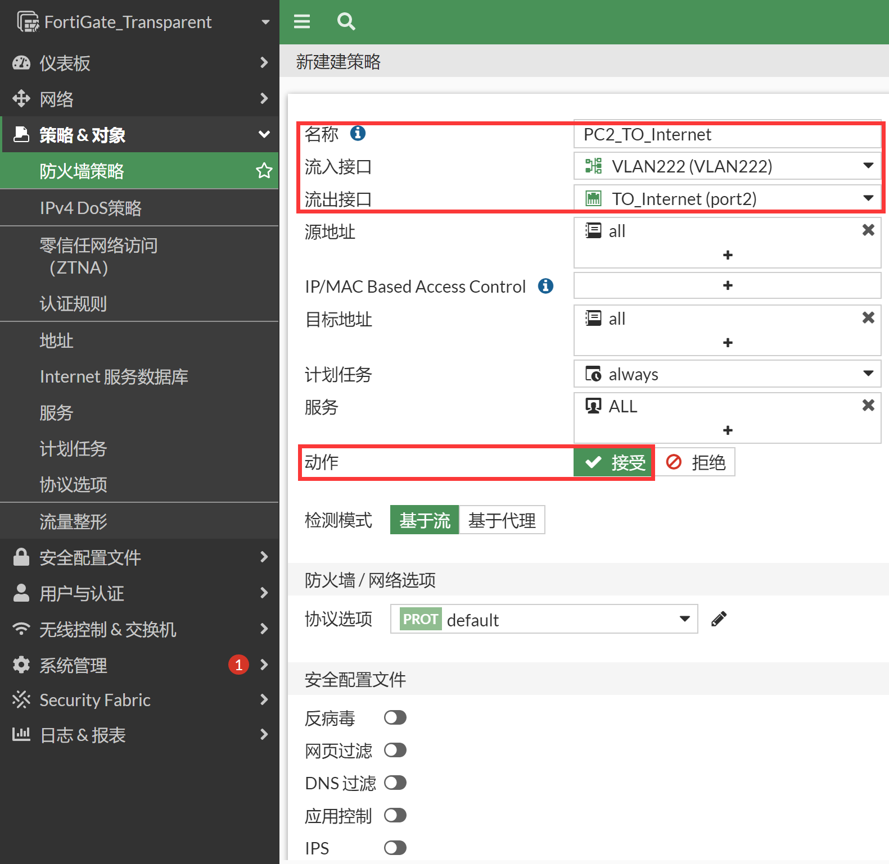

   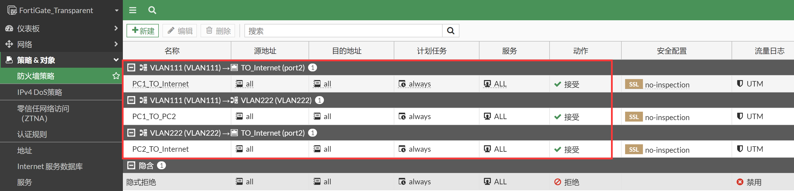

## 结果验证

1. PC1访问PC2和Internet，访问成功。

   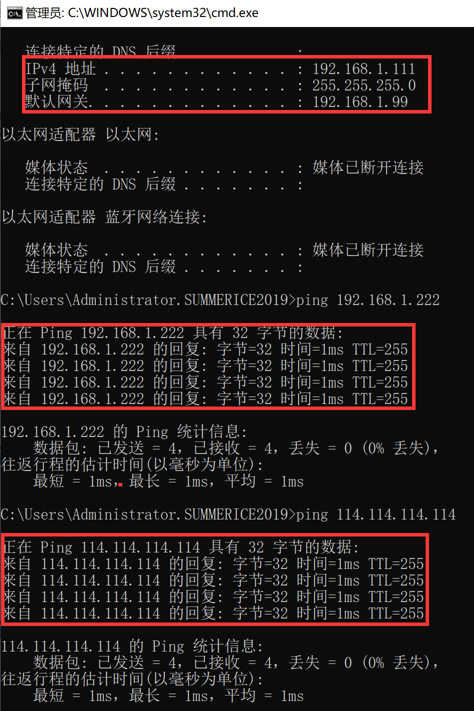

2. 抓包查看PC1访问PC2。

   ```
   FortiGate_Transparent # dia sni pac any "host 192.168.1.222 and icmp" 4
   interfaces=[any]
   filters=[host 192.168.1.222 and icmp]
   0.765120 VLAN111 in 192.168.1.111 -> 192.168.1.222: icmp: echo request
   0.765133 VLAN222 out 192.168.1.111 -> 192.168.1.222: icmp: echo request
   0.765136 port1 out 192.168.1.111 -> 192.168.1.222: icmp: echo request
   0.769002 VLAN222 in 192.168.1.222 -> 192.168.1.111: icmp: echo reply
   0.769012 VLAN111 out 192.168.1.222 -> 192.168.1.111: icmp: echo reply
   0.769014 port1 out 192.168.1.222 -> 192.168.1.111: icmp: echo reply
   ```

3. 在FortiGate上镜像port1的报文。分析一个PC1 ping PC2的过程 VLAN TAG的变化，非常直接的可以看到请求报文的VLAN-TAG从111变成了222，回复报文的VLAN-TAG从222变成了111，实现了remapping VlanID的功能。

   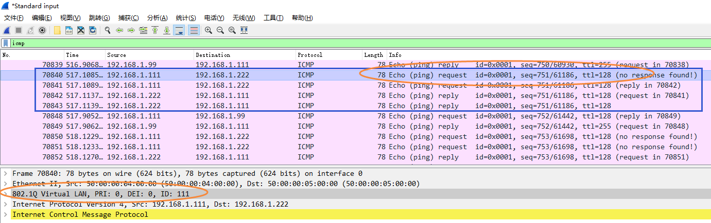

   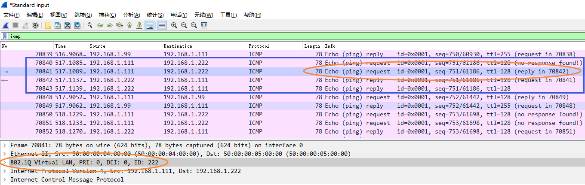

   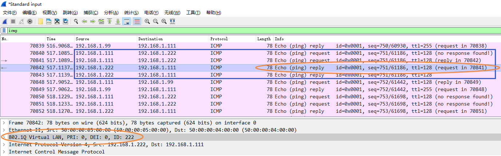

   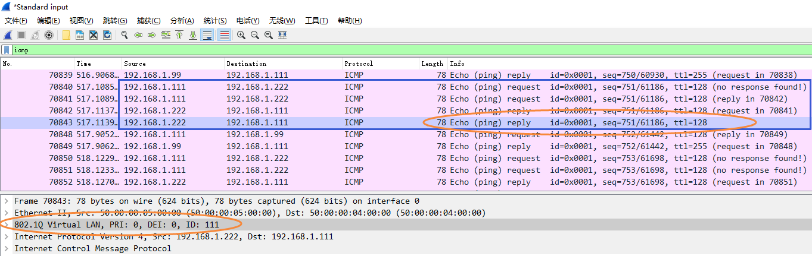

## 补充

当然组网可以调整为：防火墙完全单臂部署，PC1属于VLAN111、PC2属于VLAN222、Internet_R属于VLAN333，默认情况下相互隔离。

FGT配置remapping VlanID，可以让Port1子接口VLAN111、VLAN222、VLAN333加入到同一个Forward-Domain中，让三者广播域互通，同时FGT可以通过策略控制三者的流量。

这种方案可以用来作为内网相同网段主机的安全隔离，针对二层环境下东西向流量进行安全控制。

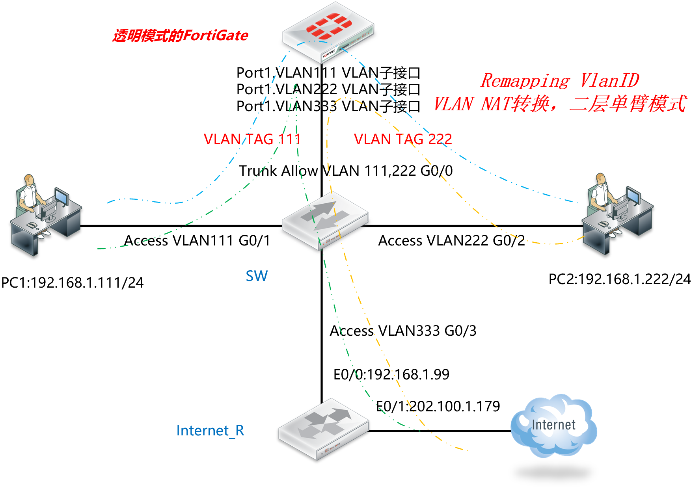
