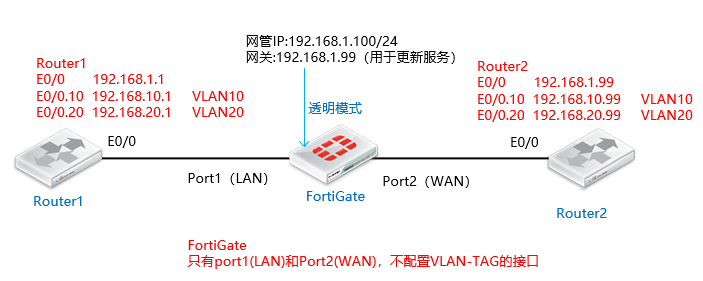
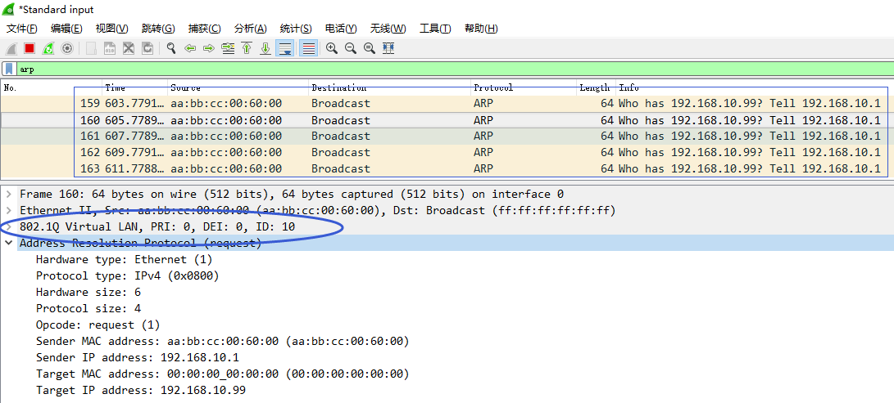
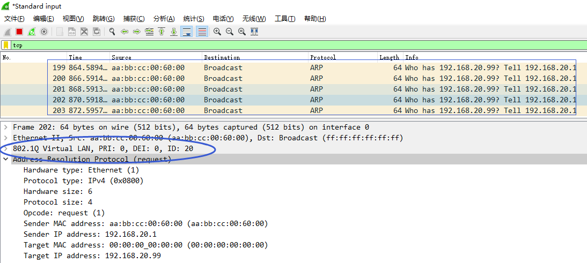
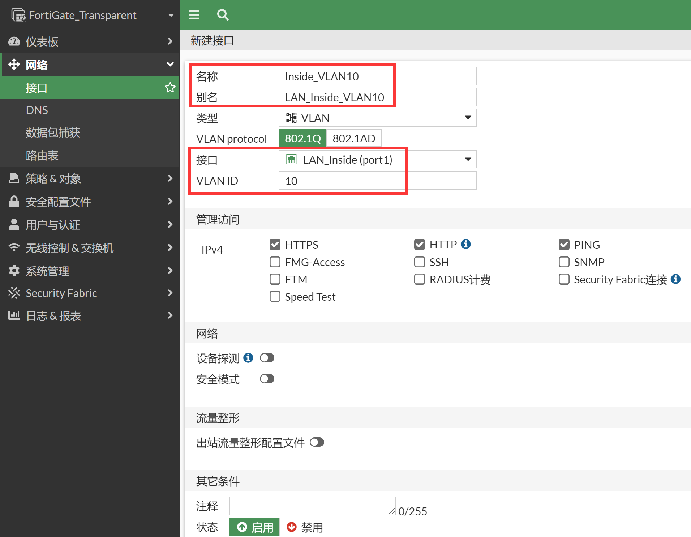
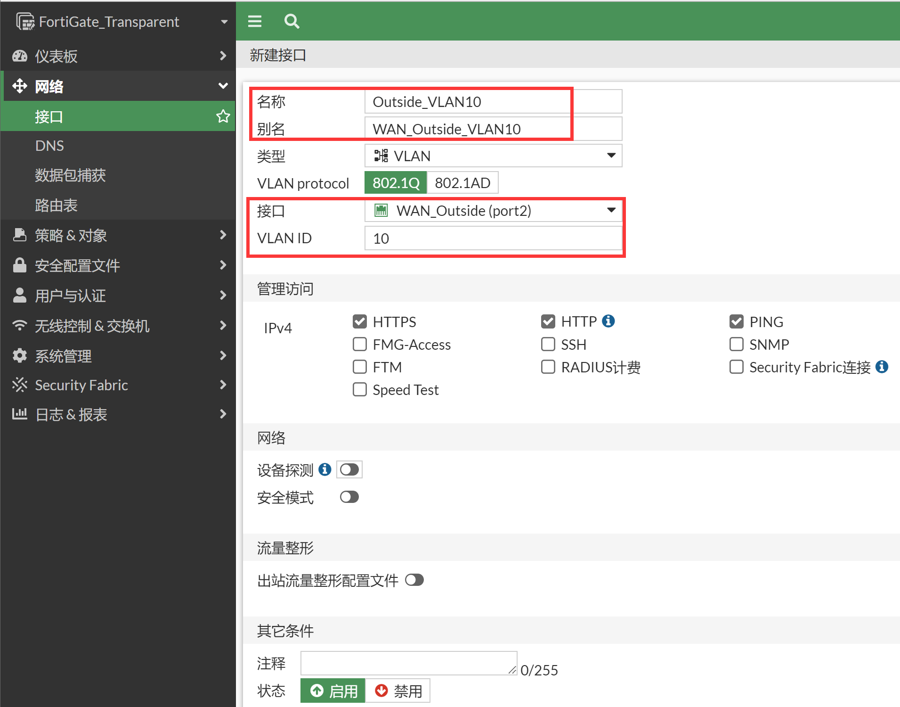
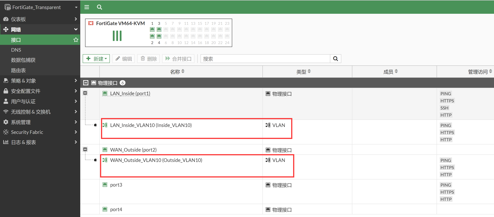
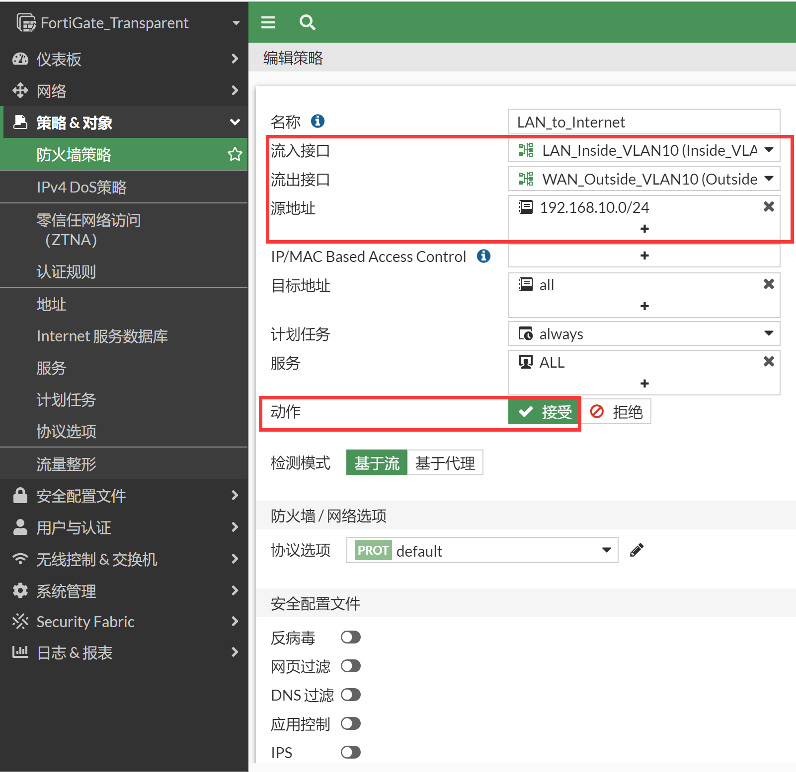
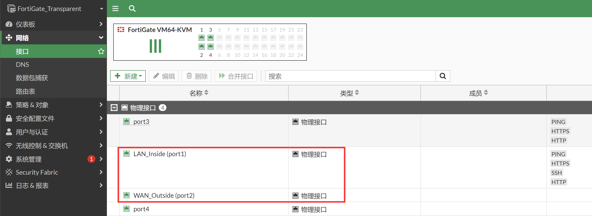
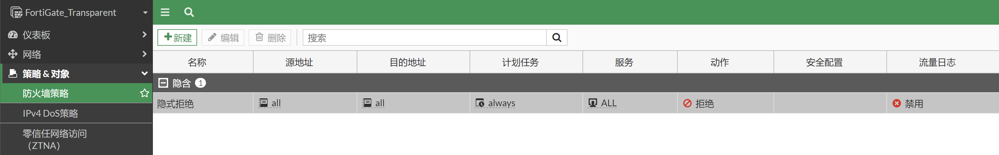

# vlanforward(默认关闭，谨慎使用)

## 功能简介

FortiGate在不配置VLAN接口的情况下，默认不转发那些携带了VLAN-TAG的数据，携带了VLAN-TAG的数据会被认为是非IP数据，直接全部丢弃（set vlanforward disable）——默认disable。

```
FortiGate_Transparent # config system interface
FortiGate_Transparent (interface) # edit port1
FortiGate_Transparent (port1) # show full-configuration | grep vlanforward
set vlanforward disable    //默认即为disable
```

假如FortiGate在不配置VLAN接口的情况下，默认转发那些携带了VLAN-TAG的数据（set vlanforward enable），也就是说FortiGate（透明）上线一个新的环境，不清楚网络中是否跑了VLAN，为了不影响那些不知道的VLAN的业务，于是开启vlanforward，以便那些未知VLAN的业务可以正常通信。

听起来美好，但是实际上问题很大，考虑到FortiGate默认所有接口都是一个forward-domain 0，如此的情况很容易引起广播风暴。因此在目前版本中vlanforward默认就为disable的状态。（“The vlanforward default setting has been modified for security reasons. The default setting was previously enabled. If vlanforward is enabled under all interfaces in TP mode, even without any firewall policy config, traffic with vlan tags can go through the FortiGate.  This introduced a potential security issue, the default was moved to disable starting with v5.0.10, v5.2.2, and v5.4.0.”）

通常来说我们上线FortiGate透明的时候需要详细的了解客户的业务情况，网络中是否有VLAN和VLAN-ID多少这些信息都是必须要去了解的，vlanforward enable这种省事的方法不可取，非特别特别的情况下尽量不要使用，同时也是为了避免忘记配置forward-domain而引起广播风暴的风险。通常来说vlanforward保持在disable的状态就好了，不要enable。

> 详情参考：https://community.fortinet.com/t5/FortiGate/Technical-Note-vlanforward-interface-parameter/ta-p/198171

## 网络拓扑



## 场景一：关闭vlanforward

### 基本配置

Router1和Router2运行了子接口 E0/0.10和E0/0.20，FortiGate透明模式运行与Router1和Router2之间，三者的基础配置如下：

**Router1：**

```
hostname Router1
!
interface Ethernet0/0
ip address 192.168.1.1 255.255.255.0
no shutdown
!
interface Ethernet0/0.10
encapsulation dot1Q 10
ip address 192.168.10.1 255.255.255.0
!
interface Ethernet0/0.20
encapsulation dot1Q 20
ip address 192.168.20.1 255.255.255.0
```

**Router2：**

```
hostname Router2
!
interface Ethernet0/0
ip address 192.168.1.99 255.255.255.0
no shutdown
!
interface Ethernet0/0.10
encapsulation dot1Q 10
ip address 192.168.10.99 255.255.255.0
!
interface Ethernet0/0.20
encapsulation dot1Q 20
ip address 192.168.20.99 255.255.255.0
```

**FortiGate：**

```
FortiGate-VM64-KVM # config system global
FortiGate-VM64-KVM (global) # set hostname FortiGate_Transparent
FortiGate_Transparent (global) # set timezone 55
FortiGate_Transparent (global) # set language simch
FortiGate-VM64-KVM (global) # end
FortiGate_Transparent #
FortiGate_Transparent # config system settings

FortiGate_Transparent (settings) # set opmode transparent    // 修改FGT的运行模式为透明模式，默认为NAT路由模式。，注意切换透明模式防火墙需要防火墙没有相关接口、策略、路由等配置。
FortiGate_Transparent (settings) # set manageip 192.168.1.100 255.255.255.0  // 配置可以管理防火墙的本地IP和网关，以便HTTP/SSH管理防火墙及防火墙的服务更新
FortiGate_Transparent (settings) # set gateway 192.168.1.99
FortiGate_Transparent (settings) # end
Changing to TP mode

（MGMT1或MGMT2口默认有管理权限），以要通过port1（LAN）接口管理设备为例，开启port1（LAN）管理FGT的命令如下：
FortiGate_Transparent # config system interface
FortiGate_Transparent (interface) # edit port1
FortiGate_Transparent (port1) # set allowaccess https http ping ssh    //允许网管协议从Port1接口通过https/http/SSH/Ping访问透明模式的FortiGate
FortiGate_Transparent (port1) # end

port1和port2都是默认配置，同时也没有配置任何安全策略，纯透明防火墙初始化空配置。
FortiGate_Transparent # config system interface
FortiGate_Transparent (interface) # edit port1
FortiGate_Transparent (port1) # show full-configuration | grep vlanforward
        set vlanforward disable    //默认vlanforward是disable的
```

### 实验步骤

1. 首先测试Router1的e0/0 192.168.1.1到192.168.1.99类似于不带vlan-tag的本地vlan vlan1的业务。

   ```
   Router1#ping 192.168.1.99       
   Type escape sequence to abort.
   Sending 5, 100-byte ICMP Echos to 192.168.1.99, timeout is 2 seconds:
   .....
   Success rate is 0 percent (0/5)
   ```

2. 结果不通，在FortiGate上抓包，

   ```
   FortiGate_Transparent # diagnose sniffer packet any "arp or icmp" 4 0 l
   interfaces=[any]
   filters=[arp or icmp]
   2019-07-03 18:05:12.481488 port1 in arp who-has 192.168.1.99 (aa:bb:cc:0:20:0) tell 192.168.1.1
   2019-07-03 18:05:12.481508 port2 out arp who-has 192.168.1.99 (aa:bb:cc:0:20:0) tell 192.168.1.1
   2019-07-03 18:05:12.486286 port2 in arp reply 192.168.1.99 is-at aa:bb:cc:0:20:0
   2019-07-03 18:05:12.486295 port1 out arp reply 192.168.1.99 is-at aa:bb:cc:0:20:0
   2019-07-03 18:05:15.442315 port1 in 192.168.1.1 -> 192.168.1.99: icmp: echo request
   2019-07-03 18:05:17.444526 port1 in 192.168.1.1 -> 192.168.1.99: icmp: echo request
   2019-07-03 18:05:19.444349 port1 in 192.168.1.1 -> 192.168.1.99: icmp: echo request
   2019-07-03 18:05:21.444162 port1 in 192.168.1.1 -> 192.168.1.99: icmp: echo request
   2019-07-03 18:05:23.444217 port1 in 192.168.1.1 -> 192.168.1.99: icmp: echo request
   ```

3. ARP解析正常，但是icmp请求被防火墙丢弃，deubug flow分析不通的原因。

   ```
   diagnose debug flow filter addr 192.168.1.1
   diagnose debug flow filter  proto 1
   diagnose debug flow show function-name enable
   diagnose debug flow trace start 10
   diagnose debug enable   
   
   id=20085 trace_id=1 func=print_pkt_detail line=5428 msg="vd-root:0 received a packet(proto=1, 192.168.1.1:10->192.168.1.99:2048) from port1. type=8, code=0, id=10, seq=0."
   id=20085 trace_id=1 func=init_ip_session_common line=5593 msg="allocate a new session-0000007d"
   id=20085 trace_id=1 func=br_fw_forward_handler line=565 msg="Denied by forward policy check"    //没有配置安全策略允许，自然是会丢弃的。
   ```

4. 测试Router1的E0/0.10 192.168.10.1→192.168.10.99的业务，此业务携带了VLAN-TAG 10。

   ```
   Router1#ping 192.168.10.99       
   Type escape sequence to abort.
   Sending 5, 100-byte ICMP Echos to 192.168.10.99, timeout is 2 seconds:
   .....
   Success rate is 0 percent (0/5)
   ```

5. 结果不通，在FGT上抓包。

   ```
   FortiGate_Transparent # diagnose sniffer packet any "arp or icmp" 4 0 l
   interfaces=[any]
   filters=[arp or icmp]
   ```

6. 什么都抓不到，通过镜像抓包查看，发现携带了vlan-tag 10的ARP报文都无法被转发，也就是说接口下的这条命令：set vlanforward disable，且FGT本地没有对应vlan-tag 10的接口，会丢弃携带了vlan-tag 10的任何报文，包括ARP报文，甚至数据报文CPU都不上送，携带了VLAN-TAG的数据会被当做非IP流量数据直接丢弃。

   

7. 测试VLAN20的数据和vlan10同样的效果。

   ```
   Router1#ping 192.168.20.99
   Type escape sequence to abort.
   Sending 5, 100-byte ICMP Echos to 192.168.20.99, timeout is 2 seconds:
   .....
   Success rate is 0 percent (0/5)
   ```

   

8. 查看Router1的ARP表，发现无法学习到相关的ARP条目。

   ```
   Router1#show arp         
   Protocol  Address          Age (min)  Hardware Addr   Type   Interface
   ...
   Internet  192.168.10.99           0   Incomplete      ARPA  
   Internet  192.168.20.99           0   Incomplete      ARPA  
   ...
   ```

9. 在FGT的Port1和Port2上增加Inside_VLAN10和Outside_VLAN10的两个VLAN 10的接口。

   

   

   

10. 将两个VLAN接口加入到forward-domain 10里。

    ```
    FortiGate_Transparent # config system interface
    FortiGate_Transparent (interface) # edit Inside_VLAN10
    FortiGate_Transparent (Inside_VLAN10) # set forward-domain 10
    FortiGate_Transparent (Inside_VLAN10) # next
    FortiGate_Transparent (interface) # edit Outside_VLAN10
    FortiGate_Transparent (Outside_VLAN10) # set forward-domain 10
    FortiGate_Transparent (Outside_VLAN10) # end
    ```

    > 注意：配置VLAN-ID的场景下则必须配置“forward-domain” 否则FGT的MAC地址表项会错乱翻转，业务不通，甚至存在广播风暴的风险。
    > 假设不配置forward-domain，由于port2、port2.10（Outside_VLAN10）都是属于同一个广播域，那么192.168.10.1请求192.168.10.99的arp广播请求会被发送到port2、port2.10（Outside_VLAN10）甚至port1都会被广播出去，同时由于Router2的E0/0（192.168.1.99）和E0/0.10（192.168.10.99）的MAC地址一样都是：aa:bb:cc:00:20:00，由于在同一个广播域中的不同接口不能存在相同的MAC地址，此时port2也可以学习到aa:bb:cc:00:20:00,同时port2.10（Outside_VLAN10）也可以学习到aa:bb:cc:00:20:00，这样会造成MAC地址表冲突，同时MAC表中只能存在一个MAC表项，会操作MAC表翻转，如果配置全通策略，甚至可能引起环路的风险。因此配置VLAN-ID务必将forward-domain配置上，这是一个很必要的配置操作。

11. 查看配置了forward-domain的FortiGate的MAC表和Router1的arp表。

    ```
    FortiGate_Transparent # diag netlink brctl name host root.b
    show bridge control interface root.b host.
    fdb: size=2048, used=6, num=10, depth=2
    Bridge root.b host table
    port no device  devname mac addr                ttl     attributes
    ...
      6     14      Outside_VLAN10  aa:bb:cc:00:20:00       5        Hit(5)
      2     4       port2   aa:bb:cc:00:20:00       0        Hit(0)
    ...
    ```

    ```
    Router1#show arp
    Protocol  Address          Age (min)  Hardware Addr   Type   Interface
    ...
    Internet  192.168.1.99            0   aabb.cc00.2000  ARPA   Ethernet0/0
    Internet  192.168.10.99           0   aabb.cc00.2000  ARPA   Ethernet0/0.10
    ...
    ```

12. 此时再看VLAN10的业务，在Router1上使用192.168.10.1 ping 192.168.10.99。

    ```
    Router1#ping 192.168.10.99
    Type escape sequence to abort.
    Sending 5, 100-byte ICMP Echos to 192.168.10.99, timeout is 2 seconds:
    .....
    Success rate is 0 percent (0/5)
    ```

13. 虽然还是不通，但是情况已经不一样了，明显VLAN10的数据全部上送到了CPU进行处理，ARP可正常学习，只是ping不通，原因是防火墙没有配置策略，所以匹配了默认的drop策略。

    ```
    FortiGate_Transparent # diagnose sniffer packet any "arp or icmp" 4 0 l
    interfaces=[any]
    filters=[arp or icmp]
    2019-07-03 18:24:49.697190 Inside_VLAN10 in arp who-has 192.168.10.99 tell 192.168.10.1
    2019-07-03 18:24:49.697218 Outside_VLAN10 out arp who-has 192.168.10.99 tell 192.168.10.1
    2019-07-03 18:24:49.698089 Outside_VLAN10 in arp reply 192.168.10.99 is-at aa:bb:cc:0:20:0
    2019-07-03 18:24:49.698102 Inside_VLAN10 out arp reply 192.168.10.99 is-at aa:bb:cc:0:20:
    2019-07-03 18:24:51.700405 Inside_VLAN10 in 192.168.10.1 -> 192.168.10.99: icmp: echo request
    2019-07-03 18:24:53.700372 Inside_VLAN10 in 192.168.10.1 -> 192.168.10.99: icmp: echo request
    2019-07-03 18:24:55.704350 Inside_VLAN10 in 192.168.10.1 -> 192.168.10.99: icmp: echo request
    2019-07-03 18:24:57.704314 Inside_VLAN10 in 192.168.10.1 -> 192.168.10.99: icmp: echo request
    ```

    ```
    Router1#show arp
    Protocol  Address          Age (min)  Hardware Addr   Type   Interface
    Internet  192.168.1.1             -   aabb.cc00.6000  ARPA   Ethernet0/0
    Internet  192.168.1.99            5   aabb.cc00.2000  ARPA   Ethernet0/0
    Internet  192.168.10.1            -   aabb.cc00.6000  ARPA   Ethernet0/0.10
    Internet  192.168.10.99           0   aabb.cc00.2000  ARPA   Ethernet0/0.10  // arp可以学习到
    Internet  192.168.20.1            -   aabb.cc00.6000  ARPA   Ethernet0/0.20
    ```

    ```
    diagnose debug flow filter addr 192.168.10.1
    diagnose debug flow filter  proto 1
    diagnose debug flow show function-name enable
    diagnose debug flow trace start 10
    diagnose debug enable   
    
    id=20085 trace_id=2 func=print_pkt_detail line=5428 msg="vd-root:0 received a packet(proto=1, 192.168.10.1:17->192.168.10.99:2048) from Inside_VLAN10. type=8, code=0, id=17, seq=0."
    id=20085 trace_id=2 func=init_ip_session_common line=5593 msg="allocate a new session-00000244"
    id=20085 trace_id=2 func=br_fw_forward_handler line=565 msg="Denied by forward policy check"
    ```

14. 此时在FortiGate上配置VLAN 10的放通安全策略。

    

15. VLAN10的数据可以正常通信。

    ```
    Router1#ping 192.168.10.99 repeat 100
    Type escape sequence to abort.
    Sending 100, 100-byte ICMP Echos to 192.168.10.99, timeout is 2 seconds:
    !!!!!!!!!!!!!!!!!!!!!!!!!!!!!!!!!!!!!!!!!!!!!!!!!!!!!!!!!!!!!!!!!!!!!!
    !!!!!!!!!!!!!!!!!!!!!!!!!!!!!!
    Success rate is 100 percent (100/100), round-trip min/avg/max = 1/1/2 ms
    ```

    ```
    FortiGate_Transparent # diagnose sniffer packet any "icmp or arp" 4 0 l
    interfaces=[any]
    filters=[icmp or arp]
    2019-07-03 18:57:39.090299 Inside_VLAN10 in 192.168.10.1 -> 192.168.10.99: icmp: echo request
    2019-07-03 18:57:39.090376 Outside_VLAN10 out 192.168.10.1 -> 192.168.10.99: icmp: echo request
    2019-07-03 18:57:39.090379 port2 out 192.168.10.1 -> 192.168.10.99: icmp: echo request
    2019-07-03 18:57:39.091154 Outside_VLAN10 in 192.168.10.99 -> 192.168.10.1: icmp: echo reply
    2019-07-03 18:57:39.091166 Inside_VLAN10 out 192.168.10.99 -> 192.168.10.1: icmp: echo reply
    2019-07-03 18:57:39.091168 port1 out 192.168.10.99 -> 192.168.10.1: icmp: echo reply
    ```

### 总结

在默认的“set vlanforward disable”的情况下：

- 如果FGT本地存在VLAN-ID接口（此处为类似VLAN1的接口 port1）则数据会上送CPU处理，如果配置VLAN10的接口，则接收到了VLAN-TAG10的VLAN数据也会上送CPU处理，那么通不通就完全看安全策略是否放通了。
- 如果FGT本地不存在VLAN-ID的接口，收到了VLAN-TAG的数据，且本地并没有相应的VLAN接口，那么这样的数据将会被FGT底层当做非IP数据丢弃，上送CPU的机会都没有，直接丢弃，连arp都不处理，直接丢弃。

## 场景二：开启vlanforward

### 实验步骤

1. 在port1和port2上开启vlanforward（不配置任何VLAN接口和安全策略）。

   ```
   config system interface
       edit "port1"
           set vdom "root"
           set allowaccess ping https ssh http
           set vlanforward enable
           set type physical
           set alias "LAN_Inside"
           set snmp-index 1
       next
       edit "port2"
           set vdom "root"
           set allowaccess ping https ssh http
           set vlanforward enable
           set type physical
           set alias "WAN_Outside"
           set snmp-index 2
       next
   end
   ```

   

   

2. 再次测试一下Router1到Router2的VLAN 20的业务，VLAN 20的数据是通的。

   ```
   Router1#ping 192.168.20.99
   Type escape sequence to abort.
   Sending 5, 100-byte ICMP Echos to 192.168.20.99, timeout is 2 seconds:
   !!!!!
   Success rate is 100 percent (5/5), round-trip min/avg/max = 1/1/2 ms
   ```

3. 但是在FGT上抓取不到任何的VLAN20相关的数据，数据没有上送到CPU处理，直接被bypass掉了。

   ```
   FortiGate_Transparent # diagnose sniffer packet any "icmp or arp" 4 0 l
   interfaces=[any]
   filters=[icmp or arp]
   ```

### 总结

如果FGT上没有创建VLAN20的这个接口，同时接口开启了vlanforward，那么相当于这些未知的携带了VLAN-TAG的数据，将会统统bypass掉，不上CPU处理直接转发走。

如果不熟悉vlanforward和forward-domain的工作原理，这样的bypass流量风险比较大，因为那些bypass的流量FGT完全不可控，也不可见，一旦出问题完全无法掌控，因此vlanforward不建议开启，保持默认disable即可。
