# 开启透明模式防火墙并保护上网流量

## 组网需求

在不改变现有网络拓扑前提下，将防火墙NGFW以透明模式部署到网络中，放在路由器和交换机之间，防火墙为透明模式，对内网网段192.168.1.0/24的上网进行4~7层的安全防护。

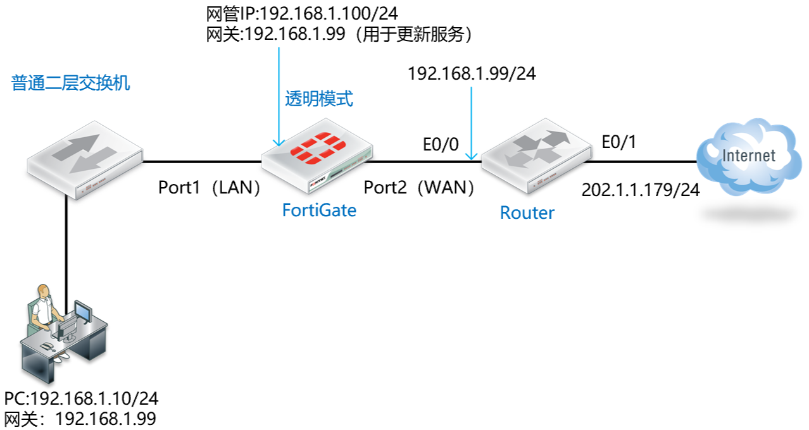

## 配置要点

- Internet_R路由器的基础配置
- 将防火墙配置为透明模式并开启网管
- 配置安全策略允许内网PC访问互联网

## 配置步骤

1. Internet_R路由器的基础配置（以思科为例）。

   ```
   hostname Internet_R
   !
   interface Ethernet0/0
   ip address 192.168.1.99 255.255.255.0
   no shutdown
   ip nat inside
   !
   interface Ethernet0/1
   ip address 202.100.1.179 255.255.255.0
   no shutdown
   ip nat outside
   !
   ip route 0.0.0.0 0.0.0.0 202.100.1.192
   !        
   access-list 101 permit ip any any
   ip nat inside source list 101 interface Ethernet0/1 overload
   ```

2. 将防火墙配置为透明模式并开启网管，进入设备命令行（CLI）中进行配置，将模式修改为“透明模式”，同时为设备配置好管理地址和网关。

   ```
   FortiGate-VM64-KVM # config system global
   FortiGate-VM64-KVM (global) # set hostname FortiGate_Transparent
   FortiGate_Transparent (global) # set timezone 55
   FortiGate_Transparent (global) # set language simch
   FortiGate-VM64-KVM (global) # end
   FortiGate_Transparent #
   FortiGate_Transparent # config system settings
   FortiGate_Transparent (settings) # set opmode transparent    // 修改FGT的运行模式为透明模式，默认为NAT路由模式。，注意切换透明模式防火墙需要防火墙没有相关接口、策略、路由等配置。
   FortiGate_Transparent (settings) # set manageip 192.168.1.100 255.255.255.0  // 配置可以管理防火墙的本地IP和网关，以便HTTP/SSH管理防火墙及防火墙的服务更新。
   FortiGate_Transparent (settings) # set gateway 192.168.1.99
   FortiGate_Transparent (settings) # end
   Changing to TP mode
   
   FortiGate_Transparent # get system status
   Version: FortiGate-VM64-KVM v7.0.8,build0418,221012 (GA.F)
   ...
   Operation Mode: Transparent
   ...
   Virtual domains status: 0 in NAT mode, 1 in TP mode
   ...
   ```

   > 注意：
   >
   > 透明模式下，所有的接口都无法写入IP地址，整机只有一个设备IP地址。当需要从某个接口管理设备时，需在命令行下开启相应接口的管理权限。
   >
   > 开启透明模式前，需要删除系统自带的fortilink接口（需要先删除fortilink接口关联的DHCP与NTP配置）。

3. 通过内网PC尝试登陆FortiGate的Manage IP：192.168.1.100，此时FortiGate的port1未开启HTTP/HTTPS/PING，所以是无法访问的。

   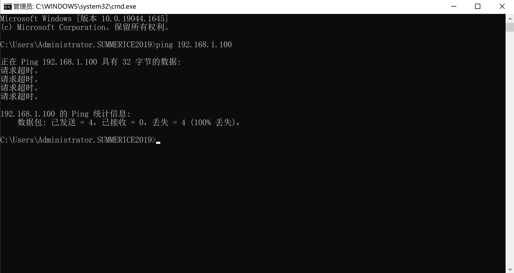

4. 在FortiGate的CLI中开启port1的管理权限。

   ```
   FortiGate_Transparent # config system interface
   FortiGate_Transparent (interface) # edit port1
   FortiGate_Transparent (port1) # set allowaccess https http ping ssh    //允许网管协议从Port1接口通过https/http/SSH/Ping访问透明模式的FortiGate
   FortiGate_Transparent (port1) # end
   ```

5. 使用PC PING FortiGate的管理IP，并使用HTTPS登陆管理页面。

   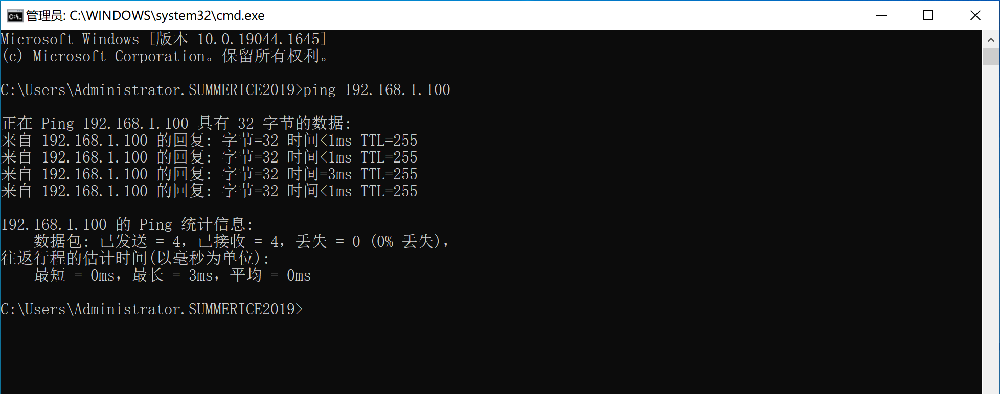

   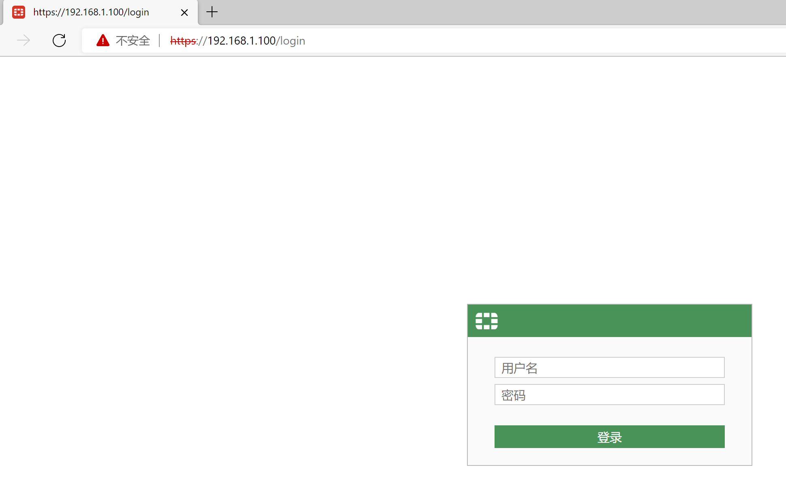

6. 配置安全策略允许内网PC访问互联网，默认情况下透明模式的FortiGate没有开启任何策略，此时TCP/UDP/ICMP的流量是全部不通的。

   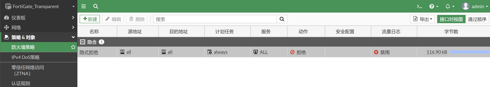

   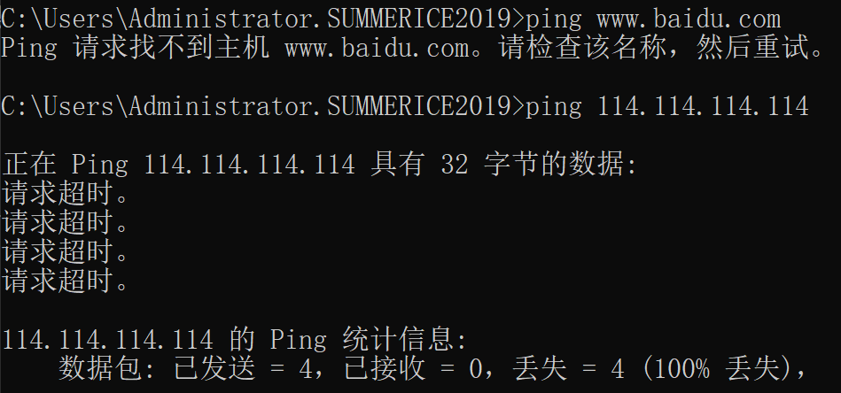

7. 建议先给接口一个别名，这样配置策略的时候可以很清楚的知道接口的位置和功能。

   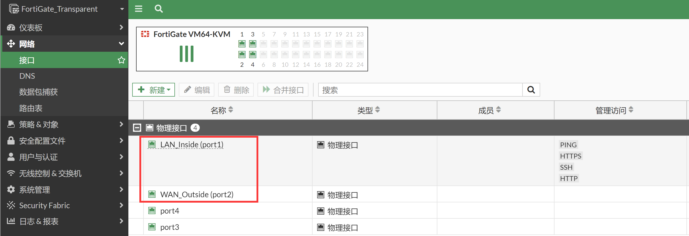

8. 进入策略&对象→防火墙策略，新建防火墙策略，放通port1到port2的流量，源地址创建LAN网段的地址对象并引用，开启防病毒功能，这里使用默认的防病毒配置文件。

   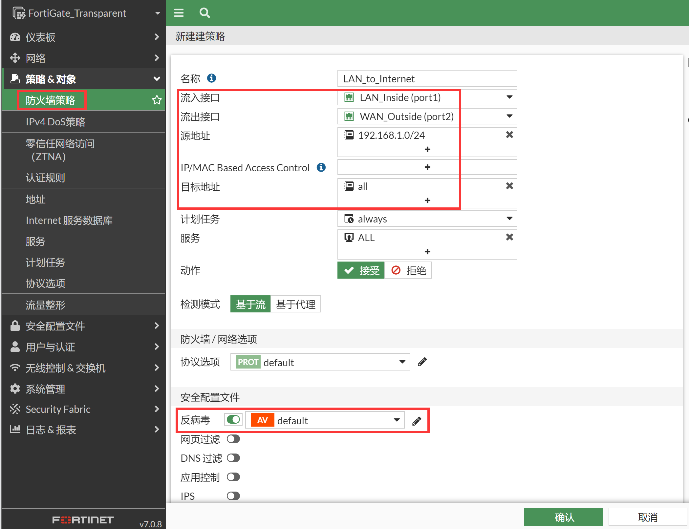

>注意：建议在不需要的情况下关闭接口配置下的“设备探测”（Device detection）功能，该功>能用于MAC地址厂商设备信息识别及MAC地址过滤，会消耗较多的设备资源。

## 结果验证

1. 使用内网PC测试Internet业务。

   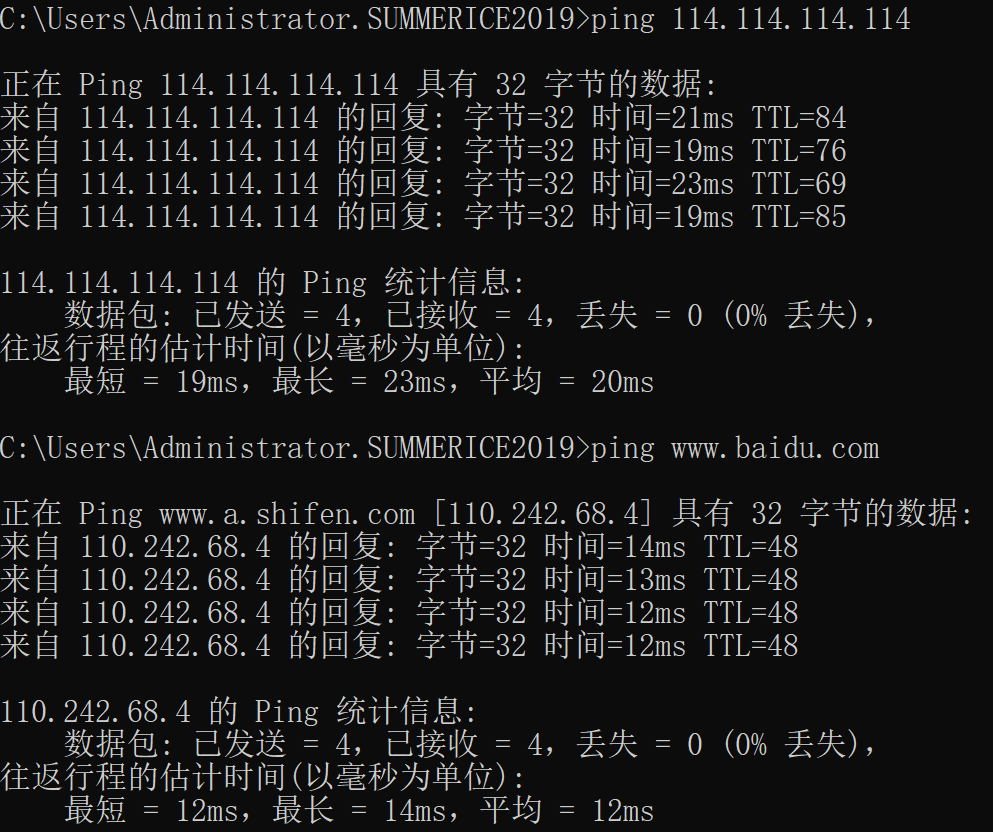

   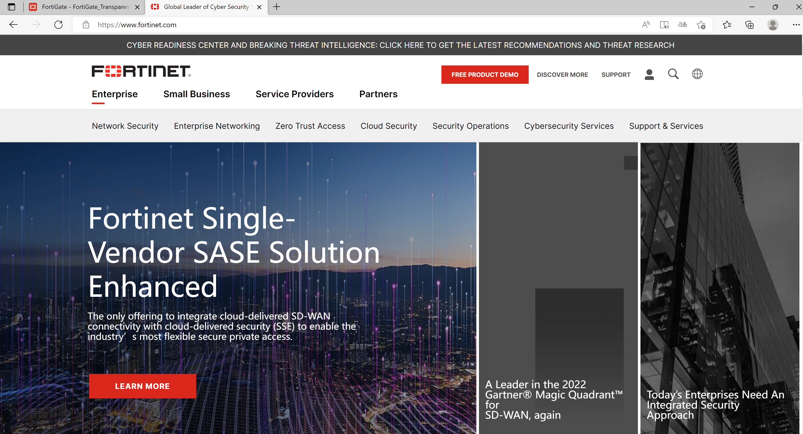

2. 使用PC测试通过HTTP协议下载病毒测试文件，可以看到下载动作被FortiGate拦截。

   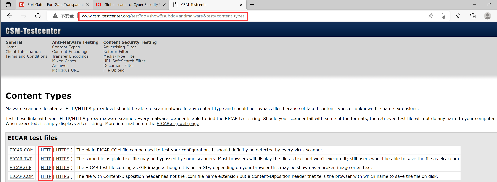

   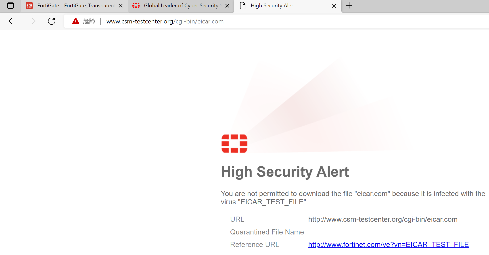

3. 在日志&报表→反病毒中可以看到相关拦截日志，协议为HTTP。

   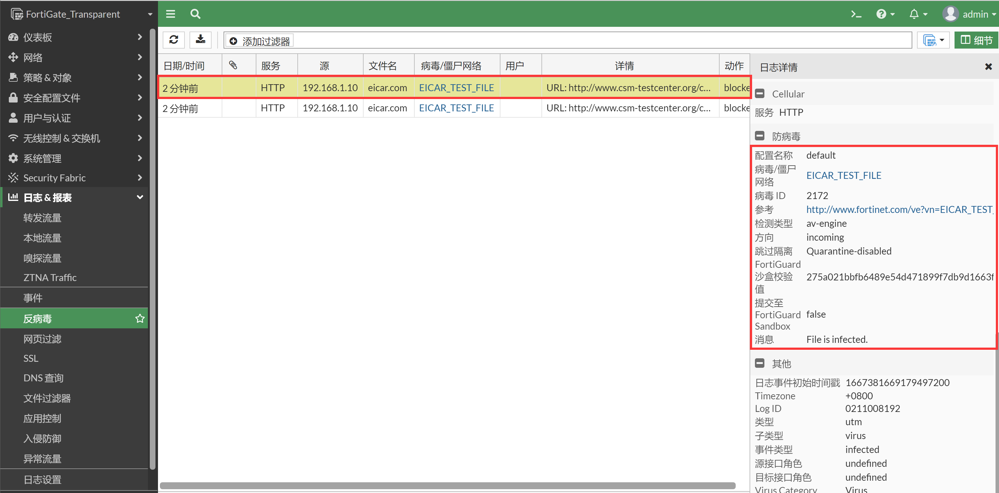

4. 如果是通过HTTPS协议下载病毒文件，由于数据被HTTPS加密，需要在策略中调用SSL深度检测。

   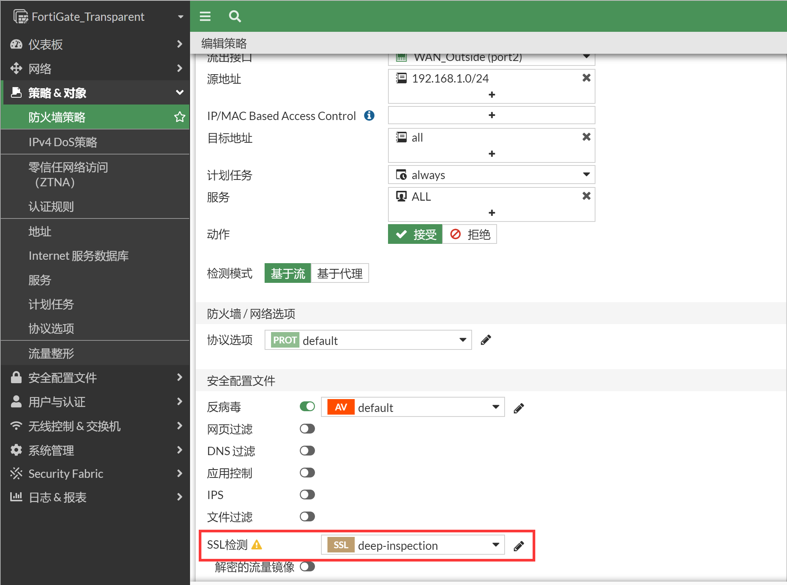

5. 使用PC测试通过HTTP协议下载病毒测试文件，可以看到下载动作被FortiGate拦截。

   

   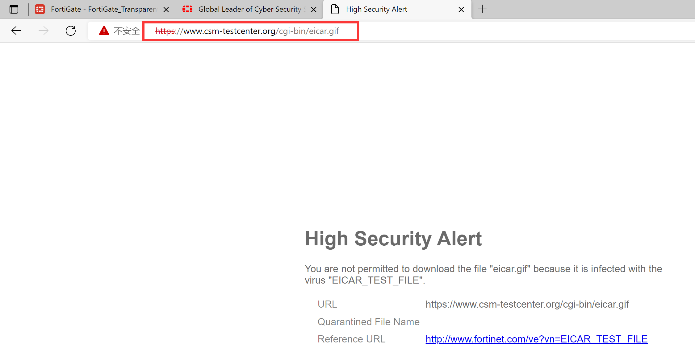

6. 在日志&报表→反病毒中可以看到相关拦截日志，协议为HTTPS。

   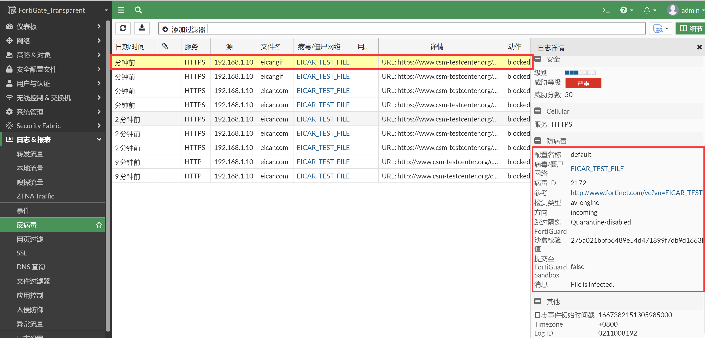
