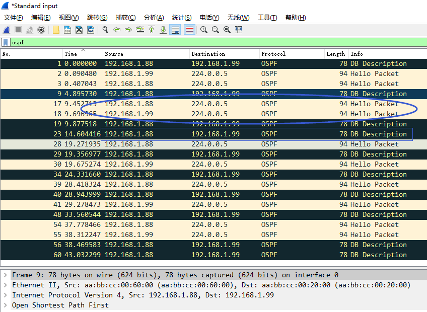

# 组播(OSPF)与透明模式

## 组网需求

路由器1和路由器2之间运行了动态路由协议，防火墙以透明模式运行在两台路由器之间，需要确保两台路由器之间的动态路由协议运行正常，并且数据可通。

## 网络拓扑


## 配置要点

- Router1/Router2路由器的基础配置

- 将防火墙配置为透明模式并开启网管

- 默认不配置策略情况下，观察动态路由协议的情况

- 配置安全策略解决OSPF/EIGRP邻居关系异常

## 配置步骤和结果验证

1. Router1/Router2路由器的基础配置。

   **Router1：**

   ```
   interface Loopback0
   ip address 1.1.1.1 255.255.255.255
   !
   interface Ethernet0/0
   ip address 192.168.1.88 255.255.255.0
   no shutdown
   !
   router ospf 10
   network 1.1.1.1 0.0.0.0 area 0
   network 192.168.1.0 0.0.0.255 area 0
   !
   router rip
   version 2
   network 1.0.0.0
   network 192.168.1.0
   no auto-summary
   !
   router eigrp 10
   network 1.1.1.1 0.0.0.0
   network 192.168.1.0
   ```

   **Router2：**

   ```
   interface Loopback0
   ip address 2.2.2.2 255.255.255.255
   !
   interface Ethernet0/0
   ip address 192.168.1.99 255.255.255.0
   no shutdown
   !
   router ospf 10
   network 2.2.2.2 0.0.0.0 area 0
   network 192.168.1.0 0.0.0.255 area 0
   !
   router rip
   version 2
   network 2.0.0.0
   network 192.168.1.0
   no auto-summary
   !
   router eigrp 10
   network 2.2.2.2 0.0.0.0
   network 192.168.1.0
   ```

2. 将防火墙配置为透明模式并开启网管，进入设备命令行（CLI）中进行配置，将模式修改为"透明模式"同时为设备配置好管理地址和网关。

   ```
   FortiGate-VM64-KVM # config system global
   FortiGate-VM64-KVM (global) # set hostname FortiGate_Transparent
   FortiGate_Transparent (global) # set timezone 55
   FortiGate_Transparent (global) # set language simch
   FortiGate-VM64-KVM (global) # end
   
   FortiGate_Transparent # config system settings
   FortiGate_Transparent (settings) # set opmode transparent    // 修改FGT的运行模式为透明模式，默认为NAT路由模式。，注意切换透明模式防火墙需要防火墙没有相关接口、策略、路由等配置。
   FortiGate_Transparent (settings) # set manageip 192.168.1.100 255.255.255.0    //配置可以管理防火墙的本地IP和网关，以便HTTP/SSH管理防火墙及防火墙的服务更新。
   FortiGate_Transparent (settings) # set gateway 192.168.1.99
   FortiGate_Transparent (settings) # end
   Changing to TP mode
   
   MGMT1或MGMT2口默认有管理权限，以要通过port1（LAN）接口管理设备为例，开启port1（LAN）管理FGT的命令如下：
   FortiGate_Transparent # config system interface
   FortiGate_Transparent (interface) # edit port1
   FortiGate_Transparent (port1) # set allowaccess https http ping ssh    //允许网管协议从Port1接口通过https/http/SSH/Ping访问透明模式的FortiGate
   FortiGate_Transparent (port1) # end
   
   ```

3. 默认不配置策略情况下，观察动态路由协议的情况，RIP 邻居是正常的，但是OSPF邻居无法建立成功，EIGRP邻居路由学习异常，邻居反复的震荡。

   ```
   Router1#show ip rip database
   1.0.0.0/8    auto-summary
   1.1.1.1/32    directly connected, Loopback0
   2.0.0.0/8    auto-summary
   2.2.2.2/32
       [1] via 192.168.1.99, 00:00:01, Ethernet0/0
   192.168.1.0/24    auto-summary
   192.168.1.0/24    directly connected, Ethernet0/0
   
   Router1#show ip route       
   ...
   R        2.2.2.2 [120/1] via 192.168.1.99, 00:00:03, Ethernet0/0
   ...
   ```

   ```
   Router1#show ip ospf database
               OSPF Router with ID (1.1.1.1) (Process ID 10)
                   Router Link States (Area 0)
   Link ID         ADV Router      Age         Seq#       Checksum Link count
   1.1.1.1         1.1.1.1         274         0x80000003 0x00F9A5 2
   
   Router1#show ip ospf neighbor
   Neighbor ID     Pri   State           Dead Time   Address         Interface
   2.2.2.2           1   EXSTART/DR      00:00:31    192.168.1.99    Ethernet0/0
   
   Router1#show ip ospf neighbor
   Neighbor ID     Pri   State           Dead Time   Address         Interface
   2.2.2.2           1   INIT/DROTHER    00:00:37    192.168.1.99    Ethernet0/0
   
   *Jul  2 07:55:15.999: %OSPF-5-ADJCHG: Process 10, Nbr 2.2.2.2 on Ethernet0/0 from EXSTART to DOWN, Neighbor Down: Too many retransmissions
   *Jul  2 07:56:16.002: %OSPF-5-ADJCHG: Process 10, Nbr 2.2.2.2 on Ethernet0/0 from DOWN to DOWN, Neighbor Down: Ignore timer expired
   ```

   ```
   Router1#
   *Jul  2 07:55:24.200: %DUAL-5-NBRCHANGE: EIGRP-IPv4 10: Neighbor 192.168.1.99 (Ethernet0/0) is down: retry limit exceeded
   *Jul  2 07:55:28.663: %DUAL-5-NBRCHANGE: EIGRP-IPv4 10: Neighbor 192.168.1.99 (Ethernet0/0) is up: new adjacency
   ```

   > 原因分析：
   >
   > 我们知道RIP/OSPF/EIGRP都是用组播IP来建立邻居关系：RIP:224.0.0.9，OSPF:224.0.0.5/224.0.0.6，EIGRP:224.0.0.10。
   >
   > 对应FGT来说默认情况下：
   >
   > 如果组播是不通，为何RIP协议又可以正常使用？
   >
   > 如果组播是通的，为何OSPF/EIGRP邻居关系异常呢？
   >
   > 怎么看都是有点矛盾的！

4. 让我们带着这个疑惑来分析一下原因，首先，我们来看FortiGate透明模式下组播到底通还是不通，答案是：通的。原因是默认情况下有两个系统默认的设置允许组播通过FortiGate的。

   **配置1：系统设置：**

   ```
   FortiGate_Transparent # config system settings 
   FortiGate_Transparent (settings) # show full-configuration | grep multicast
       set multicast-skip-policy disable    //默认为disable，组播流量默认需要查询策略。如果修改为enable，则会bypass掉组播流量，组播流量也是可以通的，但是FGT上不会建立组播的会话
       set gui-multicast-policy enable
   ```

   **配置2:组播策略：**

   透明模式下的FortiGate默认存在有一条permit any到any全通的组播策略。

   ```
   FortiGate_Transparent # config firewall multicast-policy
   FortiGate_Transparent (multicast-policy) # show
   config firewall multicast-policy
       edit 1
           set srcintf "any"
           set dstintf "any"
           set srcaddr "all"
           set dstaddr "all"
       next
   end
   ```

5. 在GUI中查看组播策略（需要在系统管理→可见功能中打开组播策略显示），可以看到这条默认放通的组播策略。

   

   

6. 通过上述两个默认的配置，可以看出FGT的组播默认就是通的。在FGT查看组播会话，这样就可以解释通为什么RIP路由协议是OK的了，抓包可以看到RIP协议只有224.0.0.9的组播报文。

   ```
   FortiGate_Transparent # diagnose sys mcast-session list
   session info: id=6 vf=0 proto=17 192.168.1.1.520->224.0.0.9.520    //RIP会话
   used=2 path=3 duration=137 expire=177 indev=3 pkts=6 bytes=312
   state=00000002:tp
   path: policy=1, outdev=4
   
   session info: id=4 vf=0 proto=17 192.168.1.99.520->224.0.0.9.520    //RIP会话
   used=2 path=3 duration=1035 expire=174 indev=4 pkts=38 bytes=1976
   state=00000002:tp
   path: policy=1, outdev=3
   Total 6 sessions
   
   session info: id=3 vf=0 proto=89 192.168.1.1.0->224.0.0.5.0    //OSPF会话
   used=2 path=3 duration=1037 expire=179 indev=3 pkts=110 bytes=8720
   state=00000002:tp
   path: policy=1, outdev=4
   
   session info: id=5 vf=0 proto=89 192.168.1.99.0->224.0.0.5.0    //OSPF会话
   used=2 path=3 duration=1034 expire=176 indev=4 pkts=110 bytes=8688
   state=00000002:tp
   path: policy=1, outdev=3
   
   session info: id=7 vf=0 proto=88 192.168.1.1.0->224.0.0.10.0    //EIGRP会话
   used=2 path=3 duration=22 expire=175 indev=3 pkts=6 bytes=410
   state=00000002:tp
   path: policy=1, outdev=4
   
   session info: id=2 vf=0 proto=88 192.168.1.99.0->224.0.0.10.0    //EIGRP会话
   used=2 path=3 duration=1041 expire=176 indev=4 pkts=226 bytes=13610
   state=00000002:tp
   path: policy=1, outdev=3
   ```

   

7. 既然RIP路由协议可以正常使用，那为什么OSPF和EIGRP却不行呢？进一步的分析你会发现，OSPF和EIGRP的组播其实是正常转发的，但是OSPF和EIGRP建立邻居关系不仅仅只使用了组播，而且还使用单播，默认情况下没有任何策略情况下，单播的数据会被默认丢弃，因此邻居关系异常。

   > OSPF的DB Description报文使用单播，EIGRP的Update报文使用单播。这是OSPF和EIGRP邻居关系异常的真正原因。

   

   

8. 既然原因清楚了，那么要解决这个问题就很简单了。只需要配置单播安全策略解决OSPF/EIGRP邻居关系异常即可。首先创建port1→port2的单播放通策略，源目为Router1和Router2的IP地址。

   

9. 创建完成后，右键点击该策略，选择创建反向策略，放通Router2到Router1的单播流量，并启用该策略（自行修改名称）。

   

   

   

10. 上述两条策略配置完毕，会发现RIP/OSPF/EIGRP的邻居关系都已经正常建立，路由学习也正常。

    ```
    Router1#show ip ospf neighbor
    Neighbor ID     Pri   State           Dead Time   Address         Interface
    2.2.2.2           1   FULL/DR         00:00:34    192.168.1.99    Ethernet0/0
    
    Router1#show ip eigrp neighbors
    EIGRP-IPv4 Neighbors for AS(10)
    H   Address                 Interface              Hold Uptime   SRTT   RTO  Q  Seq
                                                       (sec)         (ms)       Cnt Num
    0   192.168.1.99            Et0/0                    13 00:03:06   23   138  0  35
    
    Router1#show ip eigrp topology
    EIGRP-IPv4 Topology Table for AS(10)/ID(1.1.1.1)
    Codes: P - Passive, A - Active, U - Update, Q - Query, R - Reply,
           r - reply Status, s - sia Status
    P 192.168.1.0/24, 1 successors, FD is 281600
            via Connected, Ethernet0/0
    P 2.2.2.2/32, 1 successors, FD is 409600
            via 192.168.1.99 (409600/128256), Ethernet0/0
    P 1.1.1.1/32, 1 successors, FD is 128256
            via Connected, Loopback0
    
    Router1#show ip ospf database
                OSPF Router with ID (1.1.1.1) (Process ID 10)
                    Router Link States (Area 0)
    Link ID         ADV Router      Age         Seq#       Checksum Link count
    1.1.1.1         1.1.1.1         252         0x80000005 0x0098DF 2
    2.2.2.2         2.2.2.2         253         0x80000005 0x008DD3 2
                    Net Link States (Area 0)
    Link ID         ADV Router      Age         Seq#       Checksum
    192.168.1.99    2.2.2.2         253         0x80000001 0x003B1D
    
    Router1#show ip rip  database
    1.0.0.0/8    auto-summary
    1.1.1.1/32    directly connected, Loopback0
    192.168.1.0/24    auto-summary
    192.168.1.0/24    directly connected, Ethernet0/0
    
    Router1#show ip route          
    ...
    D        2.2.2.2 [90/409600] via 192.168.1.99, 00:02:51, Ethernet0/0
    ...
    ```

11. 此时使用Router1的1.1.1.1 Ping Router2的2.2.2.2，是不通的，因为FortiGate还未放通1.1.1.1和2.2.2.2之间的单播流量。

    ```
    Router1#ping 2.2.2.2 source  1.1.1.1  
    Type escape sequence to abort.
    Sending 5, 100-byte ICMP Echos to 2.2.2.2, timeout is 2 seconds:
    Packet sent with a source address of 1.1.1.1
    .....
    Success rate is 0 percent (0/5)
    ```

12. 配置单播安全策略允许Router1的1.1.1.1访问Router2的2.2.2.2。

    

13. 再次测试Router1的1.1.1.1 Ping Router2的2.2.2.2。

    ```
    Router1#ping 2.2.2.2 source  1.1.1.1 repeat 100
    Type escape sequence to abort.
    Sending 100, 100-byte ICMP Echos to 2.2.2.2, timeout is 2 seconds:
    Packet sent with a source address of 1.1.1.1
    !!!!!!!!!!!!!!!!!!!!!!!!!!!!!!!!!!!!!!!!!!!!!!!!!!!!!!!!!!!!!!!!!!!!!!
    !!!!!!!!!!!!!!!!!!!!!!!!!!!!!!
    Success rate is 100 percent (100/100), round-trip min/avg/max = 1/1/9 ms
    
    FortiGate抓包：
    FortiGate_Transparent # diagnose sniffer packet any "icmp" 4
    interfaces=[any]
    filters=[icmp]
    5.551382 port1 in 1.1.1.1 -> 2.2.2.2: icmp: echo request
    5.551455 port2 out 1.1.1.1 -> 2.2.2.2: icmp: echo request
    5.552281 port2 in 2.2.2.2 -> 1.1.1.1: icmp: echo reply
    5.552292 port1 out 2.2.2.2 -> 1.1.1.1: icmp: echo reply
    ```

### 补充1

如果组播不希望默认全通，而需要策略明确的策略控制，怎么操作？

1. 进入FortiGate的组播策略页面，删除组播策略的默认放通策略。

   

2. 配置明细的组播策略代替any到any全通的默认组播策略即可。

   

   

   

### 补充2

如果不想配置组播策略，可以全局系统设置中bypass组播流量。

```
FortiGate_Transparent # config system settings
FortiGate_Transparent (settings) # set multicast-skip-policy
enable     Allowing multicast traffic through the FortiGate without creating a multicast firewall policy.
disable    Require a multicast policy to allow multicast traffic to pass through the FortiGate.    //默认是disable
FortiGate_Transparent (settings) # set multicast-skip-policy enable
FortiGate_Transparent (settings) # end
```
