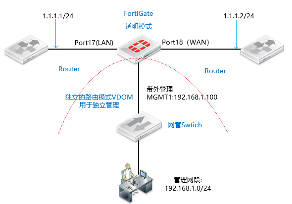
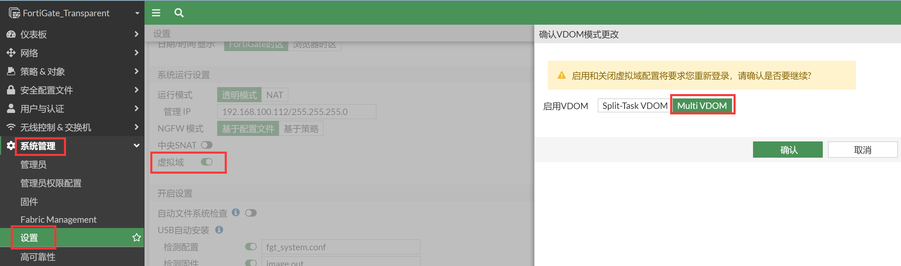
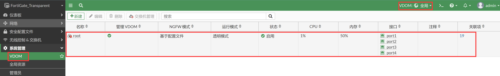
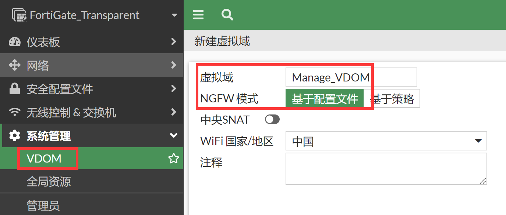
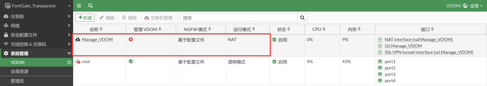
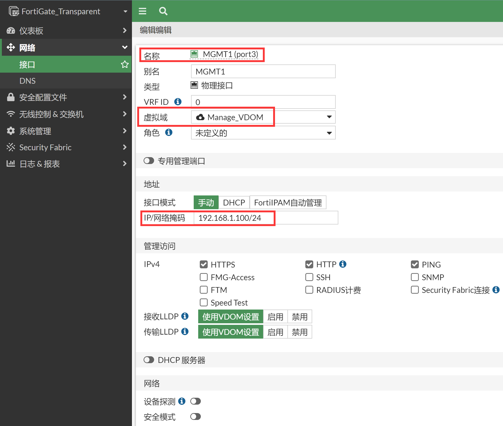
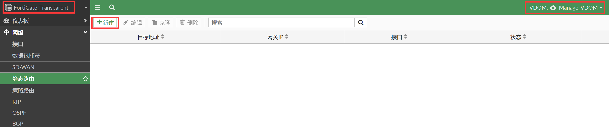
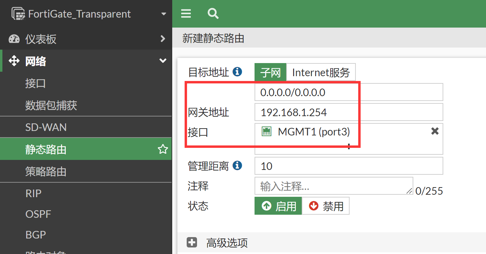
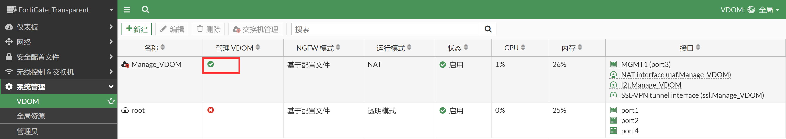

# 透明模式的带外管理

## 组网需求

透明模式部署下的防火墙，需实现带外管理：

- 防火墙上须配置一个与管理网段相同的IP地址进行管理
- 添加的管理IP产生的本地路由，不会对正常业务数据传输造成异步路由等冲突

## 网络拓扑



## 配置要点

- 将防火墙配置为透明模式
- 配置VDOM
- 将MGMT1加入到独立管理的VDOM中

## 配置步骤

1. 将防火墙配置为透明模式，进入设备命令行（CLI）中进行配置，将模式修改为"透明模式"同时为设备配置好管理地址和网关。

   ```
   FortiGate-VM64-KVM # config system global
   FortiGate-VM64-KVM (global) # set hostname FortiGate_Transparent
   FortiGate_Transparent (global) # set timezone 55
   FortiGate_Transparent (global) # set language simch
   FortiGate-VM64-KVM (global) # end
   
   FortiGate_Transparent # config system settings
   FortiGate_Transparent (settings) # set opmode transparent     //修改FGT的运行模式为透明模式，默认为NAT路由模式。，注意切换透明模式防火墙需要防火墙没有相关接口、策略、路由等配置。
   FortiGate_Transparent (settings) # set manageip 1.1.1.3 255.255.255.0    //配置可以管理防火墙的本地IP和网关。
   FortiGate_Transparent (settings) # set gateway 1.1.1.2
   FortiGate_Transparent (settings) # end
   Changing to TP mode
   
   MGMT1或MGMT2口默认有管理权限，以要通过port17（LAN）接口管理设备为例，开启port17（LAN）管理FGT的命令如下：
   FortiGate_Transparent # config system interface
   FortiGate_Transparent (interface) # edit port17
   FortiGate_Transparent (port1) # set allowaccess https http ping ssh    //允许网管协议从Port1接口通过https/http/SSH/Ping访问透明模式的FortiGate
   FortiGate_Transparent (port1) # end
   ```

2. 当前的配置只能通过1.1.1.3去管理FGT，如果需要独立管理FortiGate需要开启VDOM功能，并且划分独立的网段和路由给到FGT进行网管。

3. 在GUI或命令行下开启VDOM功能，开启后当前管理员会退出登陆。

   

   ```
   FortiGate_Transparent # config system global
   FortiGate_Transparent (global) # set vdom-mode multi-vdom
   FortiGate_Transparent (global) # end
   You will be logged out for the operation to take effect.
   Do you want to continue? (y/n)y
   exit
   FortiGate_Transparent login: 
   ```

4. 开启VDOM之后WEB页面系统管理下出现VDOM的配置模块。

   

5. 新建一个MGMT的VDOM，默认的root已经是透明模式的状态了。

   

   

6. 编辑MGMT1接口，将FortiGate用于独立管理的接口加入Manage_VDOM，并配置独立管理IP。

   

7. 进入Mange_VDOM，为MGMT1配置默认路由。

   

   

8. 注意：如果需要服务更新、syslog、SNMP网管等等都需要从MGMT1发出，需要将管理VDOM切换到Mange_VDOM。

   ```
   FortiGate_Transparent # config global
   FortiGate_Transparent (global) # config system global
   FortiGate_Transparent (global) # set management-vdom Mange_VDOM
   FortiGate_Transparent (global) # end
   FortiGate_Transparent (global) # end
   ```

   

## 注意事项

1. 当不需要带外管理端口，对处于透明模式的防火墙直接进行管理时（如此例中的port17口或port18口），需注意：

- manage IP是整个防火墙本身的IP地址，不针对某个接口，根据配置此处FGT本机管理IP为1.1.1.3。
- 需通过某个接口对桥模式防火墙进行管理时，需开启相应接口下的如ping，https，ssh等管理功能，如此例中，当要通过port17或者port18来对防火墙进行管理时，需开启port17和port18接口下的ping、https、ssh等管理服务。

2. 而独立管理的VDOM，则是完全由另外一个VDOM（Mange_VDOM）来充当管理功能的防火墙，而原本的root只用来转发业务数据，将管理和业务分离出来。
