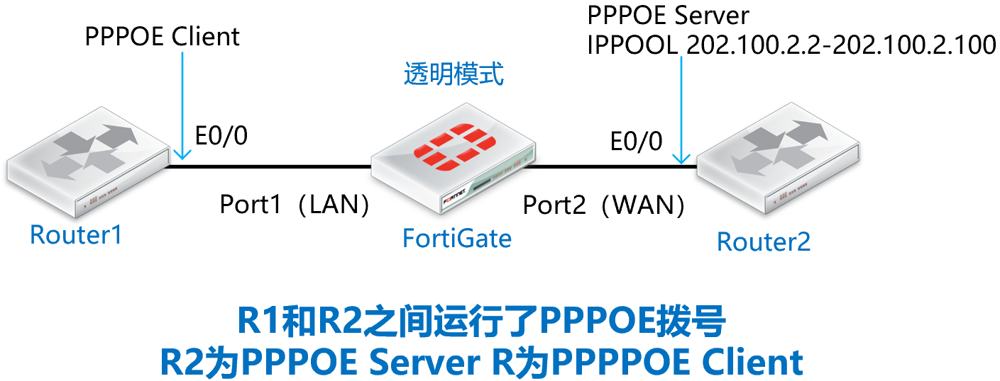
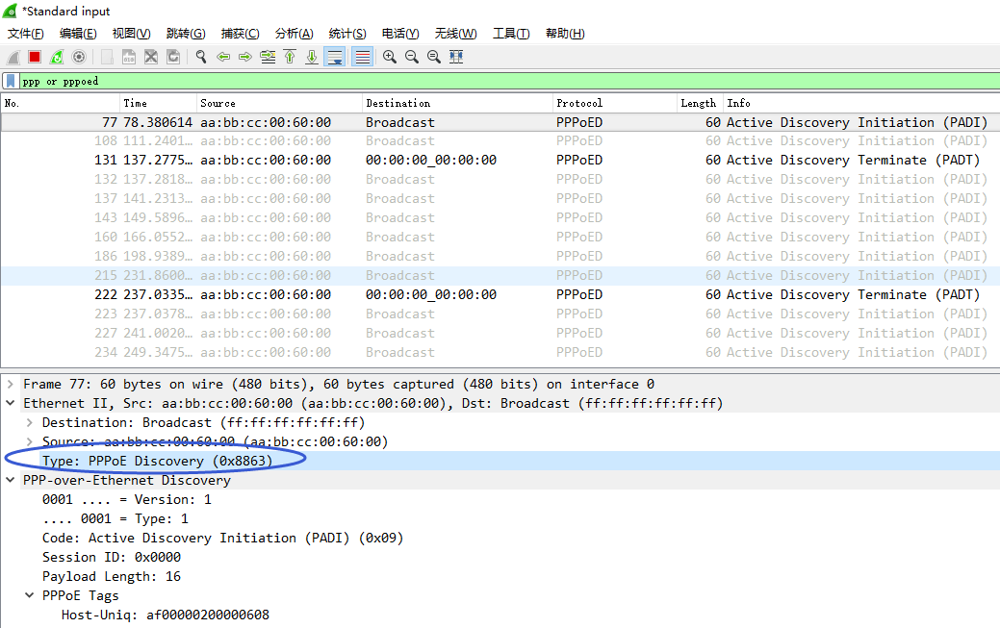
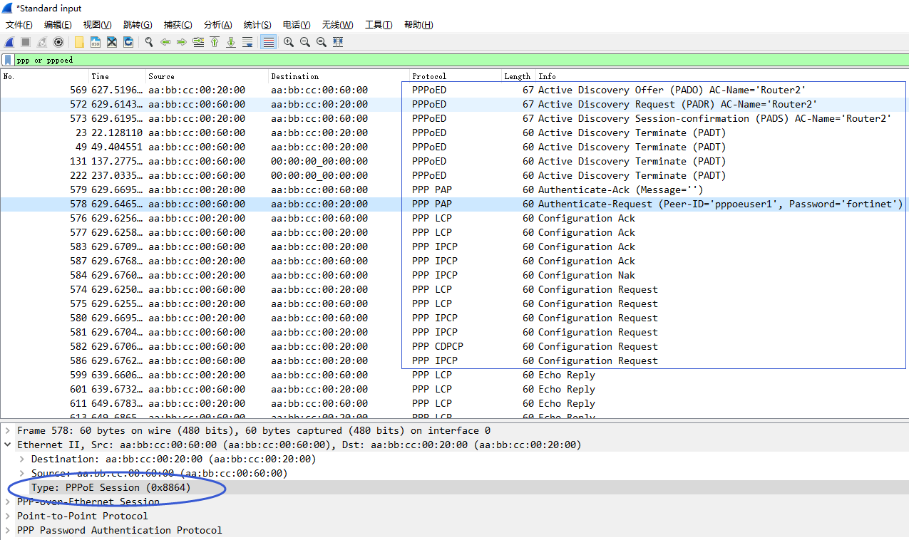

# 非IP流量(PPPOE)与透明模式

## 组网需求

路由器1和路由器2之间运行了PPPOE协议（非IP协议），防火墙以透明模式运行在两台路由器之间，需要确保路由器1的PPPOE拨号正常。

## 网络拓扑



## 配置要点

- Router1/Router2路由器的基础配置

- 将防火墙配置为透明模式并开启网管

- 默认情况下，观察PPPOE拨号的情况

- 配置l2forward解决非IP流量转发问题

## 配置步骤与结果验证

1. Router1/Router2路由器的基础配置。

   **Router1 (PPPOE Client)：**

   ```
   interface Loopback0
   ip address 1.1.1.1 255.255.255.255
   !
   interface Ethernet0/0
   no ip address
   no shutdown
   pppoe enable group global
   pppoe-client dial-pool-number 1
   !
   interface Dialer1
   mtu 1492
   ip address negotiated
   encapsulation ppp
   dialer pool 1
   ppp pap sent-username pppoeuser1 password 0 fortinet
   ppp ipcp route default
   ```

   **Router2 (PPPOE Server):**

   ```
   interface Loopback0
   ip address 2.2.2.2 255.255.255.255
   !
   username pppoeuser1 password 0 fortinet
   !
   bba-group pppoe bba1
   virtual-template 1
   !       
   interface Loopback1
   ip address 202.100.2.1 255.255.255.0
   !
   interface Ethernet0/0
   no ip address
   no shutdown
   pppoe enable group bba1
   !
   interface Virtual-Template1
   description PPPOE bba1
   mtu 1492
   ip unnumbered Loopback1
   peer default ip address pool pool1
   ppp authentication pap
   !
   ip local pool pool1 202.100.2.2 202.100.2.100
   ```

2. 将防火墙配置为透明模式并开启网管，进入设备命令行（CLI）中进行配置，将模式修改为“透明模式”同时为设备配置好管理地址和网关。

   ```
   FortiGate-VM64-KVM # config system global
   FortiGate-VM64-KVM (global) # set hostname FortiGate_Transparent
   FortiGate_Transparent (global) # set timezone 55
   FortiGate_Transparent (global) # set language simch
   FortiGate-VM64-KVM (global) # end
   FortiGate_Transparent #
   FortiGate_Transparent # config system settings
   
   FortiGate_Transparent (settings) # set opmode transparent    //修改FGT的运行模式为透明模式，默认为NAT路由模式。注意切换透明模式防火墙需要防火墙没有相关接口、策略、路由等配置。
   FortiGate_Transparent (settings) # set manageip 192.168.1.100 255.255.255.0    //配置可以管理防火墙的本地IP和网关，以便HTTP/SSH管理防火墙及防火墙的服务更新。
   FortiGate_Transparent (settings) # set gateway 192.168.1.99
   FortiGate_Transparent (settings) # end
   Changing to TP mode
   
   MGMT1或MGMT2口默认有管理权限，以要通过port1（LAN）接口管理设备为例，开启port1（LAN）管理FGT的命令如下：
   FortiGate_Transparent # config system interface
   FortiGate_Transparent (interface) # edit port1
   FortiGate_Transparent (port1) # set allowaccess https http ping ssh    //允许网管协议从Port1接口通过https/http/SSH/Ping访问透明模式的FortiGate
   FortiGate_Transparent (port1) # end
   ```

3. 默认情况下，观察PPPOE拨号的情况，Router1（PPPOE Client）无法PPPPOE拨号成功。

   ```
   Router1#show ip route
   ...
         1.0.0.0/32 is subnetted, 1 subnets
   C        1.1.1.1 is directly connected, Loopback0
   ...
   Router1#show ip int brief
   Interface                  IP-Address      OK? Method Status                Protocol
   Ethernet0/0                unassigned      YES manual up                    up     
   Ethernet0/1                unassigned      YES unset  administratively down down   
   Ethernet0/2                unassigned      YES unset  administratively down down   
   Ethernet0/3                unassigned      YES unset  administratively down down   
   Dialer1                    unassigned      YES IPCP   up                    up     
   Loopback0                  1.1.1.1         YES manual up                    up     
   Virtual-Access1            unassigned      YES unset  up                    up     
   Virtual-Access2            unassigned      YES unset  down                  down
   ```

4. 通过在FGT上抓包可以看到FGT并不转发PPPOE的报文，非IP的PPPOE数据默认不会被FGT所转发。

   ```
   FortiGate_Transparent # diagnose sniffer packet any "pppoed" 4
   interfaces=[any]
   filters=[pppoed]
   4.124126 port1 in pppoe printer hasn't been added to sniffer
   37.014209 port1 in pppoe printer hasn't been added to sniffer
   69.908430 port1 in pppoe printer hasn't been added to sniffer
   102.798634 port1 in pppoe printer hasn't been added to sniffer
   135.705063 port1 in pppoe printer hasn't been added to sniffer
   ```

   

5. 解决非IP流量转发问题，在FGT的二层接口下配置set l2forward enable即可！

   ```
   FortiGate_Transparent # config system interface
   FortiGate_Transparent (interface) # edit port1
   FortiGate_Transparent (port1) # set l2forward enable
   
   FortiGate_Transparent (port1) # next
   FortiGate_Transparent (interface) # edit port2
   FortiGate_Transparent (port2) # set l2forward enable
   FortiGate_Transparent (port2) # end
   ```

6. 再次抓包查看，此时FGT可以转发PPPOE请求了。

   ```
   FortiGate_Transparent # diagnose sniffer packet any "pppoed" 4
   interfaces=[any]
   filters=[pppoed]
   5.324865 port1 in pppoe printer hasn't been added to sniffer
   5.324880 port2 out pppoe printer hasn't been added to sniffer
   5.325468 port2 in pppoe printer hasn't been added to sniffer
   5.325474 port1 out pppoe printer hasn't been added to sniffer
   ```

   

7. 查看Router1的Router1 PPPOE拨号情况，可以看到拨号成功了。

   ```
   Router1#show ppp all      
   Interface/ID OPEN+ Nego* Fail-     Stage    Peer Address    Peer Name
   ------------ --------------------- -------- --------------- --------------------
   Vi2          LCP+ IPCP+ CDPCP-     LocalT   202.100.2.1                    
   
   Router1#show pppoe session
        1 client session
   Uniq ID  PPPoE  RemMAC          Port                    VT  VA         State
              SID  LocMAC                                      VA-st      Type
       N/A      2  aabb.cc00.2000  Et0/0                   Di1 Vi2        UP     
                   aabb.cc00.6000                              UP             
   
   Router1#show  ip route    
   ...
   Gateway of last resort is 202.100.2.1 to network 0.0.0.0
   S*    0.0.0.0/0 [1/0] via 202.100.2.1
   ...
   C        202.100.2.1 is directly connected, Dialer1
   C        202.100.2.3 is directly connected, Dialer1
   
   Router1#show ip int brief 
   Interface                  IP-Address      OK? Method Status                Protocol
   ... 
   Dialer1                    202.100.2.3     YES IPCP   up                    up     
   ...
   ```
