# VLAN与虚拟接口对

## 组网需求

------

内部有两个VLAN（trunk环境），网关在路由器上，防火墙工作在虚拟接口对方式部署在核心交换与核心路由之间，允许两个VLAN访问外网，同时两个VLAN之间需要互访，并且对这两个VLAN进行保护，开启反病毒过滤。

## 网络拓扑

------

### 拓扑1：单VLAN透传

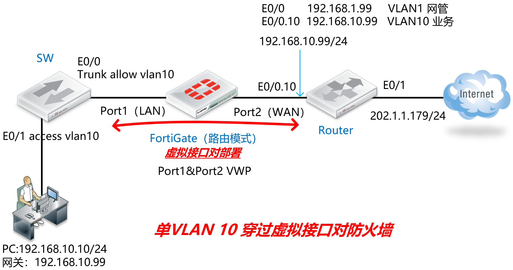

### 拓扑2：多VLAN透传，VLAN之间互访

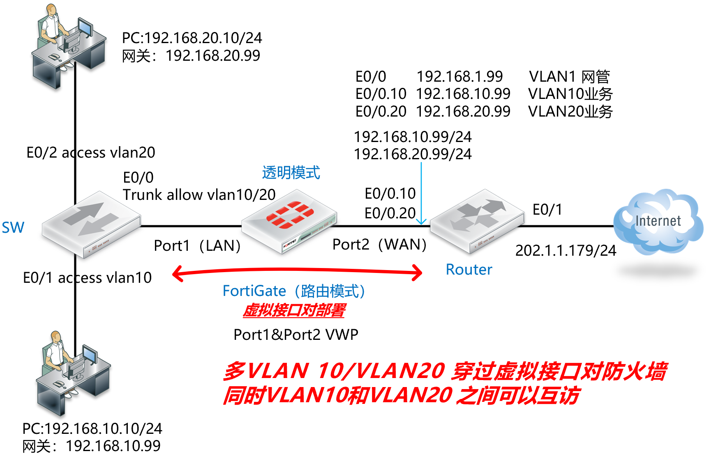

## 配置要点

### 拓扑1：单VLAN透传

- SW交换机/Internet_R路由器的基础配置
- 配置虚拟接口对（Port1&Port2）
- 配置安全策略允许内网PC（VLAN10内主机）访问互联网

### 拓扑2：多VLAN透传，VLAN之间互访

- SW交换机/Internet_R路由器的基础配置
- 配置虚拟接口对（Port1&Port2）
- 配置安全策略允许内网PC（VLAN10和VLAN20内主机）访问互联网

## 配置步骤

### 拓扑1：单VLAN透传

1. SW交换机/Internet_R路由器的基础配置。

   **SW：**

   ```
   interface Ethernet0/0
   switchport trunk allowed vlan 1,10
   switchport trunk encapsulation dot1q
   switchport mode trunk
   !
   interface Ethernet0/1
   switchport access vlan 10
   switchport mode access
   ```

   **Internet_R：**

   ```
   hostname Internet_R
   !
   interface Ethernet0/0
   ip address 192.168.1.99 255.255.255.0
   no shutdown
   ip nat inside
   !
   interface Ethernet0/0.10
   encapsulation dot1Q 10
   ip address 192.168.10.99 255.255.255.0
   no shutdown
   ip nat inside
   !
   interface Ethernet0/1
   ip address 202.100.1.179 255.255.255.0
   no shutdown
   ip nat outside
   !
   ip route 0.0.0.0 0.0.0.0 202.100.1.192
   !        
   access-list 101 permit ip any any
   ip nat inside source list 101 interface Ethernet0/1 overload
   ```

2. 配置虚拟接口对（Port1&Port2），防火墙处于路由模式的情况下，直接创建虚拟接口对，将port1和port2加入到虚拟接口对中并开启通配符VLAN，识别VLAN-Tag的数据。

   

   

   

3. 虚拟接口对通道正式打通，可以认为port1和port2之间可以透明的传输数据了（需要防火墙策略放通），对应的CLI如下。

   ```
   config system virtual-wire-pair
       edit "VWP1"
           set member "port1" "port2"
           set wildcard-vlan enable    //这个命令很关键，识别VLAN-TAG，VWP模式下无需再到本地创建对应的VLAN接口和Forwar-Domain了，大大的简化了策略的配置量
       next
   end
   ```

4. 配置虚拟接口对的策略：允许LAN（Port2，VLAN10内网主机）到WAN（port1）的上网流量穿过FGT，策略&对象的位置会多出“防火墙虚拟线对策略”（如果没有看到，则刷新页面或注销管理登陆，重新登陆FGT即可看到）。

   

5. 右上角选择VWP1线对，方向选择port1→port2（也可选择双向的方向），新建VWP策略（虚拟连接对可以选择多个，在同一条相同动作的策略中进行多接口控制）。

   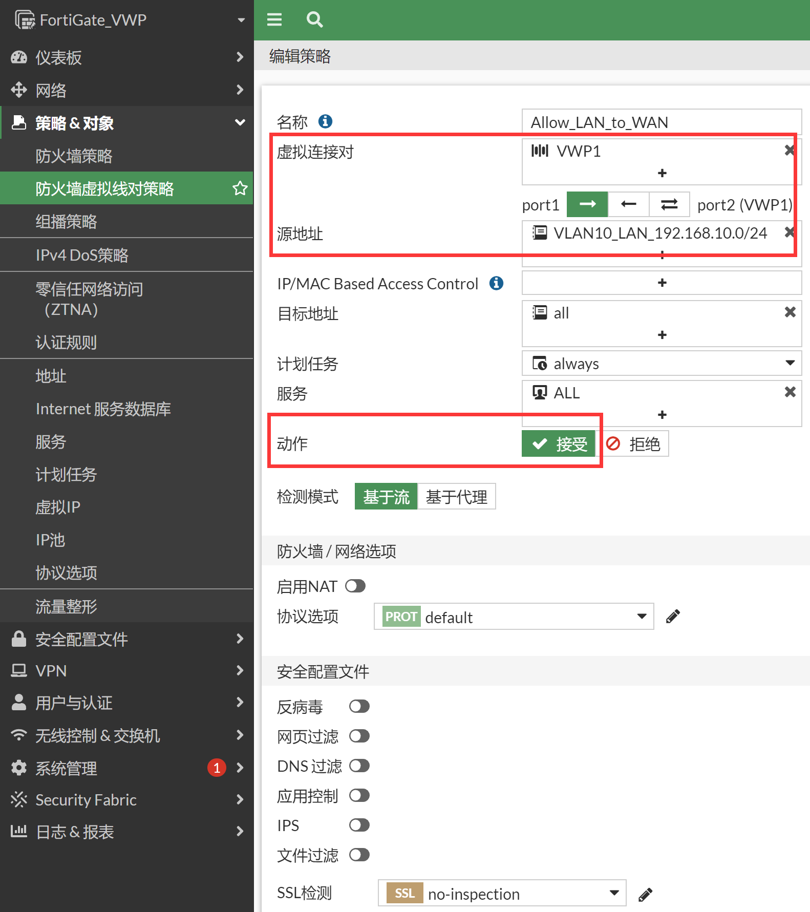

   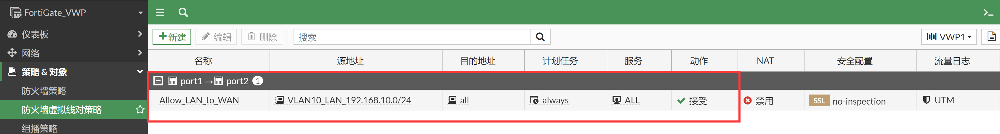

   > 只需要配置VALN10网段到WAN的策略即可实现，配置很简单，可以忽略VLAN-TAG接口和Forward-Domain等透明模式下需要考虑的因素。

### 拓扑2：多VLAN透传，VLAN之间互访

1. SW交换机/Internet_R路由器的基础配置。

   **SW：**

   ```
   interface Ethernet0/0
   switchport trunk allowed vlan 1,10,20
   switchport trunk encapsulation dot1q
   switchport mode trunk
   !
   interface Ethernet0/1
   switchport access vlan 10
   switchport mode access
   !
   interface Ethernet0/2
   switchport access vlan 20
   switchport mode access
   ```

   **Internet_R：**

   ```
   hostname Internet_R
   !
   interface Ethernet0/0
   ip address 192.168.1.99 255.255.255.0
   no shutdown
   ip nat inside
   !
   interface Ethernet0/0.10
   encapsulation dot1Q 10
   ip address 192.168.10.99 255.255.255.0
   no shutdown
   ip nat inside
   !
   interface Ethernet0/0.20
   encapsulation dot1Q 20
   ip address 192.168.20.99 255.255.255.0
   no shutdown
   ip nat inside
   !
   interface Ethernet0/1
   ip address 202.100.1.179 255.255.255.0
   no shutdown
   ip nat outside
   !
   ip route 0.0.0.0 0.0.0.0 202.100.1.192
   !        
   access-list 101 permit ip any any
   ip nat inside source list 101 interface Ethernet0/1 overload
   ```

2. 配置虚拟接口对（Port1&Port2），防火墙处于路由模式的情况下，直接创建虚拟接口对，将port1和port2加入到虚拟接口对中并开启通配符VLAN，识别VLAN-Tag的数据。

   

   

3. 虚拟接口对通道正式打通，可以认为port1和port2之间可以透明的传输数据了（需要防火墙策略放通），对应的CLI如下。

   ```
   config system virtual-wire-pair
       edit "VWP1"
           set member "port1" "port2"
           set wildcard-vlan enable    //这个命令很关键，识别VLAN-TAG，VWP模式下无需再到本地创建对应的VLAN接口和Forwar-Domain了，大大的简化了策略的配置量
       next
   end
   ```

4. 配置虚拟接口对的策略：允许LAN（port1）到WAN（port2）的上网流量穿过FGT，策略&对象的位置会多出“防火墙虚拟线对策略”（如果没有看到，则刷新页面或注销管理登陆，重新登陆FGT即可看到）。

   

5. 右上角选择VWP1线对，方向选择port1→port2（也可选择双向的方向），新建VWP策略（虚拟连接对可以选择多个，在同一条相同动作的策略中进行多接口控制）。

   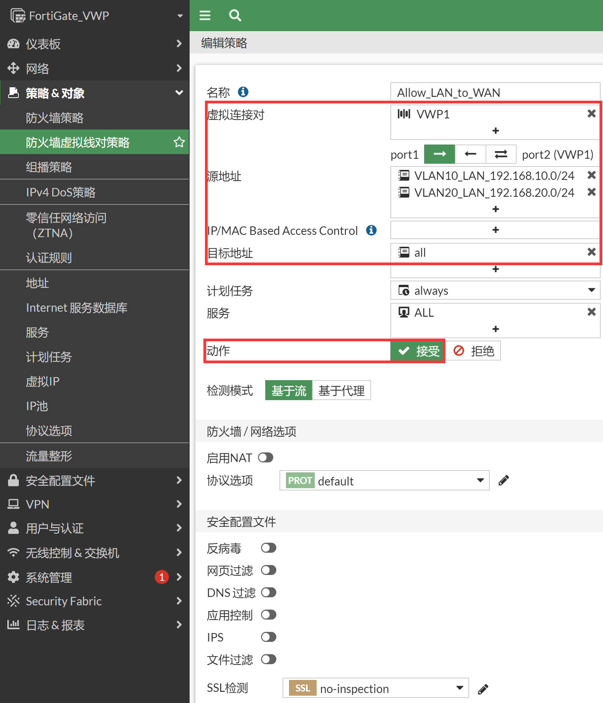

   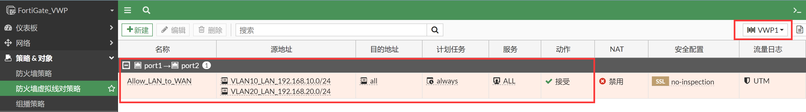

   > 其实配置上上述两条策略数据就已经通了，因为两条策略的目的IP都是any，包括了192.168.20.0/24和192.168.10.0/24，如果要明细配置策略则需要将策略中的目标地址改为明细的地址对象，并放置到策略的最前面，以便优先匹配。

6. 只需要配置VALN10/VLAN20网段相互之间的策略即可，配置很简单，可以忽略VLAN-TAG接口和Forward-Domain等透明模式下需要考虑的因素。配置相对很简单。

## 效果验证

### 拓扑1：单VLAN透传

VLAN10内的PC通过透明模式的FortiGate访问互联网，可以正常访问。

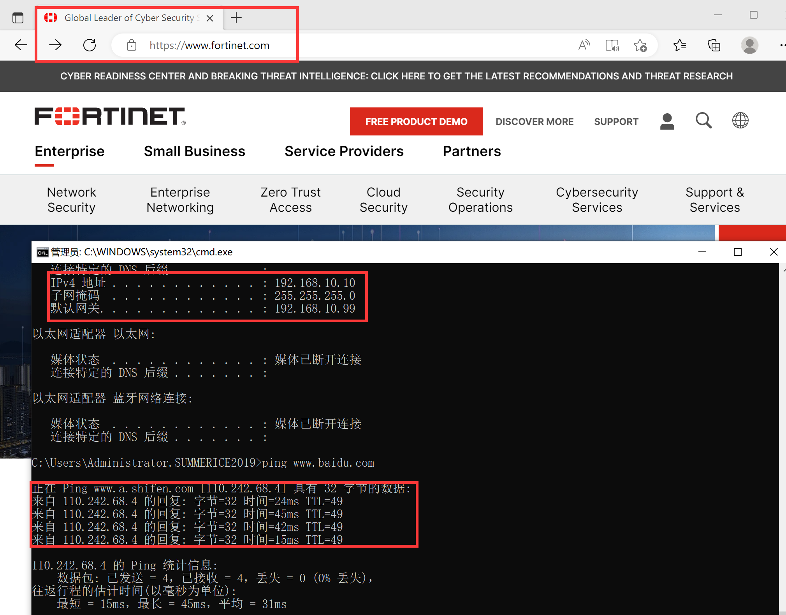

### 拓扑2：多VLAN10/20透传，VLAN之间互访

1. VLAN20内的PC访问互联网，可以正常访问。

   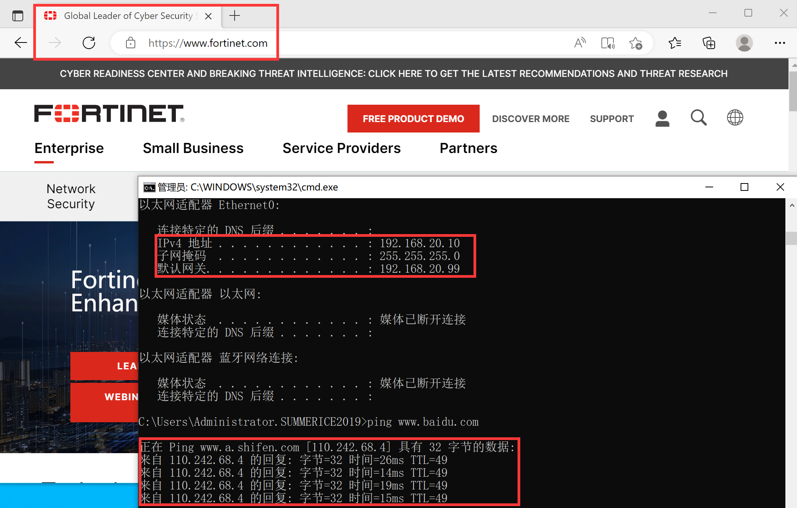

2. VLAN10内的PC访问VLAN20的PC，可以正常访问。

   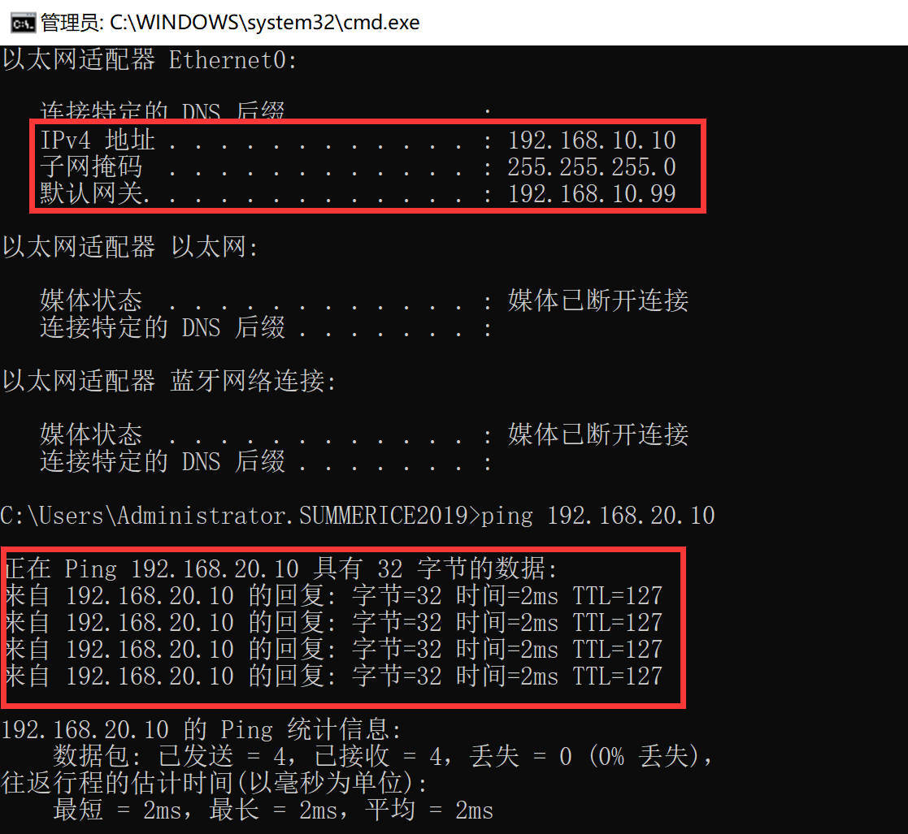

3. 抓包查看VLAN10内的PC访问VLAN20的PC的流量，注意入方向携带VLAN-TAG的数据sniffer无法正常的显示明细数据。

   ```
   FortiGate_VWP # diagnose sniffer packet any 'none' 4
   Using Original Sniffing Mode
   interfaces=[any]
   filters=[none]
   21.060512 port1 in 802.1Q vlan#10 P0 
   21.060542 port2 out 192.168.10.10 -> 192.168.20.10: icmp: echo request
   21.062168 port2 in 802.1Q vlan#20 P0 
   21.062178 port1 out 192.168.10.10 -> 192.168.20.10: icmp: echo request
   21.065095 port1 in 802.1Q vlan#20 P0 
   21.065106 port2 out 192.168.20.10 -> 192.168.10.10: icmp: echo reply
   21.065540 port2 in 802.1Q vlan#10 P0 
   21.065546 port1 out 192.168.20.10 -> 192.168.10.10: icmp: echo reply
   ```

4. debug flow以上流量。

   ```
   id=20085 trace_id=1 func=print_pkt_detail line=5871 msg="vd-root:0 received a packet(proto=1, 192.168.10.10:1->192.168.20"
   id=20085 trace_id=1 func=init_ip_session_common line=6050 msg="allocate a new session-00000821, tun_id=0.0.0.0"
   id=20085 trace_id=1 func=br_fw_forward_handler line=573 msg="Allowed by Policy-1:"
   id=20085 trace_id=1 func=__if_queue_push_xmit line=391 msg="send out via dev-port2, dst-mac-aa:bb:cc:00:20:00"
   id=20085 trace_id=2 func=print_pkt_detail line=5871 msg="vd-root:0 received a packet(proto=1, 192.168.10.10:1->192.168.20.10:2048) tun_id"
   id=20085 trace_id=2 func=resolve_ip_tuple_fast line=5957 msg="Find an existing session, id-00000821, original direction"
   id=20085 trace_id=2 func=br_fw_forward_dirty_handler line=274 msg="auxiliary ses proto=1 dev=4->3 192.168.10.10/1=>192.168.20.10/8"
   id=20085 trace_id=2 func=npu_handle_session44 line=1183 msg="Trying to offloading session from port2 to port1, skb.npu_flag=00000400 ses."
   id=20085 trace_id=2 func=br_fw_forward_dirty_handler line=297 msg="state=00008200, state2=00000000, npu_state=00000100"
   id=20085 trace_id=2 func=__if_queue_push_xmit line=391 msg="send out via dev-port1, dst-mac-00:0c:29:ae:55:70"
   id=20085 trace_id=3 func=print_pkt_detail line=5871 msg="vd-root:0 received a packet(proto=1, 192.168.20.10:1->192.168.10.10:0) tun_id=0."
   id=20085 trace_id=3 func=resolve_ip_tuple_fast line=5957 msg="Find an existing session, id-00000821, reply direction"
   id=20085 trace_id=3 func=br_fw_forward_dirty_handler line=274 msg="auxiliary ses proto=1 dev=4->3 192.168.10.10/1=>192.168.20.10/8"
   id=20085 trace_id=3 func=npu_handle_session44 line=1183 msg="Trying to offloading session from port1 to port2, skb.npu_flag=00000000 ses."
   id=20085 trace_id=3 func=br_fw_forward_dirty_handler line=297 msg="state=00008200, state2=00000000, npu_state=00000100"
   id=20085 trace_id=3 func=__if_queue_push_xmit line=391 msg="send out via dev-port2, dst-mac-aa:bb:cc:00:20:00"
   id=20085 trace_id=4 func=print_pkt_detail line=5871 msg="vd-root:0 received a packet(proto=1, 192.168.20.10:1->192.168.10.10:0) tun_id=0."
   id=20085 trace_id=4 func=resolve_ip_tuple_fast line=5957 msg="Find an existing session, id-00000821, reply direction"
   id=20085 trace_id=4 func=npu_handle_session44 line=1183 msg="Trying to offloading session from port2 to port1, skb.npu_flag=00000400 ses."
   id=20085 trace_id=4 func=br_fw_forward_dirty_handler line=297 msg="state=00008200, state2=00000000, npu_state=00000100"
   id=20085 trace_id=4 func=__if_queue_push_xmit line=391 msg="send out via dev-port1, dst-mac-00:0c:29:57:97:29"
   ```

5. 相关会话信息，可以看到reflect session的数量为1，为反向流量会话。

   ```
   session info: proto=1 proto_state=00 duration=2 expire=57 timeout=0 flags=00000000 socktype=0 sockport=0 av_idx=0 use=4
   origin-shaper=
   reply-shaper=
   per_ip_shaper=
   class_id=0 ha_id=0 policy_dir=0 tunnel=/ vlan_cos=0/0
   state=may_dirty br 
   statistic(bytes/packets/allow_err): org=120/2/1 reply=120/2/1 tuples=2
   tx speed(Bps/kbps): 50/0 rx speed(Bps/kbps): 50/0
   orgin->sink: org pre->post, reply pre->post dev=3->4/4->3 gwy=0.0.0.0/0.0.0.0
   hook=pre dir=org act=noop 192.168.10.10:1->192.168.20.10:8(0.0.0.0:0)
   hook=post dir=reply act=noop 192.168.20.10:1->192.168.10.10:0(0.0.0.0:0)
   misc=0 policy_id=1 pol_uuid_idx=14730 auth_info=0 chk_client_info=0 vd=0
   serial=0000096d tos=ff/ff app_list=0 app=0 url_cat=0
   rpdb_link_id=00000000 ngfwid=n/a
   vlanid=10 npu_state=0x000100
   no_ofld_reason:  npu-flag-off
   ext_header_type=0x22:0x22
   reflect info 0:
   dev=4->3/3->4
   npu_state=0x000100
   npu info: flag=0x00/0x00, offload=0/0, ips_offload=0/0, epid=0/0, ipid=0/0, vlan=0x0000/0x0000
   vlifid=0/0, vtag_in=0x0000/0x0000 in_npu=0/0, out_npu=0/0, fwd_en=0/0, qid=0/0
   total reflect session num: 1
   total session 1
   ```

6. 使用VLAN20内网PC访问VLAN10内网PC，也可以正常访问（具体抓包和debug过程和上述一致）。

   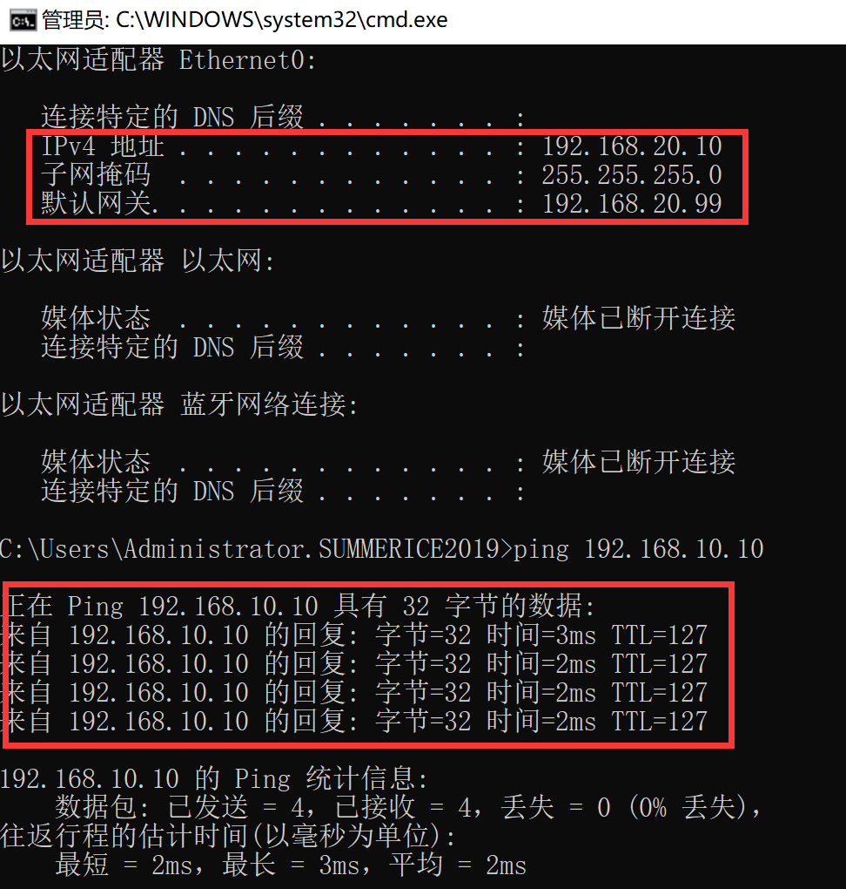

## 补充说明

1. 关于VLAN-forward参数，默认在VWP的环境下，成员接口的vlanforward是打开的。

   ```
   onfig system interface
       edit "port1"
           set vdom "root"
           set vlanforward enable    //默认开启
           set type physical
           set alias "WAN"
           set snmp-index 1
       next
   end
   FortiGate_VWP (port1) # next
   FortiGate_VWP (interface) # edit port2
   FortiGate_VWP (port2) # show
   config system interface
       edit "port2"
           set vdom "root"
           set vlanforward enable    //默认开启
           set type physical
           set alias "LAN"
           set snmp-index 2
       next
   end
   ```

2. 但是如果已经开启了set wildcard-vlan enable的情况下，set vlanforward enable是不生效的。set wildcard-vlan enable的优先级比vlanforward要高，都开启的情况下，FortiGate会优先使用set wildcard-vlan enable。

### 总结

1. 开启了wildcard-vlan enable，vlanforward不生效，wildcard-vlan优先，识别VLAN-TAG，并上送到FGT的CPU上去策略处理。这是推荐的配置。

2. 如果关闭了wildcard-vlan disable，则vlanforward生效，则携带了vlan-tag的数据会直接穿透VWP接口，不再匹配策略，直接bypass可通（不推荐这样使用，流量不可见也不可控，这不是安全设备想要的结果，具体参考[vlanforward](..\..\透明模式\传统透明模式\VLAN与透明模式\vlanforward.md)章节）。

3. 具体现象可以尝试关闭wildcard-vlan，清空VWP策略。

   ```
   config system virtual-wire-pair
       edit "VWP1"
           set member "port1" "port2"
           set wildcard-vlan disable  //关闭wildcard
       next
   end
   config system interface
       edit "port1"
           set vdom "root"
           set vlanforward enable
           set type physical
           set alias "WAN"
           set snmp-index 1
       next
       edit "port2"
           set vdom "root"
           set vlanforward enable
           set type physical
           set alias "LAN"
           set snmp-index 2
       next
   end
   
   FortiGate_VWP # config firewall policy
   FortiGate_VWP (policy) # purge   （清除策略，让设备没有任何策略）
   This operation will clear all table!
   Do you want to continue? (y/n)y
   FortiGate_VWP (policy) # end
   ```

4. 具体的数据转发现象呢？我们会发现，所有的携带了VLAN-TAG的数据都是通的，VLAN10/20的PC可以上网，VLAN10和VLAN20的PC相互可通信。但是在FGT上看不到任何的信息，抓不到任何的包，直接bypass掉携带了VLAN-TAG的数据。VWP不处理携带了VLAN-TAG的数据。而不携带VLAN-TAG的数据（VLAN1）将会上送到FGT的CPU进行策略匹配处理。携带了VLAN-TAG的数据被bypass掉了，直接可通。（vlan1的不携带vlan-tag的数据会上送到CPU进行处理，需要策略放通才可以正常通信。） 

   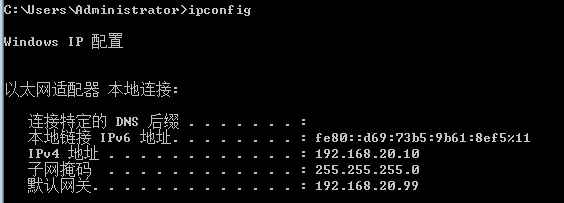

   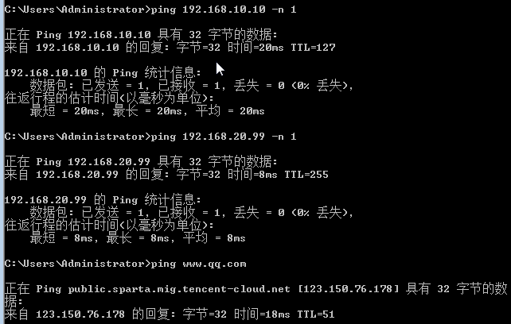

5. 抓不到相应的报文。但是数据是可通的。

   ```
   FortiGate_VWP # diagnose sniffer packet any "host 192.168.20.10" 4
   interfaces=[any]
   filters=[host 192.168.20.10]
   ```

6. 实际上可以抓到VLAN-TAG的数据，只是FGT由于开启了vlanforward，不处理携带了VLAN-TAG的数据，直接bypass掉了（不推荐这样的部署）。

   ```
   FortiGate_VWP # diagnose sniffer packet any "none" 4
   interfaces=[any]
   filters=[none]
   1.189503 port2 in 802.1Q vlan#20 P0 
   1.475067 port2 in 802.1Q vlan#20 P0
   1.475081 port1 out 802.1Q vlan#20 P0
   1.475749 port1 in 802.1Q vlan#20 P0
   1.475756 port2 out 802.1Q vlan#20 P0
   1.568623 port2 in 802.1Q vlan#10 P0 
   1.568668 port1 out 802.1Q vlan#10 P0
   2.211987 port2 in 802.1Q vlan#10 P0
   2.226707 port2 in 802.1Q vlan#10 P0 
   2.226719 port1 out 802.1Q vlan#10 P0
   2.246979 port2 in 802.1Q vlan#10 P0 
   2.246985 port1 out 802.1Q vlan#10 P0
   2.248370 port2 in 802.1Q vlan#10 P0
   2.248377 port1 out 802.1Q vlan#10 P0
   2.356281 port2 in 802.1Q vlan#10 P0
   2.356287 port1 out 802.1Q vlan#10 P0
   2.357778 port2 in 802.1Q vlan#10 P0
   2.357784 port1 out 802.1Q vlan#10 P0
   2.468629 port2 in 802.1Q vlan#10 P0
   2.468643 port1 out 802.1Q vlan#10 P0
   2.489493 port2 in 802.1Q vlan#20 P0
   2.489500 port1 out 802.1Q vlan#20 P0
   2.490062 port1 in 802.1Q vlan#20 P0
   2.490067 port2 out 802.1Q vlan#20 P0
   3.290091 port2 in 802.1Q vlan#20 P0 
   3.502555 port2 in 802.1Q vlan#20 P0
   3.502570 port1 out 802.1Q vlan#20 P0
   3.503316 port1 in 802.1Q vlan#20 P0
   3.503322 port2 out 802.1Q vlan#20 P0
   ```

7. 推荐开启 wildcard-vlan （set wildcard-vlan enable），让FGT可以识别VLAN-TAG的数据，然后使用策略控制所有的携带和不携带VLAN-TAG的数据流。
