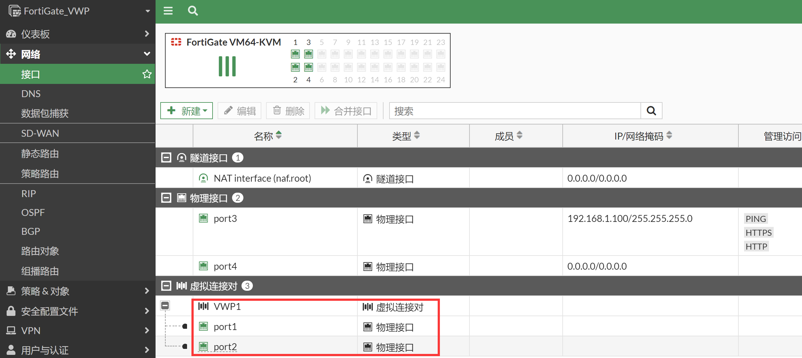
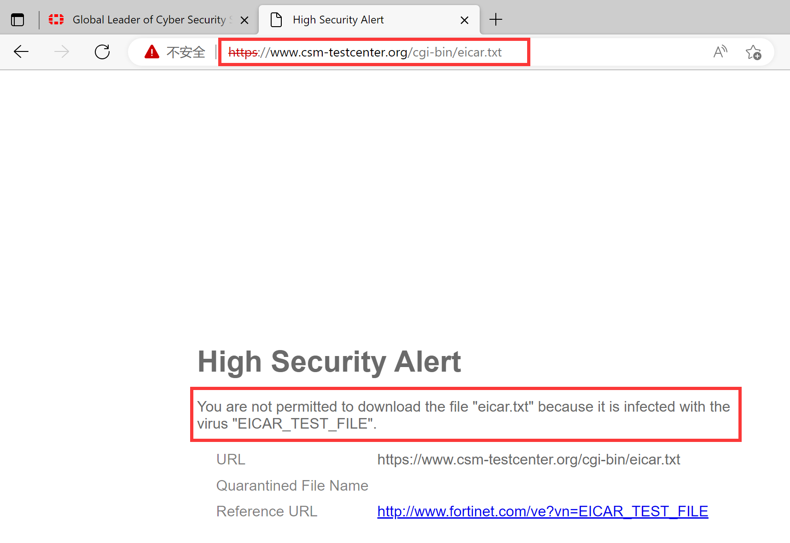

# 开启虚拟接口对并保护上网流量

## 组网需求

------

在不改变现有网络拓扑前提下，将防火墙路由模式部署到网络中，放在路由器和交换机之间，在此基础上开启虚拟接口对（VWP），对内网网段192.168.1.0/24的上网数据进行4~7层的安全防护。

虚拟接口对的策略和透明模式的策略/路由模式的策略使用起来几乎一样，没有太多的特别之处。

## 网络拓扑

------


## 配置要点

------

- Internet_R路由器的基础配置
- 配置虚拟接口对（Port1&Port2）
- 配置虚拟接口对安全策略允许内网PC访问互联网

## 配置步骤

------

1. Internet_R路由器的基础配置。

   ```
   hostname Internet_R
   !
   interface Ethernet0/0
   ip address 192.168.1.99 255.255.255.0
   no shutdown
   ip nat inside
   !
   interface Ethernet0/1
   ip address 202.100.1.179 255.255.255.0
   no shutdown
   ip nat outside
   !
   ip route 0.0.0.0 0.0.0.0 202.100.1.192
   !        
   access-list 101 permit ip any any
   ip nat inside source list 101 interface Ethernet0/1 overload
   ```

2. 配置虚拟接口对（Port1&Port2），防火墙处于路由模式的情况下，直接创建虚拟接口对：将port1和port2加入到虚拟接口对中并开启通配符VLAN，识别VLAN-Tag的数据。

   

   

   

3. 虚拟接口对通道正式打通，可以认为port1和port2之间可以透明的传输数据了（需要防火墙策略放通），对应的CLI如下：

   ```
   config system virtual-wire-pair
       edit "VWP1"
           set member "port1" "port2"
           set wildcard-vlan enable
       next
   end
   ```

4. 配置虚拟接口对安全策略允许内网PC访问互联网，默认情况下FortiGate没有开启任何策略，此时TCP/UDP/ICMP的流量是全部不通的，例如默认FGT没有策略的情况下，内网PC访问网关和互联网资源都是被Drop的。

   

5. 如果需要想要IPV4业务可以通的话，则需要配置相应的安全策略。配置虚拟接口对的策略：允许LAN（port2）到WAN（port1）的上网流量穿过FGT，策略&对象的位置会多出“防火墙虚拟线对策略”（如果没有看到，则刷新页面或注销管理登陆，重新登陆FGT即可看到）。

   

6. 右上角选择VWP1线对，方向选择port2→port1（也可选择双向的方向），新建VWP策略，开启AV功能并引用默认的AV Profile（虚拟连接对可以选择多个，在同一条相同动作的策略中进行多接口控制）。

   

   

## 结果验证

1. 使用内网PC访问外部网络，可以正常访问。

   

2. 测试通过HTTP下载病毒文件（http://www.csm-testcenter.org/test?do=show&subdo=antimalware&test=content_types），被FortiGate阻断。

   

   

3. 在FortiGate上查看相应的AV日志。

   

4. 如果是通过HTTPS下载病毒，由于数据被HTTPS加密，如需要检测需要开启SSL深度检测，需要在虚拟接口对策略中调用SSL深度检测。

   

5. 测试通过HTTPS下载病毒文件（http://www.csm-testcenter.org/test?do=show&subdo=antimalware&test=content_types），被FortiGate阻断。

   

6. 在FortiGate上查看相应的AV日志。

   
